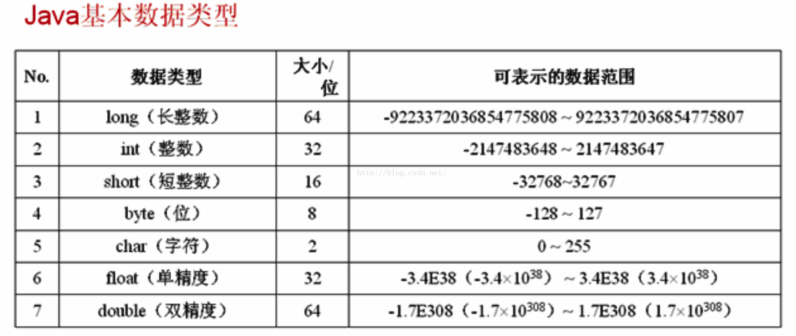
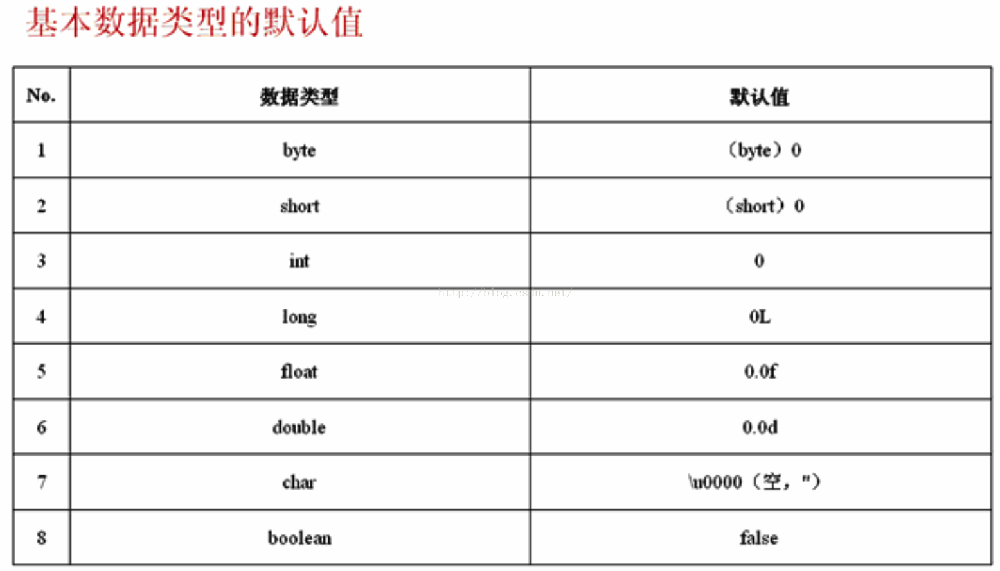

# 摘要
本文介绍了Java的数据类型，整体上可以将其数据类型划分为两种：`基本数据类型`和`对引用数据类型`。
其中`基本数据类型`大致可以分为四大类八种:`数值型`包括整型(byte,short,int,long)以及浮点类型(float,double)，`字符类型`(char)和`布尔类型`(boolean)。`引用数据类型`包括`类(class)`、`接口(interface)`、和`数组`。需要注意的，引用数据类型本质就是`受限的指针`。

## 基本数据类型


基本数据类型受其类型限制有其取值范围。如果赋值超出类型的范围则会出现错误。我们称之为`数据溢出`，包括`数据上溢和数据下溢`。特别的，由于进位的原因：对于`int和long`类型最大值加1成为最小值，最小值减1成为最大值，对于数值型其他类型则没有这种特性。示例代码如下：

```java
public class TypeOfData {
    public static void main(String[] args) {
        System.out.println("Short.MAX_VALUE = " + Short.MAX_VALUE);
        System.out.println("Short.MAX_VALUE + 1 = " + (Short.MAX_VALUE + 1));
        System.out.println("Short.MIN_VALUE = " + Short.MIN_VALUE);
        System.out.println("Short.MIN_VALUE - 1 = " + (Short.MIN_VALUE - 1));
        System.out.println("Integer.MAX_VALUE = " + Integer.MAX_VALUE);
        System.out.println("Integer.MAX_VALUE + 1 = " + (Integer.MAX_VALUE + 1));
        System.out.println("Integer.MIN_VALUE = " + Integer.MIN_VALUE);
        System.out.println("Integer.MIN_VALUE - 1 = " + (Integer.MIN_VALUE - 1));
        System.out.println("Long.MAX_VALUE = " + Long.MAX_VALUE);
        System.out.println("Long.MAX_VALUE + 1 = " + (Long.MAX_VALUE + 1));
        System.out.println("Long.MIN_VALUE = " + Long.MIN_VALUE);
        System.out.println("Long.MIN_VALUE - 1 = " + (Long.MIN_VALUE - 1));
        System.out.println("Float.MAX_VALUE = " + Float.MAX_VALUE);
        System.out.println("Float.MAX_VALUE + 1 = " + (Float.MAX_VALUE + 1));
        System.out.println("Float.MIN_VALUE = " + Float.MIN_VALUE);
        System.out.println("Float.MIN_VALUE - 1 = " + (Float.MIN_VALUE - 1));
    }
}
```
如果要解决数据一出问题，方法就是更长的数据类型。

## 基本数据类型的默认值
在Java语言中，JVM会对各种数据类型默认赋值。如下所示：



## 转义字符
常见的转义字符：

|字符|描述||字符|描述|
|-|-|-|-|-|
|`\f`|换页||`\\`|反斜杠|
|`\b`|倒退一格||`\'`|单引号|
|`\"`|双引号||`\0`|空字符(NULL)|
|`\?`|问号||`\n`|换行|
|'\r'|归位||`\t`|制表符(Tab)|

## 数据类型的转换
Java的数据类型在定义时就已经确立了，因此不能随意转换成其他的数据类型，但Java允许用户有限度的做类型转换处理。

数据类型的转换分为：“自动类型转换”  及 “强制类型转换”两种。

在程序中已经定义好了数据类型的变量，若是想用另一种数据类型表示时，Java会在下列的条件皆成立时，自动做数据类型转换：

1、转换前的数据类型与转换后的数据类型兼容。
2、转换后的数据类型的表示范围比转换前的类型大。

特别的，任何类型的数据都可以向String转换。

```java
public class DataTypeConvert {  
    public static void main(String[] args) {  
        float f = 30.3f; //浮点型  
        int x = (int)f;   // 强制类型转换  
        String str = "A" + x; //+运算符
        System.out.println(str); 
        System.out.println(x);  
        System.out.println("10/3= "+((float)10/3));  
    }  
}  
```