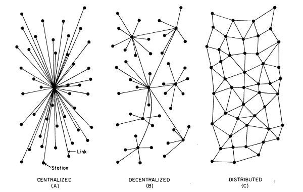

# Centralized, Decentralized & Distributed

Highlight some points where these three majorly differ.
1.  Points of Failure / Maintenance: Centralized systems are easy to maintain as there is only a single point of failure. Decentralized have more but still finite. Distributed systems are the most difficult to maintain.
2.  Fault Tolerance / Stability: Centralized can be highly unstable. Kill the leader and there will be chaos. Kill the leader for a decentralized system and you will have many decentralized systems. Distributed systems are very stable and a single failure doesn’t do much harm.
3.  Scalability / Max Population: Centralized – low scalability, Decentralized – Moderate, Distributed – Infinite. 
4.  Ease of development / Creation: Centralized systems can be created really fast, you pick up a framework and apply it everywhere. For Decentralized and Distributed, you have to first work out the lower level details like resource sharing (trade) and communications (transport).
5.  Evolution / Diversity: Since centralized systems follow a single framework, they don’t have diversity and evolve slowly. But for Decentralized and Distributed systems, once the basic infrastructure is in place, evolution is tremendous.

## 三种类型的去中心化
以下是，Ethereum的创始人之一Vitalik Buterin从结构、政治和逻辑三个维度剖析了去中心化的含义。[查看原文](https://medium.com/@VitalikButerin/the-meaning-of-decentralization-a0c92b76a274)
当大家在讨论软件去中心化的时候，实际上往往有3种不同维度的中心化/去中心化。虽然在一些情况下这些中心化形式往往缺一不可，但通常它们还是彼此相对独立的。这几个维度是：

1. 结构（去）中心化——系统由多少物理计算机组成？该系统可容忍这些计算机多少台同时发生崩溃？

2. 政治（去）中心化——有多少个人或者组织最终控制着组成该系统的那些计算机？

3. 逻辑（去）中心化——该系统展现和维护的界面和数据结构看起来更像是单一的一体式对象呢，还是无定形的一大群？或者用这个问题来启发一下：如果包括提供商和用户在内把你的系统一分为二的话，那两部分是不是还可以继续作为独立单元完全运作？

区块链是政治去中心化（没人控制区块链）、结构去中心化（没有基础设施性的中心失败点）的，但是在逻辑上是中心化的（有一个公认的状态，整个系统行为就像一个计算机一样）。