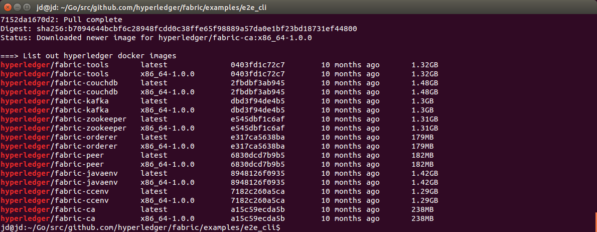
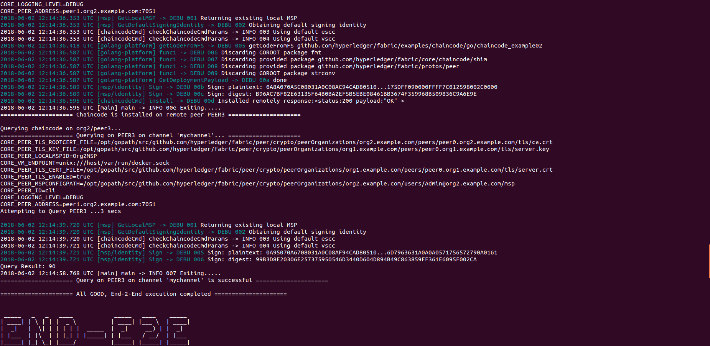
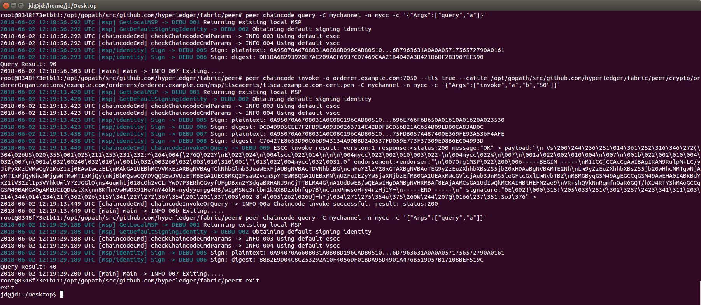

# 快速搭建Fabric 1.0环境（单机环境）
本文主要介绍Hyperledger项目的子项目Fabric 1.0单机环境的快速搭建以及测试。

本文采用的相关硬件环境： 
- VirtualBox
- Ubuntu 14.04 Trusty

## 安装虚拟机
安装操作系统并更新，注意其中某些辅助软件的安装。

```shell
$ sudo apt-get update

$ sudo apt-get install vim curl git
```

## Go安装
Ubuntu的`apt-get`提供了Go语言环境的安装，但是版本比较旧。这里手动安装。

```shell
$ wget https://storage.googleapis.com/golang/go1.9.linux-amd64.tar.gz
$ sudo tar -C /usr/local -xzf go1.9.linux-amd64.tar.gz
```
配置环境变量，这里配置的是为所有用户配置`/etc/profile`，当然也可以只为当前用户配置`./profile`

```shell
$ sudo vim /etc/profile
```

在`/etc/profile`中添加内容：

```
export PATH=$PATH:/usr/local/go/bin 
export GOROOT=/usr/local/go 
export GOPATH=$HOME/Go 
export PATH=$PATH:$HOME/go/bin
```

修改完毕，`/etc/profile`生效：

```shell
$ source /etc/profile
```

注意环境变量中设置`GOPATH`在当前用户目录下，需要为用户创建文件夹.

```shell
$ cd ~
$ mkdir Go
``` 

## Docker安装配置

具体请参看这篇文章 [Ubuntu上Docker的安装配置](../../开发工具系列/Docker/Docker实践/install-docker-on-Ubuntu1710.md)

## Docker-Compose安装设置
Docker-compose是支持通过模板脚本批量创建Docker容器的一个组件。下面安装设置：

```shell
$ sudo curl -L https://github.com/docker/compose/releases/download/1.20.0/docker-compose-`uname -s`-`uname -m` -o /usr/local/bin/docker-compose
$ sudo chmod +x /usr/local/bin/docker-compose
$ docker-compose --version
```

## Fabric源码下载与配置
通过Git下载源码。这里需要注意，需要在`GOPATH`目录下创建相应的目录并下载源码。

```shell
$ cd $GOPATH
$ mkdir -p src/github.com/hyperledger
$ cd /src/github.com/hyperledger
$ git clone https://github.com/hyperledger/fabric.git
```
由于Fabric一直在更新，我们将版本切换到我们使用的`v1.0.0`版本即可：

```shell
$ git checkout v1.0.0
```

## 下载Fabric镜像
这里使用官方的批量下载脚本：
```shell
$ cd $GOPATH/src/github.com/hyperledger/fabric/examples/e2e_cli/
$ source download-dockerimages.sh -c x86_64-1.0.0 -f x86_64-1.0.0

```

下载完毕后，查看镜像列表：

```shell
$ docker images
```

如下图所示：



## 启动Fabric网络并完成ChainCode的测试
测试网络的启动仍然需要在Fabric源码目录（`$GOPATH/src/github.com/hyperledger/fabric/examples/e2e_cli/`）下。这里提供了启动、关闭Fabric网络的自动化脚本。我们需要启动Fabric网络，并自动运行`Example02 ChainCode`的测试，执行如下脚本：

```shell
$ ./network_setup.sh up

```

这个做了以下操作：

1. 编译生成Fabric公私钥、证书的程序，程序在目录：fabric/release/linux-amd64/bin
2. 基于configtx.yaml生成创世区块和通道相关信息，并保存在channel-artifacts文件夹。
3. 基于crypto-config.yaml生成公私钥和证书信息，并保存在crypto-config文件夹中。
4. 基于docker-compose-cli.yaml启动1Orderer+4Peer+1CLI的Fabric容器。
5. 在CLI启动的时候，会运行scripts/script.sh文件，这个脚本文件包含了创建Channel，加入Channel，安装Example02，运行Example02等功能。

最后运行完毕，我们可以看到这样的界面：



另启一个`shell`执行测试代码：

测试代码：

我们仍然是以现在安装好的Example02为例，在官方例子中，channel名字是mychannel，链码的名字是mycc。我们首先进入CLI，我们重新打开一个命令行窗口，输入：
```shell
$ docker exec -it cli bash
```

运行以下命令可以查询a账户的余额：

```shell
$ peer chaincode query -C mychannel -n mycc -c '{"Args":["query","a"]}'
```

可以看到余额是90。 然后，我们试一试把a账户的余额再转20元给b账户，运行命令：
```
peer chaincode invoke -o orderer.example.com:7050  --tls true --cafile /opt/gopath/src/github.com/hyperledger/fabric/peer/crypto/ordererOrganizations/example.com/orderers/orderer.example.com/msp/tlscacerts/tlsca.example.com-cert.pem  -C mychannel -n mycc -c '{"Args":["invoke","a","b","20"]}'
```
现在转账完毕， 我们试一试再查询一下a账户的余额，没问题的话，应该是只剩下70了。结果如下图所示：


最后我们要关闭Fabric网络，首先需要运行exit命令退出cli容器。关闭Fabric的命令与启动类似，命令为：

```shell
$ cd ~/go/src/github.com/hyperledger/fabric/examples/e2e_cli
$ ./network_setup.sh down
```

现在我们整个Fabric的环境已经测试完毕.


测试结果：

