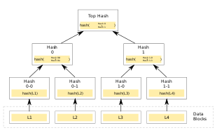

# 加密经济学
什么事加密经济学（cryptoeconomics）？以太坊社区开发者Vlad Zamfir解释：
`“A formal discipline that studies protocols that govern the production, distribution, and consumption of goods and services in a decentralized digital economy. Cryptoeconomics is a practical science that focuses on the design and characterization of these protocols.”（这是一门独立的学科，旨在研究去中心化数字经济学中的协议，这些协议被用于管理商品及服务生产、分配和消费。它也是一门实用科学，重点研究对这些协议的设计和界定方法。）`

区块连技术是运行在加密经济学理论的基础上的。加密经济学（Cryptoeconomics）来源于两个词汇密码学（Cryptography）和经济学（Economics）。正是经济学成分使得区块链技术与以往使用“去中心化点对点系统”的技术有所不同。

Torrent Site在文件共享上对P2P技术的使用由来已久。在Torrent System中，任何人都可以通过一个去中心化的网络来共享文件。这个想法旨在让每个下载者在下载的同时也保持着向网络里的其他下载者提供种子（上传已下载的数据）。问题是，这种系统的运作逻辑是建立在荣誉系统制度上的（目前，这种制度已经有所改进）。如果你下载了一个文件，系统预期你也会提供种子，但是在没有经济激励的情况下，人们认为持续上传种子是件毫无意义的事情，尤其是保留种子将占据计算机大量的存储空间时。

2008年十月，一个化名为中本聪的人发布了一篇文论，此文为Bitcoin后续的发展奠定了基础。这篇文章构建了一个以`加密经济学`为理论依据的运作模型。与之前点对点去中心化系统不同的是，系统中的节点拥有“经济激励”去遵守规则。不仅如此，通过经济学原理和密码学的结合，区块链技术构建了一个克服`拜占庭将军问题`的完美共识系统。

> `注`: 拜占庭将军问题是Leslie Lamport用来描述**分布式系统一致性问题（Distributed Consensus）**在论文中抽象出来的例子，详细请见参考文献。

加密经济学有两大支柱：密码学和经济学。下面我们来看一下他们在区块连技术中的体现。

## 密码学
区块链技术中使用了多种密码学函数，我们将主要描述以下几项：
1. 哈希算法
2. 数字签名
3. 零知识证明
4. 工作量证明

### 哈希算法
简单来说，哈希算法就是将任意长度的字符串映射到较短的固定长度的字符串。比特币使用SHA-256摘要算法对任意长度的收入给出的256bit的输出。在加密货币（Cryptoconcurrency）中哈希算法的应用：
- 加密哈希函数
- 数据结构
- 挖矿

#### 加密哈希函数
一个加密哈希函数应该具有以下特性：
- **确定性（Deterministic）**： 无论在同一个哈希函数中解析多少次，输入同一个A总能得到相同的输出h(A)
- **高效运算(Quick Computation)**： 计算哈希值的过程是高效的
- **抗原象性**：对一个给定的输出结果h(A)，想要逆推出输入A，在计算上是不可能的，更加确切的说有效时间内计算上是不可能的
- **抗碰撞性（抗弱碰撞性）**：对任何给定的A和B，找到满足B不等于A且h(A)=h(B)的B，在有效时间内，计算上是不可能的。
- **细微变化的影响**：任何输入端的细微变化都会对哈希函数的输出产生巨大的影响
- **谜题友好性**：对任意给定的Hash码Y和输入值Y而言，找到一个满足h(k|x) = Y的在计算上是不可行的。

#### 数据结构
有两种数据结构对于理解区块链非常重要：链表和哈希指针。如下图所示比特币区块链的数据结构 

如上图所示，区块链本质上一个链表结构，其中每个新区块都包含一个指向前一个区块的哈希指针。其中哈希指针为前一个区块所有数据的哈希值。

由此引出区块链的一个重要特性：**不可更改性**
假设上图区块链中，有人尝试更改1号区块中的数据。那么存储在2号区块中的哈希指针就会发生巨大变化。接下来，这将导致2号区块的哈希值发生变化，进而影响存储在3号区块的哈希值。以此类推，最终整条区块链上的数据都会发生变化。这种通过冻结整条链条来修改数据的方式几乎是不可能做到的。正是因为如此，区块链被认为是不可篡改的。

每个区块都有自己所有交易哈希值的Merkle Root。如果将这些交易按线性存储，那么在所有交易中寻找一笔特定交易的过程会变得无比冗长。而这就是区块链使用梅克尔树的原因。如下为Merkle Tree的构成。

`注`:图片引自维基百科[Merkle_tree](https://en.wikipedia.org/wiki/Merkle_tree)

在Merkle Tree中，所有交易的哈希值构成了Merkle Root,通过交易哈希值的组合都能追溯至同一个Merkle Root。这就使得搜索变得容易。如果想要获取区块中某一个交易的特定数据，我们可以通过在Merkle Tree中搜索得到结果。

#### 挖矿
加密谜题被用来挖掘新的区块，因此哈希算法仍然至关重要。其工作原理是调整难度值的设定。随后，一个被命名为“nonce”的随机字符串被添加到新区块的哈希值上，然后被再次哈希。接着，再来检验其是否低于已设定的难度值水平。如果低于，那么产生的新区块会被添加至链上，而负责挖矿的矿工就会获得奖励。如果没有低于，则矿工继续修改随即字符串“nouce”，直至低于难度值水平的值出现。

#### 数字签名
在加密货币中，数字签名是一个十分重要的密码学工具。它有以下特征：
- 可被验证：这个签名可以证明某个账户确实签署了某笔交易
- 不可伪造：没有任何其他人可以伪造和复制某个账户的签名
- 不可抵赖：如果某个账户使用自己的数字签名签署某笔交易，那么该账户将无法收回或声称其没有签署该交易。

但是，在现实生活中，无论签名有多复杂，都有被伪造的可能性。密码学给了我们一种通过公钥和私钥来解决问题的方案。假设有两个人，Alan和Tyrone。Alan想要发送一些非常重要的数据，而Tyrone想要鉴别这一数据确实来自Alan，他们可以通过使用Alan的公钥和私钥来实现这一目标。有一点必须指出，通过某人的私钥来确定其公钥是不可行的。公钥正如其名，指公开的密钥，可以被任何人获取。而私钥是仅个人拥有的密钥，你不可以将其与他人分享。

假设Alan想把信息“m”发送出去，Alan有一把私钥Ka-和一把公钥Ka+。那么，当他把信息发送给Tyrone时，他会用私钥将该条信息加密，于是信息变成了Ka-(m)。当Tyrone收到这条信息时，他可以使用Alan的公钥来取回信息，Ka+(Ka-(m))，于是便得到了原始信息“m”。

总结一下：
- Alan有一条信息“m”，当他用私钥Ka-对其进行加密之后，得到加密信息Ka-(m)。
- Tyrone随后使用Alan的公钥Ka+来解密这条加密信息Ka+(Ka-(m))，从而得到原始信息“m”。

1. 可验证性：如果加密信息能够用Alan的公钥进行解密，那就可以100%确定是Alan发送了该条信息。

2. 不可伪造性：如果说有其他人，例如Bob，拦截了该条信息，并用自己的私钥发送了一条自己的信息，那么Alan的公钥将无法对其解密。Alan的公钥只能用来解密Alan用自己的私钥加密过的信息。

3. 不可抵赖性：同样的，如果Alan宣称，“我没有发送信息，是Bob发的”，但Tyrone却能够用Alan的公钥来解密信息，那就证明Alan在撒谎。如此，Alan就无法收回他之前发出的信息，并将其归咎于他人。

加密货币的应用：现在，假设Alan正在发送一笔交易“m”给Tyrone。首先，他要用哈希函数对该交易进行哈希，然后使用私钥对其加密。Tyrone知道他正在收到一笔交易“m”，因此他能用Alan的公钥对其解密，并将解密后得到的哈希结果与他已有的交易“m”的哈希结果进行比对。由于哈希函数具有确定性，并且对于同样的输入总是给出相同的输出，那Tyrone可以直接确定，Alan确实发送了同一笔交易，且其中没有任何作恶。

更简单地来说：

- Alan有一笔交易“m”，并且Tyrone知道他正在接收该笔交易。
- Alan对m进行哈希运算，得到h(m)。
- Alan用自己的私钥对哈希结果进行加密，得到Ka-(h(m))。
- Alan将加密数据发送给Tyrone。
- Tyrone使用Alan的公钥来解密，Ka+(Ka-(h(m)))，并得到原来的哈希结果h(m)。
- Tyrone用已知的“m”进行哈希运算，可以得到h(m)。
- 哈希函数的确定性特征决定了如果h(m)=h(m)，就意味着这笔交易是真实有效的。

#### 工作量证明
当矿工们通过“挖矿”来产生新区块并添加至区块链上时，其中验证及添加区块涉及到的共识系统被称为“工作量证明”。矿工们使用庞大的计算机算力来解决这道密码学谜题，而难度值决定了这道题的所需要的计算量。这是区块链技术中最具开拓意义的机制之一。早期的去中心化点对点数字货币系统之所以会失败，是由于“拜占庭将军问题”导致的，而工作量证明的共识系统为该问题提供了一种解决方案。有关拜占庭将军问题的更加详尽资料，请阅读参考文献。

零知识证明
什么是零知识证明（Zero Knowledge Proof, ZKP）？ZKP意味着A可以向B证明，他知道特定的信息，而不必告诉对方自己具体知道些什么。在这个例子中，A是证明者，B是验证者。在密码学中，这尤为有用，因为这将为证明者提供一层额外的隐私保护。 
运行一个ZKP，要满足以下这些参数：

- 完整性：如果陈述属实，那么诚实的验证者能被诚实的证明者说服。
- 可靠性：如果证明者不诚实，他们无法通过说谎来说服验证者相信陈述是可靠的。
- 零知识：如果陈述属实，那么验证者无法得知陈述的内容是什么。

## 经济学
区块链与其他去中心化点对点系统的区别在于，它给用户提供了金融和经济激励去完成某项工作。和其他牢固的经济系统一样，我们都需要通过激励和奖赏的方式让人们去完成工作。同样的，如果矿工行为不道德或者不尽职，那就要对矿工采取惩罚措施。接下来，让我们去观察一下区块链是如何将所有的经济学基础原理融合进来的。

区块链用到了以下两种激励组合：

第一种激励组合：
- 代币：加密货币作为奖励分配给那些活跃度高且为区块链做出贡献的参与者。
- 特权：参与者可以获得决策权，这将给予他们收取租金的权利。例如，挖出新区块的矿工们可以成为新区块的临时决策者，将短暂地成为新区块的独裁者，并有权决定将哪些交易添加至该区块。他们可以对收录在区块内的所有交易收取手续费。

第二种激励组合：
- 奖励：好的参与者可以获得货币奖励，或因尽职而得到决策权。
- 惩罚：坏的参与者必须支付货币罚款，或因作恶而丧失权利。

加密货币如何实现价值？
加密货币和普通货币拥有价值的原因大体上是一样的，即基于信任。当人们信任某一种商品并赋予其价值，它就成为一种通货。这就是起初法币和黄金有价值的原因。因此，当某个给定的商品拥有一个给定的价值时，价值就会随着供求关系而发生改变。供求关系是经济学中最古老的规则。

这是供需曲线，也是经济学中最常见的一张图表。如上图所示，商品的需求与供应呈反比关系。两条曲线的交汇处是均衡点，也是你想要达到的甜蜜点。那么，让我们用这个逻辑来观察一下加密货币，比如说比特币。

### 区块链中的博弈论
那么，一个无序的、去中心化的点对点系统是如何保持其诚信的呢？矿工权利很大，且很容易作恶并逃脱。这就是先前尝试构建去中心化系统失败的地方。毕竟，用户是人类，而人类就有作恶的倾向。因此，你如何建立一个有人类诚信的去中心化系统？答案就在一个最基本的经济学概念中：博弈论。

博弈论本质上是对战略决策的研究。其核心是做对自己最有利的决策，并记住对手的决策。博弈论中一个最基本的概念是：“纳什均衡”。

纳什均衡是一种状态。在此状态下，每个参与者的策略是对其他参与者策略的最优反应。没有一个参与者可以通过独自变换策略来增加收益。让我们来观察一个纳什均衡的例子。

如上表所示，我们将其称为“收益矩阵”。上表中的数字代表参与方采取（或不采取）行动而得到的收益数量。让我们逐一分析：

假设A采取行动：

那么如果B也采取行动，收益将是4；否则，收益是0。因此，对B来说最佳策略是采取行动。

如果A不采取行动：

那么如果B不采取行动，收益将是0；否则，收益是4。

因此，我们可以得出结论：无论A如何选择，B的最佳策略就是采取行动。现在，同样的，我们来观察下A的最佳策略是什么。

如果B采取行动：

如果A不采取行动，收益将是0；否则，收益是4。那么，对A来说最佳策略是采取行动。

如果B不采取行动：

如果A不采取行动，收益将是0；否则，收益将是4。那么，无论B如何选择，A的最佳策略就是采取行动。

因此，我们可以得出结论，对A和B来说，最好的策略都是采取行动。

因此纳什均衡是：

-当A和B都采取行动。-

那么，区块链是如何运用纳什均衡的呢？因为链自身在一个自我强加性的纳什均衡里，所以不夸张的说，区块链是真实存在的，而矿工们也可以维持诚信。

让我们举个例子：

如上图所示，蓝色的1，2和3号区块是主链的一部分。现在，假设有个恶意的矿工挖出了一个2A区块，并企图用一次硬分叉来满足自己的财务收益。那么，用什么来阻止其他矿工加入他，并在新的区块后面挖矿？

其实，矿工们有一个非常困难但却很快的鉴定规则，那就是任意一个区块在无效区块上挖矿，即被认定为无效区块。因此，其他矿工只需忽略无效区块，并继续在老链上挖矿即可。记住，所有货币都是建立在信任和认知价值上的。因此，为什么会有人将那么多的资源浪费在一块有效性无法被确认的区块上？

现在你要思考的是：万一有许多矿工决定加入新的矿群，并在其新区块上挖矿。这个问题在于，区块链网络是一个巨大且广泛分布的网络，在里面进行交流和协作几乎是不可行的。大部分矿工只会选择能将其收益最大化的那条路径，正因如此，主链的纳什均衡也就得以实现了。

区块链中的惩罚
就像其他任何一个有效的经济系统一样，应当有正向激励和负向激励。在博弈论模型中如何实现惩罚？想象一个收益矩阵，其中参与者的收益很高，则其对社会的影响也非常高。例如：

假设有A和B两个人，他们都将要犯罪。现在，根据收益矩阵，当他们犯罪时，他们的收益都很高。因此他们的纳什均衡点是都去犯罪。虽然这在逻辑上是有意义的，但会带来非常恶劣的社会影响。人类多半是被个人贪婪所驱动的，而非利他主义。如果这是真的，那么世界将变成一个很糟糕的地方。那么，人类如何应对的？答案是引入惩罚机制。

假设我们有一个系统，每当有-0.5个因子的公共设施从公众手里被取走，就要相应的对任何犯罪的人记录-5个因子的惩罚。那么，让我们将惩罚因子加入上面的收益矩阵中，再观察下表的变化：

如上表所示，收益发生了巨大变化。纳什均衡变成了（1,1），不犯罪是最佳策略。现在，惩罚的代价是高昂的，但是社会毕竟损失了0.5个因子的公共设施。那是什么激励着社会加入这场惩罚博弈？这个问题的答案是将惩罚作为针对每个人的强制措施，即任何一个没有参与到惩罚博弈中的人也将会被惩罚。例如说，用税收供养的警力。警察可以惩罚罪犯，但公共设施的损失会以税收的形式从公众手里取走。任何参与博弈但没有付税的人，都会被认作为是罪犯并受到惩罚。

在区块链里，任何不遵守规则并且非法开采的矿工都会受到惩罚。他们会被剥夺特权和承受被社会排斥的风险。这种惩罚会变得更加严厉，一旦权益证明被采用后（稍后详述）。通过使用简单的博弈论和惩罚系统，矿工们就能保持诚信。

## 参考文献:

[拜占庭将军问题](http://lamport.azurewebsites.net/pubs/byz.pdf)

[零知识证明](https://en.wikipedia.org/wiki/Zero-knowledge_proof)

[Merkle Tree](https://en.wikipedia.org/wiki/Merkle_tree)

[加密货币博弈论](https://blockgeeks.com/guides/cryptocurrency-game-theory/)