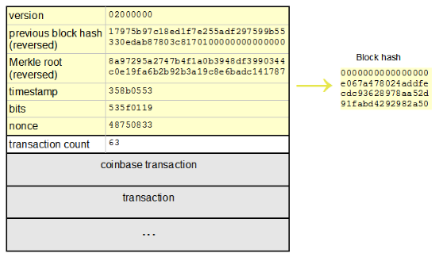

# 什么是工作量证明

## 起源
工作量证明（Proof of Work, 简称 POW），理解就是一份证明，用来确认你做过一定量的工作。监测工作的整个过程通常是极为低效的，而通过对工作的结果进行认证来证明完成了相应的工作量，则是一种非常高效的方式。比如现实生活中的毕业证、驾驶证等等，也是通过检验结果的方式（通过相关考试）所取得的证明。

工作量证明系统（或者说协议、函数），是一种应对拒绝服务攻击和其他服务滥用的经济对策。它要求发起者进行一定量的运算，也就意味着需要消耗计算机一定的时间。这个概念由Cynthia Work和Moni Naor 1993年在学术论文中首次提出。而工作量证明（POW）这名词，则是在1999年Markus Jakobsson和Ari Juels的文章中才被真正提出。

哈希现金是一种工作量证明机制，它是亚当 贝克（Adam Back）在1997年发明的，用于抵抗邮件的拒绝服务攻击及垃圾邮件网关滥用。在比特币之前，哈希现金被用于垃圾邮件的过滤，也被微软用于hotmail/exchange/outlook等产品中（微软使用一种与哈希现金不兼容的格式并将其命名为电子邮戳）。

哈希现金也被哈尔 芬尼以可以重复使用的工作量证明（DPOW）的形式用于一种比特币之前的加密货币实验中。另外，戴伟的B-money，尼克 萨博的比特金（Bit-Gold）这些比特币的先行者，都是在哈希现金的框架下进行挖矿的。

## 哈希函数
哈希函数（Hash Function），也称为散列函数，给定一个输入`x`，它会算出相应的输出`H(x)`。哈希函数的主要特征是：
1. 输入`x`可以是任意长度的字符串
2. 输出结果即`H(x)`的长度是固定的
3. 计算`H(x)`的过程是高效的（对于长度为`n`的字符串`x`，计算出`H(x)`的时间复杂度为`O(n)`）

而对于比特币这种加密系统所使用的哈希函数，它需要另外具备以下性质：
1. **免碰撞**， 即不会出现输入 `x不等于y`，但是 `H(x) = H(y)`。其实这个特点在理论上并不成立。比如，比特币使用的`SHA256`算法，会有`2^256`中输出，如果我们进行`2^256+1`次输入，那么必然会产生一次碰撞；甚至从概率的角度来看，进行`2^130`次输入就有有99%的可能要发生一次碰撞。不过我们可以计算一下，假设一台计算机以每秒10000次的速度进行哈希运算，要经过`10^27`年才能完成`2^128`次哈希。甚至可以这么说，即便是人类制造的所有计算机子宇宙诞生开始一直计算到今天，发生碰撞的概率也是极小的。
2. **隐匿性**，对于一个给定的输出结果`H(x)`，想要逆推出输入`x`，在计算上是不可能的。
3. 不存在比穷举更好方法，可以是哈希结果`H(x)`落在特定的范围。

以上特点是比特币工作量证明系统可以正常工作的基石。

## 工作量证明的机理
工作量证明系统主要特征是客户端需要做一定难度的工作得出一个结果，验证方却很容易通过结果来检查出客户端是不是做了相应的工作。这种方案的一个核心特征是**不对称**：工作对于请求方时适中的，对于验证方是易于验证的。它与验证码不同，验证码设计的出发点是易于被人类解放而不易被计算机解决。

下图表示工作量证明的流程：


举个例子，给定的一个基本的字符串"Hello, world!"，我们给出的工作量要求是，可以在这个字符串后面添加一个叫做`nonce`的整数值，对变更后（添加`nonce`)的字符串进行SHA256哈希运算，如果得到的哈希结果（以16进制的形式表示）是以"0000"开头的，则验证通过。为了达到这个工作量证明的目标。我们需要不停的递增nonce值，对得到的新字符串进行SHA256哈希运算。按照这个规则，我们需要经过4251次计算才能找到恰好前4位为0的哈希散列。

```
"Hello, world!0" => 1312af178c253f84028d480a6adc1e25e81caa44c749ec81976192e2ec934c64
"Hello, world!1" => e9afc424b79e4f6ab42d99c81156d3a17228d6e1eef4139be78e948a9332a7d8
"Hello, world!2" => ae37343a357a8297591625e7134cbea22f5928be8ca2a32aa475cf05fd4266b7
...
"Hello, world!4248" => 6e110d98b388e77e9c6f042ac6b497cec46660deef75a55ebc7cfdf65cc0b965
"Hello, world!4249" => c004190b822f1669cac8dc37e761cb73652e7832fb814565702245cf26ebb9e6
"Hello, world!4250" => 0000c3af42fc31103f1fdc0151fa747ff87349a4714df7cc52ea464e12dcd4e9
```

通过这个示例我们对工作量证明机制有了一个初步的理解。有的人会认为如果工作量证明只是这样的一个过程，那是不是只需要记住nonce为4521计算能通过验证就行了？当然不是的，这只是一个个例。

下面，我们将输入简单的变更为"Hello, world+整数值"，整数值取1到1000，也就是说，将输入变成一个由1000个值组成的数组："Hello, world!1、Hello, world!2……Hello, world!1000"。然后对数组中的每一个输入依次进行上面例子中要求的工作量证明——找到前导为4个0的哈希散列。

容易算出，预期大概要进行2^16次尝试（哈希值的伪随机特性使得我们可以做概率估算），才能得到4个前导0的哈希散列。而统计一下刚才进行的1000次计算的实际计算结果，我们会发现，进行计算的平均次数为66958次，十分接近2^16（65536）。在这个例子中，数学期望的计算次数，就是我们要求的“工作量”，重复多次进行的工作量证明会是一个符合统计学规律的概率事件。

统计输入的字符串与对应得到目标结果实际使用的计算次数列表如下：

```
Hello, world!1 => 42153
Hello, world!2 => 2643
Hello, world!3 => 32825
Hello, world!4 => 250
Hello, world!5 => 7300
...
Hello, world!995 => 164819
Hello, world!996 => 178486
Hello, world!997 => 22798
Hello, world!998 => 68868
Hello, world!999 => 46821

```
比特币体系里的工作量证明机制与上述示例类似，但要比它更复杂一些。

## 比特币中的工作量证明
在比特币网络中任何一个节点，如果想生成一个新的区块并写入区块链，必须解出比特币网络工作量证明的谜题。这道题目三个关键要素是`工作量证明函数、区块以及难度值`。工作量证明函数是这道题的计算方法，区块决定了这道题的输入数据，难度值决定了这道所需的计算量。

### 工作量证明函数
比特币系统使用的工作量证明函数是`SHA256`。

SHA是安全散列算法（`Secure Hash Algorithm`）的缩写，是一个密码散列函数家族。这一组函数是由美国国家安全局（NSA）设计，美国国家标准与技术研究院（NIST）发布的，主要适用于数组签名标准。SHA256就是这个函数家族中的一个，是输出值为256位的哈希算法。到目前为止，还没有出现对SHA256算法的有效攻击。

### 区块
比特币的区块是由区块头以及该区块所包含的交易列表组成。区块头的大小为80字节，由4个字节的版本号、32字节的上一个区块的散列值、32个字节的上一个区块的散列值、32字节的Merkle Root Hash、4字节的时间戳（当前时间）、4字节的当前难度值和4字节的随机数组成。区块包含的交易列表附加在区块头后面，其中第一笔交易是`coinbase`交易，这是一笔为了让矿工获得奖励及手续费的特殊交易。

区块的大致结构如图所示：



拥有80字节固定长度的区块头，就是用于比特币工作量证明的输入字符串。因此，为了使区块头能体现区块所包含的所有交易，在区块的构造过程中，需要将该区块要包含的交易列表，通过Merkle Tree算法生成Merkle Root Hash，并以此作为交易列表的摘要存到区块头中。其中Merkle Tree的算法图解如下：


### 难度值
难度值(difficulty)是矿工们在挖矿时候的重要指标，它决定了矿工大约需要经过多少次哈希运算才能产生一个合法的区块。比特币的区块大约每十分钟生成一个，如果要在不同全网算力条件下，新区块的产生都保持这个速率，难度之必须根据全网算力变化进行调整。简单地说，难度值被设定在无论挖矿能力如何，新区块产生速率都保持在平均十分钟一个。

难度的调整是在每个完整节点中独立自动发生的。每2016个区块，所有节点都会按统一的公式自动调整难度，这个公式是由最新2016个区块的花费时长与期望时长（期望时长为20160分钟即两周，是按每10分钟一个区块的产生速率计算出的总时长）比较得出的，根据实际时长与期望时长的比值，进行相应调整（或变难或变易）。也就是说，如果区块产生的速率比10分钟快则增加难度，比10分钟慢则降低难度。

这个公式可以总结为如下形式：
```
新难度值 = 旧难度值 * ( 过去2016个区块花费时长 / 20160 分钟 )
```
工作量证明需要有一个目标值。比特币工作量证明的目标值（Target）的计算公式如下：
```
目标值 = 最大目标值 / 难度值
其中最大目标值为一个恒定值：
0x00000000FFFFFFFFFFFFFFFFFFFFFFFFFFFFFFFFFFFFFFFFFFFFFFFFFFFFFFFF
```
目标值的大小与难度值成反比。比特币工作量证明的达成就是矿工计算出来的区块哈希值必须小于目标值。

我们也可以简单理解成，比特币工作量证明的过程，就是通过不停的变换区块头（即尝试不同的nouce值）作为输入进行SHA256哈希运算，找出一个特定格式哈希值的过程（即要求有一定数量的前导0）。而要求的前导0的个数越多，代表难度越大。


### 工作量证明过程
我们可以把工作量证明过程作如下描述：
1. 生成Coinbase交易，并与其他所有准备打包进区块的交易组成交易列表，通过Merkle Tree算法生成Merkle Root Hash。（这就对交易列表顺序固定性做了约束）
2. 把Merkle Root Hash及其他相关字段组成区块头，将区块头的80字节数据(Block Header)作为工作量证明的输入
3. 不停地更新区块头中的随机数`nonce`，并对每次变更后的区块头做双重SHA256运算（也就是SHA256(SHA256(Block_Header))），将结果值与当前网络的目标值做对比，如果小于目标值，则解题成功，工作量证明完成。

该过程如下所示：


5. 结语
比特币的工作量证明，就是我们俗称“挖矿”所做的主要工作。理解工作量证明机制，将为我们进一步理解比特币区块链的共识机制奠定基础。在之后的文章中，我们将会详细介绍比特币交易和区块的结构及同步过程、最长链机制以及达成共识的原理。

[引文链接](http://www.infoq.com/cn/articles/bitcoin-and-block-chain-part02)