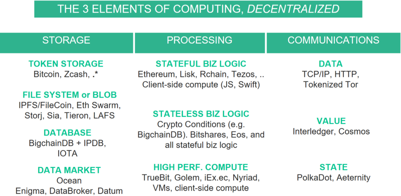
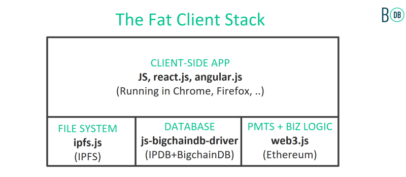
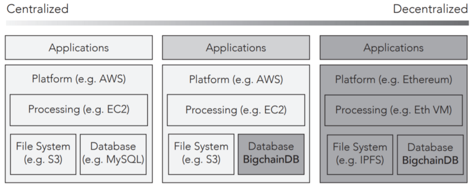
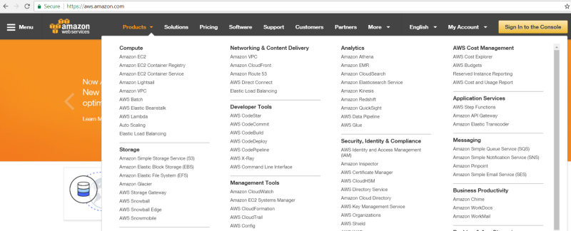

# 区块链基础设施纵览

本文翻译为翻译文章：

原文链接：https://blog.bigchaindb.com/blockchain-infrastructure-landscape-a-first-principles-framing-92cc5549bafe

以太坊、IPFS/Filecoin和BigchainDB之间是怎样的关系？Golem、Polkadot或Interledger又是什么情况？我经常被问到诸如此类的问题，所以决定写下这篇文章，从基本框架层面回答这些问题。

简单来说：并不存在名为“区块链”的无所不能的神奇系统。相比之下，倒是有很多优秀的计算构件块，可以组合起来创建实用的去中心化应用。以太坊可以充当此类角色，此外还有很多类似的选择。接下来具体分析。

## 背景
构成计算技术的基本元素是存储、处理和通信。大型主机、PC、移动设备和云服务都以各自的方式展现这些元素。各个元素之内还有专门的构件块来分配资源。

例如，在存储元素内，既有文件系统也有数据库。文件系统使用目录文件的层级结构存放mp3这样的blob（二进制大对象）数据，而数据库用来存放结构化的元数据，使用SQL[1]这样的查询接口。在中心化的云平台上，我们可能使用Amazon S3服务存放文件，用MongoDB Atlas运行数据库，并使用Amazon EC2处理运算需求。

本文聚焦于区块链的大框架：介绍区块链中各个计算元素的模块以及各个模块的一些实现案例，偏向概论而非详解。

## 区块链的组成模块
以下是去中心化技术中各个计算元素的构件块：

- 存储：代币存储、数据库、文件系统/blob
- 处理：有状态的业务逻辑、无状态的业务逻辑、高性能计算
- 通信：数据、价值和状态的连接网络

# 区块链的基础架构纵览
区块链技术体现在每个模块中，如下图所示[2]：

# 存储
作为基本计算元素，存储部分包含了以下构件块。

**代币存储**。代币是价值的存储媒介（例如资产、证券等），价值可以是比特币、航空里程或是数字作品的版权。代币存储系统的主要作用是发放和传输代币（有多种变体），同时防止多重支付之类的事件发生。

[比特币](https://en.wikipedia.org/wiki/Bitcoin)和[Zcash](https://z.cash/)是两大“纯净”的、只关注代币本身的系统。以太坊则开始将代币用于各种服务，以实现其充当全球计算中心的理想。这些例子中代币被用作运营整个网络架构的内部激励。

还有些代币不是网络用来推动自身运行的内部工具，而是用做更高级别网络的激励，但它们的代币实际上是存储在底层架构中的。一个例子是像Golem这样的[ERC20](https://github.com/ethereum/eips/issues/20)代币，运行在以太坊网络层上。另一个例子是[Envoke](http://envoke.cre8tives.org/)的IP授权代币，运行在[IPDB](https://ipdb.io/)网络层上。

最后我用“.*”来说明大多数区块链系统都有一套代币存储机制。

**数据库**。数据库专门用来存储结构化的元数据，例如数据表（关系型数据库）、文档存储（例如JSON）、键值存储、时间序列或图数据库。数据库可以使用SQL这样的查询快速检索数据。

传统的分布式（但中心化）数据库如[MongoDB](https://www.mongodb.com/)和[Cassandra](http://cassandra.apache.org/)通常会存储数百TB甚至PB级的数据，性能可达到[每秒百万次写入](https://medium.com/netflix-techblog/benchmarking-cassandra-scalability-on-aws-over-a-million-writes-per-second-39f45f066c9e)。

[SQL](https://en.wikipedia.org/wiki/SQL)这样的查询语言是很强大的，因为它将实现与规范区分开来，这样就不会绑定在某个具体的应用上。[SQL已经作为标准应用了数十年](https://modern-sql.com/standard)，所以同一个数据库系统可以用在很多不同的行业中。

换言之，要在比特币之外讨论一般性，不一定要拿图灵完备性说事。你只需要一个数据库就够了，这样既简洁又方便扩展。有些时候图灵完备也是很有用的，我们将在“去中心化处理”一节具体讨论。

[BigchainDB](https://www.bigchaindb.com/)是去中心化的数据库软件，是专门的文档存储系统。它基于MongoDB（或RethinkDB），继承了后者的查询和扩展逻辑。但它也具备了区块链的特征，诸如去中心化控制、防篡改和代币支持。[IPDB](https://ipdb.io/)是BigchainDB的一个受监管的公开实例。

在区块链领域，也可以说[IOTA](https://iota.org/)是一个时间序列数据库。

**文件系统/blob数据存储**。这些系统以目录和文件的层级结构来存储大文件（电影、音乐、大数据集）。

[IPFS](https://ipfs.io/)和[Tahoe-LAFS](https://tahoe-lafs.org/trac/tahoe-lafs)是去中心化的文件系统，包含去中心化或中心化的blob存储。[FileCoin](https://filecoin.io/)、[Storj](https://storj.io/)、[Sia](http://sia.tech/)和[Tieron](https://tierion.com/)是去中心化的blob存储系统，古老而出色的[BitTorrent](http://www.bittorrent.com/)也是如此，虽然后者使用的是p2p体系而非代币。[以太坊Swarm](https://github.com/ethersphere/swarm)、[Dat](https://datproject.org/)、[Swarm-JS](https://github.com/gritzko/swarm)基本上都支持上述两种方式。

**数据市场**。这种系统将数据所有者（比如企业）与数据使用者（比如AI创业公司）连接在一起。它们位于数据库与文件系统的上层，但依旧是核心架构，因为数不清的需要数据的应用（例如AI）都依赖这类服务。[Ocean](https://oceanprotocol.com/)就是协议和网络的一个例子，可以基于它创建数据市场。还有一些特定应用的数据市场：[Enigma Catalyst](https://enigma.co/)用于加密市场，[Datum](https://datum.org/)用于私人数据，[DataBroker DAO](https://enigma.co/)则用于物联网数据流[2]。

## 处理
接下来讨论处理这个基本计算元素。

“智能合约”系统，通常指的是以去中心化形式处理数据的系统[3]。它其实有两个属性完全不同的子集：无状态（组合式）业务逻辑和有状态（顺序式）业务逻辑。无状态和有状态在复杂性、可验证性等方面差异巨大。第三种去中心化的处理模块是高性能计算（HPC）。

**无状态（组合式）业务逻辑**。这是一种任意逻辑，不在内部保留状态。用电子工程术语来说，它可以理解为组合式数字逻辑电路。这一逻辑可以表现为真值表、逻辑示意图、或者带条件语句的代码（if/then、and、or、not等判断的组合）。因为它们没有状态，很容易验证大型无状态智能合约，从而创建大型可验证的安全系统。N个输入和一个输出需要O（2^N）个计算来验证。

[跨账本协议（ILP）](https://interledger.org/)包含crypto-conditions（CC）协议，以便清楚地标出组合电路。CC很好理解，因为它通过[IETF](https://tools.ietf.org/html/draft-thomas-crypto-conditions-01)成为了互联网标准，而ILP则在各种中心和去中心化的支付网络（例如超过[75家银行使用的瑞波](https://finance.yahoo.com/news/75-banks-now-ripples-blockchain-network-162939601.html)）中广泛应用。CC有很多独立实现的版本，包括[JavaScript](https://github.com/interledgerjs/five-bells-condition)、[Python](https://github.com/bigchaindb/cryptoconditions)、[Java](https://github.com/interledger/java-crypto-conditions)等。[BigchainDB](https://github.com/bigchaindb/cryptoconditions)、瑞波等系统也用CC，用以支持组合式业务逻辑/智能合约。

Bitshare和Eos也支持无状态业务逻辑。

因为有状态逻辑是无状态逻辑的超集，支持有状态逻辑的系统也自然支持无状态逻辑（但代价是增加复杂性，可验证性方面也要考虑更多问题）。

BigchainDB、Bitshares、Eos还支持事件。它提供了一种持久的层级，使功能更接近有状态的业务逻辑（感谢Ian Grigg指出这一点[2]）。

**有状态（顺序）业务逻辑**。这是一种在内部保留状态的任意逻辑。也就是说，它有记忆，或者说它是一种带有至少一个反馈回路（和一个时钟）的组合逻辑电路。例如，一颗微处理器有一个内部寄存器，根据发送给它的机器码指令进行更新。更一般地说，有状态的业务逻辑是一个图灵机，接受一系列输入并返回一系列输出。有这种（实际近似）表现的系统被称为图灵完备系统[4]。

[以太坊](https://ethereum.org/)是最知名的使用有状态业务逻辑/智能合约的区块链系统，其智能合约直接在链上运行。[Lisk](https://lisk.io/)、[RChain](https://www.rchain.coop/)、[DFINITY](https://dfinity.org/)、[Aeternity](https://www.aeternity.com/zh)、[Tezos](https://www.tezos.com/)、[Fabric](https://hyperledger-fabric.readthedocs.io/en/latest/)、[Sawtooth](https://sawtooth.hyperledger.org/docs/core/releases/latest/introduction.html)和很多其它系统也有智能合约。运行“在某处”的代码是个强大的理念，有很多使用场景。这也能部分解释为什么以太坊一飞冲天，为什么它的生态系统如此兴旺，以及为什么会有这么多竞争者在这一领域崛起。

因为顺序逻辑是组合逻辑的超集，这类系统也支持组合逻辑。

正如DAO黑客所示，代码中的小错误可能导致严重后果。芯片产业采用的形式化验证也能在这里发挥作用，以太坊基金会正在这方面做出努力。但它有规模限制：对于组合电路，可能的映射数量最多有2^（输入数量）种。对于时序电路，内部状态的上限是2^（内部状态变量的数量），前提是内部的变量都是布尔值。例如，对于一个带有3个输入的组合电路，它有2^3=8种可能的状态供验证。但如果它是一个带有32位寄存器的时序电路，要完整验证就要检查2^32=42亿种状态。这一限制约束了时序电路的复杂程度（如果要保证可信度）。“按结构修正”是另一种验证有状态智能合约的手段，比如[Rchain](http://rchain-architecture.readthedocs.io/en/latest/introduction/introduction.html)使用的rho微积分。

如果需要去中心化的处理，很多场景下有个更简单的方法：只要把处理过程放在客户端一侧，运行在浏览器或移动设备中，用JS或Swift代码编写就行了。这个时候就要信赖客户端的处理过程，如果设备是你自己控制的那就没什么问题。我们把它叫做“[胖客户端](https://blog.bigchaindb.com/bigchaindb-version-1-0-released-932bee682266)”，是相对于“[胖协议](http://joel.mn/post/148641439498/fat-protocols)”架构来说的。这种体系对主流web开发者很友好。例如，很多web应用需要用到应用状态。要开发这样的系统只需要用到JS+IPDB（使用[js-bigchaindb驱动](https://www.npmjs.com/package/js-bigchaindb-driver)）。如果你的应用也需要blob存储和支付功能，就再加上JS的IPFS客户端版本（[ipfs.js](https://github.com/ipfs/js-ipfs)）和以太坊版本（[web3.js](https://github.com/ethereum/web3.js)），比如：

**高性能计算（HPC）**。这是一种处理“重负载”计算任务的过程，诸如渲染、机器学习、电路模拟、气象预报、蛋白质折叠等任务都是这种类型。这类计算任务往往花费几个小时、甚至数周时间，运行在整套机器集群上（CPU、GPU甚至TPU）。

这些方法可以让HPC去中心化：

- [Golem](https://golem.network/)和[iEx.ec](https://iex.ec/zh-hans/)可以用来组成去中心化的超级计算机及相关的应用框架。
- [Nyriad](http://www.nyriad.com/)可以组成存储处理框架。基本上这个处理过程与中心化的存储是放在一起的（Nyriad也有适合后者的方案）。
- [TrueBit](https://truebit.io/)实现第三方计算，并进行后期计算检查（空闲时进行隐式检查，出现问题时进行显式检查）。
- 有些人只是用VM或[Docker](https://www.docker.com/)容器执行复杂的计算任务，将结果（VM最终状态或单纯的计算结果）放到blob存储里，只提供有限的访问权限。然后他们把存储访问授权卖给容器使用者，比如代币读取权限。这种方式需要更多客户端来验证结果，好处在于技术都很成熟。当TrueBit成熟后，这种方法自然会与其融合。

## 通信
这一节我们会谈到第三个也是最后一个基本的计算元素，通信。描绘通信框架的方法很多，我会重点介绍网络连接。它有三个层级：数据、价值和状态。

**数据**。60年代，[ARPA.net](https://en.wikipedia.org/wiki/ARPANET)诞生了。它的成功催生了一系列类似的网络，诸如[NPL](https://en.wikipedia.org/wiki/NPL_network)和[CYCLADES](https://en.wikipedia.org/wiki/CYCLADES)。新的问题随之出现：它们无法互相交流。Cerf和Kahn在70年代发明了TCP/IP来连接这些网络，创建一个网络组成的联网系统，也就是今天我们熟知的Internet。TCP/IP是当今网络连接的事实标准。OSI协议栈曾经是它的竞争对手，但很早就消亡了；然而讽刺的是，[OSI](https://en.wikipedia.org/wiki/OSI_model)的模型被证明是有用的。于是，虽然TCP/IP历史悠久，但它仍然是连接网络数据的去中心化构件。

[Tor](https://www.torproject.org/)项目可以被视为TCP/IP的上层，用来保护用户的隐私。然而它有很多中心化的特点，更不要说它获得了国防部的资助，令很多人不满。代币化的类Tor项目正在兴起，可以拭目以待[2]。

**价值**。TCP/IP只在数据层连接不同网络。你可以复送分包——将一个分包一次发送到很多目的地——也无所谓。但如果要在网络中发送价值时，该怎样连接网络呢？比如比特币到以太坊，乃至SWIFT清算网络到瑞波XRP网络。你需要代币能一次只发送到一个目的地。防止重复发送的一种联网方式是使用汇票，但这种做法往往消耗很多资源。但是，我们可以只保留汇票的核心要素，抛开信任中介，使用密钥托管。爱丽丝可以通过马洛里向鲍勃汇款，款项经过马洛里之手但他不能动用（并且有期限约束，马洛里不能一直占着款子不放）。这就是跨账本协议（ILP）的核心要素。这也是双向挂钩（想想侧链）和状态管道（比如[Lightning](https://lightning.network/)和[Raiden](https://raiden.network/)）的理念；但重点完全在于为价值交换连接网络。除了ILP，[Cosmos](https://cosmos.network/)等系统会更复杂一些，以换取更多便利。

**状态**。除了连接价值网络，我们能否更进一步？想象一个计算机病毒，其带有自己的比特币钱包，可以在网络间跳转；或者以太坊主网中的一个智能合约，可以将其状态转向另一个以太坊网络乃至另一个兼容网络？或者，为什么将AI DAO局限在单一网络中？

于是诞生了[Polkadot](http://polkadot.io/)，用来连接网络的状态。Aeternity也介于价值网络和状态网络之间。

##案例
现在我们研究了三大计算元素（存储、处理、通信），探讨了每种元素的去中心化构件，以及每种构件的项目实例。

人们开始发展组合式的系统。有很多由两种构件组成的模式，通常使用IPFS+以太坊或IPFS+IPDB。甚至有人使用三个或更多的模块组合。以下是一些前沿案例：

- [Ujo](https://blog.ujomusic.com/ujo-x-rac-under-the-hood-the-future-of-licensing-d4f38e2efabd)使用IPFS|Swarm+IPDB+以太坊，用于去中心化音乐网络。IPFS或Swarm用在文件系统和blob存储上。IPDB（和BigchainDB）用于元数据存储和查询。以太坊用于代币存储和有状态业务逻辑。
- [Innogy](https://medium.com/@cstoecker/implementing-first-industry-4-0-use-cases-with-iota-dag-tangle-machine-tagging-for-digital-twins-baf1943c499d)使用IPFS+IPDB+IOTA，用于供应链/物联网应用。IPFS用于文件系统和blob存储。IPDB（和BigchainDB）用于元数据存储和查询。IOTA用于时间序列数据。

## 相关工作
以下是区块链社区其他研究者的相关框架，我很高兴能与他们进行很好的交流。

Joel Monegro的“[胖协议](http://joel.mn/post/148641439498/fat-protocols)”框架强调每个构件都是一个协议。我觉得这是一个很酷的框架，尽管它要求构件之间只能使用网络协议交流。还有一种方式：模块可以简单地成为“导入”语句或库调用。

使用导入的原因可以是为了(a)更低的延迟：一个网络呼叫要花费时间，可能影响乃至破坏可用性；(b)简洁：使用库调用（乃至嵌入代码）往往比连接到一个网络、支付代币等更简单；(c)更加成熟：协议栈才刚刚兴起。我们有历史数十年之久的优秀Unix库，甚至Python和JS模块也有15年以上的历史。

Fred Ehrsam的“[Dapp开发者协议栈](https://medium.com/@FEhrsam/the-dapp-developer-stack-the-blockchain-industry-barometer-8d55ec1c7d4)”强调web商业模式。虽然它很有帮助，但它不是要针对给定计算元素（比如文件系统与数据库）在模块之间进行细化区分的。

[BigchainDB](https://www.bigchaindb.com/whitepaper/)白皮书（最早发布于2016年2月）第一部分展示了其早期版本的形态，如下所示：

它关注于处理、文件系统和数据库这几大构件。它没有使用“计算元素”的框架，没有区分去中心化处理的类型。本文是我在过去一年半根据这份白皮书进一步思考的成果；我在5月22日在[Consensus 2017上的演讲](http://trent.st/content/20170522%20blockchains%20for%20ai%20-%20consensus%202017.pdf)进一步补充了我的观点，与本文内容很接近。（我写这篇文章的部分原因是很多人请我将这些思考化作文字）。

该图还指出了一个频谱，最左边是完全的中心化，最右是完全的去中心化。这有助于将已有的软件系统升级为更加去中心化的形式，将最有必要升级的模块优先去中心化。

Stephan Tual的“[Web 3.0重构](https://blog.stephantual.com/web-3-0-revisited-part-one-across-chains-and-across-protocols-4282b01054c5)”堆栈与本文的思想基本一致，只不过更偏重于以太坊。它为社区提供了很好的服务，用一张映射图将很多项目归类到相似的构件中。我惊喜地意识到它与我的思想非常相似。不过它的应用服务模块层（消息模块、存储模块、共识模块、管理模块……）实际上将三种事物混合在一起：应用、“是什么”和“怎样做”。对我而言，模块应该是“是什么”的类别。所以消息是一个应用（应该在应用层）；存储应该更加细粒化；共识是“怎样做”的部分（隐藏在一些模块里）；管理也是“怎样做”的部分（所以也该隐藏起来）。它也有“网络”协议，用作单独的底层模块，不过我将它们视为模块间交互的一种可行方式，与库调用类似。不管怎样，我认为这是非常出色的堆栈。

Alexander Ruppert的“[映射去中心化世界](https://medium.com/birds-view/mapping-the-decentralized-world-of-tomorrow-5bf36b973203)”有大约20类组织，x轴有四个高级类，依次是基础设施层、中间件层、流动层、应用层。这也是很棒的部分；我很高兴能帮助Alex做出这个映射。它对核心基础设施着墨不多，更注重广泛的趋势；而本文主要写的是核心基础设施的框架原则。

## 未来
Ujo这样的系统将很多模块合并在一起，诸如IPFS或Swarm（用于blob）+以太坊（用于代币和业务逻辑）+IPDB和BigchainDB（用于可快速查询的数据库），所以综合了所有系统的优点。

我希望随着人们更好地理解构件之间的关系，这种趋势也会随之加速。这也比把所有东西都塞入名为“区块链”的单一框架更有效率。

我希望这一理念随着去中心化生态系统一起继续进化。AWS一开始只有一种服务：为blob存储提供的S3服务；之后它有了处理服务：EC2；它继续进化。AWS现在有50多个模块，当然其中少数模块依旧是最关键的。下图列出了AWS的所有服务。

我发现类似的故事正在去中心化世界上演。初看起来，我们可以设想每一个AWS模块的去中心化版本。但也会有不同点，因为每种生态系统（云、移动、去中心化）都有自己的特定模块，比如去中心化的代币存储。这将是很有趣的旅程！

# 注释
[1] 其实我们可以进一步对这些构件进行分级。例如数据库是在文件系统之上的。后者则在原始数据（blob）存储之上。分布式数据库推动通信发展。例如，多数现代数据库使用Ext4、XFS或GridFS等文件系统与底层存储。本文中我给出的框架是应用开发者的视点：文件系统的UX是什么，数据库的UX是什么，等等。

[2] 2017年8月我在此加入了一些新内容。

[3] 我从未真正喜欢过“智能合约”这种说法。在AI语境下它们并不算智能。它们也和”合约“这个法律概念没有关系。如果它们的确包含法律元素，它们通常会加上状态，比如说用Ricardian合约。”去中心化处理“的称谓和其中的”去中心化业务逻辑“更加合理。不过现在“智能合约”的叫法如此普及，就这么叫也可以。相比纠结称谓，我们有更有意义的事情要做。

[4] 这里我提到的“图灵完备”是实践层面的，不是纯粹理论层面的。理论上，机器根据输入数据及其当前内部状态返回一系列输出数据；但实践上，机器无法永续运行，无法解决“机器何时停止”的问题（停止问题）。

