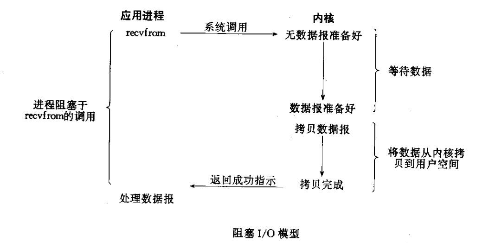
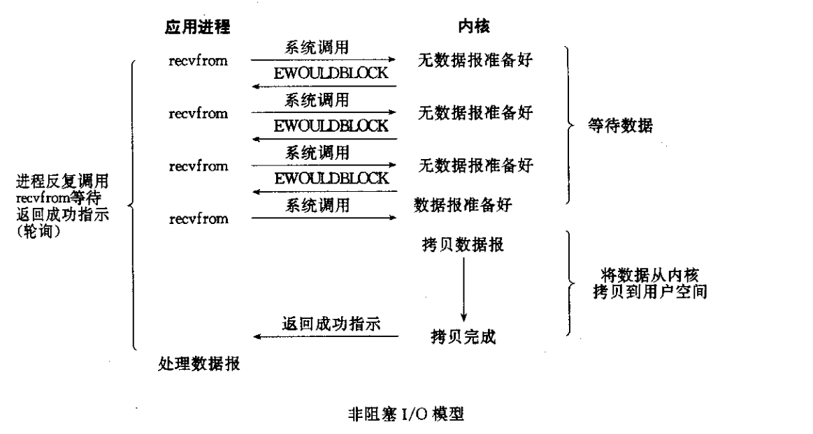
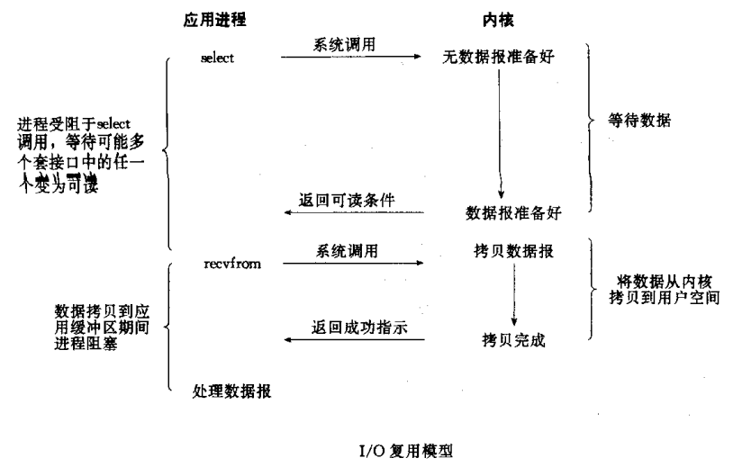
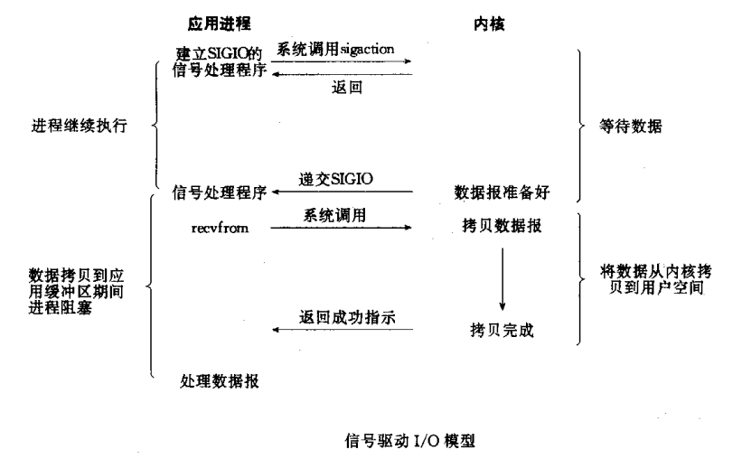
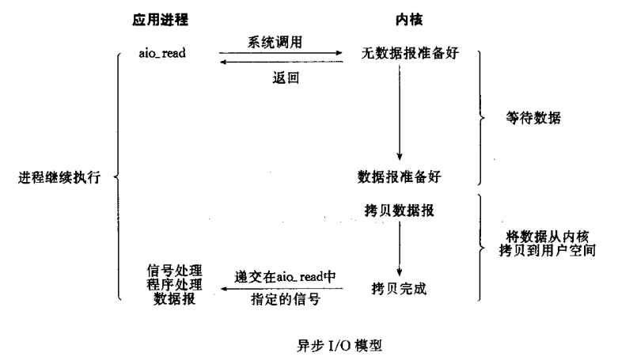
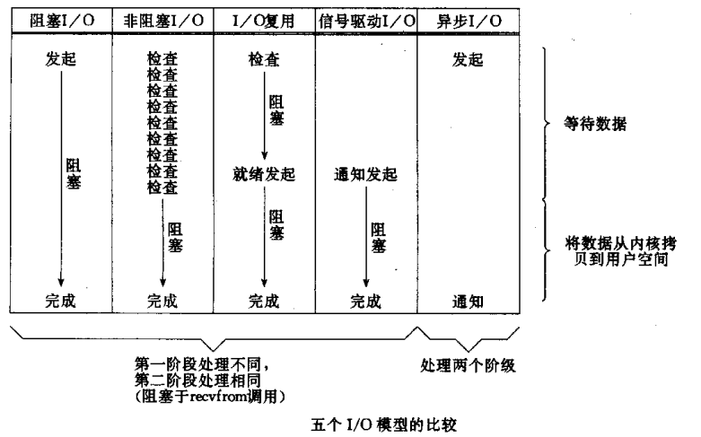

# Unix下几种IO模型介绍
在[对同步异步和阻塞非阻塞的理解](./对同步异步和阻塞非阻塞的理解.md) 一文中详尽的纪录了
自己对与同步异步和阻塞非阻塞概念的理解。我们说两组四个概念有着本质的区别： `首先，两组
概念修饰的对象就不同。 阻塞和非阻塞是对进程等待数据就绪时状态的描述。如果进程访问的数据
尚未就绪，进程是否需要挂起等待。换句话说，就是签名相同的函数内部实现机制的不同。数据未
就绪时，直接返回为非阻塞；挂起等待数据就绪为阻塞。 同步和异步是指访问数据的机制不同。
同步一般指主动请求并等待I/O操作完成的方式，在数据就绪后进行读写时，必须进入阻塞状态。
异步则指主动请求数据后，在等待I/O操作完毕的通知时，可以继续处理其它任务，这可以使进程
在读写数据时也不被阻塞。`

本文主要内容来自于对《unix网络编程》中对IO的理解和总结。

本文继续上述概念，主要介绍Unix以及类Unix系统中的几种常见I/O模型，例如Linux系列，大致
包括以下几种：

1. 同步IO模型（synchronous IO）
  - 阻塞IO （Blocking IO）
  - 非阻塞IO （non-blocking IO）
  - 多路复用IO （multiplexing IO）
  - 信号驱动IO （signal-driven IO）
2. 异步IO模型（asychrnonous IO）
  - 异步IO

网络IO的本质是socket的读取，socket在linux系统被抽象为流，IO可以理解为对流的操作。
对于一次IO访问，数据会先被拷贝到操作系统内核的缓冲区中，然后才会从操作系统内核的缓冲区
拷贝到应用程序的地址空间，所以一般会经历两个阶段：
  1. 等待所有数据都准备好或者一直在等待数据，有数据的时候将数据拷贝到系统内核；
  2. 将内核缓存中数据拷贝到用户进程中；

对于socket流而言：
  1. 等待网络上的数据分组到达，然后被复制到内核的某个缓冲区；
  2. 把数据从内核缓冲区复制到应用进程缓冲区中；

## 阻塞I/O模型
这也是最常用的I/O模型，默认情况下所有的套接字都是`阻塞`的, 如下图所示：

其中函数recvfrom视为系统调用，因此我们此时正在考虑应用进程和内核的区别。无论recvfrom函
数如何实现，一般都会有一个从应用进程中运行到内核中运行的切换，一段时间后再跟一个返回到应
用进程的切换。如上图所示，进程调用recvfrom,该系统调用直到数据报到达且拷贝到进程缓冲区
或者出错才返回。最常见的出错是系统调用被信号中断。在这里强调，我们说的进程阻塞的整段时间
是指从调用recvfrom开始到它返回的这段时间，当进程返回成功指示时，应用进程开始处理数据报。
我们可以看到，应用进程从 `执行recvfrom系统调用开始` 到`复制数据包到应用进程的缓冲区完成`
的整段时间内是被阻塞的； 在这个过程中，要么数据包正确到达，要么系统调用被中断信号打断；
直到数据报被复制到应用进程缓冲区完毕后，应用进程（用户进程）才会解除阻塞状态。很重要的，
应用进程在等待数据准备阶段自己将自己阻塞。

## 优缺点：
1. 优点： 能够及时返回数据，无延迟；方便调试
2. 缺点： 需要付出进程等待的代价。

## 非阻塞I/O模型
当我们将把一个套接字设置成非阻塞方式时，即通知内核：当请求的I/O操作必须要让进程休眠才能
完成时，不要让进程休眠，而是返回一个错误（在数据没有准备好的情况下）。此时，当前进程可以
执行其他任务，不用阻塞。

从图中我们可以看出，前三次调用recvfrom函数时，数据报没有准备好，内核均返回一个
`EWOULDBLOCK` 错误，并且不会阻塞当前进程。直到第四次调用recvfrom函数时，数据报已经
准备好，并被拷贝到进程缓冲区，recvfrom返回成功指示，接着就是当前进程处理数据。

当一个进程像这样对一个非阻塞描述字循环调用recvfrom时，我们称这个过程为`轮询（polling）`。
应用进程不断地查询内核，看看某个操作是否已经准备好，这对CPU时间是极大的浪费，但是这种模
型偶尔在专门提供某种功能的系统中才有。

### 优缺点：
1. 优点：相较于阻塞模型，非阻塞不用再等待任务，而是把时间花费到其它任务上，也就是这个
当前线程同时处理多个任务；
2. 缺点：导致任务完成的响应延迟增大了，因为每隔一段时间才去执行询问的动作，但是任务可能
在两个询问动作的时间间隔内完成，这会导致整体数据吞吐量的降低。

## 多路复用I/O模型
有了I/O复用，我们就可以调用`select`和`poll`，在这两个系统调用中的某一个上阻塞，而不是
阻塞于真正的I/O系统调用。

图中阻塞于`select`调用，等待数据报套接字变为可读。当`select`返回套接字可读这一条件时，
则调用 recvfrom 把所读数据报复制到应用进程缓冲区；之前的同步非阻塞方式需要用户进程不停
的轮询，但是IO多路复用不需要不停的轮询，而是派别人去帮忙循环查询多个任务的完成状态，
`UNIX/Linux`下的`select、poll、epoll`就是干这个的；`select`调用是内核级别的，`select`
轮询相对非阻塞的轮询的区别在于---前者可以等待多个`socket`，能实现同时对多个IO端口进行
监听，当其中任何一个`socket`的数据准好了，就能返回进行可读，然后进程再进行`recvform`
系统调用，将数据由内核拷贝到用户进程，当然这个过程是阻塞的。`select或poll`调用之后，
会阻塞进程，与`blocking IO`阻塞不同在于，此时的`select`不是等到`socket`数据全部到达
再处理, 而是有了一部分数据（网络上的数据是分组到达的）就会调用用户进程来处理。如何知道有
一部分数据到达了呢？监视的事情交给了内核，内核负责数据到达的处理。

上面那句话中存在两个重要点：
1. 对多个`socket`进行监听，只要任何一个`socket`数据准备好就返回可读；
2. 不等一个`socket`数据全部到达再处理，而是一部分`socket`的数据到达了就通知用户进程；

其实`select、poll、epoll`的原理就是不断的遍历所负责的所有的socket完成状态，
当某个`socket`有数据到达了，就返回可读并通知用户进程来处理；

### 优点和缺点
1. 优点：能够同时处理多个连接，系统开销小，系统不需要创建新的额外进程或者线程，也不需要
维护这些进程和线程的运行，降低了系统的维护工作量，节省了系统资源。
2. 缺点：如果处理的连结数目不高的话，使用`select/epoll`的`web server`不一定比使用
`multi-threading + blocking IO`的`web server`性能更好，可能延迟还更大。
（因为阻塞可以保证没有延迟，但是多路复用是处理先存在的数据，所以数据的顺序则不管，
导致处理一个完整的任务的时间上有延迟）

### 同步非阻塞和多线程＋同步阻塞
高并发的程序一般使用`同步非阻塞方式`而`非多线程 + 同步阻塞方式`。要理解这一点，首先要扯
到并发和并行的区别。比如去某部门办事需要依次去几个窗口，办事大厅里的人数就是并发数，
而窗口个数就是并行度。也就是说并发数是指同时进行的任务数（如同时服务的 HTTP 请求），
而并行数是可以同时工作的物理资源数量（如 CPU 核数）。通过合理调度任务的不同阶段，并发数
可以远远大于并行度，这就是区区几个 CPU 可以支持上万个用户并发请求的奥秘。在这种高并发的
情况下，为每个任务（用户请求）创建一个进程或线程的开销非常大。而同步非阻塞方式可以把多个
IO请求丢到后台去，这就可以在一个进程里服务大量的并发IO请求。

## 信号驱动I/O模型

首先开启套接字的信号驱动式IO功能，并且通过`sigaction`系统调用安装一个信号处理函数，
该函数调用将立即返回，当前进程没有被阻塞，继续工作；当数据报准备好的时候，内核则为该进程
产生`SIGIO`的信号，随后既可以在信号处理函数中调用`recvfrom`读取数据报，并且通知主循环
数据已经准备好等待处理，也可以通知主循环让它读取数据报；（其实就是一个待读取的通知和
待处理的通知）。

## 异步I/O模型

我们调用`aio_read`函数，给内核传递描述符、缓冲区指针、缓冲区大小和文件偏移，并且告诉
内核当整个操作完成时如何通知我们。该函数调用后立即返回，不被阻塞于等待I/O操作的完成。

该模型与信号驱动模型的主要区别在于：信号驱动I/O模型是由内核通知应用进程合适启动一个I/O
操作，而异步I/O模型是由内核通知应用线程I/O何时完成。

## 各种I/O模型的比较
如下图，给出了五种不同I/O模型的比较。它表明：前四种模型的主要区别都在于第一阶段，因为
前四种模型的第二阶段基本相同——在数据从内核拷贝到调用者的缓冲区时，进程阻塞与recvfrom调用。
然而，异步I/O模型处理的两个阶段都不同于前四个模型。

### 同步IO和异步IO
Posix.1 定义这两个术语如下：
1. 同步I/O操作引起请求进程阻塞，知道I/O操作完成
2. 异步I/O操作不引起请求进程阻塞

根据上面的定义，我们前四个模型——阻塞I/O模型、非阻塞I/O模型、I/O复用模型和信号驱动I/O模型
都是同步I/O模型，因为真正的I/O操作(recvfrom)阻塞进程，只有第五个为异步I/O模型。 划分如
下图所示：

