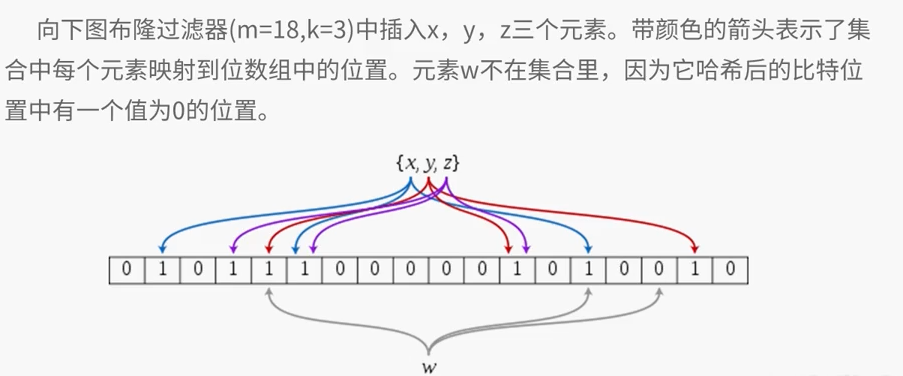

# 布隆过滤器(Floom Fiter)简介
## 位图(bitmap)
用位运算操纵bit实现0/1数据的高效存储。相比字节、字等单位尺度更低，更节省空间，同时具有cache局部性优势。但是只能用来标记数据出现与不出现，不能用来计数。

### 操作
```c
#define SHIFT 5  //移位次数
#define MASK 0x1F //掩码
#define N 10000000 //位图大小
int a[1+ N/32]; //用于存储实际的位，每一个int型变量有32位(c语言中)， int型变量数就是N/32, 加1判定不能被32整除 
/**
 *  
 * @param {[type]} int i [description]
 */
void set(int i){ a[i>>SHIFT] |= (1<<(i & MASK));}
/**
 * 检查某一位是否为1
 * @param  {[type]}  int i             [description]
 * @return {Boolean}     [description]
 */
bool isSet(int i){ reutrn a[i>>SHIFT] & (1<<(i & MASK));}
/**
 *  清除操作，该位置为0，其他位置为1，然后取&
 * @param  {[type]} int i             [description]
 * @return {[type]}     [description]
 */
var clr(int i){ a[i>>SHIFT] &= ~(1<<(i & MASK));}
```

### 不同语言中的位图
1. C语言 
> 位域可以实现简单的位图，但是只能在一个字节内，实现如下：
```c
struct BitField{
    unsigned char a:2; //最低位
    unsigned char b:3;
    unsigned char c:3; //最高位
}
```
2. C++语言
> bitset类，具有test,set和reset等函数
3. Java语言
> BitSet类，与C++类似

#### 应用
**问题描述** -- 已知某个文件内包含一些电话号码，每个号码为8位数字，统计不同号码的个数。

**分析** -- 电话号码较少时，可以采用哈希表完成。当电话号码较多时，可以采用位图完成。8位电话号码最多有10^8个，共需要10^8/8MB=12.5MB内存。定义一个12.5MB的位图，扫描文件，将电话号码对应的位置1，最后统计1的个数即可。

**问题描述** -- 2.5亿个整数中找出不重复的整数个数，内存不足以容纳这2.5亿个整数

**分析** -- 限制说明不能用整数数组来解决，可以用位图。因为需要找出不重复的整数个数，直接用位图不行。我们可以将位图进行扩展，用1bit表示一个数即可，0表示未出现，1表示出现一次，2表示出现2次及以上。在遍历这些数的时，如果对应位置为0，则将其置为1；如果对应位置为1，则将其置为2；如果对应位置为2；则保持不变。遍历整个数组，找出值为1的位，进行计数。或者我们不用2bit表示，可以用两个位图来模拟实现这个2bit-map. 方式很简单，先在第一个1bit-map中检查是否出现1，如果是0则置为1，如果是1，在第二个1bit-map对应位置置1。 检查时，扫描第一个位图，如果对应位置为1，扫描第二个位图，如果为零，则表示不重复。全为0表示不出现，全为1表示重复。


## Bloom Filter
### 基本原理
**布隆过滤器=位图+哈希**。一个空的布隆布隆过滤其是一个m位的位图，所有位的值都为0.定义k个不同的符合随机均匀分布的哈希函数，每个函数都把集合元素映射到位图m位中的某一位。不能进行删除操作，我们无法确定某个位置的1是由哪个元素插入时设置的。 

- `插入` -- 先把这个元素作为k个哈希函数的输入，拿到k个数组位置，然后把所有这些位置置为1
- `查询` -- 把这个元素作为k个哈希函数的输入，得到k个数组位置。这些位置中只要有任意一个是0，元素肯定不在这个集合里。如果元素在集合里，那么这些位置在插入这个元素时都被置为1了。如果这些位置都是1，那么要么元素在集合里，要么所有这些位置是在其他元素插入过程中被偶然置为1了，这就导致了一次“误报”。

### 示例


1. 优点
 - 存储空间和插入、查询时间都是常数，远远超过一般算法
 - Hash函数相互之间没有关系，方便由硬件并行实现
 - 不需要存储元素本身，在某些对保密要求严格的场合有优势
 - 耗费空间减少到散列表的1/8~1/4
2. 缺点
 - 有一定的误识别率(将空间增大)
 - 删除困难(增加元素位数，使其可以统计)

### 设计与实现
给定一个布隆过滤器，m是该位数组的大小，k是Hash函数的个数，n是要插入元素的个数，则误报的概率近似为：

<a href="https://www.codecogs.com/eqnedit.php?latex=(1&space;-e^{-\frac{kn}{m}})^{k}" target="_blank"></a>

随着m（位数组的大小）的增加，假正例(False Positives)的概率会下降，同时随着插入元素个数n的增加，False Positives的概率又会上升。在给定m和n时，使误报概率最小的k由下述共识决定：

<a href="https://www.codecogs.com/eqnedit.php?latex=k&space;\approx&space;0.7&space;*&space;\frac{m}{n}" target="_blank"></a>

### 应用
- Google的分布式数据库Bigtable使用了布隆过滤器来查找不存在的行或列，以减少磁盘查找的IO次数
- Squid网页代理服务器在cache digests中使用了布隆过滤器
- Venti文档存储系统采用布隆过滤器来检测先前存储的数据
- SPIN模型检测器使用布隆过滤器在大规模验证问题时跟踪可达状态空间
- Google Chrome浏览器使用布隆过滤器加速安全浏览服务
- 很多Key-Value系统使用布隆过滤器来加快查询过程，如Hbase, Accumulo, Leveldb。一般而言，Value保存在磁盘中，访问磁盘西药话费大量时间，然而使用布隆过滤器可以快速判断某个Key对应的Value是否存在，因此可以避免很多不必要的磁盘操作。

爬虫工具——利用布隆过滤器判断网页是否已经被抓取过。

资料:
[布隆过滤器(Bloom Filter)详解](http://www.cnblogs.com/haippy/archive/2012/07/13/2590351.html)
[Bloom Filter](https://en.wikipedia.org/wiki/Bloom_filter)

