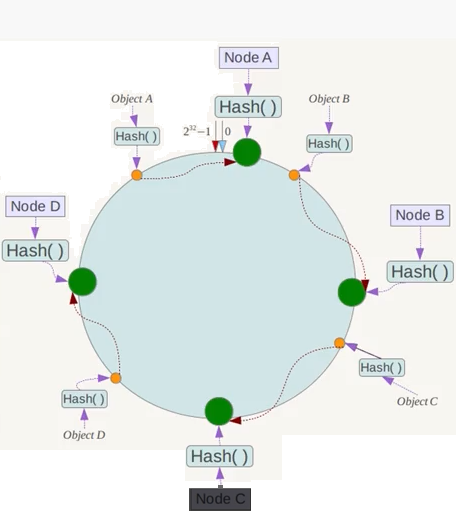

# 目录
1. 基本概念
2. 散列函数
3. 实现方式
4. 特殊的散列
5. 应用
6. 高级主题

# 基本概念
**散列的主要作用** ： 为了解决常规数组或链表在增(insert)、删(delete)、查(search)操作上复杂都过高的问题。除了散列之外，平衡树也可以降低操作的复杂度，但是散列具有更优的平均性能。

**散列的注意事项** ： 
 - 好的散列函数 -- 将元素映射到特定位置，分布越均匀越好
 - 解决散列冲突 -- 不同的元素产生相同的key就会导致冲突，如何很好的解决冲突

**优缺点**
 - 优点 -- 性能高，特别是元素个数确定的时候
 - 缺点 -- 元素个数较少时没有很好的性能优势，无法顺序遍历，元素访问的局部性较差

**影响散列性能的两大因素** 
 - 散列函数 -- 从局部上尽可能地避免元素冲突
 - 负载 -- 从整体上避免冲突过多

如果散列函数效果很差，可能会导致散列相关操作的复杂度退化成O(n); 如果散列函数效果很好，通常相关操作的复杂度只有O(1)

当散列表元素的个数比散列容量大时，通常就会导致散列表访问性能的下降，所以往往需要通过负载因子来限制整个散列表允许的最多元素个数(Java中的hashtable的默认负载因子是0.75).当超过负载后，需要重新分配更大的散列表。重新分配的主要目的并不是因为溢出，而是因为访问性能可能会下降。

当元素个数确定时，可以通过预先分配大于负载的散列表来获得最佳性能。如果元素个数不确定，就需要动态分配空间，或者选择其它数据结构。 

**散列的操作步骤**
1. hash = func(key)
2. index = hash % array_size

一般情况下，key都很复杂，不能直接映射到散列表中(例如字符串、身份证号等)。这时就需要利用散列函数将key转化成可以取余操作的整数。如果key是可以直接调用取余操作的整数，则可以忽略第一步。

## 散列函数
**散列函数的要求**
1. 计算散列值尽可能均匀分布(uniform distribution)
2. 开环散列还需要避免散列值得堆聚(clustering)

**常见的散列函数**
1. 加法
2. 位运算，通常有移位或异或操作
3. 乘法，推荐乘数有 31(java hashcode默认)，131，1313，13131，131313
4. 查表

[Function实现](http://www.partow.net/programming/hashfunctions/)

## 实现方式
### 开放寻址(open addressing)
1. 线性探查(Linear Probing, 最常用)：<a href="https://www.codecogs.com/eqnedit.php?latex=h_{i}&space;=&space;(h(key)&plus;i)&space;\%&space;m,&space;0&space;\leq&space;i&space;\leq&space;m-1" target="_blank"></a>
2. 二次探查(Quadratic Probing): <a href="https://www.codecogs.com/eqnedit.php?latex=h_{i}&space;=&space;(h(key)&plus;i*i)&space;\%&space;m,&space;0&space;\leq&space;i&space;\leq&space;m-1" target="_blank"></a>
3. 双重散列(Double Hashing): <a href="https://www.codecogs.com/eqnedit.php?latex=h_{i}&space;=&space;(h(key)&plus;i*h1(key))&space;\%&space;m,&space;0&space;\leq&space;i&space;\leq&space;m-1" target="_blank"></a>

 - 优点 -- 开放寻址没有额外的内存分配，局部性较好，此外也比较容易序列化
 - 缺点 -- 最大的缺点就是元素个数不能超过散列表大小，同时负载也不宜过高，删除操作繁琐，对散列函数的要求较高
 
### 线性探查(Linear Probing)
 - 基本思想 --将散列表T[0,...,m-1]看成是一个循环向量，若初始探查的地址为d(即h(key)=d)，则最长的探查序列为 d, d+1, d+2, ..., m-1, 0, 1, ..., d-1

 - 探查终止条件
    1. 若当前探查的单元为空，则表示查找失败（若是插入则将key写入其中）
    2. 若当前探查的单元中含有key，则探查成功，但对于插入意味着失败
    3. 若探查到T[d-1]时仍未发现空单元也没有找到key,则无论是查找还是插入均意味着失败(此时表示表已经满载)


```java
/**
 * String类型的线性开环寻址，不能对元素进行删除和空间的动态扩展 适用于元素个数固定或者较少的情形 将String类型修改为其他类型即可自行扩展其用途
 * 
 * @author Bruce Jiang
 *
 */
public class HashSet {
    final static int MAX_STR_LEN = 128;
    private final static int DEFAULT_DIVISOR = 11;
    private final static float DEFAULT_LF = 0.75F;

    private int size; // 散列表大小
    private int current_size; // 当前插入元素的个数
    private float load_factor; // 装填因子
    private int allowed_size; // 在装填因子情况下，允许插入的大小

    private String[] hashset;
    private boolean[] empty;

    public HashSet() {
        this(DEFAULT_DIVISOR, DEFAULT_LF);
    }

    public HashSet(int divisor, float lf) {
        this.size = divisor;
        this.load_factor = lf;
        this.current_size = 0;
        this.allowed_size = (int) (this.size * this.load_factor);

        this.hashset = new String[divisor];
        this.empty = new boolean[divisor];

        for (int i = 0; i < this.size; i++) {
            this.empty[i] = true;
        }
    }

    public boolean search(String str) {
        if(str == null) return false;
        
        int pos = hSearch(str);
        
        if(empty[pos] || hashset[pos].equals(str))return false;
        
        return true;
    }

    public boolean insert(String str) {
        
        if( str == null ) return false;
        
        //如果插入元素已经过多，需要重新分配更大的散列表，所以不允许在旧表中插入
        if(current_size >= allowed_size) return false;
        
        int pos = hSearch(str);
        
        if(empty[pos]){
            empty[pos] = false;
            hashset[pos] = str;
            current_size ++;
            return true;
        }
        //如果对应位置已是正确的字符串，直接返回true
        if(hashset[pos].equals(str)) return true;
        return false;
    }

    /**
     * 查找操作的私有函数， 在下述三种情况下返回： 1. 查找位置为空 2. 查找位置是正确的元素 3. 散列表已满
     * 
     * @param str
     * @return
     */
    private int hSearch(String str) {
        long hash = BKDRHash(str);
        int pos = (int) (hash % size);

        int i = pos;

        do {
            // 如果位置为空或者是要查找的字符串，则返回
            if (empty[i] || hashset[i].equals(str)) {
                return i;
            }
            i = (i + 1) % size; // 探查下一个位置
        } while (i != pos);
        return i;
    }

    private long BKDRHash(String str) {
        long seed = 131; // 31 131 1313 13131 131313 etc..
        long hash = 0;

        for (int i = 0; i < str.length(); i++) {
            hash = (hash * seed) + str.charAt(i);
        }

        return hash;
    }
    /* End Of BKDR Hash Function */

}


```


### 分离链接(Separate Chaining)
#### 实现方法
1. linked list: 散列表是指针数组(仅为后序元素数组指针)，冲突元素构成链表
2. list head cells(Java Hashtable): 散列表是实体数组(可以存储元素)， 冲突元素构成元素列表
3. orther structures(AVL or RB Tree): 具有较好的时间复杂度

### 与开放寻址相比有点
1. 分离链接法处理冲突简单，且无堆积现象，因此平均查找长度较短
2. 适用于元素个数不固定的情况
3. 负载因子可以大于1
4. 删除节点的操作易于实现

### 特殊的散列
#### 暴雪(Blizzard)哈希
暴雪游戏公司为了解决哈希冲突而创造方法。为了解决散列表字符串访问冲突而设计，可能会出现冲突，但是概率低到可以忽略冲突。**在哈希表中不是用一个哈希值而是用三个哈希值来校验字符串。无须存储实际的字符串。**

步骤:
1. 计算出字符串的三个哈希值(一个用来确定位置，另外两个用来校验)
2. 查看哈希表中对应位置是否为空。为空则字符串不存在，否则转移到下一个位置
3. 不为空则检查其他两个哈希值是否匹配，是表示找到，否则移到下一个位置
4. 判断是不是又回到原来的位置，假如是，则返回没有找到。


#### 完美哈希
没有哈希冲突的哈希函数，函数H将N个key值映射到M个整数上(M>=N)，而且，对于任意的key1, key2, H(key1)!=H(key2);如果M==N，则H是最小完美哈希函数(Minimal Perfect Hash Function, 简称MPHF)。最坏情况下的复杂度O(1).

用途: 解决静态集合遍历时采用常规哈希容易出现冲突的问题。
困难在于哈希函数的构造，使用gperf构造工具。

##### 原理
静态集合T大小为n, 定义三个函数：

<a href="https://www.codecogs.com/eqnedit.php?latex=h(t)&space;=&space;(g(h_{1}(t))&space;&plus;&space;g(h_{1}(t)))\&space;mod\&space;n" target="_blank"></a>

<a href="https://www.codecogs.com/eqnedit.php?latex=h_{1}(t)&space;=&space;(\sum_{i=1}^{|t|}t[i]*w_{1}[i])\&space;mod&space;\&space;m" target="_blank"></a>

<a href="https://www.codecogs.com/eqnedit.php?latex=h_{2}(t)&space;=&space;(\sum_{i=1}^{|t|}t[i]*w_{2}[i])\&space;mod&space;\&space;m&space;\&space;(m&space;>&space;n)" target="_blank">&space;n)" title="h_{2}(t) = (\sum_{i=1}^{|t|}t[i]*w_{2}[i])\ mod \ m \ (m > n)" /></a>

MPHF就是求两个散列函数h1, h2和一个映射函数g, 用h来计算静态集合每一个元素的哈希值。通过构造一个m点无向图，用两个哈希值做边，如果不存在环就可以构造MPHF,否则尝试新的散列函数，m越大越容易构造，相应的也浪费空间。

#### 一致性哈希
通常用在分布式缓存中，解决数据迁移和负载均衡问题。

常规方案：

在分布式系统中，如果某业务可以由多个相同的节点处理，可以用Hash的方式将业务请求分散到这些节点处理，如果有N个节点，计算方法为： Hash(id)%N.

但是当节点数量增加或减少时，Hash函数就会变化，导致各个节点之前的数据都失效，从而引起非常严重的数据迁移问题。

构造问题：

1. 求出各节点的哈希值，并将其分配到0~2^32的圆上。
2. 采用同样的方法求出存储数据的键哈希值，并映射到相同的圆上；
3. 从数据映射到的位置开始顺时针查找，将数据保存到找到的第一个节点上。如果超过2^32仍然找不到节点，就会保存到第一个节点上。

**优势**： 对于节点增减都只需要重定位环空间中的一小部分数据，具有较好容错性和可扩展性。当节点较少时，可以引入虚拟节点来避免数据倾斜问题。

如下图所示：


在该环上分布着四个节点，同样，将四个数据求哈希值并映射到环上，将其存储到顺时针访问环上的第一个节点。假如节点B挂掉，则环上节点A到节点B上的数据会发生重定向，它们将会被重定向到节点C.


## 应用
### 最多连续数的子集
给定一个整数数组，找到其中包含最多连续数的子集，例如：15，7，12，6，14，13，9，11，则返回:5：[11,12,13,14,15]。最简单方法是sort后cany一遍，时间复杂度为O(n log n)。 要求时间复杂度为O(n)

1. 思路一： 采用bitmap(位图)或者基数排序
2. 思路二： 哈希+并查集。遍历数组，利用并查集将连续数聚集成一个棵树。问题的的关键在于如何快速找到和某个数相邻的另外两个数的下标。可以将所有数的下标存入哈希表实现快速查找。

### 无锁(lock-free)哈希
**在多线程情况下，保证线程安全的情况下，不加锁的哈希**

上亿条持仓纪录在内存里面需要进行管理，一个主机上可能有几十个处理器，每个处理器绑定一个进程(可以看成是线程)，这几十个进程需要同步地对这上亿条持仓纪录进行查询、修改、删除和新增操作，每个进程每秒需要做数百万次这样的操作。每条持仓纪录，由三个信息来定位(key):

1. 持仓类型(一个字符，A~Z)
2. 股东代码(10位字符，第一位A~Z, 后面九位是数字0~9)
3. 股票代号(short类型)

被定为到的持仓纪录是一个64bit的值(value),请设计一个多线程共享哈希表。

#### CAS(Compare And Swap)原子操作
CAS语义是"我认为V的值应该为A，如果是，那么将V的值更新为B，否则不修改并告诉V的值实际为多少" CAS是一项乐观锁，当多个线程尝试使用CAS同时更新同一个变量时，只有其中一个线程能更新变量的值，而其它线程都失败，失败的线程并不会被挂起，而是被告知这次竞争失败，并可以再次尝试。

CAS有三个操作数，内存值V，旧的预期值A，要修改的新值B。当且仅当预期值A和内存值V相同时，将内存值V修改为B，否则什么都不做。

CAS无锁算法的C实现：

```c
int compare_and_swap(int* reg/*存储值的内存地址*/, int oldval, int newval) {
    ATOMIC();
    int old_reg_val = *reg;
    if(old_reg_val == oldva) {
        *reg = newval;
    }
    END_ATOMIC();
    return old_reg_val;
}
```

相关链接
[非阻塞同步算法与CAS(Compare and Swap)无锁算法](https://www.cnblogs.com/Mainz/p/3546347.html)
[CAS原子操作实现无锁及性能分析](http://blog.csdn.net/u011244446/article/details/52538315)
[世界上最简单的无锁哈希表](http://blog.jobbole.com/39186/)


### LSH
[LSH Main Page]
局部敏感哈希(Locality-Sensitive Hashing, LSH)方法介绍

### minHash
[MinHash]
[MinHash与SimHash]

### simHash
[simHash与重复消息识别]
[海量数据相似度计算之simhash和海明距离]
[海量数据相似度计算之simHash短文本查找]