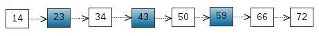
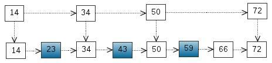
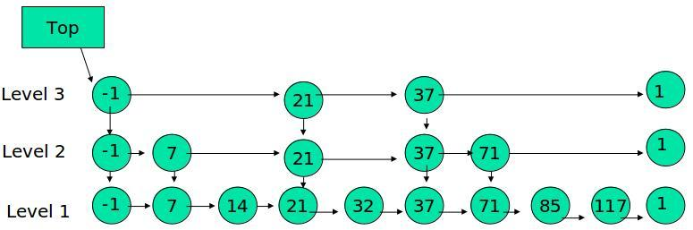
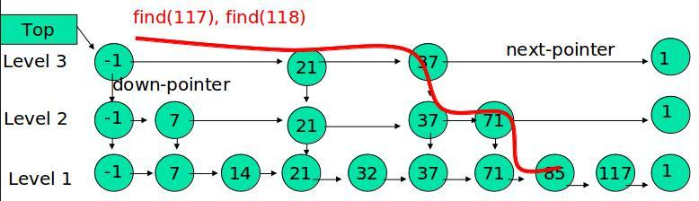
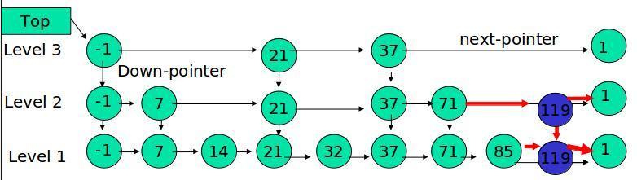
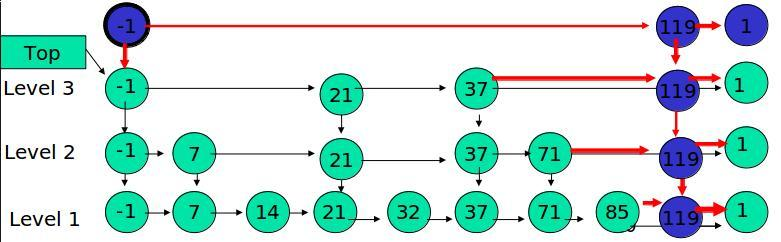
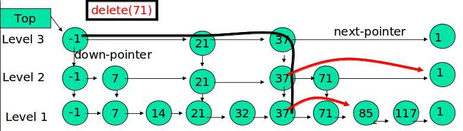

# 跳跃表实现原理
跳表是一种随机化的数据结构。它的效率和红黑树以及 AVL树不相上下，但跳表的原理相当简单，只要你能熟练操作链表，就能轻松实现一个 `SkipList`。

我们考虑有序表的搜索。



从上表中搜索元素<23, 43, 59>，需要比较的次数分别为<2, 4, 6>，一共需要的比较测试为2+4+6=12次。链表是有序的，但是无法使用二分查找。此时，我们可以效仿二叉搜索树，把一些节点提取出来作为索引，得到如下图所示的结构：



这里我们把<14, 34, 50, 72>提取出来作为一级索引，这样搜索的时候就可以减少比较次数了（当表中的元素数量较少时无法体现出这种特点）。

## 跳跃表


其中-1表示INT_MIN, 链表的最小值；1表示INT_MAX，链表的最大值。

跳跃表(跳表)具有如下性质：
- 有多层
- 每一层都是一个有序链表
- 最底层(Level 1)的链表包含所有元素
- 如果一个元素出现在Level i的链表中，则它在Level i之下的链表中一定会出现
- 每个节点包含两个指针，一个指向同一个链表中的下一个元素，一个指向下一层的元素

### 跳跃表的搜索



例子：在上图表结构中查找元素 117

1. 比较21，比21大，往后面找
2. 比较37, 比37大，比链表最大值小，从37的下面一层开始找
3. 比较71, 比71大，比链表最大值小，从71的下面一层开始找
4. 比较85，比85大，从后面找
5. 比较117，等于117，找到了节点。

具体的搜索算法如下：

```c
/**
 * 如果存在x,返回x所在的节点；
 * 否则返回x的后继节点
 */

find(x) {
    p = top
    while(1) {
        while(p->next->key < x) {
            p = p->next;
        }
        if(p->down == null)
            return p->next;
        return p->down;
    }
}
```

### 跳跃表的插入

先确定该元素要占据的层数`K`（采用丢硬币的方式，这完全是随机的），然后在`Level 1, ..., Level K` 各个层的链表都插入元素。

例如， 插入元素 119， K = 2



如果 K 大于链表的层数，则要添加新的层。

例如， 插入元素 119， K = 4



插入元素的时候，元素所占有的层数完全是随机的，通过一下随机算法产生：

```c
random_level() {
    K = 1;

    while(random(0,1)) {
        K ++;
    }

    return K;
}
```

相当与做一次丢硬币的实验，如果遇到正面，继续丢，遇到反面，则停止，

用实验中丢硬币的次数`K`作为元素占有的层数。显然随机变量`K`满足参数为概率`p = 1/2` 的几何分布，`K`的期望值`E[K] = 1/p = 2`，就是说，各个元素的层数，期望值是`2`层。

## 跳表的高度。

`n`个元素的跳表，每个元素插入的时候都要做一次实验，用来决定元素占据的层数`K`，跳表的高度等于这`n`次实验中产生的最大`K`。

## 跳表的空间复杂度分析
根据上面的分析，每个元素的期望高度为`2`，一个大小为`n`的跳表，其节点数目的
期望值是`2n`。

## 跳表的删除

在各个层中找到包含`x`的节点，使用标准的`delete from list`方法删除该节点。

例子：删除 71



## 参考文献

[1] Skip Lists-A Probabilistic Alternative to Balanced Trees-William Pugh