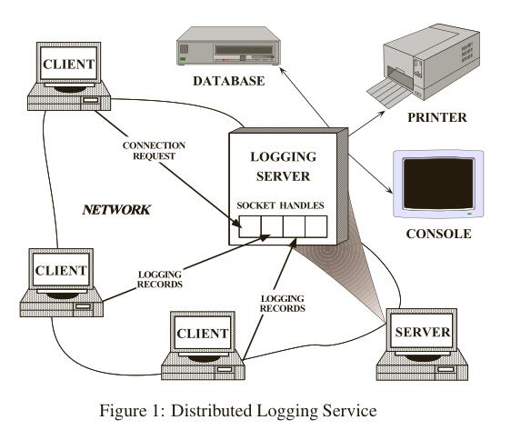
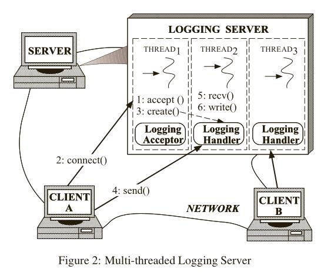
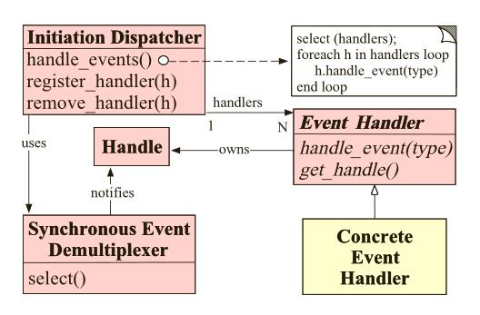
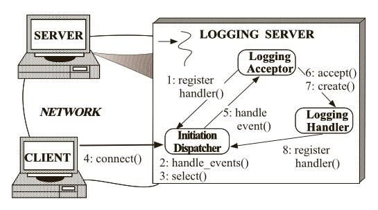
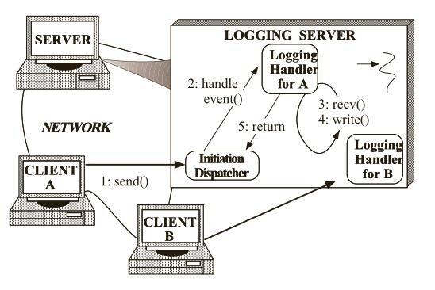
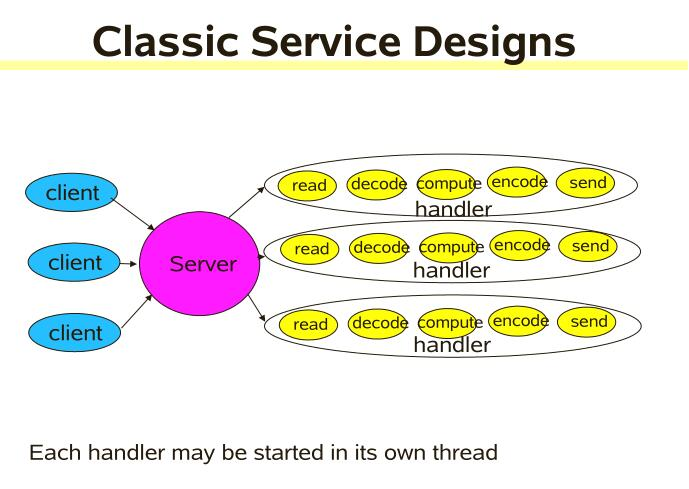
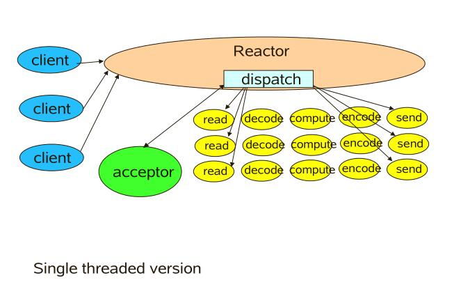
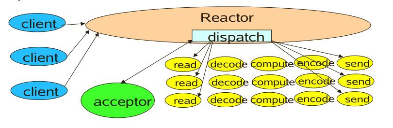
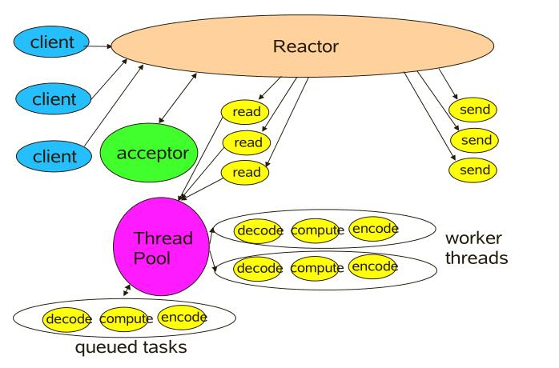

# 反应器(Reactor)模式
## 前言
 本文针对Reactor模式从四个方面进行了阐述，首先简单介绍了Reactor模式是什么；其次，阐述了为什么使用Reactor模式；再次，针对实际生活的应用场景，分析了在什么场景下使用Reactor模式；最后，着重分析讲解了如何使用Reactor模式，以及代码示例。

## What：Reactor模式是什么？
反应器设计模式(Reactor pattern)是一种为处理并发服务请求，并将请求提交到一个或者多个服务处理程序的事件设计模式。当客户端请求抵达后，服务处理程序使用多路分配策略，由一个非阻塞的线程来接收所有的请求，然后派发这些请求至相关的工作线程进行处理。 Reactor模式主要包含下面几部分内容。
1. 初始事件分发器(Initialization Dispatcher)：用于管理Event Handler，定义注册、移除EventHandler等。它还作为Reactor模式的入口调用Synchronous Event Demultiplexer的select方法以阻塞等待事件返回，当阻塞等待返回时，根据事件发生的Handle将其分发给对应的Event Handler处理，即回调EventHandler中的handle_event()方法
2. 同步（多路）事件分离器(Synchronous Event Demultiplexer)：无限循环等待新事件的到来，一旦发现有新的事件到来，就会通知初始事件分发器去调取特定的事件处理器。
3. 系统处理程序(Handles)：操作系统中的句柄，是对资源在操作系统层面上的一种抽象，它可以是打开的文件、一个连接(Socket)、Timer等。由于Reactor模式一般使用在网络编程中，因而这里一般指Socket Handle，即一个网络连接（Connection，在Java NIO中的Channel）。这个Channel注册到Synchronous Event Demultiplexer中，以监听Handle中发生的事件，对ServerSocketChannnel可以是CONNECT事件，对SocketChannel可以是READ、WRITE、CLOSE事件等。
4. 事件处理器(Event Handler)： 定义事件处理方法，以供Initialization Dispatcher回调使用。
5. 对于Reactor模式，可以将其看做由两部分组成，一部分是由Boss组成，另一部分是由worker组成。Boss就像老板一样，主要是拉活儿、谈项目，一旦Boss接到活儿了，就下发给下面的work去处理。也可以看做是项目经理和程序员之间的关系。

## Why：为什么使用Reactor模式？
### Part A:
对于一个事件驱动的分布式日志登录服务系统，如下图1所示。

客户端应用通过日志服务来录入它们当前状态和记录，这些状态可记录可能包含了错误通知信息、断点调试信息等。日志记录被发送到一个中央日服务器上，该服务器可以处理日志和连接用户请求。客户端想要记录日志信息，首先必须发送一个连接请求给服务器。服务器通过一个“处理工厂”来监听客户端对应的地址信息，以等待这些连接请求的到来。当一个连接请求到来时，“处理工厂”就创建一个handle，其代表了连接的端点，用来建立客户端和服务器之间的连接。当handle收到来自客户端的请求连接时，就会返回给服务器。一旦客户端连接成功，它们就可以同时发送日志记录到服务器。
### Part B:
或许最有效的方法来开发一个并发日志系统是使用多线程，这样可以同时处多个理客户端请求，如下图2所示。

然而，多线程实现这样的分布式日志系统可能会面临下面的问题：
- 可用性：服务器必须能够处理传入请求即使是等待其他请求到达的。特别是，一个服务器不能无限期地处理任何单一来源的事件而排斥其他事件源。因为这可能大大延迟响应其他客户的时间。
- 效率：一个服务器应该做到延迟最小化、吞吐量最大化，避免不必要地使用CPU。多线程可能会导致糟糕的性能由于上下文切换、同步和数据移动。
- 编程简洁：服务器的设计上应该简化使用合适的并发策略。多线程可能需要复杂的并发控制方案。
- 可移植性：多线程不是可用在所有操作系统平台。
- 适应性：集成新的或改进服务，如改变消息格式或添加服务器端缓存，应该承担最小的现有代码的修改和维护成本。例如，实现新应用程序服务应该不需要修改通用事件多路分解和调度机制。
### Part C:
针对上面的问题，可以集成同步多路分解事件并分发相应的事件处理程序来处理相应的事件。对于每一个应用程序所提供的服务，引入一个单独的事件处理器处理某些类型的事件。所有事件处理程序实现了相同的接口。事件处理程序注册一个初始调度程序，它使用一个同步事件信号分离器等待事件发生。当事件发生时，同步事件信号分离器通知初始调度器，它同步告知事件处理程序去关联对应的事件。事件处理程序然后分派事件到实现了所请求服务的方法中。

上述日志系统的Reactor模式类图如下所示：

客户端连接到日志服务器所经过的一系列步骤如下图所示：

日志服务器记录日志所经过的一系列步骤如下图所示：


## Where：什么场景下使用Reactor模式？
对于高并发系统，常会使用Reactor模式，其代替了常用的多线程处理方式，节省系统的资源，提高系统的吞吐量。下面用比较直观的形式来介绍这种模式的使用场景。

以餐厅为例，每一个人就餐就是一个事件，顾客会先看下菜单，然后点餐，处理这些就餐事件需要服务人员。就像一个网络服务会有很多的请求，服务器会收到每个请求，然后指派工作线程去处理一样。

在多线程处理方式下：
1. 一个人来就餐，一个服务员去服务，然后客人会看菜单，点菜。 服务员将菜单给后厨。
2. 二个人来就餐，二个服务员去服务……
3. 五个人来就餐，五个服务员去服务……

这类似多线程的处理方式，一个事件到来，就会有一个线程为其服务。很显然这种方式在人少的情况下会有很好的用户体验，每个客人都感觉自己享有了最好的服务。如果这家餐厅一直这样同一时间最多来5个客人，这家餐厅是可以很好的服务下去的。

由于这家店的服务好，吃饭的人多了起来。同一时间会来10个客人，老板很开心，但是只有5个服务员，这样就不能一对一服务了，有些客人就不能马上享有服务员为其服务了。老板为了挣钱，不得不又请了5个服务员。现在又好了，每位顾客都享受最好最快的待遇了。

越来越多的人对这家餐厅满意，客源又多了，同时来吃饭的人到了20人，老板高兴但又高兴不起来了，再请服务员吧，占地方不说，还要开工钱，再请人就挣不到到钱了。

怎么办呢？老板想了想，10个服务员对付20个客人也是能对付过来的，服务员勤快点就好了，伺候完一个客人马上伺候另外一个，还是来得及的。综合考虑了一下，老板决定就使用10个服务人员的线程池！

但是这样又有一个比较严重的缺点：如果正在接受服务员服务的客人点菜很慢，其他的客人可能就要等好长时间了。有些脾气火爆的客人可能就等不了走人了。

这样，我么那就引入了Reactor模式，那么，Reactor模式是如何处理这个问题呢？

老板后来发现，客人点菜比较慢，大部服务员都在等着客人点菜，其实干的活不是太多。老板之所以能当老板当然有点不一样的地方，终于发现了一个新的方法，那就是：当客人点菜的时候，服务员就可以去招呼其他客人了，等客人点好了菜，直接招呼一声“服务员”，马上就有个服务员过去服务。在用了这个新方法后，老板进行了一次裁员，只留了一个服务员！这就是用单个线程来做多线程的事。实际的餐馆都是用的Reactor模式在服务。

## How：如何使用Reactor模式？
在网络服务和分布式对象中，对于网络中的某一个请求处理，我们比较关注的内容大致为：读取请求( Read request)、 解码请求(Decode request)、处理服务(Process service)、 编码答复(Encode reply)、 发送答复(Send reply)。但是每一步对系统的开销和效率又不尽相同。
### A、Classic Service Design
对于传统的服务设计，每一个到来的请求，系统都会分配一个线程去处理，这样看似合乎情理，但是，当系统请求量瞬间暴增时，会直接把系统拖垮。因为在高并发情况下，系统创建的线程数量是有限的。传统系统设计如下图所示：

传统的服务代码实现如下所示：
```java
class Server implements Runnable {
    public void run() {
        try {
            //创建服务端连接
            ServerSocket ss = new ServerSocket(PORT);
            //不停创建线程处理新的请求
            while (!Thread.interrupted())
                new Thread(new Handler(ss.accept())).start();
            // or, single-threaded, or a thread pool
        } catch (IOException ex) {
            /* ... */ }
    }

    //处理请求的handler
    static class Handler implements Runnable {
        final Socket socket;

        Handler(Socket s) {
            socket = s;
        }

        public void run() {
            try {
                byte[] input = new byte[MAX_INPUT];
                socket.getInputStream().read(input);
                byte[] output = process(input);
                socket.getOutputStream().write(output);
            } catch (IOException ex) {
                /* ... */ }
        }

        private byte[] process(byte[] cmd) {
            /* ... */ }
    }
}
```
显然，传统的一对一的线程处理无法满足新需求的变化。对此，考虑到了线程池的使用，这样就使得线程可以被复用，大大降低创建线程和销毁线程的时间。然而，线程池并不能很好满足高并发线程的需求，当海量请求到来时，线程池中的工作线程达到饱和状态，这时可能就导致请求被抛弃，无法完成客户端的请求。对此，考虑到将一次完整的请求切分成几个小的任务，每一个小任务都是非阻塞的；对于读写操作，使用NIO对其进行读写；不同的任务将被分配到与想关联的处理器上进行处理，每个处理器都是通过异步回调机制实现。这样就大大提供系统吞吐量，减少响应时间。这就是下面将要介绍的Reactor模式。
### Basic Reactor Design
 单线程版的Reactor模式如下图所示。对于客户端的所以请求，都又一个专门的线程去进行处理，这个线程无线循环去监听是否又客户的请求到来，一旦收到客户端的请求，就将其分发给响应的处理器进行处理。
 

#### Reactor 1: Setup
在Reactor模式中，我们需要进行一些基本设置，首先需要创建一个Selector和一个ServerSocketChannel ，将监听的端口绑定到Channel中，还需要设置Channel为非阻塞，并在Selector上注册自己感兴趣的时事件，可以是连接事件，也可以是读写事件。代码如下所示：
```java
//定义reactor，其中包括Selector和ServerSocketChannel
//将ServerSocketChannel和事件类型绑定到Seletor上，设置  serverSocket为非阻塞
class Reactor implements Runnable {
    final Selector selector;
    final ServerSocketChannel serverSocket;

    Reactor(int port) throws IOException {
        selector = Selector.open();
        serverSocket = ServerSocketChannel.open();
        serverSocket.socket().bind(new InetSocketAddress(port));
        serverSocket.configureBlocking(false);
        SelectionKey sk = serverSocket.register(selector, SelectionKey.OP_ACCEPT);
        sk.attach(new Acceptor());
    }
    /*
     * Alternatively, use explicit SPI provider: SelectorProvider p =
     * SelectorProvider.provider(); selector = p.openSelector();
     * serverSocket = p.openServerSocketChannel();
     */
}
```
#### Reactor 2: Dispatch Loop
下面这段代码可以看做是boss线程，它负责接收请求并安排给对应的handle处理。可以看出，只要当前线程不中断就会一直监听，其中selector.select()是阻塞的，一旦又请求到来时，就会从selector中获取到对应的SelectionKey ，然后将其下发给后续处理程序(工作线程)进行处理。
```java
// class Reactor continued
//无限循环等待网络请求的到来
//其中selector.select();会阻塞直到有绑定到selector的请求类型对应的请求到来，一旦收到事件，处理分发到对应的handler，并将这个事件移除
public void run() { // normally in a new Thread
    try {
        while (!Thread.interrupted()) {
            selector.select();
            Set selected = selector.selectedKeys();
            Iterator it = selected.iterator();
            while (it.hasNext())
                dispatch((SelectionKey)(it.next());
                selected.clear();
            }
    } catch (IOException ex) {
        /* ... */ }
    }

}

void dispatch(SelectionKey k) {
    Runnable r = (Runnable) (k.attachment());
    if (r != null)
        r.run();
}
```
#### Reactor 3: Acceptor
Acceptor也是一个线程，在其run方法中，通过判断serverSocket.accept()方法来获取SocketChannel，只要SocketChannel 不为空，则创建一个handler进行相应处理。
```java
// class Reactor continued
class Acceptor implements Runnable { // inner
    public void run() {
        try {
            SocketChannel c = serverSocket.accept();
            if (c != null)
                new Handler(selector, c);
        } catch (IOException ex) {
            /* ... */ }
    }
}
```


#### Reactor 4: Handler setup
从下方代码可看出，一个handler就是一个线程，其中的SocketChannel 被设置成非阻塞。默认在Selector上注册了读事件并绑定到SocketChannel 上。
```java
final class Handler implements Runnable {
    final SocketChannel socket;
    final SelectionKey sk;
    ByteBuffer input = ByteBuffer.allocate(MAXIN);
    ByteBuffer output = ByteBuffer.allocate(MAXOUT);
    static final int READING = 0, SENDING = 1;
    int state = READING;

    Handler(Selector sel, SocketChannel c) throws IOException {
        socket = c;
        c.configureBlocking(false);
        // Optionally try first read now
        sk = socket.register(sel, 0);
        sk.attach(this);
        sk.interestOps(SelectionKey.OP_READ);
        sel.wakeup();
    }

    boolean inputIsComplete() {
        /* ... */ }

    boolean outputIsComplete() {
        /* ... */ }

    void process() {
        /* ... */ }
}
```
#### Reactor 5: Request handling
针对不同的请求事件进行处理，代码实现如下所示：
```java
// class Handler continued
//具体的请求处理，可能是读事件、写事件等
public void run() {
    try {
        if (state == READING)
            read();
        else if (state == SENDING)
            send();
    } catch (IOException ex) {
        /* ... */ }
}

void read() throws IOException {
    socket.read(input);
    if (inputIsComplete()) {
        process();
        state = SENDING;
        // Normally also do first write now
        sk.interestOps(SelectionKey.OP_WRITE);
    }
}

void send() throws IOException {
    socket.write(output);
    if (outputIsComplete())
        sk.cancel();
}
```
### C、Worker Thread Pools for Reactor
考虑到工作线程的复用，将工作线程设计为线程池。工作线程使用线程池实现如下图所示。

在handler中使用线程池来处理任务。代码实现如下所示
```java
//这里将具体的业务处理线程设置线程池，提供线程复用
class Handler implements Runnable {
    // uses util.concurrent thread pool
    static PooledExecutor pool = new PooledExecutor(...);
    static final int PROCESSING = 3;

    // ...
    synchronized void read() { // ...
        socket.read(input);
        if (inputIsComplete()) {
            state = PROCESSING;
            //从线程池中指派线程去完成工作
            pool.execute(new Processer());
        }
    }

    synchronized void processAndHandOff() {
        process();
        state = SENDING; // or rebind attachment
        sk.interest(SelectionKey.OP_WRITE);
    }

    class Processer implements Runnable {
        public void run() {
            processAndHandOff();
        }
    }
}
```
## 总结
本文简单阐述了Reactor模型，从Reactor模式是什么到Reactor模式的使用，以及使用Reactor模式的好处。我想如果你了解Netty或者vertx，你一定对Reactor模式有所了解。其中，Netty就是基于Reactor模式搭建的，其是一个异步事件驱动的网络应用框架，感兴趣的同学可以去看看。希望本文对你有所帮助。

## 学习资源
vertx:
- [http://vertx.io/](http://vertx.io/)
- [http://vertx.io/docs/](http://vertx.io/docs/)
- [https://github.com/vert-x3/vertx-examples/](https://github.com/vert-x3/vertx-examples/)
- [http://www.sczyh30.com/](http://www.sczyh30.com/)

Netty:
- [http://netty.io/](http://netty.io/)
- [https://github.com/netty/netty](https://github.com/netty/netty)
- [https://dirtysalt.github.io/netty.html#orgheadline1](https://dirtysalt.github.io/netty.html#orgheadline1)
- [https://github.com/code4craft/netty-learning](https://github.com/code4craft/netty-learning)
- [http://www.coderli.com/tags/#Netty](http://www.coderli.com/tags/#Netty)

## 参考文献：
[1] Doug Lea. Scalable IO in Java
[2] DC Schmidt. Reactor: an object behavioral pattern for concurrent event demultiplexing and event handler dispatching.
[3] [完全照搬自这篇文章： Reactor（反应器）模式初探](https://blog.csdn.net/pistolove/article/details/53152708)
