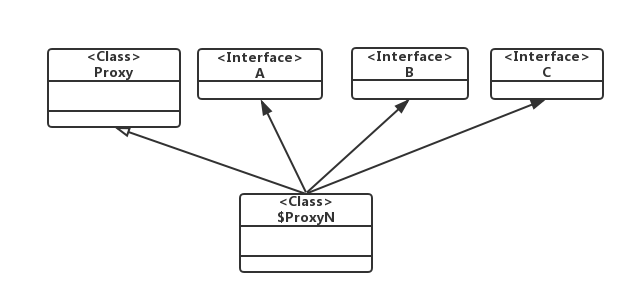

# 代理模式之动态代理
本文将主要介绍了动态代理及其与静态代理的区别，以及相关应用。 进一步，我们介绍了Java的动态代理机制及其特点。

## 动态代理
在[代理模式的基本概念](./代理模式的基本概念.md)一文中，我们举了字体库从不同环境加载的例子。 我们看到在当时的需求下静态代理已经足够完美。如果我们修改一下需求，情况就会变得不同。 

如果我们不仅仅是获取字体库，还需要获取图片，视频，音乐等其他资源怎么办？ 如果我们按照代理模式的通用类图去实现一个静态代理模式，显然，我们发现我们需要定义额外的顶层接口。例如， ImageProvider和MusicProvider接口，实现对应的功能类DiskImageProvider,SystemImageProvider,NetImageProvider,DistMusicProvider,NetMusicProvider,DiskMusicProvider以及代理类ProxyImageProvider和ProxyMusicProvider。 当进一步修改需求，要给获取图片和获取音乐等都加上缓存功能的时，ProxyImageProvider和ProxyMusicProvider都需要改动，而缓存的逻辑三个类又是相同的。 我们发现我们整个代码实现在不停发生改动。 此时，动态代理将会提供一种简单、整洁安全的实现方式。 如下代码，我们提供一种Java版的实现：

```java
public class CachedProviderHandler implements InvocationHandler {
    private Map<String, Object> cached = new HashMap<>();
    private Object target;
    public CachedProviderHandler(Object target) {
        this.target = target;
    }
    public Object invoke(Object proxy, Method method, Object[] args)
        throws Throwable {
        Type[] types = method.getParameterTypes();//获取方法的名、参数等信息
        if (method.getName().matches("load.+") && (types.length == 1) &&
                (types[0] == String.class)) {//根据函数的开头名、参数个数、参数类型判断是否是获取资源的方法
            String key = (String) args[0];//本文的例子中，接口方法只有一个参数，获取的就是这个传入的参数
            //先读缓存
            Object value = cached.get(key);
            //没有就调用从其它媒介获取资源的方法
            if (value == null) {
                value = method.invoke(target, args);
                //缓存资源
                cached.put(key, value);
            }
            return value;
        }
        return method.invoke(target, args);
    }
}

```
有了CachedProviderHandler类，原来的所有代理都不再需要了, 也就是说我们给具备相同逻辑的代理类提供一种统一的动态实现（这里使用了Java中反射概念）。

以从磁盘获取字体集为例子：

```java
public class Main {
    public static void main(String[] args) {
        String fontPath = "path";
        FontProvider realFontProvider = new DiskFontProvider();
        InvocationHandler handler = new CachedProviderHandler(realFontProvider);
        FontProvider fontProvider = (FontProvider) Proxy.newProxyInstance(realFontProvider.getClass().getClassLoader(), realFontProvider.getClass().getInterfaces(), handler);//fontProvider就是动态创建的代理类实例
        fontProvider.getFont(fontPath, 0);
    }
}
```

从上述结果，我们发现对于代理模式而言，静态代理和动态代理的实现思路基本上是相同的。其差别在于动态代理依靠实现语言的机制对具有相同逻辑的代理实现了封装实现，这样帮助开发者节约代码量，提高开发效率。

## Java的动态代理机制和特点
在上述例子的实现中，我们使用了Java提供的动态代理相关类和接口。 想要深入的了解Java的动态代理机制，首先需要了解其类和接口。

- `java.lang.reflect.Proxy` Java动态代理机制主要实现类，它提供了一组静态方法来为一组静态接口动态生成代理类及其对象。

```java
// 方法 1: 该方法用于获取指定代理对象所关联的调用处理器
public static InvocationHandler getInvocationHandler(Object proxy) 
 
// 方法 2：该方法用于获取关联于指定类装载器和一组接口的动态代理类的类对象
public static Class getProxyClass(ClassLoader loader, Class[] interfaces) 
 
// 方法 3：该方法用于判断指定类对象是否是一个动态代理类
public static boolean isProxyClass(Class cl) 
 
// 方法 4：该方法用于为指定类装载器、一组接口及调用处理器生成动态代理类实例
public static Object newProxyInstance(ClassLoader loader, Class[] interfaces, 
    InvocationHandler h)
```

- `java.lang.reflect.InvocationHandler` 调用处理器接口，它定义了一个`invoke`抽象方法，用于集中处理动态代理类对委托类实例对象方法的调用， 通常在该方法中实现对委托类的代理访问。

```java
// 该方法负责集中处理动态代理类上的所有方法调用。第一个参数既是代理类实例，第二个参数是被调用的方法对象。第三个方法是调用参数。调用处理器根据这三个参数进行预处理或分派到委托类实例上发射执行
Object invoke(Object proxy, Method method, Object[] args)
```

### Java动态代理机制
首先让我们来了解一下如何使用`Java`动态代理。具体有如下四步骤：

1. 通过实现`InvocationHandler`接口创建自己的调用处理器；
2. 通过为`Proxy`类指定`ClassLoader`对象和一组`interface`来创建动态代理类, 这组接口是委托类实现的接口；
3. 通过反射机制获得动态代理类的构造函数，其唯一参数类型是调用处理器接口类型；
4. 造函数创建动态代理类实例，构造时调用处理器对象作为参数被传入。

```java
// InvocationHandlerImpl 实现了 InvocationHandler 接口，并能实现方法调用从代理类到委托类的分派转发
// 其内部通常包含指向委托类实例的引用，用于真正执行分派转发过来的方法调用
InvocationHandler handler = new InvocationHandlerImpl(..); 
 
// 通过 Proxy 为包括 Interface 接口在内的一组接口动态创建代理类的类对象
Class clazz = Proxy.getProxyClass(classLoader, new Class[] { Interface.class, ... }); 
 
// 通过反射从生成的类对象获得构造函数对象
Constructor constructor = clazz.getConstructor(new Class[] { InvocationHandler.class }); 
 
// 通过构造函数对象创建动态代理类实例
Interface Proxy = (Interface)constructor.newInstance(new Object[] { handler });
```
实际使用过程更加简单，因为`Proxy`的静态方法`newProxyInstance`已经为我们封装了步骤2到步骤`4`的过程，所以简化后的代码实现如下:

```java
// InvocationHandlerImpl 实现了 InvocationHandler 接口，并能实现方法调用从代理类到委托类的分派转发
InvocationHandler handler = new InvocationHandlerImpl(..); 
 
// 通过 Proxy 直接创建动态代理类实例
Interface proxy = (Interface)Proxy.newProxyInstance( classLoader, 
     new Class[] { Interface.class }, 
     handler );

```

## Java动态代理机制的特点
首先是动态生成的代理类本身的一些特点。
1. 包：如果所代理的接口都是`public` 的，那么它将被定义在顶层包（即包路径为空），如果所代理的接口中有非`public`的接口（因为接口不能被定义为`protect`或`private`，所以除`public`之外就是默认的`package`访问级别），那么它将被定义在该接口所在包（假设代理了`com.test`包中的某非`public`接口`A`，那么新生成的代理类所在的包就是`com.test`），这样设计的目的是为了最大程度的保证动态代理类不会因为包管理的问题而无法被成功定义并访问；
2. 类修饰符：该代理类具有`final`和`public`修饰符，意味着它可以被所有的类访问，但是不能被再度继承；
3. 类名：格式是“$ProxyN”，其中`N`是一个逐一递增的阿拉伯数字，代表`Proxy`类第`N` 次生成的动态代理类，值得注意的一点是，并不是每次调用`Proxy`的静态方法创建动态代理类都会使得`N`值增加，原因是如果对同一组接口（包括接口排列的顺序相同）试图重复创建动态代理类，它会很聪明地返回先前已经创建好的代理类的类对象，而不会再尝试去创建一个全新的代理类，这样可以节省不必要的代码重复生成，提高了代理类的创建效率。
4. 类继承关系：该类的继承关系如图：



由图可见，`Proxy`类是它的父类，这个规则适用于所有由`Proxy`创建的动态代理类。而且该类还实现了其所代理的一组接口，这就是为什么它能够被安全地类型转换到其所代理的某接口的根本原因。

接下来让我们了解一下代理类实例的一些特点。每个实例都会关联一个调用处理器对象，可以通过`Proxy`提供的静态方法`getInvocationHandler`去获得代理类实例的调用处理器对象。在代理类实例上调用其代理的接口中所声明的方法时，这些方法最终都会由调用处理器的`invoke`方法执行。此外，值得注意的是，代理类的根类`java.lang.Object`中有三个方法也同样会被分派到调用处理器的`invoke`方法执行，它们是`hashCode`，`equals`和`toStrin`，可能的原因有：一是因为这些方法为`public`且非`final`类型，能够被代理类覆盖；二是因为这些方法往往呈现出一个类的某种特征属性，具有一定的区分度，所以为了保证代理类与委托类对外的一致性，这三个方法也应该被分派到委托类执行。当代理的一组接口有重复声明的方法且该方法被调用时，代理类总是从排在最前面的接口中获取方法对象并分派给调用处理器，而无论代理类实例是否正在以该接口（或继承于该接口的某子接口）的形式被外部引用，因为在代理类内部无法区分其当前的被引用类型。

接着来了解一下被代理的一组接口有哪些特点。首先，要注意不能有重复的接口，以避免动态代理类代码生成时的编译错误。其次，这些接口对于类装载器必须可见，否则类装载器将无法链接它们，将会导致类定义失败。再次，需被代理的所有非`public`的接口必须在同一个包中，否则代理类生成也会失败。最后，接口的数目不能超过`65535`，这是`JVM`设定的限制。

最后再来了解一下异常处理方面的特点。从调用处理器接口声明的方法中可以看到理论上它能够抛出任何类型的异常，因为所有的异常都继承于`Throwable`接口，但事实是否如此呢？答案是否定的，原因是我们必须遵守一个继承原则：即子类覆盖父类或实现父接口的方法时，抛出的异常必须在原方法支持的异常列表之内。所以虽然调用处理器理论上讲能够，但实际上往往受限制，除非父接口中的方法支持抛`Throwable`异常。那么如果在`invoke`方法中的确产生了接口方法声明中不支持的异常，那将如何呢？放心Java动态代理类已经为我们设计好了解决方法：它将会抛出`UndeclaredThrowableException`异常。这个异常是一个`RuntimeException`类型，所以不会引起编译错误。通过该异常的`getCause`方法，还可以获得原来那个不受支持的异常对象，以便于错误诊断。


## 参考文献

- [ava 动态代理机制分析及扩展](https://www.ibm.com/developerworks/cn/java/j-lo-proxy1/index.html)
- [Java深度历险（七）——Java反射与动态代理](http://www.infoq.com/cn/articles/cf-java-reflection-dynamic-proxy)
- [Decorating with dynamic proxies](https://www.ibm.com/developerworks/java/library/j-jtp08305/index.html)