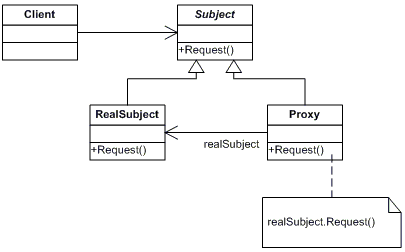

# 代理模式的基本概念
本文的主要内容是自己对于代理模式概念的理解，几种代理类型，静态代理以及其经典实现方案。


## 代理模式的概念
我首先抛出GoF对于代理模式的定义：

` **Proxy Pattern**: Provide a surrogate or placeholder for another object to control access`

` **代理模式**： 为其他对象提供一个替身或占位符以控制对这个对象的访问`。另外，代理作为一种对象与外界的交互中介，可以去掉或增强服务的功能。

代理模式的通用类图：



在代理模式的通用类图中：

- RealSubject是被代理对象，或称为委托对象
- Proxy是代理对象
- Subject为委托对象共同继承的类或共同实现的接口
- request() 为从父类或接口处继承的方法

## 几种代理类型
下面介绍几种常见的代理类型，其实也就是代理的几个应用场景。

1. 远程代理（Remote Proxy）

为不同地理的对象提供本地局域网络的代表对象。例如，为网络上的对象创建一个本地代理。要操作网络上的一个对象（网络性能不好时，问题尤为突出），我们将这个过程交由一个本地代理去完成。

2. 虚拟代理（Virtual Proxy）

根据需要将资源消耗很大的对象进行延迟处理，并提供一个替代对象，真正需要的时候进行才会创建对象。例如，在网络上加载一个很大的图片，由虚拟代理来扮演对象的替身，对象创建后代理就会将请求直接委托给被代理对象。

3. 保护代理（Protection Proxy）

代理对象控制被代理对象的访问权限。 例如，在一个论坛中不通过访问你权限的用户将获得不同层次的操作权限。我们可以将这个权限鉴别过程交由代理对象去处理。

## 静态代理（Static Proxy）
静态代理指代理对象和被代理对象之间的关系在代理之前就已经确定，他们都实现相同的接口或继承相同的类。

为了便于扩展，使得实现更具灵活性，我们通常会采用聚合替代继承的编程手法来实现代理。以下提供上述代理模式通用类图的一种实现。


```java
//抽象主题类
public interface Subject {
    request();
}

//主题类实现
public class RealSubject implements Subject {
    public void request() {
        System.out.println("RealSubject request ...");
    }
}

//代理类
public class Proxy implements Subject {
    private Subject subject;
    
    //对象注入机制，使用聚合的方式实现
    public Proxy(Subject subject) {
        this.subject = subject;
    }

    public void request() {
        System.out.println("Proxy request start ...");
        subject.request();
        System.out.println("Proxy request end ...");
    }
}

//使用继承的方式实现代理
public class Proxy extends RealSubject {
    @Override 
    public void request() {
        System.out.println("Proxy request start ...");
        super.request();
        System.out.println("Proxy request end ...");
    }
}

```

结合类图和代码的实现，我们可以发现： 在理模式中，Proxy和RealSubject都实现了Subject接口或都继承了Subject类。这允许任何客户端都可以象处理RealSubject一个处理Proxy。 RealSubject通常是真正做事的对象，Proxy会控制对RealSubject的访问。 RealSubject是被Proxy代理和控制访问的对象。 用聚合的编程手法实现时，Proxy持有Subject对象的引用，所以必要时它可以将请求转发给Subject。 创建RealSubject对象的过程，通常由Proxy负责。

为了说明代理模式的有点，我们举一个比较实用的例子。我们考虑系统中的字体提供功能，字体库的来源可能源自于本地磁盘、网络或者系统中。

根据代理模式的通用类图，我们首先定义一个字体库接口——`FontProvider`
```java
public interface FontProvider {
    Font loadFont(String fontPath);
}

```
从磁盘中获取字体库，需要定义一个实现类——`DiskFontProvider`
```java
public class DiskFontProvider implements FontProvider {
    @Override
    Font loadFont(String fontPath){
        System.out.println("Disk Font Library");
    }
}
```
提供磁盘字体库类的代理——`ProxyForDiskFontProvider`
```java
public class ProxyForDiskFontProvider implements FontProvider {
    private FontProvider fontProvider;

    ProxyForDiskFontProvider(FontProvider fontProvider) {
        this.fontProvider = fontProvider;
    }

    @Override
    Font loadFont(){
        System.out.println("ProxyForDiskFontProvider begin ...");
        fontProvider.loadFont(String fontPath);
        System.out.println("ProxyForDiskFontProvider end ...");
    }

}
```
场景类，磁盘取字体库。

```java
public class FontProviderClient{
    public static void main(String[] args) {
        String fontPath = "path";
        FontProvider fp=new ProxyForDiskFontProvider(new DiskFontProvider());
        fp.loadFont(fontPath);
    }
}
```
这样实现好处在于， 每次从磁盘获取字体库的时候，由于磁盘的I/O比较耗时，如果想通过缓存将读到的字体库暂存一份，我们可以直接修改ProxyForDiskFontProvider代理类。 也就是说，当业务逻辑修改时，我们可以直接修改代理类，而不需要动底层实现类。 例如,上述需求我们可以这么做 ：

```java
public class ProxyForDiskFontProvider implements FontProvider{
    private FontProvider fontProvider;
    FontProviderClient(FontProvider fontProvider){
        this.fontProvider=fontProvider;
    }
    @Override
    Font loadFont(String fontPath){
        System.out.println("check font library");
        if(不存在){
            fontProvider.loadFont(fontPath);
            System.out.println("load font library from disk to cache");
        }else{
            System.out.println("load from cache");
        }
    }
}
```
当然，也可以直接修改DiskFontProvider类的loadFont()方法，但是这样会有一个问题。上文中我们提到，字体库的获取源除了磁盘还有系统和网络等， 所以可能存在SystemFontProvider和NetFontProvider两个类。 如果这两个类也需要缓存功能的时候，采用同样的方法就需要我们同时修改另外两个类的loadFont方法。然而，代理模式中，只需要在代理类ProxyForFont中修改即可。此时从磁盘、系统和网络获取字体库的方式如下：

```java
public class FontProviderClient{
    public static void main(String[]args) {
        FontProvider fp0=new ProxyForFont(new FontProviderFromDisk());
        fp0.getFont("字体库名");
        FontProvider fp1=new ProxyForFont(new FontProviderFromSystem());
        fp1.getFont("字体库名");
        FontProvider fp2=new ProxyForFont(new FontProviderFromNet());
        fp2.getFont("字体库名");
    }
}
```
