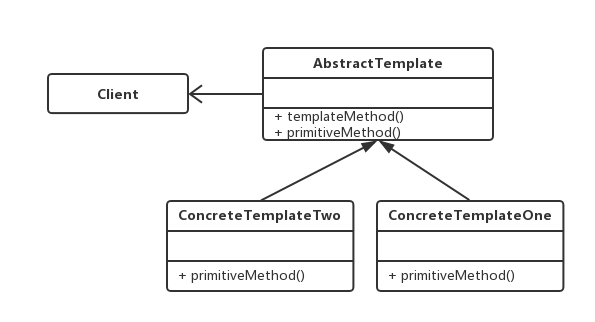

# 模板（Template）模式
在面向对象系统分析和设计过程中经常会遇到这样一种情况：对于某个业务逻辑（或者算法实现）在不同的情况下有不同的实现细节，但是逻辑（算法）的框架（或通用的应用算法）是相同的。 Template模式和Strategy模式提供了不同方式以实现该逻辑（算法）。

其中，Template模式采用 **继承**的方式实现这种逻辑：**将业务逻辑框架放在抽象类中，并定义好细节的接口，子类中实现接口细节**。 而Strategy模式提供了另外一种实现方式： **将逻辑算法封装到一个类中，采取组合（委托）的方式解决这个问题**。

一个通用的Template模式的类图为：



模板模式实际上是利用面向对象中的 **多态** 的概念实现算法框架细节和高层接口的 **松耦合**（可以对比策略模式）。 并且，可以看出模板模式采取的是 **继承** 的方式实现这一点，由于继承是一种强约束性条件，因此这也可能带来不方面的地方。 

我们详尽的法分析。 Template模式 **通过继承的方式实现具体算法的异构**，其中的关键点在于 **将通用框架（业务逻辑）封装，而算法的真正实现细节延迟的子类**。 使用Template模式是我们能够获得一种反向控制结构的效果，这也是面向对象设计与分析的一个重要原则 **依赖倒置原则(Dependency Inversion Principle, DIP)**。 其含义包括三点： 1）高层模块不应该依赖于低层模块，二者都应该依赖于抽象；2）抽象不应该依赖于具体细节；3）具体细节应该依赖于抽象。 通俗的讲，这种规定使得控制权在高层父类手中，低层模块的实现需要依赖高层抽象的接口约束。

Template不足之处在于各种具体实现细节不能复用。例如，我们在实现类ConcreteTemplate*中实现的原语方法primitiveMethod()是不能被别的类复用的。假设我们又创建了一个AbstractTemplate类的变体AnotherAbstractTemplate，并且二者只是通用算法TempalteMethod()不一样，但是实现类中的实现原语是不能复用的。 因为ConcreteTemplateOne扩展了AbstractTemplate，但是没有扩展AnotherAbstractTemplate。

Template模式暴露的问题正是继承机制固有的问题，与之相对的，Strategy模式则是通过组合(委托)的方式来达到与Template类似的效果。但是代价就是空间和时间兑换。

下面，给出上述通用类图的一个实现：

```java
public abstract class AbstractTemplate {
    
    public void templateMethod() {
        this.primitiveMethod();
    }
    public abstract void primitiveMethod();
}

public class ConcreteTemplateOne extends AbstractTemplate{
    
    @Override
    public void primitiveMethod() {
        System.out.println("ConcreteTemplateOne ... primitiveMethod");
    }
    
}

public class ConcreteTemplateTwo extends AbstractTemplate{
    
    @Override
    public void primitiveMethod() {
        System.out.println("ConcreteTemplateTwo ... primitiveMethod");
    }
}

public class Client {
    public static void main(String[] args) {
        AbstractTemplate atOne = new ConcreteTemplateOne();
        AbstractTemplate atTwo = new ConcreteTemplateTwo();
        atOne.templateMethod();
        atTwo.templateMethod();
    }   
}

```


