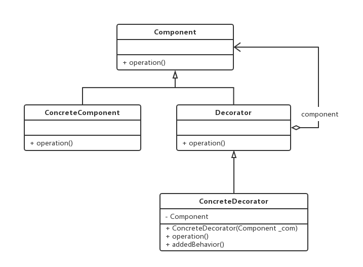

# 装饰模式 Decorator Pattern
本文主要从Decorator Pattern模式的原理和基本实现等方面叙述自己对装饰模式的理解。

在OO的设计和开发过程中，可能会遇到以下情况：我们需要为一个已经定义好的类添加新的职责（操作）。通常的情况下我们定义一个新类继承该类，但是这么做会引起以下问题： 1）通过继承方式实现，由于继承深度很深会导致系统复杂性增加；2）通过继承方式实现，这种方式只能为特定的类提供修饰工作，当拥有新的实现方式时需要增加新的继承类，这样同样会增加系统的复杂度。

Decorator Pattern提供共了一种给类增加职责的方法，不是通过继承而是通过组合实现的。（本质上还是在解决OO中类之间继承和组合的问题）


## 原理与实现
下图为Decorator Pattern的通用类图：




在上述类图中，`ConcreteComponent`和`Decorator`有共同的父类。之所以这样构建类图有以下原因： 首先，如果我们采用继承的方式实现。也就是说`Decorator`直接维护一个指向`ConcreteComponent`的引用（指针）同样可以达到上述效果。但是这样带来的缺陷就是这种方式只能为特定的`ConcreteComponent`提供修饰操作。当系统中再出现一个新的`ConcreteComponent`时，我们需要再为这个新的`ConcreteComponent`提供一个`Decorator`。也就是说，系统中类的数量会急速膨胀，复杂性增加。但是通过上图中的类结构，我们可以利用OO中的多态思想来实现。只要是`Component`类型的`ConcreteComponent`且具有相同操作，我们就可以通过相同的`Decorator`加以修饰。

上述类图中的代码实现：

```java
public abstract class Component {
	public abstract operation();
}


public class ConcreteComponent extends Component{
	@Override 
	public operation() {
		System.out.println("ConcreteComponent ... operation");
	}
}

public abstract class Decorator extends Component{
	@Override
	public abstract operation();
}

public class ConcreteDecorator extends Decorator {
	private Component com;
	public ConcreteDecorator(Component _com) {
		this.com = _com;
	}

	@Override 
	public void operation() {
		this.com.operation();
		System.out.println("ConcreteDecorator ... operation");
		addedBehavior();
	}

	public void addedBehavior() {
		System.out.println("ConcreteDecorator ... addedBehavior");
	}
}


public class Client {
	public static void main(String[] args) {
		Component com = new ConcreteCompoent();
		Decorator decorator = new ConcreteDecorator(com);
		decorator.operation();
	}
}
```

## 分析
GoF在《设计模式》中提到`Decorator`和`Proxy`模式有一定的相似之处，理解了好半天。他们的相似之处并不在于上图的通用类图中。我们说，通过让`Decorator`持有一个`ConcreteComponent`的引用，同样可以实现装饰功能。也就是说，我们回到了第一种情况，不再使`Decorator`和`ConcreteComponent`拥有相同的父类，而是采用组合关系。我们发现此时的类图和`Proxy`的通用类图就极其相似了。

`Decorator`模式和`Proxy`模式之所以相似，其根本原因在于它们都有一个指向其它对象的引用，也就是通过组合的方式为其它对象提供额外操作。但是它们之间的区别在于`Proxy`模式中代理类会提供与被代理对象一样的接口，此时业务对象被代理对象全权代理。`Decorator`模式采用了组合的方式取得了比使用继承方式更好的效果。