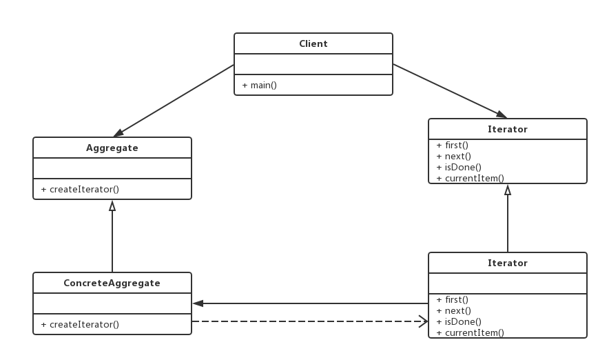

# 迭代器模式
`Iterator` 模式为解决对一个聚合对象的遍历问题提供了解决方案， 将对聚合的遍历封装到一个类中进行，这样就避免了暴露这个聚合对象的内部表示的可能。

下面是`Iterator`模式典型类图：




代码实现：

```java
public interface Iterator<E> {
	public abstract void first();
	public abstract void next();
	public abstract boolean isDone();
	public abstract E currentItem();
}

public abstract class Aggregate<E> {

	protected Aggregate(){
		
	}
	protected abstract E getItem(int idx);
	
	protected abstract void addItem(E item);
	
	protected abstract int getSize();

	protected abstract Iterator<E> iterator();
}

public class ConcreteAggregate<E> extends Aggregate<E>{
	private final static int DEFAULT_CAPACITY = 1 << 5;
	
	private Object[] element;
	
	private int len;
	
	public ConcreteAggregate() {
//		this.element = new Object[DEFAULT_CAPACITY];
//		this.len = 0;
		this(DEFAULT_CAPACITY);
	}

	public ConcreteAggregate(int _capacity) {
		super();
		this.element = new Object[_capacity];
		this.len = 0;
	}
	
	@Override
	public void addItem(E item) {
		assert len < DEFAULT_CAPACITY;
		element[len++] = item;
	}
	
	@SuppressWarnings("unchecked")
	@Override
	public E getItem(int idx) {
		if(idx < getSize()) {
			return (E)element[idx];
		}else {
			return null;
		}
		
	}

	@Override
	public int getSize() {
		return len;
	}

	@Override
	public Iterator<E> iterator() {
		return new AggregateIterator<E>(this);
	}
	
	@SuppressWarnings("hiding")
	private class AggregateIterator<E> implements Iterator<E> {
		private int idx;
		private Aggregate<E> aggregate;
		public AggregateIterator(Aggregate<E> aggregate) {
			this.idx = 0;
			this.aggregate = aggregate;
		}
		@Override
		public void first() {
			idx = 0;
		}

		@Override
		public void next() {
			if(idx < aggregate.getSize()) {
				idx ++;
			}
		}

		@Override
		public boolean isDone() {
			return (idx == aggregate.getSize());
		}

		@Override
		public E currentItem() {
			return (E)aggregate.getItem(idx);
		}

	}
}

public class Client {
	public static void main(String[] args) {
		Aggregate<Integer> aggregate = new ConcreteAggregate<Integer>();
		
		
		int NUM = 1 << 5 ;
		
		for(int i = 0; i < NUM; i ++) {
			aggregate.addItem(i);
		}
		Iterator<Integer> iterator = aggregate.iterator();
		
		for(; iterator.isDone() == false; iterator.next()) {
			System.out.println(iterator.currentItem());
		}
		System.out.println(1 << 5);
	}
}


```

`Iterator`模式的代码实现很简单，实际上是为了更好地保护`Aggregate`的状态。 我们尽可能减少`Aggregate`的`public`接口，而通过将`Iterator`对象声明为`Aggregate`的内部类来给予`Iterator`一些特权，获得访问`Aggregate`私有数据和方法的机会。

在JDK提供的源码中，我们可以发现Java Collection Framework，有很多这种实现模式。