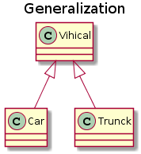
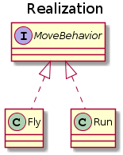
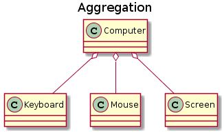
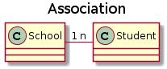

# 面向对象编程
本文主要介绍了面向对象特性，设计原则和表示方法。

*  [（一）三大特性](#一三大特性)
	* [封装](#封装)
	* [继承](#继承)
	* [多态](#多态)
*  [（二）类图](#二类图)
	* [泛化](#泛化Generalization)
	* [实现](#实现Realization)
	* [聚合](#聚合Aggregation)
	* [组合](#组合Composition)
	* [关联](#关联Association)
	* [依赖](#依赖Dependency)
*  [（三）设计原则](#三设计原则)
	* [SOLID](#SOLID)

# （一）三大特性

## 封装

利用抽象数据类型将数据和基于数据的操作封装在一起，使其构成一个不可分割的独立实体。数据被隐藏在抽象数据类型的内部，以实现细节隐藏，只保留能够操作隐藏数据的对外接口。这使得使用者无需知道对象的内部实现细节，也可以操作对象，同时更好的保护内部实现。

优点：

- 减少耦合：可以独立的开发、测试、优化、使用和修改
- 减轻维护的负担：更容易理解和调试
- 有效地调节性能：可以通过剖析确定哪些某块受到影响
- 提高重用性

注意到 gender 属性使用 int 数据类型进行存储，封装使得用户注意不到这种实现细节。并且在需要修改 gender 属性使用的数据类型时，也可以在不影响客户端代码的情况下进行。

```java
public class Person {
    private String name;
    private int gender;
    private int age;

    public String getName() {
        return name;
    }

    public String getGender() {
        return gender == 0 ? "man" : "woman";
    }

    public void work() {
        if (18 <= age && age <= 50) {
            System.out.println(name + " is working very hard!");
        } else {
            System.out.println(name + " can't work any more!");
        }
    }
}
```

## 继承
继承实现了  **IS-A**  关系，例如 Cat 和 Animal 就是一种 IS-A 关系，因此 Cat 可以继承自 Animal，从而获得 Animal 非 private 的属性和方法。

Cat 可以当做 Animal 来使用，也就是说可以使用 Animal 引用 Cat 对象。父类引用指向子类对象称为  **向上转型** 。

```java
Animal animal = new Cat();
```

继承应该遵循里氏替换原则，子类对象必须能够替换掉所有父类对象。

## 多态

多态分为编译时多态和运行时多态。编译时多态主要指方法的重载，运行时多态指程序中定义的对象引用所指向的具体类型在运行期间才确定。

运行时多态有三个条件：

- 继承
- 覆盖（重写）
- 向上转型

下面的代码中，乐器类（Instrument）有两个子类：Wind 和 Percussion，它们都覆盖了父类的 play() 方法，并且在 main() 方法中使用父类 Instrument 来引用 Wind 和 Percussion 对象。在 Instrument 引用调用 play() 方法时，会执行实际引用对象所在类的 play() 方法，而不是 Instrument 类的方法。

```java
public class Instrument {
    public void play() {
        System.out.println("Instument is playing...");
    }
}

public class Wind extends Instrument {
    public void play() {
        System.out.println("Wind is playing...");
    }
}

public class Percussion extends Instrument {
    public void play() {
        System.out.println("Percussion is playing...");
    }
}

public class Music {
    public static void main(String[] args) {
        List<Instrument> instruments = new ArrayList<>();
        instruments.add(new Wind());
        instruments.add(new Percussion());
        for(Instrument instrument : instruments) {
            instrument.play();
        }
    }
}
```

#（二）类图

## 泛化（Generalization）
下图用来描述继承/泛化关系，在 Java 中使用`extends`关键字。



## 实现（Realization）
下图用于表示接口的实现，在Java中是用`implements`关键字。



## 聚合（Aggregation）
表示整体由部分组成，但是整体和部分不是强依赖关系，整体不存在但是部分可以存在。



## 组合（Composition）
和聚合不同的是，组合关系中部分和整体是强依赖关系，整体不存在那么部分也就不存在。例如，公司和部门之间的关系，公司这个整体不存在了，那么公司中的各个部门也就不存在了。但是，再向下，公司的部门和员工之间的关系就是聚合，同样公司和员工也是聚合关系。


## 关联（Association）
表示不同类对象之间有关联，这是一种静态关系，与运行过程的状态无关，在最开始就可以确定。因此也可以用 1 对 1、多对 1、多对多这种关联关系来表示。比如学生和学校就是一种关联关系，一个学校可以有很多学生，但是一个学生只属于一个学校，因此这是一种多对一的关系，在运行开始之前就可以确定。




## 依赖（Dependency）
和关联关系不同的是，依赖关系是在运行过程中起作用的。A 类和 B 类是依赖关系主要有三种形式：

- A 类是 B 类中的（某中方法的）局部变量；
- A 类是 B 类方法当中的一个参数；
- A 类向 B 类发送消息，从而影响 B 类发生变化；


#（三）设计原则

## SOLID
SOLID是面向对象设计六大原则的首字母缩写，这六大原则分别是：

| 简写 | 全程 | 中译 |
|:---:|:---:|:-----:|
| SRP  | Single Responsiblity Principle | 单一职责原则 |
| OCP  | Open Close Principle | 开放封闭原则 |
| LSP  | Liskov Substitution Principle | 里氏替换原则 |
| ISP  | Interface Segregation Principle | 接口隔离原则 |
| DIP  | Dependency Inversion Principle | 依赖倒置原则 | 
| LKP  | Latest Knowledge Principle | 迪米特法则 | 

1. 单一职责原则 
`修改一个类的原因只有一个`, 换句话说，一个类只负责类件事情，当这个类需要负责多个或多种事情时，就需要将这个类拆分。如果一个类承担的职责过多，就等于把这些职责耦合在了一起，一个职责的变化可能会削弱这个类完成其它职责的能力。

2. 开放封闭原则
`类应该对扩展开放，对修改关闭`。 扩展就是添加新功能的意思，因此该原则要求在添加新功能时不需要修改已有的代码实现。符合开闭原则最典型的设计模式是装饰者模式，它可以动态地将责任附加到已有对象上，而不需要修改已有的功能实现。

3. 里氏替换原则
`子类对象能够替换所有的父类对象`。我们说继承是一种IS-A的关系，在这种关系下子类需要能够当成父类用，但是反之则不能。 如果子类变得更加特殊，我们更多的是断开继承关系。

4. 接口分离原则
`客户类只能看到它需要用到的接口`。 就是说，一个类或接口提供的API接口的最大集合是客户类需要的。

5. 依赖倒置原则
`高层模块不应该依赖底层模块，二者都应该依赖于抽象;抽象不应该依赖于细节，细节应该依赖于抽象`。

高层模块包含一个应用程序中重要的策略选择和业务模块，如果高层模块依赖于低层模块，那么低层模块的改动就会直接影响到高层模块，从而迫使高层模块也需要改动。

依赖于抽象意味着：

- 任何变量都不应该持有一个指向具体类的指针或者引用；
- 任何类都不应该从具体类派生；
- 任何方法都不应该覆写它的任何基类中的已经实现的方法。

6. 迪米特法则
迪米特法则又叫作最少知识原则（Least Knowledge Principle，简写 LKP），就是说一个对象应当对其他对象有尽可能少的了解，不和陌生人说话。

