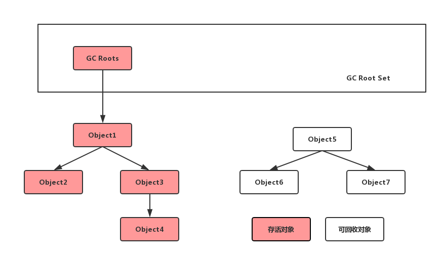

# JVM之对象存活分析
本文主要介绍了JVM中对象存活分析部分的内容，主要包括 **引用记数法** 和 **可达性分析法**。

* [引用记数法](#一引用记数法)
* [可达性分析法](#二可达性分析法)

我们经常会关注JVM的五个区域，包括三个是线程私有： **程序计数器，虚拟机栈和本地方法栈**，两个是线程共享的：**堆和方法区**。 线程私有的区域在线程执行结束时（栈帧出栈时）会自动被释放，空间信息比较容易清理。 而线程共享的`Java堆`是JVM管理的内存中最大的一块。 我们说，所有的对象实例和数组都要在Java堆上分配内存。 `Java堆`是垃圾收集的主要区域，因此也叫做`GC`堆(Garbage Collection Heap)。 另外，方法区中的内存分配和回收同样是动态的，因此垃圾收集器主要关注`GC`堆和方法区的内存。

我们要回收Java堆和方法区中的内存，首先需要考虑对象是否应该被回收，也就是要判断对象是否还有其它的引用或关联使得这个对象处于存活状态。 

判断一个对象是否处于存活状态的方法 ： **引用计数法和可达性分析法**

# （一）引用记数法

引用计数法（Reference Counting）的逻辑： 在堆中存储对象时，在对象头处维护一个计数器，一旦有一个地方引用它，计数器数值加一；当某处引用失效时，计数器数值减一。 如果对象计数器为0，表示该对象已经被废弃，处于失活状态。

引用记数法存在的问题：

1. 对象之间的互相引用问题
2. 无法管理多种形式的引用类型（Java 2区分的强引用、弱引用、软引用和虚引用）

# （二）可达性分析法

可达性分析法（Reachability Analysis）的逻辑： 通过一系列称为“GC Roots”的对象作为起点，从这些节点开始向下搜索，搜索所经过的路径称为“引用链（Reference Chain）”，当一个对象到`GC Roots`没有任何引用链相连时（用图论说就是，从`GC Roots`到这个对象不可达），则证明该对象不可用。 

从上图中可以发现，上文中的不可达对象是泛指。

在Java语言中，可以作为GC Roots的对象包括一下四种：

- 虚拟机栈（栈帧中的本地变量表）中引用的对象
- 方法区中类静态属性引用的对象
- 方法区中常量引用的对象
- 本地方法栈中JNI（即一般说的Native方法）引用的对象。

# HotSpot虚拟机如何实现可达性算法？

java中的主流虚拟机HotSpot采用可达性分析算法来确定一个对象的状态，那么HotSpot在具体实现该算法时采用了哪些结构？

## 使用OopMap记录并枚举根节点

HotSpot首先需要枚举所有的GC Roots根节点，虚拟机栈的空间不大，遍历一次的时间或许可以接受，但是方法区的空间很可能就有数百兆，遍历一次需要很久。更加关键的是，当我们遍历所有GC Roots根节点时，我们需要暂停所有用户线程，因为我们需要一个此时此刻的”虚拟机快照”，如果我们不暂停用户线程，那么虚拟机仍处于运行状态，我们无法确保能够正确遍历所有的根节点。所以此时的时间开销过大更是我们不能接受的。

基于这种情况，HotSpot实现了一种叫做OopMap的数据结构，这种数据结构在类加载完成时把对象内的偏移量是什么类型计算出，并且存放下位置，当需要遍历根结点时访问所有OopMap即可。

## 用安全点Safepoint约束根节点

如果将每个符合GC Roots条件的对象都存放进入OopMap中，那么OopMap也会变得很大，而且其中很多对象很可能会发生一些变化，这些变化使得维护这个映射表很困难。实际上，HotSpot并没有为每一个对象都创建OopMap，只在特定的位置上创建了这些信息，这些位置称为安全点（Safepoints）。

为了保证虚拟机中安全点的个数不算太多也不是太少，主要决定安全点是否被建立的因素是时间。当进行了耗时的操作时，比如方法调用、循环跳转等时会产生安全点。此外，HotSpot虚拟机在安全点的基础上还增加了安全区域的概念，安全区域是安全点的扩展。在一段安全区域中能够实现安全点不能达成的效果。