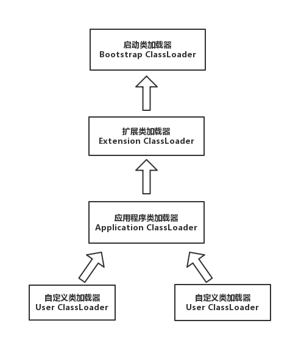

# JVM之类加载器与双亲委派模型
类加载器用于实现类的加载动作，而类加载器的实现机制则是遵照双亲委派机制。 本文主要内容包括类与类加载机制以及双亲委派模型。

* [类与类加载器](#一类与类加载器)
* [双亲委派机制](#二双亲委派机制)

# （一）类与类加载器

对于任意一个类，都需要由加载它的的类加载器和类本身一同确立其在Java虚拟机中的唯一性，每一个类加载器都有一个独立的类名空间。也就是说，比较两个类是否相等，只有在这两个类是由同一个类加载器加载的前提下才有意义，否则，即使这两个类来源于同一个Class文件，被同一个虚拟机加载，只要加载它们的类加载器不同，那么这两个类就必定不相等。这里所指的相等，包括代表类的Class对象的	`equals()`方法、`isAssignableFrom()`方法、`isInstance()`的返回结果，也包括使用`instanceof`关键字做对象所述关系的判定等情况。 如下示例演示了不同类加载器对`instanceof`关键字运算结果的影响；

```java
package reflection;

import java.io.IOException;
import java.io.InputStream;


public class ClassLoaderTest {
	public static void main(String[] args) throws InstantiationException, IllegalAccessException, ClassNotFoundException {
		ClassLoader myLoader = new ClassLoader() {
			@Override 
			public Class<?> loadClass(String name) throws ClassNotFoundException {
				try{
					String fileName = name.substring(name.lastIndexOf(".")+1) + ".class";
					
					InputStream is = getClass().getResourceAsStream(fileName);
					
					if( is == null ) {
						return super.loadClass(name);
					}
					
					byte[] b = new byte[is.available()];
					
					is.read(b);
					
					return defineClass(name, b, 0, b.length);
					
				}catch(IOException e) {
					throw new ClassNotFoundException(name);
				}
			}
		};
		
		Object obj = myLoader.loadClass("reflection.ClassLoaderTest").newInstance();
		
		System.out.println(obj.getClass());
		System.out.println(obj instanceof reflection.ClassLoaderTest);
	}
}

```
运行结果：

```java
class reflection.ClassLoaderTest
false
```

上述代码可以加载与自己在同一路径下的Class文件。 我们通过这个类加载器去加载了一个名为"reflection.ClassLoaderTest"的类，并实例化了这个类的对象。两行输出结果中，从第一句可以看出，这个对象确实是类"relfection.ClassLoaderTest"实例化出来的对象，但是从第二个输出却返回了`false`，这是因为虚拟机中存在两个`ClassLoaderTest`类，一个由系统应用程序加载器加载，另一个是由我们自定义的类加载器加载的。虽然二者都是同一个Class文件，但是二者依然是两个独立的类，做对象所属类型检查时结果为false。


# （二）双亲委派机制

从Java虚拟机角度来说只存在两种不同的类加载器：一种是启动类加载器（Bootstrap ClassLoader）,这个类加载器使用C++语言实现，是虚拟机自身的一部分；另一种就是所有其他的类加载器，这些类加载器都由Java语言实现，独立于虚拟机外部，并且全部都继承自抽象类`java.lang.ClassLoader`。

从Java开发人员的角度来看，类加载器还可以划分得更加细致一些，绝大部分Java程序都会使用到以下三种系统提供的类加载器：

 - 启动类加载器（BootStrap ClassLoader）：这个类加载器负责将存放在	`$JAVA_HOME\lib`目录中的，或者是被`-Xbootclasspath`参数指定路径中的，并且是虚拟机识别的（仅按照文件名识别，例如rt.jar，名字不符合的类库即使放在lib目录中也不会被加载）类库加载到虚拟机内存中。启动类加载器无法被Java程序直接引用，用户在编写自定义类加载时，如果需要把加载请求委派给引导类加载器，那么直接使用`null`代替即可。 如下`java.lang.ClassLoader.getClassLoader()`方法代码段:

 ```java
/**
 * Returns the class loader for the class. Some implementations may use null to represent the bootstrap class loader. This method will return null in such implementations if this class was loaded by the bootstrap class loader.
 */
public ClassLoader getClassLoader() {
	ClassLoader cl = getClassLoader();
	if(cl == null) {
		return null;
	}
	SecurityManager sm = System.getSecurityManager();
	if(sm != null) {
		ClassLoader ccl = ClassLoader.getCallerClassLoader();
		if(ccl != null && ccl != cl && !cl.isAncestor(ccl)) {
			sm.checkPermission(SecurityConstants.GET_CLASSLOADER_PERMISSION);
		}
	}
	return cl;
}
 ```

- 扩展类加载器（Extension ClassLoader）:这个加载器由`sum.misc.Launcher$ExtClassLoader`实现，它负责加载`$JAVA_HOME\lib\ext`目录中的，或者被`java.ext.dirs`系统变量所指定的路径中的所有类库，开发者可以直接使用扩展类加载器。
- 应用程序类加载器（Application ClassLoader）: 这个类加载器由`sun.misc.Launcher$ApplicationClassLoader`实现。由于这个类加载器是`ClassLoader`中的`getSecurityClassLoader()`方法的返回值，所以一般也称它为系统类加载器。它负责加载用户类路径`ClassPath`上所指定的类库，开发者可以直接使用这个类加载器，如果应用程序中没有自定义过自己的类加载器。一般情况下这个就是程序中默认的类加载器。

我们的应用程序都是由这三个类加载器配合加载的，如果有需要也可以添加自己的类加载器。这些类加载器之间的关系为：



上图中展示了类加载器之间的层次关系，称为 **类加载器的双亲委派模型（Parents Deletation Model）**。双亲委派模型要求除了顶层的启动类加载器外，其余的类加载都应当有自己的父类加载器。这里类加载器之间的父子关系一般不会以继承（Inheritance）的关系实现，而是以组合（Composition）关系来复用父加载器的代码。

类加载器的双亲委派模型在JDK 1.2期间被引入并被广泛引用雨之后的所有Java程序中，但它并不是一个强制性的约束模型，而是Java设计推荐给开发者的一类加载器实现方式。

双亲委派模型的工作过程是：如果一个类加载器收到了类加载的请求，它首先不会自己尝试去加载这个类，而是把这个请求委派给父类加载器去完成，每一个层次的类加载器都是如此，因此所有的加载请求最终都应该传送到顶层的启动类加载器中，只有当父加载器反馈自己无法完成这个加载请求（它的搜索范围中没有找到所需的类）时，自加载器才会尝试自己去加载。

使用双亲委派模型来组织类加载器之间的关系，有一个显而易见的好处就是Java类随着它的类加载器一起具备了一种带有优先级的层次关系。例如类`java.lang.Object`，它存放在`rt.jar`之中，无论哪种类加载器要加载这个类，最终都是委派给处于模型最顶端的启动类加载器进行加载，因此Object类在程序的各种类加载器环境中都是同一个类。相反，如果没有使用双亲委派模型，由各个类加载器自行去加载的话，如果用户自己编写了一个称为`java.lang.Object`的类，并放在程序的`ClassPath`中，那系统中将会出现多个不同的`Object`类，Java类体系中最基础的行为也无法保证。

下面是双亲委派模型的实现，都集中在`java.lang.ClassLoader`的`loadClass()`方法中。

```java
protected synchronized Class<?> loadClass(String name, boolean resolve) throws ClassNotFoundException {
	//检查请求的是否已经被加载过
	Class c = findLoadedClass(name);

	if(c == null ) {
		try{
			if(parent != null ) {
				c = parent.loadClass(name, false);
			}else {
				c = findBootStrapClassOrNull(name);
			}
		}catch(ClassNotFoundException e) {
			//如果父类加载器抛出ClassNotFoundException
			//说明父类加载器无法完成加载请求
		}

		if( c == null ) {
			//在父类加载器无法完成加载的时候
			//再调用本身的findClass方法来执行类加载
			c.findClass(name);
		}
	}

	if(resolve) {
		resolveClass(c);
	}
	return c;
}

```