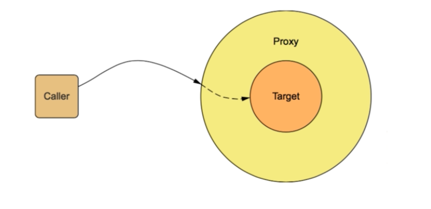
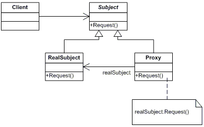
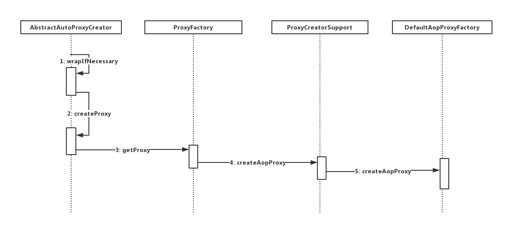

# SpringAOP技术原理与实现

AOP技术原理,参见另外一篇文章： [AOP技术原理](./AOP技术原理.md)

本文从实现的角度来阐述AOP的实现机制。 AOP的两大核心要点： **切入点和织入时机**。 本文重点讨论AOP的织入时机。

## 织入时机

我们说，在面向切面编程中可能有如下几个织入时机：

1. 编译期(AspectJ)
2. 类加载时期(AspectJ 5+)
3. 运行时(Spring AOP)

运行时织入的实现方式？ 有两种方式： **静态代理和动态代理**

### 静态代理


如下图所示：



调用方，目标对象和代理对象： 调用方通过代理对象间接与目标对象交互。反过来说，目标对象委托代理对象与调用方交互。

通用的代理模式类图：



如上图所示，阐述了静态代理的基本类图。 我们说，`RealSubject`和`Proxy`通过实现共同的接口从而具有相同的接口约束，`Proxy`通过委托机制持有`RealSubject`对象，又由于二者有相同的接口约束，此时，`Proxy`可以在自身实现的接口上添加额外操作。 如下代码所示：


```java
//接口约束
public interface Subject {
	void request();
}

//代理类
public class Proxy implements Subject{
	private RealSubject realSubject;
	
	//委托机制， 强引用
	public Proxy(RealSubject realSubject) {
		this.realSubject = realSubject;
	}
	
	@Override
	public void request() {
		System.out.println("before"); //前置操作
		try{
			realSubject.request();
		}catch(Exception e) {
			System.out.println("ex: " + e.getMessage());
			throw e;
		}finally {
			System.out.println("after"); //后置操作
		}
	}
	
}

//目标类
public class RealSubject implements Subject{
	@Override
	public void request() {
		System.out.println("real subject execute request");
	}
}

//调用者
public class Client {
	public static void main(String[] args) {
		Subject subject = new Proxy(new RealSubject());
		subject.request();
	}
}
```
静态代理的缺点： 需要代理的业务越多，重复的逻辑也就越多。


### 动态代理

为了解决静态代理相同业务逻重复问题，我们提出动态代理。 我们说，动态代理有以下两种实现方式： **基于接口的代理和基于继承的代理**， 这两类实现方式的代表是 **JDK代理和CGLIB代理**。

#### JDK动态代理

JDK动态代理的两个要点
1. `java.lang.reflect.Proxy`类 JDK实现代理只需要使用newProxyInstance方法,但是该方法需要接收三个参数,完整的写法是:

```java
static Object newProxyInstance(ClassLoader loader, Class<?>[] interfaces,InvocationHandler h )
```
注意该方法是在Proxy类中是静态方法,且接收的三个参数依次为:
- ClassLoader loader,:指定当前目标对象使用类加载器,获取加载器的方法是固定的
- Class<?>[] interfaces,:目标对象实现的接口的类型,使用泛型方式确认类型
- InvocationHandler h:事件处理,执行目标对象的方法时,会触发事件处理器的方法,会把当前执行目标对象的方法作为参数传入

2. `java.lang.reflect.InvocationHandler`接口

只能基于接口进行动态代理。

代码示例：


```java
//约束接口
public interface Subject {
	void request();
	//1
}

//目标对象
public class RealSubject implements Subject{
	@Override
	public void request() {
		System.out.println("real subject execute request");
	}

	//2
}

//代理对象
import java.lang.reflect.InvocationHandler;
import java.lang.reflect.Method;


/**
 * Aspect
 * @author Bruce Jiang
 *
 */
public class ProxySubject implements InvocationHandler{
	
	private RealSubject realSubject;
	
	public ProxySubject(RealSubject realSubject2) {
		this.realSubject = realSubject2;
	}

	@Override
	public Object invoke(Object proxy, Method method, Object[] args)
			throws Throwable {
		System.out.println("before");
		Object result = null;
		try{
			result = method.invoke(realSubject, args);
			
		}catch(Exception e) {
			System.out.println("ex: " + e.getMessage());
			throw e;
		}finally {
			System.out.println("after");
		}
		return result;
	}
}

//调用者
public class Client {
	public static void main(String[] args) {
		//保留生成的代理类，默认不保存
		System.getProperties().put("sun.misc.ProxyGenerator.saveGeneratedFiles", "true");
		Subject subject = (Subject) Proxy.newProxyInstance(
				Client.class.getClassLoader(), new Class[] { Subject.class },
				new ProxySubject(new RealSubject()));
		subject.request();
		//3
	}
}
```
如果我们要增加一个`hello()`方法，我们可以在上述代码中`1,2,3`处依次增加如下代码：

```java
//1
void hello();

//2
@Override
public void hello() {
	System.out.println("say hello");
} 

//3
subject.hello();
```

#### Cglib实现动态代理

```java
//接口约束
public interface Subject {
	void request();
}

//目标对象
public class RealSubject implements Subject{
	@Override
	public void request() {
		System.out.println("real subject execute request");
	}
}

//代理类
import net.sf.cglib.proxy.MethodInterceptor;
import net.sf.cglib.proxy.MethodProxy;

import java.lang.reflect.Proxy;

public class DemoMethodInterceptor implements MethodInterceptor {
	@Override
	public Object intercept(Object obj, Method method, Object[] args, MethodProxy proxy) throws Throwable {
		System.out.println("before in cglib");
		Object result = null;

		try{
			result = proxy.invokeSuper(obj, args) ;
		}catch(Exception e) {
			System.out.println("get ex: " + e.getMessage());
			throw e;
		}finally {
			System.out.println("after in cglib");
		}
		return result;
	}
}

//调用者
import net.sf.cglib.proxy.Enhancer;

public class Client {
	public static void main(String[] args) {
		Enhancer enhancer = new Enhancer();
		enhancer.setSuperclass(RealSubject.class);
		enhancer.setCallback(new DemoMethodInterceptor());
		Subject subject = (Subject)enhancer.create();
		subject.subject();
	}
}
```

JDK与Cglib代理的对比：

1. JDK只能针对有接口的类的接口方法进行动态代理
2. Cglib基于继承来实现代理，无法对static,final类进行代理
3. Cglib基于继承来实现代理，无法读private,static方法进行代理

## Spring AOP对JDK和Cglib两种实现的选择

首先看Spring如何创建代理bean? 这里需要回答一个问题，既然有JDK代理的实现，也有Cglib代理的实现，那么Spring是如何选择的。

Spring AOP代理类的创建过程



从上述时序图中我们可以看出，首先`AbstractAutoProxyCreator`类调用`createProxy`方法创建代理类，在`createProxy`方法中调用`ProxyFactory`的`getProxy`方法生成，继续向下`ProxyFactory`通过调用`ProxyCreatorSupport`的`createAopProxy`方法返回代理类对象，最终整个代理类对象的创建过程在`DefaultAopProxyFactory`类中被实现。

下面，我们看一下`DefaultAopProxyFactory`类的具体实现：

```java
public class DefaultAopProxyFactory implements AopProxyFactory, Serializable {
	@Override 
	public AopProxy createAopProxy(AdvisedSupport config) throws AopConfigException {
		if(config.isOptimize() || config.isProxyTargetClass() || hasNoUserSuppliedProxyInterfaces(config)) { //1
			Class<?> targetClass = config.getTargetClass(); //如果该选项设置为true
			if(targetClass == null) {
				throw new AopConfigException("TargetSource cannot determine target class: " + "Either an interface or a target is required for proxy creation");
			} 

			if(targetClass.isInterface() || Proxy.isProxyClass(targetClass)) { //优先选择Cglib代理实现。
				return new JdkDynamicAopProxy(config);
			}
			return new ObjenesisCglibAopProxy(config);
		}else { //JDK实现
			return new JdkDynamicAopProxy(config);
		}
	}
}
```

Spring AOP:

1. 如果目标对象实现了接口，则默认采用JDK动态代理
2. 如果目标对象没有实现接口，则采用Cglib进行动态代理
3. 如果目标对象实现类接口，且强制Cglib代理，则使用Cglig代理

## AOP的链式调用

采用改进的责任链模式。

## Spring AOP的应用

1. 如何利用`@Transactional`注解进行事务控制
2. 如何利用`@PreAuthorize`注解进行安全控制
3. 如何利用`@Cacheable`注解进行缓存控制

