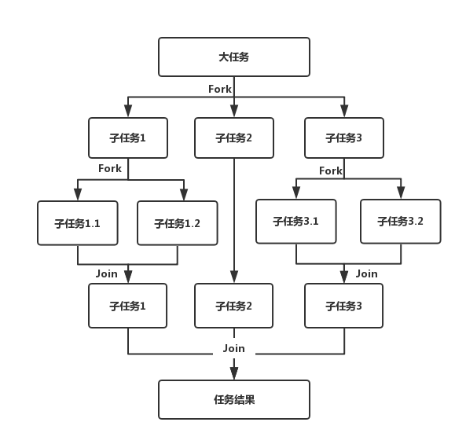

# Fork/Join框架
本文将会介绍Fork/Join框架的基本原理，算法，设计方式，实现和应用。

## 基本原理
Fork/Join框架是Java 7提供的一个用于并行执行任务的框架，是一个把较大任务分割成若干个小任务，最终汇总每个小任务结果后得到大任务结果的框架。

其原理如下图所示：



## 工作窃取算法
工作窃取算法(work-stealing)指的是某个线程从其他线程任务列表中窃取任务来执行。为什么要使用工作窃取算法？假如我们有一个比较大的任务，可以把这个任务分解为若干个互不依赖的子任务，为了减少线程之间的竞争，把这些子任务分别放在不同的队列里，并为每个队列创建一个单独的线程来执行队列中的任务，线程和队列一一对应。例如A线程负责处理队列QA中的任务。但是有些线程会将自己队列中的任务先做完，而其他线程对应队列中还有任务等待处理。那么处理完任务的线程就会从其他任务队列中窃取一个任务来处理。而在这时它们会访问同一个队列，所以为了减少窃取任务线程和被窃取任务线程之间的竞争，通常会使用双端队列，被窃取任务线程永远从双端队列的头部拿任务执行，而窃取任务的线程永远从双端队列的尾部拿任务执行。

工作窃取算法的优点是充分利用线程进行并行计算，并减少了线程间的竞争，其缺点是在某些情况下还是存在竞争，比如双端队列里只有一个任务时。并且消耗了更多的系统资源，比如创建多个线程和多个双端队列。


## Fork/Join框架设计
我们叙述Fork/Join框架原理时将其分为两个部分：分割和结果合并。

1. 分割任务 Fork类将大任务分割成子任务，有可能子任务还是很大，因此可能需要递归分割
2. 执行子任务并合并结果 分割的子任务分别放在双端队列中，然后启动多个线程分别从双端队列中获取任务执行。子任务执行结果统一放在一个结果队列中，启动一个线程从结果队列中获取数据并合并为最终结果。

Fork/Join框架提供两个基本类完成上述两件事情：

1. ForkJoinTask: 使用ForkJoin框架，必须首先创建一个ForkJoin任务。它提供在任务中执行fork()和join()操作的机制。通常情况下，我们不需要直接继承ForkJoinTask类，只需要继承它的子类，Fork/Join框架提供了以下两个子类：
    - RecursiveAction: 用于没有返回结果的任务
    - RecursiveTask: 用于有返回结果的任务
2. ForkJoinPool: ForkJoinTask需要通过ForkJoinPool来执行。

任务分解后产生的子任务被添加到当前工作线程所维护的双端队列中，进入队列的头部。当一个工作线程的队列里暂时没有任务时，它会随机从其他工作线程的队列尾部获取要给任务处理。

## 使用Fork/Join框架
例如，对超过1000万个元素的数组进行排序。

```java
class SumTask extends RecursiveTask<Long> {

    static final int THRESHOLD = 100;
    long[] array;
    int start;
    int end;

    SumTask(long[] array, int start, int end) {
    		this.array = array;
        this.start = start;
        this.end = end;
    }

    @Override
    protected Long compute() {
        if (end - start <= THRESHOLD) {
            // 如果任务足够小,直接计算:
            long sum = 0;
            for (int i = start; i < end; i++) {
                sum += array[i];
            }
            try {
                Thread.sleep(1000);
            } catch (InterruptedException e) {
            		e.printStackTrace();
            }
            System.out.println(String.format("compute %d~%d = %d", start, end, sum));
            return sum;
        }
        // 任务太大,一分为二:
        int middle = (end + start) / 2;
        System.out.println(String.format("split %d~%d ==> %d~%d, %d~%d", start, end, start, middle, middle, end));
        SumTask subtask1 = new SumTask(this.array, start, middle);
        SumTask subtask2 = new SumTask(this.array, middle, end);
        invokeAll(subtask1, subtask2);
        Long subresult1 = subtask1.join();
        Long subresult2 = subtask2.join();
        Long result = subresult1 + subresult2;
        System.out.println("result = " + subresult1 + " + " + subresult2 + " ==> " + result);
        return result;
    }
    
    
    public static void main(String[] args) throws Exception {
    	// 创建随机数组成的数组:
    	long[] array = new long[400];
    	fillRandom(array);
    	// fork/join task:
    	ForkJoinPool fjp = new ForkJoinPool(4); // 最大并发数4
    	ForkJoinTask<Long> task = new SumTask(array, 0, array.length);
    	long startTime = System.currentTimeMillis();
    	Long result = fjp.invoke(task);
    	long endTime = System.currentTimeMillis();
    	System.out.println("Fork/join sum: " + result + " in " + (endTime - startTime) + " ms.");
	}
}
```
关键代码是fjp.invoke(task)来提交一个Fork/Join任务并发执行，然后获得异步执行的结果。

