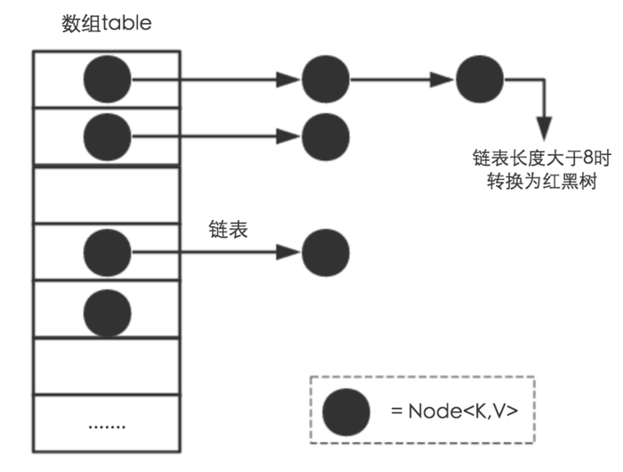
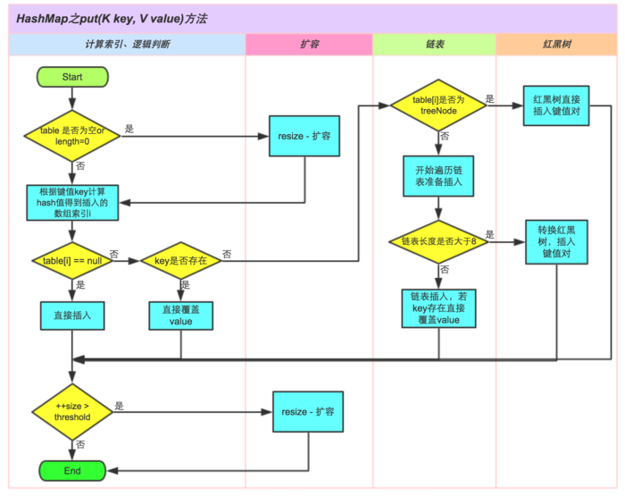
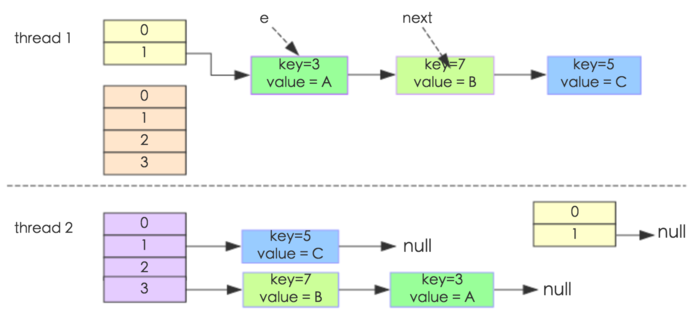

# JUC之ConcurrentHashMap
在理解`ConcurrentHashMap`之前，首先问问自己为什么提供了`HashMap`还要提供`ConcurrentHashMap`？回答当然是`HashMap`不是线程安全的。 因此，本文在具体理解`ConcurrentHashMap`之前，首先会梳理自己理解的`HashMap`为什么不安全。 然后，讲述了`ConcurrentHashMap`在Java 6, Java 7和Java 8中实现的区别，其中重点在Java 7的分段锁机制和Java 8的CAS机制。 本文并不会都深入到源码级别进行梳理，更多的是总结对比。

* [为什么HashMap不安全](#一为什么HashMap不安全)
* [ConcurrentHashMap在Java6中的实现](#二ConcurrentHashMap在Java6中的实现)
* [ConcurrentHashMap在Java7中的实现](#三ConcurrentHashMap在Java7中的实现)
* [ConcurrentHashMap在Java8中的实现](#四ConcurrentHashMap在Java8中的实现)

# （一）为什么HashMap不安全

我们首先概述一下HashMap的实现原理。Java 7 和 Java 8在实现HashMap上有所区别，当然总体而言Java 8的效率要更好一些，主要是Java 8的`HashMap`在Java 7 的基础上增加了红黑树这种数据结构，使得在桶里面查找数据的复杂度从`O(n)`降到`O(logn)`，当然还有一些其他的优化，比如resize的优化等。 我们将从三点开始介绍：

1. 计算桶位置的Hash过程
2. put()方法的实现原理
3. 扩容机制的实现


1. 计算桶位置的Hash过程

原理上Java 7 和 Java 8类似。 `HashMap`的实现使用了一个`数组+链表/红黑树`结构，当然`红黑树`是Java 8才加入的，每个数组项里面有一个链表的方式来实现，因为`HashMap`使用`key`的`hashCode`来寻找存储位置，不同的`key`可能具有相同的`hashCode`，这时候就出现哈希冲突了，也叫做`哈希碰撞`。 为了解决哈希冲突，有开放地址方法或链地址等方法。`HashMap`的实现上选取了`链地址方法`，也就是将哈希值一样的`entry`保存在同一个数组项里面，可以把一个数组项当做一个桶，桶里面装的`entry`的`key`的`hashCode`是一样的。 如下图所示，展示了我们上面描述的结构，其中一个非常重要的数据结构`Node<K,V>`（这是Java 8的实现，Java 7为`Entry<K,V>`，但原理类似），该结构实质上保存了Key-Value键值对。



我们说，`HashMap` 根据`key`的`hashCode`来决定应该将该记录放在哪个桶里面，无论是插入、查找还是删除，这都是第一步，计算桶的位置。因为`HashMap`的`length`总是`2`的`n`次幂，所以可以使用下面的方法来做模运算：

```java
//Java 7

/**
 * 根据传入的key生成hash值
 * @param k  键值名
 * @return hash值
 */
final int hash(Object k) {
    int h = hashSeed;

    //如果key是字符串类型，就使用stringHash32来生成hash值
    if (0 != h && k instanceof String) {
        return sun.misc.Hashing.stringHash32((String) k);
    }

    //一次散列
    h ^= k.hashCode();

    //二次散列
    h ^= (h >>> 20) ^ (h >>> 12);
    return h ^ (h >>> 7) ^ (h >>> 4);
}

/**
 * 返回hash值的索引，采用除模取余法，h & (length-1)操作 等价于 hash % length操作， 但&操作性能更优
 */
/**
 * 根据key的hash值与数组长度，找到该key在table数组中的下标
 * @param h hash值
 * @param length 数组长度
 * @return 下标
 */
static int indexFor(int h, int length) {
    //除模取余,相当于hash % length，&速度更快
    return h & (length-1);
}

//Java 8
static final int hash(Object key) {
    int h;
    //第一步 取key的hasCode
    //第二步 高位参与运算
    
    return (key == null) ? 0 : (h = key.hashCode()) ^ (h >>> 16); 
}


final V putVal(int hash, K key, V value, boolean onlyIfAbsent, boolean evict) {
    Node<K,V>[] tab; Node<K,V> p; int n, i;
    if ((tab = table) == null || (n = tab.length) == 0)
        n = (tab = resize()).length;
    if ((p = tab[i = (n - 1) & hash]) == null)   //第三步，整体取模运算
        tab[i] = newNode(hash, key, value, null);
    else {
        ...
    }
}

```
在Java 7中，计算桶位置用`	h&(length-1)`，其中`h`是`key`的`hashCode`值，计算好`hashCode`之后，使用上面的方法来对桶的数量取模，将这个数据记录落到某一个桶里面。 在Java 8对这种做法进行了优化，做得更加巧妙，因为`length`总是`2`的`n`次幂，所以在一次`resize`之后，当前位置的记录要么保持当前位置不变，要么就向前移动`length`。因此，Java 8中`HashMap`的重`Hash`计算更简便。 

2. put()方法的实现原理



上图展示了Java 8 中`put()`方法的处理逻辑，比Java 7多了红黑树部分，以及在一些细节上的优化。

3. 扩容机制

HashMap的扩容机制就是重新申请一个容量是当前的2倍的桶数组，然后将原先的记录逐个重新映射到新的桶里面，然后将原先的桶逐个置为null使得引用失效。后面会讲到，HashMap之所以线程不安全，就是resize这里出的问题。

## 为什么HashMap不是线程安全的

可能的原因：

1. put的时候导致的多线程数据不一致

这个问题比较好想象，比如有两个线程A和B，首先A希望插入一个key-value对到HashMap中，首先计算记录所要落到的桶的索引坐标，然后获取到该桶里面的链表头结点，此时线程A的时间片用完了，而此时线程B被调度得以执行，和线程A一样执行，只不过线程B成功将记录插到了桶里面，假设线程A插入的记录计算出来的桶索引和线程B要插入的记录计算出来的桶索引是一样的，那么当线程B成功插入之后，线程A再次被调度运行时，它依然持有过期的链表头但是它对此一无所知，以至于它认为它应该这样做，如此一来就覆盖了线程B插入的记录，这样线程B插入的记录就凭空消失了，造成了数据不一致的行为。

2. 扩容时出现死循环

我们都知道`HashMap`初始容量大小为`16`,一般来说，当有数据要插入时，都会检查容量有没有超过设定的`hredhold`，如果超过，需要增大`Hash`表的尺寸，但是这样一来，整`个Hash`表里的元素都需要被重算一遍。这叫`rehash`，这个成本相当的大。 

我们来看扩容机制的核心实现：

```java
void resize(int newCapacity) {
    Entry[] oldTable = table;
    int oldCapacity = oldTable.length;
    if (oldCapacity == MAXIMUM_CAPACITY) {
        threshold = Integer.MAX_VALUE;
        return;
    }

    Entry[] newTable = new Entry[newCapacity];
    transfer(newTable, initHashSeedAsNeeded(newCapacity));
    table = newTable;
    threshold = (int)Math.min(newCapacity * loadFactor, MAXIMUM_CAPACITY + 1);
}

void transfer(Entry[] newTable, boolean rehash) {
    int newCapacity = newTable.length;
    for (Entry<K,V> e : table) {
        while(null != e) {
            Entry<K,V> next = e.next;
            if (rehash) {
                e.hash = null == e.key ? 0 : hash(e.key);
            }
            int i = indexFor(e.hash, newCapacity);
            e.next = newTable[i];
            newTable[i] = e;
            e = next;
        }
    }
}
```
大概看下transfer：

1. 对索引数组中的元素遍历
2. 对链表上的每一个节点遍历：用 next 取得要转移那个元素的下一个，将 e 转移到新 Hash 表的头部，使用头插法插入节点。
3. 循环2，直到链表节点全部转移
4. 循环1，直到所有索引数组全部转移

经过这几步，我们会发现转移的时候是逆序的。假如转移前链表顺序是`1->2->3`，那么转移后就会变成`3->2->1`。这时候就有点头绪了，死锁问题不就是因为`1->2`的同时`2->1`造成的吗？所以，`HashMap`的死锁问题就出在这个`transfer()`方法上。 这个方法的功能是将原来的记录重新计算在新桶的位置，然后迁移过去。 如下图所示：



我们解释上图中的过程：

我们假设有两个线程同时需要执行`resize`操作，我们原来的桶数量为`2`，记录数为`3`，需要`resize`桶数量到`4`，原来的记录分别为：`[3,A],[7,B],[5,C]`，在原来的`map`里面，我们发现这三个`entry`都落到了第二个桶里面。 假设线程`thread1`执行到了`transfer`方法的`Entry next = e.next`这一句，然后时间片用完了，此时的`e = [3,A], next = [7,B]`。线程`thread2`被调度执行并且顺利完成了`resize`操作，需要注意的是，此时的`[7,B]`的后继`next`为`[3,A]`。如果此时线程`thread1`重新被调度运行，那么它持有的引用是已经被`thread2 resize`之后的结果。线程`thread1`首先将`[3,A]`迁移到新的数组上，然后再处理其后继`[7,B]`。 此时，`[3,A]`和`[7,B]`形成了`循环链表`，在`get()`时，如果`get`的`key`的桶索引和`[3,A]`和`[7,B]`一样，那么就会陷入死循环。

# （二）ConcurrentHashMap在Java6中的实现
待续

# （三）ConcurrentHashMap在Java7中的实现


# （四）ConcurrentHashMap在Java8中的实现


# Reference 

- [谈谈HashMap线程不安全的体现](http://www.importnew.com/22011.html)