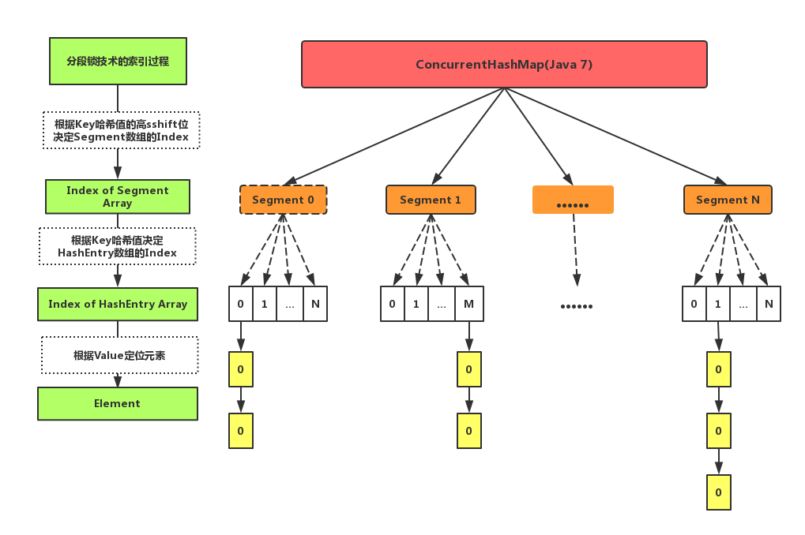
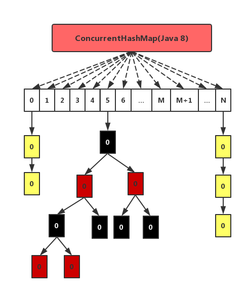

# JUC之ConcurrentHashMap
在理解`ConcurrentHashMap`之前，首先问问自己为什么提供了`HashMap`还要提供`ConcurrentHashMap`？回答当然是`HashMap`不是线程安全的。 因此，本文在具体理解`ConcurrentHashMap`之前，首先会梳理自己理解的`HashMap`为什么不安全。 然后，讲述了`ConcurrentHashMap`在Java 7和Java 8中实现的区别，其中重点在Java 7的分段锁机制和Java 8的CAS机制。 本文并不会都深入到源码级别进行梳理，更多的是总结对比。

* [为什么HashMap不安全](#一为什么HashMap不安全)
* [ConcurrentHashMap在Java7中的实现](#二ConcurrentHashMap在Java7中的实现)
* [ConcurrentHashMap在Java8中的实现](#三ConcurrentHashMap在Java8中的实现)

# （一）为什么HashMap不安全

我们首先概述一下HashMap的实现原理。Java 7 和 Java 8在实现HashMap上有所区别，当然总体而言Java 8的效率要更好一些，主要是Java 8的`HashMap`在Java 7 的基础上增加了红黑树这种数据结构，使得在桶里面查找数据的复杂度从`O(n)`降到`O(logn)`，当然还有一些其他的优化，比如resize的优化等。 我们将从三点开始介绍：

1. 计算桶位置的Hash过程
2. put()方法的实现原理
3. 扩容机制的实现


1. 计算桶位置的Hash过程

原理上Java 7 和 Java 8类似。 `HashMap`的实现使用了一个`数组+链表/红黑树`结构，当然`红黑树`是Java 8才加入的，每个数组项里面有一个链表的方式来实现，因为`HashMap`使用`key`的`hashCode`来寻找存储位置，不同的`key`可能具有相同的`hashCode`，这时候就出现哈希冲突了，也叫做`哈希碰撞`。 为了解决哈希冲突，有开放地址方法或链地址等方法。`HashMap`的实现上选取了`链地址方法`，也就是将哈希值一样的`entry`保存在同一个数组项里面，可以把一个数组项当做一个桶，桶里面装的`entry`的`key`的`hashCode`是一样的。 如下图所示，展示了我们上面描述的结构，其中一个非常重要的数据结构`Node<K,V>`（这是Java 8的实现，Java 7为`Entry<K,V>`，但原理类似），该结构实质上保存了Key-Value键值对。


我们说，`HashMap` 根据`key`的`hashCode`来决定应该将该记录放在哪个桶里面，无论是插入、查找还是删除，这都是第一步，计算桶的位置。因为`HashMap`的`length`总是`2`的`n`次幂，所以可以使用下面的方法来做模运算：

```java
//Java 7

/**
 * 根据传入的key生成hash值
 * @param k  键值名
 * @return hash值
 */
final int hash(Object k) {
    int h = hashSeed;

    //如果key是字符串类型，就使用stringHash32来生成hash值
    if (0 != h && k instanceof String) {
        return sun.misc.Hashing.stringHash32((String) k);
    }

    //一次散列
    h ^= k.hashCode();

    //二次散列
    h ^= (h >>> 20) ^ (h >>> 12);
    return h ^ (h >>> 7) ^ (h >>> 4);
}

/**
 * 返回hash值的索引，采用除模取余法，h & (length-1)操作 等价于 hash % length操作， 但&操作性能更优
 */
/**
 * 根据key的hash值与数组长度，找到该key在table数组中的下标
 * @param h hash值
 * @param length 数组长度
 * @return 下标
 */
static int indexFor(int h, int length) {
    //除模取余,相当于hash % length，&速度更快
    return h & (length-1);
}

//Java 8
static final int hash(Object key) {
    int h;
    //第一步 取key的hasCode
    //第二步 高位参与运算
    
    return (key == null) ? 0 : (h = key.hashCode()) ^ (h >>> 16); 
}


final V putVal(int hash, K key, V value, boolean onlyIfAbsent, boolean evict) {
    Node<K,V>[] tab; Node<K,V> p; int n, i;
    if ((tab = table) == null || (n = tab.length) == 0)
        n = (tab = resize()).length;
    if ((p = tab[i = (n - 1) & hash]) == null)   //第三步，整体取模运算
        tab[i] = newNode(hash, key, value, null);
    else {
        ...
    }
}

```
在Java 7中，计算桶位置用`	h&(length-1)`，其中`h`是`key`的`hashCode`值，计算好`hashCode`之后，使用上面的方法来对桶的数量取模，将这个数据记录落到某一个桶里面。 在Java 8对这种做法进行了优化，做得更加巧妙，因为`length`总是`2`的`n`次幂，所以在一次`resize`之后，当前位置的记录要么保持当前位置不变，要么就向前移动`length`。因此，Java 8中`HashMap`的重`Hash`计算更简便。 

2. put()方法的实现原理


上图展示了Java 8 中`put()`方法的处理逻辑，比Java 7多了红黑树部分，以及在一些细节上的优化。

3. 扩容机制

HashMap的扩容机制就是重新申请一个容量是当前的2倍的桶数组，然后将原先的记录逐个重新映射到新的桶里面，然后将原先的桶逐个置为null使得引用失效。后面会讲到，HashMap之所以线程不安全，就是resize这里出的问题。

## 为什么HashMap不是线程安全的

可能的原因：

1. put的时候导致的多线程数据不一致

这个问题比较好想象，比如有两个线程A和B，首先A希望插入一个key-value对到HashMap中，首先计算记录所要落到的桶的索引坐标，然后获取到该桶里面的链表头结点，此时线程A的时间片用完了，而此时线程B被调度得以执行，和线程A一样执行，只不过线程B成功将记录插到了桶里面，假设线程A插入的记录计算出来的桶索引和线程B要插入的记录计算出来的桶索引是一样的，那么当线程B成功插入之后，线程A再次被调度运行时，它依然持有过期的链表头但是它对此一无所知，以至于它认为它应该这样做，如此一来就覆盖了线程B插入的记录，这样线程B插入的记录就凭空消失了，造成了数据不一致的行为。

2. 扩容时出现死循环

我们都知道`HashMap`初始容量大小为`16`,一般来说，当有数据要插入时，都会检查容量有没有超过设定的`hredhold`，如果超过，需要增大`Hash`表的尺寸，但是这样一来，整`个Hash`表里的元素都需要被重算一遍。这叫`rehash`，这个成本相当的大。 

我们来看扩容机制的核心实现：

```java
void resize(int newCapacity) {
    Entry[] oldTable = table;
    int oldCapacity = oldTable.length;
    if (oldCapacity == MAXIMUM_CAPACITY) {
        threshold = Integer.MAX_VALUE;
        return;
    }

    Entry[] newTable = new Entry[newCapacity];
    transfer(newTable, initHashSeedAsNeeded(newCapacity));
    table = newTable;
    threshold = (int)Math.min(newCapacity * loadFactor, MAXIMUM_CAPACITY + 1);
}

void transfer(Entry[] newTable, boolean rehash) {
    int newCapacity = newTable.length;
    for (Entry<K,V> e : table) {
        while(null != e) {
            Entry<K,V> next = e.next;
            if (rehash) {
                e.hash = null == e.key ? 0 : hash(e.key);
            }
            int i = indexFor(e.hash, newCapacity);
            e.next = newTable[i];
            newTable[i] = e;
            e = next;
        }
    }
}
```
大概看下transfer：

1. 对索引数组中的元素遍历
2. 对链表上的每一个节点遍历：用 next 取得要转移那个元素的下一个，将 e 转移到新 Hash 表的头部，使用头插法插入节点。
3. 循环2，直到链表节点全部转移
4. 循环1，直到所有索引数组全部转移

经过这几步，我们会发现转移的时候是逆序的。假如转移前链表顺序是`1->2->3`，那么转移后就会变成`3->2->1`。这时候就有点头绪了，死锁问题不就是因为`1->2`的同时`2->1`造成的吗？所以，`HashMap`的死锁问题就出在这个`transfer()`方法上。 这个方法的功能是将原来的记录重新计算在新桶的位置，然后迁移过去。 如下图所示：


我们解释上图中的过程：

我们假设有两个线程同时需要执行`resize`操作，我们原来的桶数量为`2`，记录数为`3`，需要`resize`桶数量到`4`，原来的记录分别为：`[3,A],[7,B],[5,C]`，在原来的`map`里面，我们发现这三个`entry`都落到了第二个桶里面。 假设线程`thread1`执行到了`transfer`方法的`Entry next = e.next`这一句，然后时间片用完了，此时的`e = [3,A], next = [7,B]`。线程`thread2`被调度执行并且顺利完成了`resize`操作，需要注意的是，此时的`[7,B]`的后继`next`为`[3,A]`。如果此时线程`thread1`重新被调度运行，那么它持有的引用是已经被`thread2 resize`之后的结果。线程`thread1`首先将`[3,A]`迁移到新的数组上，然后再处理其后继`[7,B]`。 此时，`[3,A]`和`[7,B]`形成了`循环链表`，在`get()`时，如果`get`的`key`的桶索引和`[3,A]`和`[7,B]`一样，那么就会陷入死循环。


3. Fast-fail
产生原因， 在使用迭代器的过程中如果`HashMap`被修改，那么`ConcurrentModificationException`将被抛出，也即`Fast-fail`策略。

当HashMap的iterator()方法被调用时，会构造并返回一个新的EntryIterator对象，并将EntryIterator的expectedModCount设置为HashMap的modCount（该变量记录了HashMap被修改的次数）。

```java
HashIterator() {
  expectedModCount = modCount;
  if (size > 0) { // advance to first entry
  Entry[] t = table;
  while (index < t.length && (next = t[index++]) == null)
    ;
  }
}
```
在通过该Iterator的next方法访问下一个Entry时，它会先检查自己的expectedModCount与HashMap的modCount是否相等，如果不相等，说明HashMap被修改，直接抛出ConcurrentModificationException。该Iterator的remove方法也会做类似的检查。该异常的抛出意在提醒用户及早意识到线程安全问题。

## 线程安全的解决方案： 

单线程条件下，为避免出现ConcurrentModificationException，需要保证只通过HashMap本身或者只通过Iterator去修改数据，不能在Iterator使用结束之前使用HashMap本身的方法修改数据。因为通过Iterator删除数据时，HashMap的modCount和Iterator的expectedModCount都会自增，不影响二者的相等性。如果是增加数据，只能通过HashMap本身的方法完成，此时如果要继续遍历数据，需要重新调用iterator()方法从而重新构造出一个新的Iterator，使得新Iterator的expectedModCount与更新后的HashMap的modCount相等。

多线程条件下，可使用`Collections.synchronizedMap`方法构造出一个同步`Map`，或者直接使用线程安全的`ConcurrentHashMap`。

# （二）ConcurrentHashMap在Java7中的实现

Java 7中`ConcurrentHashMap`的底层数据结构是`数组+链表`。 为了实现高并发，Java 7为`ConcurrentHashMap`引入了分段锁技术，也因此造成了其索引数组与`HashMap`略微不同。 `ConcurrentHashMap`而是分为两层，第一层为`Segment`分段锁数组，`Segment`数组中的每个元素负责管理一段`HashEntry`索引数组用于索引元素。整体的数据结果如下图所示。



下面，我们具体说明上述数据结构如何工作：

## 检索元素
在读写Key-Value对时，首先获取Key的哈希值。然后将哈希值的高sshift位对Segment长度取模，从而得到该Key-Value在Segment管理的Key-Value元素子集中。 紧接着根据Key-Value中Key的哈希值在HasHEntry中索引元素所在链表，再根据链表索引Value。 在上述过程中，我们需要着重关注获取Key哈希值的过程，因为这里直接决定了检索元素整个过程的效率。 

为了保证不同的Key值被均匀散列到不同的`Segment`中，`ConcurrentHashMap`采取了如下算法计算Key的哈希值：

```java
private int hash(Object k) {
  int h = hashSeed;
  if ((0 != h) && (k instanceof String)) {
    return sun.misc.Hashing.stringHash32((String) k);
  }
  h ^= k.hashCode();
  h += (h <<  15) ^ 0xffffcd7d;
  h ^= (h >>> 10);
  h += (h <<   3);
  h ^= (h >>>  6);
  h += (h <<   2) + (h << 14);
  return h ^ (h >>> 16);
}
```

我们从`get(Key)` 方法中来看`ConcurrentHashMap`是如何通过两级索引实现元素检索。

```java
public V get(Object key) {
    Segment<K,V> s; // manually integrate access methods to reduce overhead
    HashEntry<K,V>[] tab;
    int h = hash(key); //(1)
    long u = (((h >>> segmentShift) & segmentMask) << SSHIFT) + SBASE; // (2)
    if ((s = (Segment<K,V>)UNSAFE.getObjectVolatile(segments, u)) != null && (tab = s.table) != null) { (3)
        for (HashEntry<K,V> e = (HashEntry<K,V>) UNSAFE.getObjectVolatile(tab, ((long)(((tab.length - 1) & h)) << TSHIFT) + TBASE); e != null; e = e.next) { //（4）
            K k;
            if ((k = e.key) == key || (e.hash == h && key.equals(k)))
                return e.value;
        }
    }
    return null;
}
```

我们解释一下上述源代码，在该代码中`(1)`步计算Key的哈希值，第`(2)`步计算元素在`Segment`数组中的索引；第`(3)`步定位`Segment[u]`；第`(4)`步在`HashEntry`数组中定位元素所在的链表。


## 同步的实现

`Segment`继承自`ReentrantLock`，所以我们可以很方便的对每一个`Segment`上锁。

对于读操作，获取`Key`所在的`Segment`时，需要保证可见性。具体实现上可以使用`volatile`关键字，也可使用锁。但使用锁开销太大，使用`volatile`时每次写操作都会让所有CPU内缓存无效，也有一定开销。`ConcurrentHashMap`使用如下方法保证可见性，取得最新的`Segment`。

```java
Segment<K,V> s = (Segment<K,V>)UNSAFE.getObjectVolatile(segments, u)
```

获取`Segment`中的`HashEntry`时也使用了类似方法

```java
HashEntry<K,V> e = (HashEntry<K,V>) UNSAFE.getObjectVolatile(tab, ((long)(((tab.length - 1) & h)) << TSHIFT) + TBASE)
```

对于写操作，并不要求同时获取所有`Segment`的锁，因为那样相当于锁住了整个`Map`。它会先获取该`Key-Value`对所在的`Segment`的锁，获取成功后就可以像操作一个普通的`HashMap`一样操作该`Segment`，并保证该`Segment`的安全性。同时由于其它`Segment`的锁并未被获取，因此理论上可支持`concurrencyLevel`（等于`Segment`的个数）个线程安全的并发读写。

获取锁时，并不直接使用lock来获取，因为该方法获取锁失败时会挂起（参考可重入锁）。事实上，它使用了自旋锁，如果tryLock获取锁失败，说明锁被其它线程占用，此时通过循环再次以tryLock的方式申请锁。如果在循环过程中该Key所对应的链表头被修改，则重置retry次数。如果retry次数超过一定值，则使用lock方法申请锁。

这里使用自旋锁是因为自旋锁的效率比较高，但是它消耗CPU资源比较多，因此在自旋次数超过阈值时切换为互斥锁。


### size操作

put、remove和get操作只需要关心一个Segment，而size操作需要遍历所有的Segment才能算出整个Map的大小。一个简单的方案是，先锁住所有Sgment，计算完后再解锁。但这样做，在做size操作时，不仅无法对Map进行写操作，同时也无法进行读操作，不利于对Map的并行操作。

为更好支持并发操作，ConcurrentHashMap会在不上锁的前提逐个Segment计算3次size，如果某相邻两次计算获取的所有Segment的更新次数（每个Segment都与HashMap一样通过modCount跟踪自己的修改次数，Segment每修改一次其modCount加一）相等，说明这两次计算过程中无更新操作，则这两次计算出的总size相等，可直接作为最终结果返回。如果这三次计算过程中Map有更新，则对所有Segment加锁重新计算Size。该计算方法代码如下


```java
public int size() {
  final Segment<K,V>[] segments = this.segments;
  int size;
  boolean overflow; // true if size overflows 32 bits
  long sum;         // sum of modCounts
  long last = 0L;   // previous sum
  int retries = -1; // first iteration isn't retry
  try {
    for (;;) {
      if (retries++ == RETRIES_BEFORE_LOCK) {
        for (int j = 0; j < segments.length; ++j)
          ensureSegment(j).lock(); // force creation
      }
      sum = 0L;
      size = 0;
      overflow = false;
      for (int j = 0; j < segments.length; ++j) {
        Segment<K,V> seg = segmentAt(segments, j);
        if (seg != null) {
          sum += seg.modCount;
          int c = seg.count;
          if (c < 0 || (size += c) < 0)
            overflow = true;
        }
      }
      if (sum == last)
        break;
      last = sum;
    }
  } finally {
    if (retries > RETRIES_BEFORE_LOCK) {
      for (int j = 0; j < segments.length; ++j)
        segmentAt(segments, j).unlock();
    }
  }
  return overflow ? Integer.MAX_VALUE : size;
}
```
ConcurrentHashMap与HashMap相比，有以下不同点

- ConcurrentHashMap线程安全，而HashMap非线程安全
- HashMap允许Key和Value为null，而ConcurrentHashMap不允许
- HashMap不允许通过Iterator遍历的同时通过HashMap修改，而ConcurrentHashMap允许该行为，并且该更新对后续的遍历可见

# （三）ConcurrentHashMap在Java8中的实现

Java 7为实现并行访问，引入了Segment这一结构，实现了分段锁，理论上最大并发度与Segment个数相等。Java 8为进一步提高并发性，摒弃了分段锁的方案，而是直接使用一个大的数组。同时为了提高哈希碰撞下的寻址性能，Java 8在链表长度超过一定阈值（8）时将链表（寻址时间复杂度为O(N)）转换为红黑树（寻址时间复杂度为O(long(N))）。其数据结构如下图所示



## 寻址方式

`Java 8`的`ConcurrentHashMap`同样是通过`Key`的哈希值与数组长度取模确定该Key在数组中的索引。同样为了避免不太好的`Key`的`hashCode`设计，它通过如下方法计算得到Key的最终哈希值， 将Key的hashCode值与其高16位作异或并保证最高位为0（从而保证最终结果为正整数）。

```java
static final int spread(int h) {
  return (h ^ (h >>> 16)) & HASH_BITS;
}
```

## 同步方式
对于put操作，如果Key对应的数组元素为null，则通过CAS操作将其设置为当前值。如果Key对应的数组元素（也即链表表头或者树的根元素）不为null，则对该元素使用synchronized关键字申请锁，然后进行操作。如果该put操作使得当前链表长度超过一定阈值，则将该链表转换为树，从而提高寻址效率。

对于读操作，由于数组被volatile关键字修饰，因此不用担心数组的可见性问题。同时每个元素是一个Node实例（Java 7中每个元素是一个HashEntry），它的Key值和hash值都由final修饰，不可变更，无须关心它们被修改后的可见性问题。而其Value及对下一个元素的引用由volatile修饰，可见性也有保障

对于Key对应的数组元素的可见性，由Unsafe的getObjectVolatile方法保证。

```java
static final <K,V> Node<K,V> tabAt(Node<K,V>[] tab, int i) {
  return (Node<K,V>)U.getObjectVolatile(tab, ((long)i << ASHIFT) + ABASE);
}

```

## size操作

put方法和remove方法都会通过addCount方法维护Map的size。size方法通过sumCount获取由addCount方法维护的Map的size。


# Reference 

- Java 7 与 Java 8 源码
- [谈谈HashMap线程不安全的体现](http://www.importnew.com/22011.html)
- [HashMap实现原理即源码分析](http://www.cnblogs.com/chengxiao/p/6059914.html)