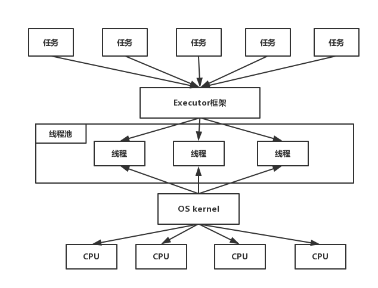
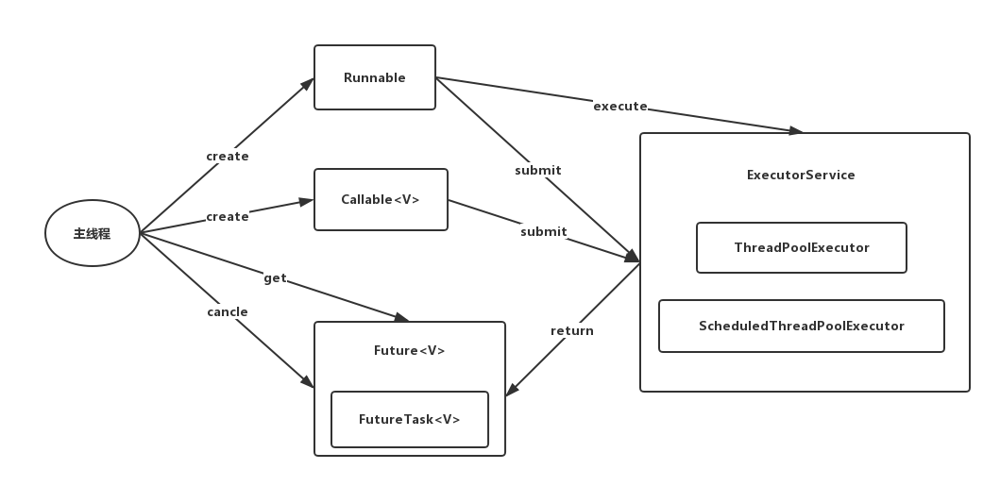

# JUC之Executor框架
在Java中，使用线程来异步执行任务。Java线程的创建和销毁需要一定的开销，如果我们为每一个任务创建一个新线程来执行，这些线程的创建与销毁将消耗大量的计算资源。同时，为每个任务创建一个新线程来执行，这种策略很可能会使处于高负荷状态的应用最终崩溃。Java线程既是工作单元，也是执行机制。从Java 5开始，Java的目标就是把工作单元与执行机制分离。工作单元包括Runnable和Callable，而执行机制由Executor框架提供。

## Executor框架的两级调度模型
在HotSpot VM的线程模型中，Java线程（java.land.Thread)被一对一映射为本地操作系统线程。Java线程启动时会创建一个本地操作系统线程；当该Java线程被终止时，这个操作系统线程也会被回收。操作系统会调度所有线程并将它们分配给可用的CPU。

在上层，Java多线程程序通常会把应用分解为若干个任务，然后使用用户级的调度器（Executor框架）将这些任务映射为固定数量的线程；在底层，操作系统内核将这些线程映射到硬件处理器上。这种两级调度模型的示意图，如下图所示。

从图中可以看出，应用程序通过Executor框架控制上层的调度；而下层的调度由操作系统内核控制，下层的调度不会收到应用程序的控制。

## Executor框架的结构和成员
本文将Executor分为两个部分来介绍Executor: `Executor`的结构和`Executor`框架包含的成员组件。

### Executor框架的结构
Executor框架大致可以分为三个部分：

- 任务  包括被执行任务需要实现的接口：`Runnable`接口或`Callable`接口
- 任务的执行  包括任务执行机制的核心接口`Executor`，以及继承自`Executor`的`ExecutorService`接口。 `Executor`框架有两个关键类`ThreadPoolExecutor`和`ScheduledThreadPoolExecutor`实现了`ExecutorService`接口。
- 异步计算的结果。 包括接口`Future`和实现`Future`接口的`FutureTask`类。

Executor框架包含的主要的类和接口，如下图所示：

- Executor是一个接口。

