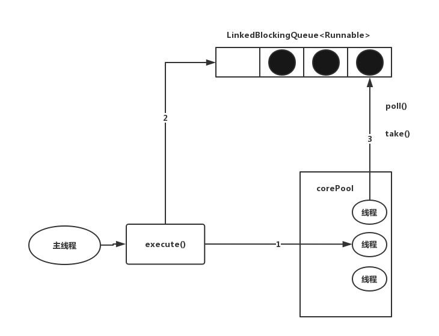

# JUC之Executor框架
在Java中，使用线程来异步执行任务。Java线程的创建和销毁需要一定的开销，如果我们为每一个任务创建一个新线程来执行，这些线程的创建与销毁将消耗大量的计算资源。同时，为每个任务创建一个新线程来执行，这种策略很可能会使处于高负荷状态的应用最终崩溃。Java线程既是工作单元，也是执行机制。从Java 5开始，Java的目标就是把工作单元与执行机制分离。工作单元包括Runnable和Callable，而执行机制由Executor框架提供。

## Executor框架的两级调度模型
在HotSpot VM的线程模型中，Java线程（java.land.Thread)被一对一映射为本地操作系统线程。Java线程启动时会创建一个本地操作系统线程；当该Java线程被终止时，这个操作系统线程也会被回收。操作系统会调度所有线程并将它们分配给可用的CPU。

在上层，Java多线程程序通常会把应用分解为若干个任务，然后使用用户级的调度器（Executor框架）将这些任务映射为固定数量的线程；在底层，操作系统内核将这些线程映射到硬件处理器上。这种两级调度模型的示意图，如下图所示。


从图中可以看出，应用程序通过Executor框架控制上层的调度；而下层的调度由操作系统内核控制，下层的调度不会收到应用程序的控制。


## Executor框架的结构和成员
本文将Executor分为两个部分来介绍Executor: `Executor`的结构和`Executor`框架包含的成员组件。

### Executor框架的结构
Executor框架大致可以分为三个部分：

- 任务  包括被执行任务需要实现的接口：`Runnable`接口或`Callable`接口
- 任务的执行  包括任务执行机制的核心接口`Executor`，以及继承自`Executor`的`ExecutorService`接口。 `Executor`框架有两个关键类`ThreadPoolExecutor`和`ScheduledThreadPoolExecutor`实现了`ExecutorService`接口。
- 异步计算的结果。 包括接口`Future`和实现`Future`接口的`FutureTask`类。

Executor框架包含的主要的类和接口，如下图所示：


- Executor是一个接口，它是Executor框架的基础，它将任务的提交与任务的执行分离开来。
- ThreadPoolExecutor是线程池的最核心实现类，用来执行被提交的任务。
- ScheduledThreadPoolExecutor是一个实现类，可以在给定的延迟后运行命令，或者定期执行命令。`ScheduledThreadPoolExecutor`比`Timer`更灵活，功能更加强大。
- Future接口和实现Future接口的`FutureTask`类，代表异步计算的结果。
- Runnable接口和Callable接口的实现类，都可以被ThreadPoolExecutor或ScheduledThreadPoolExecutor执行。

Executor框架的使用示意图，如下图所示：


主线程首先要创建Runnable或者Callable接口的任务对象。工具类Executors可以把一个Runnable对象封装为一个Callable对象(Executors.callable(Runnable task)或Executors.callable(Runnable task, Object result))。

然后可以把`Runnable`对象直接交给`ExecutorService`执行（`ExecutorService.execute(Runnable command)`)；或者也可以把`Runnable`对象或`Callable`对象提交给`ExecutorService`执行（`ExecutorService.submit(Runnable task)`或`ExecutorService.submit(Callable<T> task)`)。

如果执行`ExecutorService.submit(...)`，`ExecutorServide`将返回一个实现`Future`接口的对象（目前为止返回的是`FutureTask`对象）。由于`FutureTask`实现了`Runnable`,程序员也可以创建`FutureTask`，然后直接提交给`ExecutorService`执行。

最后，主线程可以执行`FutureTask.get()`方法来等待任务执行完成。主线程也可以执行`FutureTask.cancel(boolean mayInterruptIfRunning)`来取消此任务的执行。


### Executor框架的成员
介绍`Executor`框架的成员：`ThreadPoolExecutor, ScheduledThreadPoolExecutor,Future, Runnable, Callable`和`Executors`。

1. ThreadPoolExecutor 通常使用工厂类`Executors`来创建。`Executors`可以创建三种类型的`ThreadPoolExecutor`: `SingleThreadExecutor`, `FixedThreadPool`和`CachedThreadPool`。 详细介绍三种`ThreadPoolExecutor`:
	- FixedThreadPool 适用于为了满足资源管理的需求，而需要限制当前线程数量的的应用场景，它比较适合用于负载比较重的服务器。`Executors`提供了创建使用固定线程数量的`FixedThreadPool`。
	```java
	public static ExecutorService newFixedThreadPool(int nThreads)
	public static ExecutorService newFixedThreadPool(int nThreads, ThreadFactory threadFactory)
	```
  - SingleThreadExecutor 适用于需要保证顺序执行任务，并且在任意时间点不会有多个线程活动的应用场景。 `Executors`提供了创建使用单个线程的`SingleThreadExecutor`。
  ```java
  public static ExecutorService newSingleThreadExecutor()
  public static ExecutorService newSingleThreadExecutor(ThreadFactory threadFactory)
  ```
  
  - CachedThreadPool 是大小无界的线程池，适用于执行很多的短期异步任务的小程序，或者是负载较轻的服务器。`Executors`提供了创建一个会根据需要创建新线程的`CachedThreadPool`。
  ```java
  public static ExecutorService newCachedThreadPool()
  public static ExecutorService newCachedThreadPool(ThreadFactory threadFactory)
  ```
  
2. ScheduledThredPoolExecutor 通常使用`Executors`工厂类进行创建。`Executors`可以创建两种类型的`ScheduledThreadPoolExecutor`，如下：
  - ScheduledThreadPoolExecutor 包含若干个线程的ScheduledThreadPoolExecutor
  - SingleThreadScheduledExecutor 只包含一个线程的ScheduledThreadPoolExecutor
  下面是分别介绍这两种`ScheduledThreadPoolExecutor`:
  	
  - ScheduledThreadPoolExecutor适用于需要多个后台线程执行周期任务，同时为了满足资源管理需求而需要限制后台线程数量的应用场景。
  ```java
  public static ScheduledExecutorService newScheduledThreadPool(int corePoolSize)
  public static ScheduledExecutorService newScheduledThreadPool(int corePoolSize, ThreadFactory threadFactory)
  ```
  - SingleThreadScheduledExecutor适用于需要单个后台线程执行周期任务，同时需要保证顺序执行各个任务的场景。
  ```java
  public static ScheduledExecutorService newSingleThreadScheduledExecutor()
  public static ScheduledExecutorService newSingleThreadScheduledExecutor(ThreadFactory threadFactory)
  ```

3. Future接口 Future接口通常和实现Future接口的FutureTask类用来表示异步计算结果。当我们把Runnable接口或者Callable接口的实现类提交(submit)给ThreadPoolExecutor或者ScheduledThreadPoolExecutor时，ThreadPoolExecutor或ScheduledThreadPoolExecutor会返回一个FutureTask对象。 对应的API如下：
```java
<T> Future<T> submit(Callable<T> task)
<T> Future<T> submit(Runnable task, T result)
Future<?> submit(Runnable task)
```

4. Runnable接口和Callable接口 Runnable接口和Callable接口的实现类，都可以被`ThreadPoolExecutor`或`ScheduledTHreadPoolExecutor`执行。它们之间的区别是`Runnable`不会返回结果，而`Callable`可以返回结果。除了可以自己实现`Callable`对象外，还可以通过`Executors`工厂类把一个`Runnable`封装成一个`Callable`。

```java
public static Callable<Object> callable(Runnable task)
```

`Executors`提供了将一个`Runnable`和一个待返回的结果包装成一个`Callable`接口的API

```java
public static <T> Callable<T> callable(Runnable task, T result)
```

### ThreadPoolExecutor
`Executor`框架的核心类是`ThreadPoolExecutor`，它是线程池的实现类，主要由下列四个组件构成：
1. `corePool` 核心线程池的大小
2. `maximumPool` 最大线程池的大小
3. `BlockingQueue` 用来暂时保存任务的工作队列
4. `RejectedExecutionHandler` 当`ThreadPoolExecutor`已经关闭或`ThreadPoolExecutor`已经饱和时（达到了最大线程池大小且工作队列已满），`execute()`方法将要调用的`Handler`.
	- 通过`Executor`框架的工具类`Executors`，可以创建三种类型的`ThreadPoolExecutor`
	-	`FixedThreadPool`
	-	`SingleThreadExecutor`
	-	`CachedThreadPool`

详细介绍三种`ThreadPoolExecutor`

#### FixedThreadPool
`FixedThreadPool`被称为可重用固定线程数量的线程池。源代码实现如下：

```java
public static ExecutorService newFixedThreadPool(int nThreads) {
	return new ThreadPoolExecutor(nThreads, nThreads, 0L, TimeUnit.MILLISECONDS, new LinkedBlockingQueue<Runnable>());
}
```
`FixedThreadPool`的`corePoolSize`和`maximumPoolSize`都被设置为创建`FixedThreadPool`时指定的参数`nThreads`。

当线程池中的线程数大于`corePoolSize`时， `keepAliveTime`为多余的空闲线程等待新任务的最长时间，超过这个时间后多余的线程将被终止。这里将`keepAliveTime`设置为0L，意味着多余的空闲线程会立刻被终止。

`FixedThreadPool`的`execute()`方法的运行示意图： 



1. 如果当前运行线程少于`corePoolSize`，则创建新线程来执行任务
2. 如果线程池完成预热后（当前运行的线程数等于`corePoolSize`)，将任务加入到`LinkedBlockingQueue`
3. 线程执行完1中的任务后，会重复从`LinkedBlockingQueue`获取任务执行

`FixedThreadPool`使用无界队列`LinkedBlockingQueue`作为线程池的工作队列（队列的容量为`Integer.MAX_VALUE`）。使用无界队列作为工作队列会对线程池带来如下影响：

1. 线程池中的线程数量达到`corePoolSize`后，新任务将在无界队列中等待，因此线程池中的线程数量不会超过`corePoolSize`
2. 由于1，使用无界队列时`maximumPoolSize`将是一个无效参数
3. 由于1和2，使用无界队列时`keepAliveTime`将是一个无效参数
4. 由于使用无界队列，运行中的`FixedThreadPool`（未执行方法`shutdown()`或`shutDownNow()`不会拒绝任务（不会调用`RejectedExceptionHandler.rejectedExeption`方法）

#### SingleThreadExecutor
`SingleThreadExecutor`是使用单个`worker`线程的`Executor`。源代码实现如下：

```java
public static ExecutorService newSingleThreadExecutor() {
	return new FinalizableDelegatedExecutorService(new ThreadPoolExecutor(1, 1, 0L, TimeUnit.MILLISECONDS, new LinkedBlockingQueue<Runnable>()))
}
```
`SingleThreadExecutor`的`corePoolSize`和`maximumPoolSize`被设置为1。其他参数与`FixedThreadPool`相同。`SingleThreadExecutor`使用无界队列`LinkedBlockingQueue`作为线程池的工作队列（队列的容量为`Integer.MAX_VALUE`）。`SingleThreadExecutor`使用无界队列作为工作队列对线程池带来的影响与`FixedThreadPool`相同。

`SingleThreadExecutor`的运行示意图：


1. 如果当前运行的线程数量少于`corePoolSize`（即线程池中没有运行的线程），则创建一个新线程来执行任务。
2. 在线程池完成预热后（当前线程池中有一个运行的线程），将任务加入`LinkedBlockingQueue`
3. 线程执行完1中的任务后，会在一个无限循环中反复从`LinkedBlokcingQueue`获取任务来执行。

#### CachedThreadPool
`CachedThreadPool`是一个根据需要创建新线程的线程池。源代码如下：

```java
public static ExecutorService newCachedThreadPool() {
	return new ThreadPoolExecutor(0, Integer.MAX_VALUE, 60L, TimeUnit.SECONDS, new SynchronousQueue<Runnable>());
}
```

`CachedThreadPool`的`corePoolSize`被设置为0，即`corePool`为空；`maximumPoolSize`被设置为`Integer.MAX_VALUE`，即`maximumPool`是无界的。这里把`keepAliveTime`设置为60L，意味着`CachedThreadPool`使用没有容量的`SynchronousQueu`作为线程池的工作队列，但`CachedThreadPool`的`maximumPool`是无界的。这意味着，如果主线程提交任务的速度高于`maximumPool`中线程处理任务的速度时，`CachedThreadPool`会不断创建线程。极端情况下，`CachedThreadPool`会因为创建过多线程而耗尽CPU和内存资源。

`CachedThreadPool`的`execute()`方法的执行示意图：


1. 首先执行`SynchronousQueue.offer(Runnable task)`。 如果当前`maximumPool`中有空闲线程正在执行`SynchronousQueue.poll(keepAliveTime, TimeUnit.NANOSECONDS)`，那么主线程执行`offer`操作与空闲线程执行的`poll`操作配对成功，主线程把任务交给空闲线程执行，`execute()`方法执行完成；否则执行下面的步骤2。
2. 当初始`maximumPool`为空，或者`maximumPool`中当前没有空闲线程时，将没有线程执行`SynchronousQueue.poll(keepAliveTime, TimeUnit.NANOSECONDS)`。这种情况下，步骤1将失败。此时`CachedThreadPool`会创建一个新线程执行任务，`execute()`方法执行完成。
3. 在步骤2中创建的线程将任务执行完后，会执行`SynchronousQueue.poll(keepAliveTime, TimeUnit.NANOSECONDS)`。这个`poll`操作会让空线程最多在`SynchronousQueue`中等待60秒钟。如果60秒内主线程提交了一个新任务（主线程执行步骤1），那么这个空闲线程将执行主线程提交的新任务；否则，这个空闲线程将终止。由于空闲60秒的空闲线程会被终止，因此长时间保持空闲的`CachedThreadPool`不会使用任何资源。

我们说，`SynchronousQueue`是一个没有容量的阻塞队列。每个插入操作必须等待另一个线程的对应移除操作，反之亦然。`CachedThreadPool`使用`SynchronousQueue`，把主线程提交的任务传递给空闲线程执行。`CachedThreadPool`中任务传递的示意图：


### ScheduledThreadPoolExecutor
`ScheduledThreadPoolExecutor`继承自`ThreadPoolExecutor`。它主要用来在给定的延迟后运行任务，或者定期执行任务。 `ScheduledThreadPoolExecutor`的功能和`Timer`类似，但`ScheduledThreadPoolExecutor`功能更加强大，更灵活。`Timer`对应的是单个后台线程，而`ScheduledThreadPoolExecutor`可以在构造函数中指定多个对应的后台线程数。

#### ScheduledThreadPoolExecutor的运行机制
`ScheduledThreadPoolExecutor`的任务传递示意图：


`DelayQueue`是一个无界队列，所以`ThreadPoolExecutor`的`maximumPoolSize`在`ScheduledThreadPoolExecutor`中没有意义（设置`maximumPoolSize`的大小没有效果）。

`ScheduledThreadPoolExecutor`的任务主要分为两个部分：

1. 当调用`ScheduledThreadPoolExecutor`的`scheduleAtFixedRate()`方法或者`scheduleWithFixedDelay()`方法时，会向`ScheduledThreadPoolExecutor`的`DelayQueue`添加一个实现了`RunnableScheduledFuture`接口的`ScheduledFutureTask`。
2. 线程池中的线程从`DelayQueue`中获取`ScheduledFutureTask`，然后执行任务。

`ScheduledThreadPoolExecutor`为了实现周期性执行任务，对`ThreadPoolExecutor`做了如下修改：
1. 使用`DelayQueue`作为任务队列
2. 获取任务的方式不同
3. 执行周期任务后，增加了额外的处理。

#### ScheduledThreadPoolExecutor的实现
我们说，`ScheduledThreadPoolExecutor`会将待调度的任务（`ScheduledFutureTask`）放到一个`DelayQueue`中。

`ScheduledFutureTask`主要包含3个成员变量：
- long类型成员变量time, 表示这个任务将要被执行的具体时间
- long类型成员变量sequenceNumber, 表示这个任务被添加到`ScheduledThreadPoolExecutor`中的序号
- long类型成员变量period, 表示任务执行的间隔周期。

`DelayQueue`封装了一个`PriorityQueue`，这个`PriorityQueue`会对队列中的`ScheduledFutureTask`进行排序。排序时，time小的排在前面（时间早的任务将先被执行）。如果两个`ScheduledFutureTask`的time相同，就比较`sequenceNumber`,`sequenceNumber`小的排在前面（也就是说，如果两个任务的执行时间相同，那么先提交的任务将被先执行）

`SecheduledThreadPoolExecutor`中的线程执行周期任务的过程，下图是`SecheduledThreadPoolExecutor`中的线程1执行某个周期任务的四个步骤：


1. 线程1从`DelayQueue`中获取已到期的`ScheduledFutureTask(DelayQueue.take)`。到期任务是指`ScheduledFutureTask`的`time`大于等于当前时间
2. 线程1执行这个`ScheduledFutureTask
3. 线程1修改`ScheduledFutureTask`的`time`变量为下次将要被执行的时间
4. 线程1把这个修改`time`之后的`ScheduledFutureTask`放回`DelayQueue`中(`DelayQueue.add()`)

下面我们展示1中任务的获取过程。下面是`DelayQueue.take()`方法的源代码实现：

```java
public E take() throws InterruptedException {
    final ReentrantLock lock = this.lock;
    lock.lockInterruptibly();	                                      															 
    try {
        for (;;) {
            E first = q.peek();
            if (first == null)
                available.await();                                  
            else {
                long delay = first.getDelay(NANOSECONDS);      
                if (delay <= 0)
                    return q.poll();                               
                first = null; // don't retain ref while waiting
                if (leader != null)
                    available.await();                             
                else {
                    Thread thisThread = Thread.currentThread();
                    leader = thisThread;
                    try {
                        available.awaitNanos(delay);               
                    } finally {
                        if (leader == thisThread)
                            leader = null;
                    }
                }
            }
        }
    } finally {
        if (leader == null && q.peek() != null)
            available.signal();
        lock.unlock();                                              
    }
}

```

### FutureTask
`Future`接口和其实现类`FutureTask`代表异步计算的结果。
#### FutureTask简介
`FutureTask`除了实现`Future`接口以外，还实现了`Runnable`接口。因此,`FutureTask`可以交由`Executor`执行，也可以由调用线程直接执行（`FutureTask.run()`）。根据`FutureTask.run()`方法被执行的时机，`FutureTask`可以处于下面三种状态：
1. 未启动 `FutureTask.run()`方法还没有被执行前，`FutureTask`处于未启动状态。当创建一个`FutureTask`，且没有执行`FutureTask.run()`之前，这个`FutureTask`处于未启动状态
2. 已启动 `FutureTask.run()`方法被执行的过程中，`FutureTask`处于未启动状态。
3. 已完成 `FutureTask.run()`方法执行完后正常结束，或被取消`FutureTask.cancel()`或执行`FutureTask.run()`方法时抛出异常而结束，`FutureTask`处于已经完成状态。

`FutureTask`状态迁移示意图：


#### FutureTask使用

#### FutureTask详解
