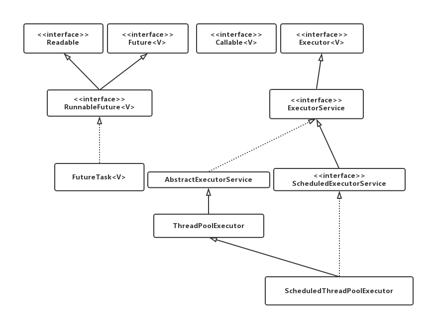

# JUC之Executor框架
在Java中，使用线程来异步执行任务。Java线程的创建和销毁需要一定的开销，如果我们为每一个任务创建一个新线程来执行，这些线程的创建与销毁将消耗大量的计算资源。同时，为每个任务创建一个新线程来执行，这种策略很可能会使处于高负荷状态的应用最终崩溃。Java线程既是工作单元，也是执行机制。从Java 5开始，Java的目标就是把工作单元与执行机制分离。工作单元包括Runnable和Callable，而执行机制由Executor框架提供。

## Executor框架的两级调度模型
在HotSpot VM的线程模型中，Java线程（java.land.Thread)被一对一映射为本地操作系统线程。Java线程启动时会创建一个本地操作系统线程；当该Java线程被终止时，这个操作系统线程也会被回收。操作系统会调度所有线程并将它们分配给可用的CPU。

在上层，Java多线程程序通常会把应用分解为若干个任务，然后使用用户级的调度器（Executor框架）将这些任务映射为固定数量的线程；在底层，操作系统内核将这些线程映射到硬件处理器上。这种两级调度模型的示意图，如下图所示。


从图中可以看出，应用程序通过Executor框架控制上层的调度；而下层的调度由操作系统内核控制，下层的调度不会收到应用程序的控制。


## Executor框架的结构和成员
本文将Executor分为两个部分来介绍Executor: `Executor`的结构和`Executor`框架包含的成员组件。

### Executor框架的结构
Executor框架大致可以分为三个部分：

- 任务  包括被执行任务需要实现的接口：`Runnable`接口或`Callable`接口
- 任务的执行  包括任务执行机制的核心接口`Executor`，以及继承自`Executor`的`ExecutorService`接口。 `Executor`框架有两个关键类`ThreadPoolExecutor`和`ScheduledThreadPoolExecutor`实现了`ExecutorService`接口。
- 异步计算的结果。 包括接口`Future`和实现`Future`接口的`FutureTask`类。

Executor框架包含的主要的类和接口，如下图所示：



- Executor是一个接口，它是Executor框架的基础，它将任务的提交与任务的执行分离开来。
- ThreadPoolExecutor是线程池的最核心实现类，用来执行被提交的任务。
- ScheduledThreadPoolExecutor是一个实现类，可以在给定的延迟后运行命令，或者定期执行命令。`ScheduledThreadPoolExecutor`比`Timer`更灵活，功能更加强大。
- Future接口和实现Future接口的`FutureTask`类，代表异步计算的结果。
- Runnable接口和Callable接口的实现类，都可以被ThreadPoolExecutor或ScheduledThreadPoolExecutor执行。

Executor框架的使用示意图，如下图所示：


主线程首先要创建Runnable或者Callable接口的任务对象。工具类Executors可以把一个Runnable对象封装为一个Callable对象(Executors.callable(Runnable task)或Executors.callable(Runnable task, Object result))。

然后可以把`Runnable`对象直接交给`ExecutorService`执行（`ExecutorService.execute(Runnable command)`)；或者也可以把`Runnable`对象或`Callable`对象提交给`ExecutorService`执行（`ExecutorService.submit(Runnable task)`或`ExecutorService.submit(Callable<T> task)`)。

如果执行`ExecutorService.submit(...)`，`ExecutorServide`将返回一个实现`Future`接口的对象（目前为止返回的是`FutureTask`对象）。由于`FutureTask`实现了`Runnable`,程序员也可以创建`FutureTask`，然后直接提交给`ExecutorService`执行。

最后，主线程可以执行`FutureTask.get()`方法来等待任务执行完成。主线程也可以执行`FutureTask.cancel(boolean mayInterruptIfRunning)`来取消此任务的执行。


### Executor框架的成员
介绍`Executor`框架的成员：`ThreadPoolExecutor, ScheduledThreadPoolExecutor,Future, Runnable, Callable`和`Executors`。

1. ThreadPoolExecutor 通常使用工厂类`Executors`来创建。`Executors`可以创建三种类型的`ThreadPoolExecutor`: `SingleThreadExecutor`, `FixedThreadPool`和`CachedThreadPool`。 详细介绍三种`ThreadPoolExecutor`:
	- FixedThreadPool 适用于为了满足资源管理的需求，而需要限制当前线程数量的的应用场景，它比较适合用于负载比较重的服务器。`Executors`提供了创建使用固定线程数量的`FixedThreadPool`。
	```java
	public static ExecutorService newFixedThreadPool(int nThreads)
	public static ExecutorService newFixedThreadPool(int nThreads, ThreadFactory threadFactory)
	```
  - SingleThreadExecutor 适用于需要保证顺序执行任务，并且在任意时间点不会有多个线程活动的应用场景。 `Executors`提供了创建使用单个线程的`SingleThreadExecutor`。
  ```java
  public static ExecutorService newSingleThreadExecutor()
  public static ExecutorService newSingleThreadExecutor(ThreadFactory threadFactory)
  ```
  
  - CachedThreadPool 是大小无界的线程池，适用于执行很多的短期异步任务的小程序，或者是负载较轻的服务器。`Executors`提供了创建一个会根据需要创建新线程的`CachedThreadPool`。
  ```java
  public static ExecutorService newCachedThreadPool()
  public static ExecutorService newCachedThreadPool(ThreadFactory threadFactory)
  ```
  
2. ScheduledThredPoolExecutor 通常使用`Executors`工厂类进行创建。`Executors`可以创建两种类型的`ScheduledThreadPoolExecutor`，如下：
  - ScheduledThreadPoolExecutor 包含若干个线程的ScheduledThreadPoolExecutor
  - SingleThreadScheduledExecutor 只包含一个线程的ScheduledThreadPoolExecutor
  下面是分别介绍这两种`ScheduledThreadPoolExecutor`:
  	
  - ScheduledThreadPoolExecutor适用于需要多个后台线程执行周期任务，同时为了满足资源管理需求而需要限制后台线程数量的应用场景。
  ```java
  public static ScheduledExecutorService newScheduledThreadPool(int corePoolSize)
  public static ScheduledExecutorService newScheduledThreadPool(int corePoolSize, ThreadFactory threadFactory)
  ```
  - SingleThreadScheduledExecutor适用于需要单个后台线程执行周期任务，同时需要保证顺序执行各个任务的场景。
  ```java
  public static ScheduledExecutorService newSingleThreadScheduledExecutor()
  public static ScheduledExecutorService newSingleThreadScheduledExecutor(ThreadFactory threadFactory)
  ```

3. Future接口 Future接口通常和实现Future接口的FutureTask类用来表示异步计算结果。当我们把Runnable接口或者Callable接口的实现类提交(submit)给ThreadPoolExecutor或者ScheduledThreadPoolExecutor时，ThreadPoolExecutor或ScheduledThreadPoolExecutor会返回一个FutureTask对象。 对应的API如下：
```java
<T> Future<T> submit(Callable<T> task)
<T> Future<T> submit(Runnable task, T result)
Future<?> submit(Runnable task)
```

4. Runnable接口和Callable接口 Runnable接口和Callable接口的实现类，都可以被`ThreadPoolExecutor`或`ScheduledTHreadPoolExecutor`执行。它们之间的区别是`Runnable`不会返回结果，而`Callable`可以返回结果。除了可以自己实现`Callable`对象外，还可以通过`Executors`工厂类把一个`Runnable`封装成一个`Callable`。

```java
public static Callable<Object> callable(Runnable task)
```

`Executors`提供了将一个`Runnable`和一个待返回的结果包装成一个`Callable`接口的API

```java
public static <T> Callable<T> callable(Runnable task, T result)
```

### ThreadPoolExecutor
`Executor`框架的核心类是`ThreadPoolExecutor`，它是线程池的实现类，主要由下列四个组件构成：
1. `corePool` 核心线程池的大小
2. `maximumPool` 最大线程池的大小
3. `BlockingQueue` 用来暂时保存任务的工作队列
4. `RejectedExecutionHandler` 当`ThreadPoolExecutor`已经关闭或`ThreadPoolExecutor`已经饱和时（达到了最大线程池大小且工作队列已满），`execute()`方法将要调用的`Handler`.
	- 通过`Executor`框架的工具类`Executors`，可以创建三种类型的`ThreadPoolExecutor`
	-	`FixedThreadPool`
	-	`SingleThreadExecutor`
	-	`CachedThreadPool`

详细介绍三种`ThreadPoolExecutor`

#### FixedThreadPool

#### SingleThreadExecutor

#### CachedThreadPool

### ScheduledThreadPoolExecutor

#### ScheduledThreadPoolExecutor的运行机制

#### ScheduledThreadPoolExecutor的实现

### FutureTask

#### FutureTask简介

#### FutureTask使用

#### FutureTask详解
