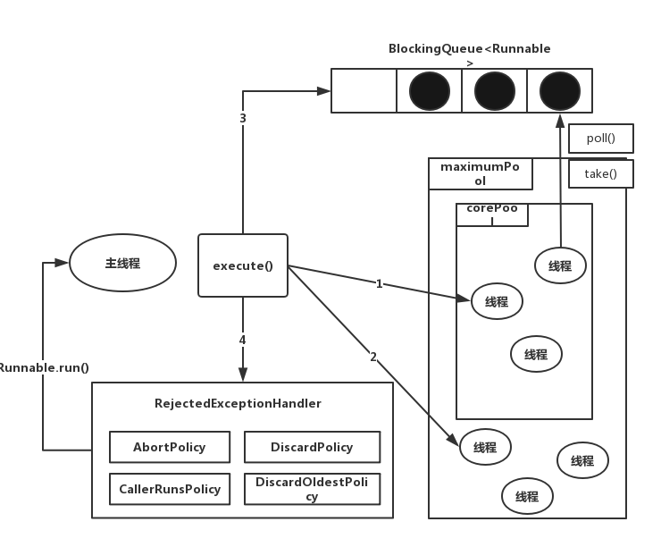

# Java线程池
合理使用线程池的优势：
1. 降低资源消耗。 通过重复利用已创建的线程降低线程创建和销毁造成的消耗。
2. 提高响应速度。 当任务到达时，任务可以不需要等到线程创建就能立即执行。
3. 提供线程的可管理性。 线程是稀缺资源，如果无限制的创建，不仅会消耗系统资源，还会降低系统的稳定性，使用线程池可以进行统一分配、调优和监控。

## 线程池的实现原理
当向线程池提交一个任务后，线程池的处理流程如下：
1. 线程池判断核心线程池里的线程是否都在执行任务。如果不是，则创建一个新的工作做线程来执行任务。如果核心线程池里的线程都在执行任务，则进入下一个流程。
2. 线程池判断工作队列是否已满。如果工作队列没有满，则将新提交的任务存储在这个工作队列里。如果工作队列已满，则进入下一个流程。
3. 线程池判断线程池的线程是否都处于工作状态。如果没有，则创建一个新的工作线程来执行任务。如果已经满了，则交给饱和策略来处理这个任务。

线程池的主要处理流程：


`ThreadPoolExecutor`执行`execute()`方法的示意图：



`ThreadPoolExecutor`执行`execute()`方法分为下面的四种情况：
1. 如果当前运行的线程少于`corePoolSize`，则创建新线程来执行任务（注意，执行这一步骤需要获取全局锁）
2. 如果运行的线程等于或多于`corePoolSize`，则将任务加入`BlockingQueue`
3. 如果无法将任务加入`BlockingQueue`（队列已满），则创建新的线程来处理任务（注意，执行这一步需要获取全局锁）
4. 如果创建新线程将使当前运行的线程超出`maximumPoolSize`,任务将会被拒绝，并调用`RejectedExceptionHandler.rejectedExecution()`方法。

`ThreadPoolExecutor`采取上述步骤的总体设计思路是为了执行`execute()`方法时，尽可能避免获取全局锁。在`ThreadPoolExecutor`完成预热之后（当前运行线程大于等于corePoolSize)，几乎所有的`execute()`方法调用都是执行步骤2，而步骤2不需要获取全局锁。

`execute`源码：

```java
public void execute(Runnable command) {
	if(comman == null) throw new NullPointerException();
	//如果线程数量少于基本线程数，则创建线程并执行当前任务
	if(poolSize >= corePoolSize || !addIfUnderCorePoolSize(command)) {
		//如果线程数大于基本线程数或线程创建失败，则将当前任务放到工作队列中
		if(runState == RUNNING && workQueue.offer(command)) {
			if(runState != RUNNING || poolSize == 0) {
				ensureQueuedTaskHandled(command);
			}
		}
		//如果线程池不处于运行中或任务无法放入队列，且当前线程数量小于最大允许的线程数量，则创建一个线程执行任务
		else if (!addIfUnderMaximumPoolSize(command)) {
			//抛出RejectedExecutionException异常
			reject(command); //is shutdown or saturated
		}
	}
}
```

**工作线程** 线程池创建线程时，会将线程封装成工作线程Worker，Worker在执行完任务后，还会循环获取工作队列里的任务来执行。

```java
public void run() {
	try{
		Runnable task = firstTask;
		firstTask = null;
		while(task != null || (task = getTask()) != null) {
			runTask(task);
			task = null;
		}
	}finally {
		workerDone(this);
	}
}

```
`ThreadPoolExecutor`中线程执行任务的示意图：


线程池中的线程执行任务分两种情况；
1. 在`execute()`方法创建一个线程时，会让这个线程执行当前任务。
2. 这个线程执行完上任务后，会反复从`BlockingQueue`获取任务来执行。

## 线程池的使用
### 线程池的创建
可以通过`ThreadPoolExecutor`来创建一个线程池。
```java
new ThreadPoolExecutor(corePoolSize, maximumPoolSize, keepAliveTime, milliseconds, runnableTaskQueue, handler);
```

创建线程池时需要几个参数：

1. `corePoolSize`（线程池的基本大小）：当提交一个任务到线程池时，线程池会创建一个线程来执行任务，即使其他空闲的基本线程能够执行新任务也会创建线程，等到需要执行的任务数大于线程池基本大小时就不再创建。如果调用了线程池的`prestartAllCoreThreads()`方法，线程池会提前创建并启动所有基本线程。
2. `runnableTaskQueue`（任务队列）： 用于保存等待执行的任务的阻塞队列。可以选择以下几个队列：
	- `ArrayBlockingQueue` 一个基于数组结构的有界阻塞队列，该队列按照FIFO原则对元素进行排序
	- `LinkedBlockingQueue` 一个基于链表结构的阻塞队列，该队列按FIFO排序元素，吞吐量要高于`ArrayBlockingQueue`。静态工厂方法`Executors.newFixedThreadPool()`。
	- `SynchronousQueue`：一个不能存储元素的阻塞队列。每个插入操作必须等待另一个线程调用移除操作，否则插入操作一直处于阻塞状态，吞吐量要高于`LinkedBlockingQueue`，静态工厂方法`Executors.newCachedThreadPool`使用了这个队列。
	- `PriorityBlockingQueue`： 一个具有优先级的无限阻塞队列。
3. `maximumPoolSize`（线程池最大数量）：线程池允许创建的最大线程数量。如果队列满了，并且已经创建的线程数小于最大线程数，则线程池会在创建新的线程执行任务。值得注意的是，如果使用了无界的任务队列这个参数就没有效果。
4. `ThreadFactory`：用于设置创建线程的工厂，就可以通过线程工厂给每个创建出来的线程设置更有意义的名字。使用开源矿建guava提供的`ThreadFactoryBuilder`可以快速给线程池里的线程设置有意义的名字。例如：

```java
new ThreadFactoryBuilder().setNameFormat("xx-task-%d").build();
```

5. `RetectedExecutionHandler`（饱和策略）：当队列和线程池都满，说明线程池处于饱和状态，那么必须采取一种策略处理提交的新任务。这个策略默认情况下是`AbortPolicy`，表示无法处理新任务时抛出的异常。在JDK 1.5中线程池框架提供了以下四种策略：

- AbortPolicy: 直接抛出异常
- CallerRunsPolicy: 只用调用者所在的线程来处理运行任务
- DiscardOldestPolicy: 丢弃队列里最新的一个任务，并执行当前任务
- DiscardPolicy: 不处理，丢弃掉。

也可以根据场景需要实现`RejectedExecutionHandler`接口自定义策略。如纪录日志或持久化不能处理的任务：
- keeyAliveTime（线程活动保持时间）： 线程池的工作线程闲置后，保持存活的时间。所以任务很多，并且每个任务执行的之间较短，可以调长时间，提高线程的利用率。
- TimeUnit（线程活动）：可选单位有天（DAYS）、小时（HOURS）、分钟（MINUTES）、毫秒（MILLISECONDS）、微秒（MICROSECONDS，千分之一毫秒）和纳秒（NANOSECONDS，千分之一微秒）

## 向线程提交任务
有两种方法向线程提交任务，分别为`execute()`和`submit()`方法。

`execute()`方法用于提交不需要返回值的任务，所以无法判断任务是否被线程池执行成功。通过以下代码可知`execute()`方法输入的任务是一个`Runnable`类的实例。

```java
threadPool.execute(new Runnable() {
	@Override public void run(){
		//TODO Auto-generated method stub
	}
});
```

`submit()`方法用于提交需要返回值的任务。线程池会返回一个`Future`类型的对象，通过这个`Future`对象可以判断任务是否执行成功，并且可以通过`Future`的`get()`方法来获取返回值，`get()`方法会阻塞当前线程直到任务完成，而使用`get(long timeout, TimeUnit unit)`方法则会阻塞当前线程一段时间后立即返回。

```java
Future<Object> future = executor.submit(harReturnValueTask);
try{
	Object s = future.get();
}catch(InterruptedException e) {
	//处理中断异常
}catch(ExecutionException e) {
	//处理无法执行任务异常
	

}finally{
	//关闭线程池
	executor.shutdown();
}
```

## 关闭线程池
通过调用线程池的`shutdown()`和`shutdownNow()`方法来关闭线程池。它们的原理是遍历线程池中的工作线程，然后逐个调用线程的`interrupt`方法来中断线程，所以无法响应中断的任务可能永远无法终止。但是它们存 在一定区别，`shutdownNow()`首先将线程池的状态设置成`STOP`，然后尝试停止所有正在执行或暂停的线程，并返回等待执行任务的列表，而`shutdown`只是将线程池的状态设置成`SHUTDOWN`状态，然后中断所有闲置状态的线程。只要调用了这两个关闭方法的任意一个，`isShutDown`方法就会返回`true`。当所有任务都已关闭后，才表示线程关闭成功，这时调用`isTerminaed`方法会返回`true`。调用哪一种方法来关闭线程池，应该由提交的任务特性决定，通常调用`shutdown`方法来关闭线程池，如果任务不一定要完成，可以调用`shotdownNow()`。

## 合理配置线程池
从几个角度分析：

- 任务性质： CPU密集型任务、IO密集型任务和混合型任务
- 任务的优先级： 高、中和低
- 任务的执行时间： 长、中和短
- 任务的依赖性：是否依赖其他系统资源，例如数据库连接

性质不同的任务可以用不同规模的线程池分开处理。CPU密集型任务应配置尽可能少的线程，如配置N(cpu)+1个线程的线程池。由于IO密集型任务线程并不是一直在执行任务，则应该配置尽可能多的线程，例如2*N(cpu)个线程。 混合型任务，如果可以拆分，则将其拆分成一个CPU密集型任务和一个IO密集型任务。可以通过 `Runtime.getRuntime().availableProcessors()`方法获得当前设备的CPU个数。

## 线程池的监控
- `taskCount` 线程池需要执行的任务数量
- `completedTaskCount`线程池在运行过程中已经完成的任务数量，小于或等于`taskCount`
- `largestPoolSize` 线程池里曾经创建过的最大线程数量。通过这个数据可以知道线程池是否曾经满过。如果该数值等于线程池的最大大小，则表示线程池曾经满过。
- `getPoolSize` 线程池的线程数量。如果线程池不销毁的话，线程池里的线程不会自动销毁，所以这个值只增不减。
- `getActiveCount`： 获取活动的线程数。