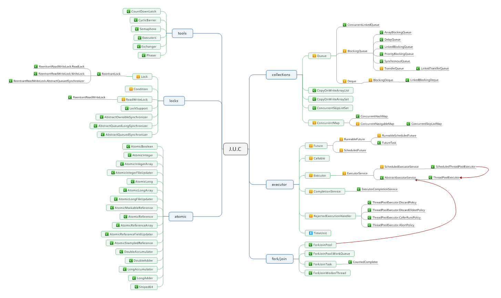

# Java并发包综述
本文是这个系列的开篇，主要纪录了自己对于Java整个并发体系，也就是java.util.concurrent(J.U.C)包的理解。这里面可能包括了硬件，软件，思想以及一些错误。并发包作为Java引以为豪的一部分许多概念来自于Doug Lea的util.concurrent库。

Java 5中添加并发包，其中Java的并发改进分为三个层次：

1. **JVM级别的更改** 大多数现代处理器在某一硬件级别对并发提供支持，通常以`compare and swap(CAS)指令形式`。CAS 是一种低级别的、细粒度的技术，它允许多个线程更新一个内存位置，同时能够检测其他线程的冲突并进行恢复。它是许多高性能并发算法的基础。在`JDK 5.0`之前，`Java`语言中用于协调线程之间的访问的惟一原语是同步，同步是更重量级和粗粒度的。公开 CAS 可以开发高度可伸缩的并发 Java 类。这些更改主要提供给`JDK`库类使用，而不是开发人员。
2. **低级使用程序类** 锁定和原子类。使用CAS作为并发原语，`ReentrantLock`提供与`synchronized`原语相同的锁定和内存语义，这样可以更好的控制锁定（如计时的锁定等待、锁定轮询和可中断的锁定等待）和更好的可伸缩性（竞争时的高性能）。大多数开发人员将不再直接使用 ReentrantLock 类，而是使用在 ReentrantLock 类上构建的高级类。
3. 高级实用程序类。这些类实现并发构建块，每个计算机科学文本中都会讲述这些类 -- 信号、互斥、闩锁、屏障、交换程序、线程池和线程安全集合类等。大部分开发人员都可以在应用程序中用这些类，来替换许多（如果不是全部）同步、wait() 和 notify() 的使用，从而提高性能、可读性和正确性
4. Fork/Join框架的理解

大体内容如下：
1. J.U.C的API： 包括完整的类库结构和样例分析
2. J.U.C的硬件原理以及软件思想
3. J.U.C误区和常见陷阱

下面图是J.U.C的完整API:

