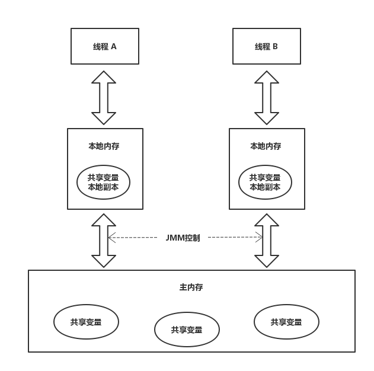

# 对并发编程的理解
提及并发编程，我们首先就应当知道引入它的目的——提高程序运行效率。但由于并发编程技术的引入，资源竞争问题也随之出现，这也是并发编程中的根本问题——线程安全。我们说，线程安全问题其实就是关注线程之间的通信问题以及线程间信息同步问题。更具体地说，也是就是如何保证原子操作，内存可见性和程序的顺序一致性。本文的讨论将围绕这三个基本问题，并结合Java语言来说明问题。

## 原子操作
所谓原子操作指的是“不可被中断的一个或一些列操作”，这个概念有点类似于数据库的原子性概念。也就是说，一组操作要么全执行，要么全部执行。

举一个最简单的例子，A向B转了100块钱。在实现时，通常的做法是两个步骤：1）A的账户减去100元；2）B的账户增加100元。1）和2）这两个操作是具有原子性的，如果有其中一个操作执行错误，那么资金总额就会出问题。

## 内存可见性
所谓可见性指的是“一个线程修改了一个共享变量，其他线程都能读到这个结果”。 

之所以出现内存可见性问题是有原因的。我们知道CPU从主内存中读取数据的效率并不高效，因此为了提高存取速度，现代主流计算机存储体系中都会有几级缓存。为简单起见，我们抽象出如下内存模型（下图也是Java内存模型的抽象图），来解释可见性。



线程A和线程B的通信过程，要经历如下步骤：

1. 线程A将本地内存中更新过的共享变量刷新到主内存中
2. 线程B将主内存中读取线程A之前更新过的共享变量读取到本地内存中

在上述模型中，JMM通过控制主内存与每个线程本地内存之间的交互来为Java程序提供内存可见性保证。

提高到操作系统层面，每当线程读取主内存中的共享变量，首先会将其加载到本地内存（可能是高速缓存，或其他缓冲区中），修改该变量后，CPU会立刻刷新缓存，但是并不一定会立刻将该缓存数据刷新到主内存中（该操作是不可预期的）。此时其它线程（尤其是不在同一个CPU上执行的线程）访问该变量时，从主内存中读到的就是旧的数据，而非第一个线程更新后的数据。


## 顺序一致性
所谓顺序一致性指的是“程序的执行结果与该程序在顺序一致性内存模型上的执行结果一致”。顺序一致性内存模型是被计算机科学家理想化的理论参考模型，它提供了极强的内存可见性保证。

之所以要保证顺序一致性是由于处理器为了提高程序整体执行效率，可能会对代码进行优化，其中就包括重排序，目的是让代码按照更高效的顺序执行。这就包含了两个层面，编译器级别的重排序和CPU指令级别的重排序。而顺序一致性内存模型保证了经过重排序的程序执行结果与程序顺序执行时的结果一致。

## Java解决并发问题
在本节中，将着重叙述JVM如何通过怎样的机制保证以上三种特性——原子操作、内存可见性和顺序一致性
## Java如何保证内存可见性
Java提供了volatile关键字， 通过volatile原语来保证内存可见性。当使用volatile修饰某个变量时，它会保证对该变量的修改会立即被更新到内存中，并且将其它缓存中对该变量的缓存设置成无效，因此其它线程需要读取该值时必须从主内存中读取，从而得到最新的值。

## Java如何保证原子性
### 锁和同步机制
通常，我们使用锁和同步机制来保证Java操作的原子性，而这两个机制是本质上是建立在同步原语基础上的，例如valatile原语。使用锁，可以保证在同一时间段内只有一个线程能够拿到锁，这也就保证了在该时间段内只有拿到锁的线程能够执行申请和释放锁之间的代码块。例如：

```java
public void test() {
	lock.lock();
	try{
		a ++;
		b ++;
	}finally{
		lock.unlock();
	}
}
```
与锁类似，我们可以使用同步机制——`Synchronized`重量锁，它是基于volatile实现的。使用`Synchronzed`实现同步的基础：Java中每个对象都可以作为锁。具体表现为以下几种形式：

1. 对于普通同步方法，锁是当前实例对象
2. 对于静态同步方法，锁是当前类的Class对象
3. 对于同步方法块，锁是`Synchronized`括号里配置的对象

无论使用锁还是`synchronized`，本质都是通过锁来实现资源的排它性，从而实际目标代码段同一时间只会被一个线程执行，进而保证了目标代码段的原子性。这是一种以牺牲性能为代价的方法。


### CAS（Compare And Swap）
基础类型变量自增（i++）是一种常被新手误以为是原子操作而实际不是的操作。Java中提供了对应的原子操作类来实现该操作，并保证原子性，其本质是利用了CPU级别的CAS指令。由于是CPU级别的指令，其开销比需要操作系统参与的锁的开销小。例如，Java提供的十三个原子类之中的AtomicInteger使用方法如下。
```java
AtomicInteger atomicInteger = new AtomicInteger();
for(int b = 0; b < numThreads; b++) {
  new Thread(() -> {
    for(int a = 0; a < iteration; a++) {
      atomicInteger.incrementAndGet();
    }
  }).start();
}
```

## Java如何保证顺序一致性
我们说，重排序包括两个层面——编译器和处理器对指令的重排序，但是二者均会保证重排序后的结果和代码顺序执行的结果一致。所以，重排序过程并不会影响到单线程程序执行的正确性，但是重排序却可能影响多线程程序并发执行结果的正确性。

我们说，如果程序是正确同步的，程序的执行将具有顺序一致性——即程序的执行结果与该程序在顺序一致性内存模型中执行的结果相同。其中，这里的同步指广义上的同步，包括同步原语（synchronized, volatile和final）的正确使用。

### 内存屏障
为了保证内存可见性， Java编译器会在生成指令序列的适当位置插入内存屏障指令来禁止特定类型的处理器重排序。 JMM将内存屏障指令分为四类：

| 屏障类型 | 指令示例 | 说明 |
|:--------:|:--------:|:----:|
| LoadLoad Barriers | Load1;LoadLoad;Load2 | 确保Load1数据的装载优先于Load2及所有后续装载指令 |
| StoreStore Barriers | Store1;StoreStore;Store2 | 确保Store1数据对其他处理器可见（刷新到内存）优先于Store2及所有后续存储指令的存储 |
| LoadStore Barriers | Load1;LoadStore;Store2 | 确保Load1数据装载先于Store2及所有后续的存储指令刷新到内存 |
| StoreLoad Barriers | Store;StoreLoad;Load2 | 确保Store1数据对其他处理器变得可见（指刷新到内存）先于Load2及所有后序装载指令的装载。StoreLoad Barriers会使该屏障之前的所有内存访问指令（存储和装载指令）完成之后，才执行该屏障之后的内存访问指令 | 


`StoreLoad Barriers`是一个全能型屏障，它同时具有其他2个屏障的效果。支持该屏障的开销很贵，因为当前处理器通常要把写缓冲区中的数据全部刷新到内存中（Buffer Fully Flush)。


 JVM还通过被称为happens-before原则隐式地保证顺序性。两个操作的执行顺序只要可以通过happens-before推导出来，则JVM会保证其顺序性，反之JVM对其顺序性不作任何保证，可对其进行任意必要的重新排序以获取高效率。

### happens-before原则（先行发生原则）

- 传递规则：如果操作1在操作2前面，而操作2在操作3前面，则操作1肯定会在操作3前发生。该规则说明了happens-before原则具有传递性
- 锁定规则：一个unlock操作肯定会在后面对同一个锁的lock操作前发生。这个很好理解，锁只有被释放了才会被再次获取
- volatile变量规则：对一个被volatile修饰的写操作先发生于后面对该变量的读操作
- 程序次序规则：一个线程内，按照代码顺序执行
- 线程启动规则：Thread对象的start()方法先发生于此线程的其它动作
- 线程终结原则：线程的终止检测后发生于线程中其它的所有操作
- 线程中断规则： 对线程interrupt()方法的调用先发生于对该中断异常的获取
- 对象终结规则：一个对象构造先于它的finalize发生

## as-if-serial语义
as-if-serial语义的意思是： 不论怎样的重排序（编译器和处理为了提高并行度），（单线程）程序的执行结果不能被改变。


问：平时项目中使用锁和synchronized比较多，而很少使用volatile，难道就没有保证可见性？

答：锁和synchronized即可以保证原子性，也可以保证可见性。都是通过保证同一时间只有一个线程执行目标代码段来实现的。


问：锁和synchronized为何能保证可见性？
答：根据JDK 7的Java doc中对concurrent包的说明，一个线程的写结果保证对另外线程的读操作可见，只要该写操作可以由happen-before原则推断出在读操作之前发生。

The results of a write by one thread are guaranteed to be visible to a read by another thread only if the write operation happens-before the read operation. The synchronized and volatile constructs, as well as the Thread.start() and Thread.join() methods, can form happens-before relationships.

问：既然锁和synchronized即可保证原子性也可保证可见性，为何还需要volatile？
答：synchronized和锁需要通过操作系统来仲裁谁获得锁，开销比较高，而volatile开销小很多。因此在只需要保证可见性的条件下，使用volatile的性能要比使用锁和synchronized高得多。

问：既然锁和synchronized可以保证原子性，为什么还需要AtomicInteger这种的类来保证原子操作？
答：锁和synchronized需要通过操作系统来仲裁谁获得锁，开销比较高，而AtomicInteger是通过CPU级的CAS操作来保证原子性，开销比较小。所以使用AtomicInteger的目的还是为了提高性能。

问：还有没有别的办法保证线程安全
答：有。尽可能避免引起非线程安全的条件——共享变量。如果能从设计上避免共享变量的使用，即可避免非线程安全的发生，也就无须通过锁或者synchronized以及volatile解决原子性、可见性和顺序性的问题。

问：synchronized即可修饰非静态方式，也可修饰静态方法，还可修饰代码块，有何区别
答：synchronized修饰非静态同步方法时，锁住的是当前实例；synchronized修饰静态同步方法时，锁住的是该类的Class对象；synchronized修饰静态代码块时，锁住的是synchronized关键字后面括号内的对象。