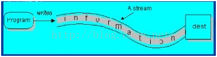
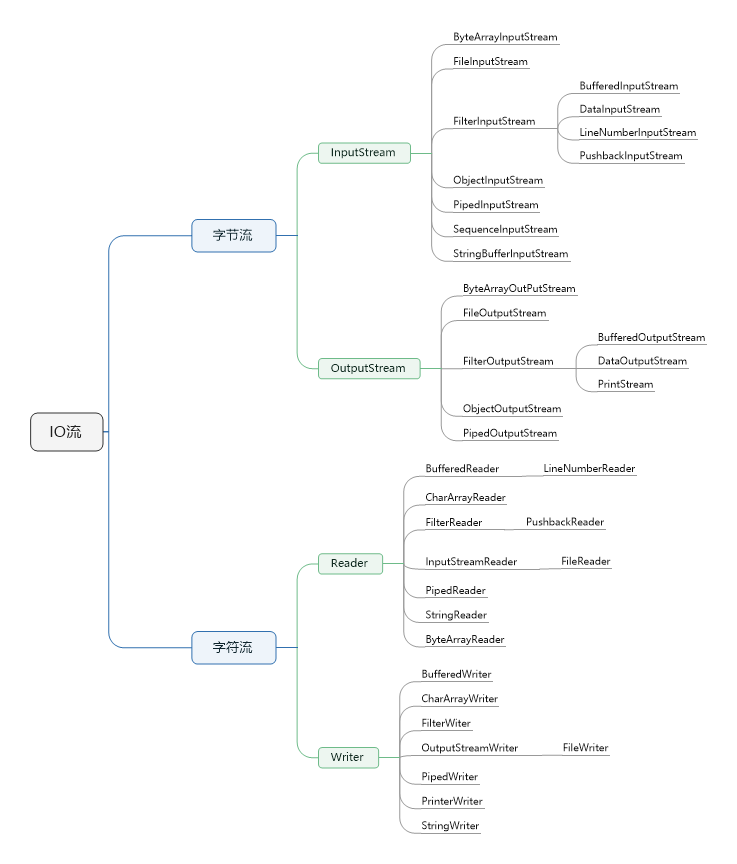
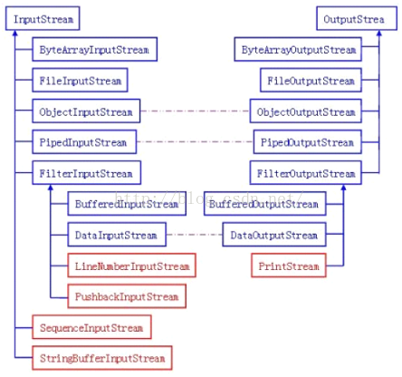

# Java IO 流
一边抄一边总结写下的本文。文中是自己的对于Java IO Stream框架的总体理解。当然大部分是从总体架构上的，很少深入到源码级别。这应该是后面要做的具体事情。

对程序语言设计者来说，创建一个好的输入/输出（I/O）系统是一项艰巨的任务。————Bruce Eckel 《Java编程思想》

I/O带来的挑战不仅仅来自于数据源端和与之通信的接收端（文件，控制台和网络连接等），还要来自于不同的交互方式和他们之间的通信方式（顺序、随机存取、二进制、按字符、按行、按字等）。

Java IO流的实现类都存在于`java.io`包中（当然，这里需要排除`NIO`），本文的分析业主要借助Java 8源码的`java.io`包中的类间关系和类功能来总结Java IO的设计思想。

本文大致分为以下几个部分：

1. 概述
2. Java IO流的顶层设计
3. 概念与模型
4. 字节流
5. 字符流
6. 文件类
7. System类提供的标准流

## 概述
Java的IO通过`java.io`包下的类支持。在`java.io`包下主要包括输入和输出两种流，每种输入和输出流又可以分为两大类 **字节流** 和 **字符流**。 其中字节流以字节为单位处理输入/输出操作，而字节流则以字节为单位处理输入/输出操作。另外，Java的IO设计中使用了装饰器模式，它将IO流分为底层节点流和上层处理流，其中节点流用于和底层的物理存储节点直接关联——不同的物理节点获取节点流的方式可能存在一定的差异，但是Java IO流可以将不同的物理节点流包装成统一的处理流，从而允许程序使用统一的输入/输出操作代码来读取不同物理节点上的数据。

除此之外，在Java的IO中都需要涉及的一点：序列化机制也会提及。

本文将以自顶向下的方式讲述自己对Java IO流的理解。


## 顶层设计概述

|类| 说明|
|:--:|:---:|
|File| 文件类 |
|RandomAccessFile| 随机存取文件类|
|InputStream | 字节输入流 |
|OutputStream | 字节输出流|
|Reader | 字符输入流 |
|Writer | 字符输出流 |

在`java.io`包中最重要的几个顶层设计五个类和一个接口： `File, InputStream, OutputStream, Reader, Writer`和 `Serializable`。


顶层主要的类如下：

1. File（文件特征与管理）：用于文件或者目录的描述信息，例如生成新目录，修改文件名，删除文件，判断文件所在路径等。**注意这是一个扩展定义**。
2. InputStream（二进制格式操作）：抽象类，基于字节的输入操作，是所有字节输入流的父类。定义了所有字节输入流都具有的共同特征。
3. OutputStream（二进制格式操作）：抽象类。基于字节的输出操作，是所有字节输出流的父类。定义了所有字节输出流都具有的共同特征。
4. Reader（文件格式操作）：抽象类，基于字符的输入操作，是所有字符输入流的父类。定义了所有字符输入流都具有的共同特征。
5. Writer（文件格式操作）：抽象类，基于字符的输出操作，是所有字符输入流的父类。定义了所有字符输入流都具有的共同特征。
6. RandomAccessFile（随机文件操作）：一个独立的类，直接继承自Object。它的功能丰富，可以从文件的任意位置进行存取（输入输出）操作。


## 概念与模型

### 流的概念和作用
Java中将输入输出抽象称为流，就好像水管，将两个容器连接起来。流是一组有顺序的，有起点和终点的字节集合，是对数据传输的总称或抽象。即数据在两设备间的传输称为流.
 
### Java IO所采用的模型  
Java的IO模型设计非常优秀，它使用Decorator(装饰者)模式，按功能划分Stream，您可以动态装配这些Stream，以便获得我们需要的功能。例如，我们需要一个具有缓冲的文件输入流，则应当组合使用FileInputStream和BufferedInputStream。 
 
### IO流的分类

- 根据处理数据类型的不同分为：字符流和字节流
- 根据数据流向不同分为：输入流和输出流
- 按数据来源（去向）分类：
	1. File（文件）： FileInputStream, FileOutputStream, FileReader, FileWriter 
    2. byte[]：ByteArrayInputStream, ByteArrayOutputStream 
    3. Char[]: CharArrayReader,CharArrayWriter 
    4. String:StringBufferInputStream, StringReader, StringWriter 
    6. 网络数据流：InputStream,OutputStream, Reader, Writer 

1. 字符流和字节流
流序列中的数据既可以是未经加工的原始二进制数据，也可以是经一定编码处理后符合某种格式规定的特定数据。因此Java中的流分为两种：

- 字节流：数据流中最小的数据单元是字节
- 字符流：数据流中最小的数据单元是字符， Java中的字符是Unicode编码，一个字符占用两个字节。

字符流的由来： Java中字符是采用Unicode标准，一个字符是16位，即一个字符使用两个字节来表示。为此，JAVA中引入了处理字符的流。因为数据编码的不同，而有了对字符进行高效操作的流对象。本质其实就是基于字节流读取时，去查了指定的码表。

2. 输入流和输出流
根据数据的输入、输出方向的不同对而将流分为输入流和输出流。

- **输入流** 程序从输入流读取数据源。数据源包括外界(键盘、文件、网络…)，即是将数据源读入到程序的通信通道


- **输出流** 程序向输出流写入数据。将程序中的数据输出到外界（显示器、打印机、文件、网络…）的通信通道。



采用数据流的目的就是使得输出输入独立于设备。

- 输入流( Input  Stream )不关心数据源来自何种设备（键盘，文件，网络）。
- 输出流( Output Stream )不关心数据的目的是何种设备（键盘，文件，网络）。

### 特性
相对于程序来说，输出流是往存储介质或数据通道写入数据，而输入流是从存储介质或数据通道中读取数据，一般来说关于流的特性有下面几点：

1. 先进先出，最先写入输出流的数据最先被输入流读取到。
2. 顺序存取，可以一个接一个地往流中写入一串字节，读出时也将按写入顺序读取一串字节，不能随机访问中间的数据。（RandomAccessFile可以从文件的任意位置进行存取（输入输出）操作）
3. 只读或只写，每个流只能是输入流或输出流的一种，不能同时具备两个功能，输入流只能进行读操作，对输出流只能进行写操作。在一个数据传输通道中，如果既要写入数据，又要读取数据，则要分别提供两个流


## Java的IO流对象
下面是Java 8源码`java.io`包中提供的有关IO流的主要实现类。

如下图一



我们将从整个设计分为两个部分 **字节流和字符流** 分别叙述，然后再综合二者的联系。


## Java IO的字节流继承体系
### 输入字节流
我们知道，在上图一的字节输入流的继承体系中：
1. `InputStream`是所有字节输入流的父类，它是一个抽象类
2. `ByteArrayInputStream`，`StringBufferInputStream`， `FileInputStream`是三种基本的**介质流**，它们分别从`byte数组`、`StringBuffer`和本地文件中读取数据
3. `PipedInputStream`是从与其他线程共用的管道中读取数据
4. `ObjectInputStream`和所有`FilterInputStream`的子类都是装饰流（装饰模式的主角）

InputStream中的三个基本的读方法
```java
abstract int read() //读取一个字节数据，并返回读到的数据，如果返回-1，表示读到了输入流的末尾。
int read(byte[] b)  //将数据读入一个字节数组，同时返回实际读取的字节数。如果返回-1，表示读到了输入流的末尾。
int read(byte[] b, int off, int len) //将数据读入一个字节数组，同时返回实际读取的字节数。如果返回-1，表示读到了输入流的末尾。off指定在数组b中存放数据的起始偏移位置；len指定读取的最大字节数。
```
流结束的判断：方法read()的返回值为-1时；readLine()的返回值为null时。

其它方法
```java
long skip(long n) //在输入流中跳过n个字节，并返回实际跳过的字节数。
int available() //返回在不发生阻塞的情况下，可读取的字节数。
void close() //关闭输入流，释放和这个流相关的系统资源。
void mark(int readlimit) //在输入流的当前位置放置一个标记，如果读取的字节数多于readlimit设置的值，则流忽略这个标记。
void reset() //返回到上一个标记。
boolean markSupported()  //测试当前流是否支持mark和reset方法。如果支持，返回true，否则返回false。
```

### 输出字节流
我们知道，在上图一的字节输出流的继承体系中：
1. `OutputStream`是所有字节输出流的父类，它是一个抽象类
2. `ByteArrayOutputStream`，`FileOutputStream`是两种基本的介质流，它们分别向`byte数组`和本地文件中写入数据
3. `PipedOutputStream`是向与其它线程共用的管道中写入数据  
4. `ObjectOutputStream`和所有`FilterOutputStream`的子类都是装饰流

outputStream中的三个基本的写方法
```java
abstract void write(int b) //往输出流中写入一个字节。
void write(byte[] b) //往输出流中写入数组b中的所有字节。
void write(byte[] b, int off, int len) //往输出流中写入数组b中从偏移量off开始的len个字节的数据。
```

其它方法
```java
void flush() //刷新输出流，强制缓冲区中的输出字节被写出
void close() //关闭输出流，释放和这个流相关的系统资源
```

## Java IO的字符流继承体系
### 输入字符流
我们知道，在上图一的字符输出流的继承体系中：
1. `Reader`是所有字符输入流的父类，它是一个抽象类
2. `CharReader`，`StringReader`是两个基本的介质流，它们分别从`Char数组`和`String`中读取数据。
3. `PipedReader`是从与其它共享线程公用的管道中读取数据
4. `FilterReader`是所有自定义装饰流的父类，其子类`PushBackReader`对`Reader`对象进行修饰，会增加一个行号。
5. `BufferedReader`是一个装饰器，为`Reader`提供缓存功能，与其子类`LineNumberReader`共同提供对`Reader`的修饰。
6. `InputStreamReader`是一个连接字节流和字符流的桥梁，它将字节流转变为字符流。`FileReader`可以说是一个达到此功能、常用的工具类，在其源代码中提供了将`FileInputStream`转变为`Reader`的方法。
7. `Reader`继承体系中各个类的用途和使用方法和`InputStream`中的类使用基本一致。

主要方法：

```java
public int read() throws IOException; //读取一个字符，返回值为读取的字符 
public int read(char cbuf[]) throws IOException; /*读取一系列字符到数组cbuf[]中，返回值为实际读取的字符的数量*/ 
public abstract int read(char cbuf[],int off,int len) throws IOException; /*读取len个字符，从数组cbuf[]的下标off处开始存放，返回值为实际读取的字符数量，该方法必须由子类实现*/ 
```
### 输出字符流
1. `Writer`是所有字符输入流的父类，它是一个抽象类
2. `CharWriter`和`StringWriter`是两种基本的介质流，它们分别向`Char数组`和`String`中写入数据
3. `PipedWriter`是向与其它线程共用的管道中写入数据
4. `BufferedWriter`是一个装饰器，为Writer提供缓冲功能
5. `PrintWriter`和`PrintStream`极其类似，功能和使用也非常相似
6. `OutputStreamWriter`是`OutputStream`到`Writer`转换的桥梁，它的子类`FileWriter`其实就是一个实现此功能的具体类。功能和使用和`OutputStream`极其类似


主要方法：
```java
public void write(int c) throws IOException； //将整型值c的低16位写入输出流 
public void write(char cbuf[]) throws IOException； //将字符数组cbuf[]写入输出流 
public abstract void write(char cbuf[],int off,int len) throws IOException； //将字符数组cbuf[]中的从索引为off的位置处开始的len个字符写入输出流 
public void write(String str) throws IOException； //将字符串str中的字符写入输出流 
public void write(String str,int off,int len) throws IOException； //将字符串str 中从索引off开始处的len个字符写入输出流 
```

## 字节流输入和输出之间的对应



1. `LineNumberInputStream`主要完成从流中读取数据时，会得到相应的行号，换行符由在使用时指定。在输出部分没有对应的部分，我们完全可以自己建立一个`LineNumberOutputStream`，在最初写入时会有一个基准的行号，以后每次遇到换行时会在下一行添加一个行号。
2. `PushbackInputStream`的功能是查看最后一个字节，不满意就放入缓冲区。主要用在编译器的语法、词法分析部分。与输出部分的`BufferedOutputStream`几乎实现相近的功能。
3. `StringBufferInputStream`已经被`Deprecated`，本身就不应该出现在`InputStream`部分，主要因为`String`应该属于字符流的范围。注意：**这个类已经被废弃**
4. `SequenceInputStream`可以认为是一个工具类，将两个或者多个输入流当成一个输入流依次读取。
5. `PrintStream`也可以认为是一个辅助工具。主要可以向其他输出流，或者`FileInputStream`写入数据，本身内部带缓冲。本质上是对其它流的综合运用的一个工具而已。很重要的是，`System.out`和`System.out`就是`PrintStream`的实例！

## 字符流与字节流转换
转换流（`InputStreamReader和OutputStreamWriter`）的特点：

1. 字符流和字节流之间的桥梁
2. 可对读取到的字节数据经过指定编码转换成字符
3. 可对读取到的字符数据经过指定编码转换成字节

何时使用转换流

1. 当字节和字符之间有转换动作时；
2. 流操作的数据需要编码或解码时。

具体的对象体现：

转换流：在IO中还存在一类是转换流，将字节流转换为字符流，同时可以将字符流转化为字节流。
1. `InputStreamReader`:字节到字符的桥梁
2. `OutputStreamWriter`:字符到字节的桥梁

- `OutputStreamWriter(OutStream out)`: 将字节流以字符流输出。
- `InputStreamReader(InputStream in)`：将字节流以字符流输入。

这两个流对象是字符体系中的成员，它们有转换作用，本身又是字符流，所以在构造的时候需要传入字节流对象进来。

## 字节流和字符流的区别

- 字节流没有缓冲区，是直接输出的，而字符流是输出到缓冲区的。因此在输出时，字节流不调用colse()方法时，信息已经输出了，而字符流只有在调用close()方法关闭缓冲区时，信息才输出。要想字符流在未关闭时输出信息，则需要手动调用flush()方法。
- 读写单位不同：字节流以字节（8bit）为单位，字符流以字符为单位，根据码表映射字符，一次可能读多个字节。
- 处理对象不同：字节流能处理所有类型的数据（如图片、avi等），而字符流只能处理字符类型的数据。
 
结论：只要是处理纯文本数据，就优先考虑使用字符流。除此之外都使用字节流。

## File类
从定义看，`File`类是`Object`的直接子类，同时它继承了`Comparable`接口可以进行数组的排序。`File`类的操作包括文件的创建、删除、重命名、得到路径、创建时间等，以下是文件操作常用的函数。

| NO. | 方法或常量名称 | 类型 | 描述 | 
|:---:|:--------------:|:----:|:----:|
| 1 | public static final String separator | 常量 | 表示路径分隔符“\”|
| 2 | public static final String pathSeparator | 常量 | 表示路径分隔，“;” |
| 3 | public File(String pathname) | 构造 | 构造File类实例，完整路径 |
| 4 | public boolean createNewFile() throws IOException | 普通 | 创建新文件 |
| 5 | public boolean delete() | 普通 | 删除文件 |
| 6 | public String getParent() | 普通 | 得到文件的上一级路径 |
| 7 | public boolean isDirectory() | 普通 | 判定给定的路径是否是文件夹 |
| 8 | public boolean isFile() | 普通 | 判定给定的路径是否是文件 |
| 9 | public String[] list() | 普通 | 列出文件夹中的文件 |
| 10 | public File[] listFiles() | 普通 | 列出文件夹中的所有文件 |
| 11 | public boolean mkdir() | 普通 | 创建新的文件夹 |
| 12 | public boolean renameTo(File dest) | 普通 | 为文件重命名 |
| 13 | public long length() | 普通 | 返回文件大小  | 


`File`类本身是一个扩展的概念，这个概念是对文件系统中文件和文件夹的统一封装。通过这种封装方式，我们可以将文件和文件夹作为同一个对象概念进行操作。`File`类保存文件或目录的各种元数据信息，包括文件名、文件长度、最后修改时间、是否可读、获取当前文件的路径名，判断指定文件是否存在、获得当前目录中的文件列表，创建、删除文件和目录等方法。 

`File`类共提供了三个不同的构造函数，以不同的参数形式灵活地接收文件和目录名信息。

构造函数：
1. `File(String pathname)`

```java
File  f1=new File("FileTest1.txt"); //创建文件对象f1，f1所指的文件是在当前目录下创建的FileTest1.txt
```
2. `File (String parent, String child)`
```java
File f2=new  File(“D:\\dir1","FileTest2.txt") ;//  注意：D:\\dir1目录事先必须存在，否则异常
```
3. `File (File parent, String child)`
```java
File  f4=new File("\\dir3");
File  f5=new File(f4,"FileTest5.txt");  //在如果 \\dir3目录不存在使用f4.mkdir()先创建
```
一个对应于某磁盘文件或目录的File对象一经创建， 就可以通过调用它的方法来获得文件或目录的属性。    
   
   - public boolean exists( ) 判断文件或目录是否存在
   - public boolean isFile( ) 判断是文件还是目录 
   - public boolean isDirectory( ) 判断是文件还是目录
   - public String getName( ) 返回文件名或目录名
   - public String getPath( ) 返回文件或目录的路径。
   - public long length( ) 获取文件的长度 
   - public String[ ] list ( ) 将目录中所有文件名保存在字符串数组中返回。 

File类中还定义了一些对文件或目录进行管理、操作的方法，常用的方法有：

   - public boolean renameTo( File newFile );   重命名文件
   - public void delete( );   删除文件
   - public boolean mkdir( ); 创建目录

## RandomAccessFile类
该类封装了字节流，同时还封装了一个缓冲区（字符数组），通过内部的指针来操作字符数组中的数据， 具有以下特点：

1. 只能操作文件，所以构造函数接收两种类型的参数：a.字符串文件路径；b.File对象。
2. 既可以对文件进行读操作，也能进行写操作，在进行对象实例化时可指定操作模式(r,rw)

注意：在实例化对象时，如果要操作的文件不存在，会自动创建；如果文件存在，写数据未指定位置，会从头开始写，即覆盖原有的内容。 可以用于多线程下载或多个线程同时写数据到文件。

## System类对IO的支持
在`System`类中提供了标准输入流，标准输出流和标准错误流：

| No. | 名称  | 类型  | 描述 |
|:---:|:-----:|:-----:|:----:|
| 1 | public static final PrintStream out | 常量 | 标准输出流，将数据输出到标准输出设备 |
| 2 | public static final InputStream in  | 常量 | 标准输入流，将数据从标准输入设备输入 |
| 3 | public static final PrintStream err | 常量 | 标准错误流，将错误输出到输出设备 | 

Java语言系统预定了3个可以直接使用的流对象，分别是：

- System.in（标准输入），通常代表键盘输入。
- System.out（标准输出）：通常写往显示器。
- System.err（标准错误输出）：通常写往显示器。
 
在标准IO中， Java程序可通过命令行参数与外界进行简短的信息交换，同时，也规定了与标准输入、输出设备，如键盘、显示器进行信息交换的方式。而通过文件可以与外界进行任意数据形式的信息交换。

### Java自带的标准数据流：java.lang.System:

```java 
java.lang.System     
public final class System  extends Object{     
   static  PrintStream  err;//标准错误流（输出）    
   static  InputStream  in;//标准输入(键盘输入流)    
   static  PrintStream  out;//标准输出流(显示器输出流)    
}    
```

注意：

1. System类不能创建对象，只能直接使用它的三个静态成员。
2. 每当main方法被执行时,就自动生成上述三个对象。

#### 标准输出流 System.out
`System.out`向标准输出设备输出数据，其数据类型为`PrintStream`。方法：
```java
void print(...)
void println(...)
```
#### 标准输入流 System.in
`System.in`读取标准输入设备数据（从标准输入获取数据，一般是键盘），其数据类型为`InputStream`。方法：

```java
int read()  //返回ASCII码。若,返回值=-1，说明没有读取到任何字节读取工作结束。
int read(byte[] b)//读入多个字节到缓冲区b中返回值是读入的字节数
```
#### 标准错误流
`System.err`输出标准错误，其数据类型为`PrintStream`。可查阅API获得详细说明。

标准输出通过`System.out`调用`println`方法输出参数并换行，而`print`方法输出参数但不换行。`println`或`print`方法都通 过重载实现了输出基本数据类型的多个方法，包括输出参数类型为`boolean、char、int、long、float和double`。同时，也重载实现 了输出参数类型为`char[]、String和Object`的方法。其中，`print（Object）`和`println（Object）`方法在运行时将调 用参数`Object`的`toString`方法。
