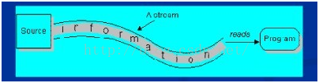

# Java IO 流
一边抄一边总结写下的本文。文中是自己的对于Java IO Stream框架的总体理解。当然大部分是从总体架构上的，很少深入到源码级别。这应该是后面要做的具体事情。

对程序语言设计者来说，创建一个好的输入/输出（I/O）系统是一项艰巨的任务。————Bruce Eckel 《Java编程思想》

I/O带来的挑战不仅仅来自于数据源端和与之通信的接收端（文件，控制台和网络连接等），还要来自于不同的交互方式和他们之间的通信方式（顺序、随机存取、二进制、按字符、按行、按字等）。

Java IO流的实现类都存在于`java.io`包中（当然，这里需要排除`NIO`），本文的分析业主要借助Java 8源码的`java.io`包中的类间关系和类功能来总结Java IO的设计思想。

本文大致分为以下几个部分：

1. 概述
2. 文件
3. Java的流模型
4. 

## 概述
Java的IO通过`java.io`包下的类支持。在`java.io`包下主要包括输入和输出两种流，每种输入和输出流又可以分为两大类 **字节流** 和 **字符流**。 其中字节流以字节为单位处理输入/输出操作，而字节流则以字节为单位处理输入/输出操作。另外，Java的IO设计中使用了装饰器模式，它将IO流分为底层节点流和上层处理流，其中节点流用于和底层的物理存储节点直接关联——不同的物理节点获取节点流的方式可能存在一定的差异，但是Java IO流可以将不同的物理节点流包装成统一的处理流，从而允许程序使用统一的输入/输出操作代码来读取不同物理节点上的数据。

除此之外，在Java的IO中都需要涉及的一点：序列化机制也会提及。

本文将以自顶向下的方式讲述自己对Java IO流的理解。

## 顶层设计概述

|类| 说明|
|:--:|:---:|
|File| 文件类 |
|RandomAccessFile| 随机存取文件类|
|InputStream | 字节输入流 |
|OutputStream | 字节输出流|
|Reader | 字符输入流 |
|Writer | 字符输出流 |

在`java.io`包中最重要的几个顶层设计五个类和一个接口： `File, InputStream, OutputStream, Reader, Writer`和 `Serializable`。

顶层主要的类如下：

1. File（文件特征与管理）：用于文件或者目录的描述信息，例如生成新目录，修改文件名，删除文件，判断文件所在路径等。**注意这是一个扩展定义**。
2. InputStream（二进制格式操作）：抽象类，基于字节的输入操作，是所有字节输入流的父类。定义了所有字节输入流都具有的共同特征。
3. OutputStream（二进制格式操作）：抽象类。基于字节的输出操作，是所有字节输出流的父类。定义了所有字节输出流都具有的共同特征。
4. Reader（文件格式操作）：抽象类，基于字符的输入操作，是所有字符输入流的父类。定义了所有字符输入流都具有的共同特征。
5. Writer（文件格式操作）：抽象类，基于字符的输出操作，是所有字符输入流的父类。定义了所有字符输入流都具有的共同特征。
6. RandomAccessFile（随机文件操作）：一个独立的类，直接继承自Object。它的功能丰富，可以从文件的任意位置进行存取（输入输出）操作。

## 概念与模型

### 流的概念和作用
Java中将输入输出抽象称为流，就好像水管，将两个容器连接起来。流是一组有顺序的，有起点和终点的字节集合，是对数据传输的总称或抽象。即数据在两设备间的传输称为流.
 
### Java IO所采用的模型  
Java的IO模型设计非常优秀，它使用Decorator(装饰者)模式，按功能划分Stream，您可以动态装配这些Stream，以便获得我们需要的功能。例如，我们需要一个具有缓冲的文件输入流，则应当组合使用FileInputStream和BufferedInputStream。 
 
### IO流的分类

- 根据处理数据类型的不同分为：字符流和字节流
- 根据数据流向不同分为：输入流和输出流
- 按数据来源（去向）分类：
	1. File（文件）： FileInputStream, FileOutputStream, FileReader, FileWriter 
    2. byte[]：ByteArrayInputStream, ByteArrayOutputStream 
    3. Char[]: CharArrayReader,CharArrayWriter 
    4. String:StringBufferInputStream, StringReader, StringWriter 
    6. 网络数据流：InputStream,OutputStream, Reader, Writer 

1. 字符流和字节流
流序列中的数据既可以是未经加工的原始二进制数据，也可以是经一定编码处理后符合某种格式规定的特定数据。因此Java中的流分为两种：

- 字节流：数据流中最小的数据单元是字节
- 字符流：数据流中最小的数据单元是字符， Java中的字符是Unicode编码，一个字符占用两个字节。

字符流的由来： Java中字符是采用Unicode标准，一个字符是16位，即一个字符使用两个字节来表示。为此，JAVA中引入了处理字符的流。因为数据编码的不同，而有了对字符进行高效操作的流对象。本质其实就是基于字节流读取时，去查了指定的码表。

2. 输入流和输出流
根据数据的输入、输出方向的不同对而将流分为输入流和输出流。

- **输入流** 程序从输入流读取数据源。数据源包括外界(键盘、文件、网络…)，即是将数据源读入到程序的通信通道

- **输出流** 程序向输出流写入数据。将程序中的数据输出到外界（显示器、打印机、文件、网络…）的通信通道。

采用数据流的目的就是使得输出输入独立于设备。

- 输入流( Input  Stream )不关心数据源来自何种设备（键盘，文件，网络）。
- 输出流( Output Stream )不关心数据的目的是何种设备（键盘，文件，网络）。

### 特性
相对于程序来说，输出流是往存储介质或数据通道写入数据，而输入流是从存储介质或数据通道中读取数据，一般来说关于流的特性有下面几点：

1. 先进先出，最先写入输出流的数据最先被输入流读取到。
2. 顺序存取，可以一个接一个地往流中写入一串字节，读出时也将按写入顺序读取一串字节，不能随机访问中间的数据。（RandomAccessFile可以从文件的任意位置进行存取（输入输出）操作）
3. 只读或只写，每个流只能是输入流或输出流的一种，不能同时具备两个功能，输入流只能进行读操作，对输出流只能进行写操作。在一个数据传输通道中，如果既要写入数据，又要读取数据，则要分别提供两个流

## Java的IO流对象
下面是Java 8源码`java.io`包中提供的有关IO流的主要实现类。

