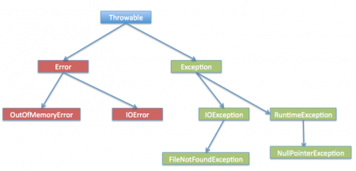

# Java中的异常处理
## 概述
Java中的例外可能在多种情况下发生，这是个十分棘手的问题。但是，十分庆幸的是Java提供了非常强大的例外处理机制。

Java作为一种面向对象的编程语言， 每当执行语句发生错误时就会创建一个异常对象，然后程序的正常流程停止，并且JRE试图找到能够处理异常的人。异常对象中对象中包含很多调试信息，例如方法的层次结构，发生异常的行号，一场类型等。放方法发生异常时，创建异常对象并将其交给运行时环境的过程称为——抛出异常(throw exception)。

运行时一旦接收到一场对象，会尝试查找异常的处理程序。异常处理程序是可以处理异常对象的代码块。查抄一场处理程序的逻辑很简单——在发生错误的方法中开始搜索，如果找不到适当的处理程序，则转到调用方法依次搜索，直到找到异常处理程序或搜索失败。例如，如果方法调用栈是A->B->C并且在方法C中引发异常，那么搜索适当的处理程序将按照C->B->A移动。如果找到适当的异常处理程序，则将异常对象传递给处理程序以处理它。异常处理程序可以被称作异常捕获(catch exception)。如果没有找到适当的异常处理程序，程序将终止并打印异常信息。

注意：Java的异常处理仅仅是一个用于处理运行时错误(runtime error)的框架，编译时错误(compile time error)并不能被异常捕获机制捕获。

## Java异常处理的关键字
Java提供了特定的关键字来处理异常。
- `throw` -- 如果在程序运行过程中发生异常，JVM就会创建一个异常对象，然后Java运行时开始处理该一场。有时我们可能想要在代码中显式生成异常，例如在用户认证程序中，如果密码为空，我们应该向客户端抛出异常。`throw`关键字用于向运行时抛出一个待处理的异常对象。
- `throws` -- 当我们在方法中抛出任何异常而不处理它时，我们需要在方法签名(method signature)中使用`throws`关键字将其传播给它的额调用方法。我们可以在`throws`字句中提供多个异常，它也可以用于`main()`方法。
- `try-catch` -- 我们用`try-catch`块来处理异常。`try`是块的开始，`catch`在`try`块的结尾以处理异常。一个`try`块可以有个多个`catch`块，当然`try-catch`块也可以嵌套。`catch`块需要要一个类型为`Exception`的参数。
- `fianlly` -- `finally`块是可选的，并且只能用于`try-catch`块。由于异常中断了程序正常的执行流程，因此，在此期间某些被打开的资源可能不会关闭，此时可以使用`finally`块。在`try-catch-finally`块中，无论是否发生异常，`finall`块总会被执行。

下列代码展示了它们的用法

```java
import java.io.FileNotFoundException;
import java.io.IOException;

public class ExceptionHandling {
    public static void main(String[] args) throws FileNotFoundException, IOException {
        try{
            testException(-5);
            testException(-10);
        }catch(FileNotFoundException e) {
            e.printStackTrace();
        }catch(IOException e) {
            e.printStackTrance();
        }finally{
            System.out.println("Releasing Resources");
        }

        testException(15);
    }

    public static void testException(int i) throws FileNotFoundException, IOException {
        if(i < 0) {
            FileNotFoundException myException = new FileNotFoundException("Negative Integer " + i);
            throw myException ;
        }else if(i > 10) {
            throw new IOException("Only supported for index 0 to 10");
        }
    }

}

```

输出结果为:

```java
java.io.FileNotFoundException: Negative Integer -5
    at com.journaldev.exceptions.ExceptionHandling.testException(ExceptionHandling.java:24)
    at com.journaldev.exceptions.ExceptionHandling.main(ExceptionHandling.java:10)
Releasing resources
Exception in thread "main" java.io.IOException: Only supported for index 0 to 10
    at com.journaldev.exceptions.ExceptionHandling.testException(ExceptionHandling.java:27)
    at com.journaldev.exceptions.ExceptionHandling.main(ExceptionHandling.java:19)
```

`testException`方法使用`throw`关键字抛出异常，方法签名使用`throws`关键字让调用者知道它可能抛出异常的类型。在`main`方法中，我们使用`main`方法中的`try-catch`块处理异常，当我们没有处理它时，我们使用`main`方法中的 `throw`子句将它传递给运行时。这里需要注意的是，因为异常，`testException(-10)`永远不会被执行。在捕获到异常后直接执行`try-catch`块后的`finally`块。 printStackTrace（）是Exception类中有用的方法之一，用于调试。

- 没有`try`语句，不能有`catch`或`finally`子句。
- `try`语句应该有`catch`块或`finally`块，可以同时有两个块。
- 不能在`try-catch-finally`块之间编写任何代码。
- 一个`try`语句可以有多个`catch`块。
- `try-catch`块可以嵌套类似于if-else语句。
- 一个`try-catch`语句只能有一个`finally`语句块。

## Java异常层次结构(Java Exception Hierarchy)
Java异常时分层的，我们可以从Java异常的继承体系中区分不同类型的异常。`Throwable`是Java异常层次结构的父类，它有两个子对象-- `Error`和`Exception`。`Exception`被进一步划分为检查异常（`Checked Exception`）和 运行时异常（`Runtime Exception`）。如下图所示：



- `Errors` -- 错误（`Error`）是超出一个用范围的特殊情况，无法预测并从中回复，例如硬件故障，JVM崩溃或内存不足错误。这也是将错误的继承体系单独列出的原因，在程序编写过程中，我们不应该处理这些状况。一些常见的错误例如OutOfMemroyError和StackOverflowError。
- `Checked Exceptions` -- 检查异常（`Checked Exception`）是我们可以在程序中预期的例外情况，并可以尝试从例外中恢复，例如`FileNotFoundException`。我们应该捕获这个异常并向用户提供有用的消息并将其正确记录以进行调试。`Exception`是所有`Checked Exception`的父类，如果我们抛出一个检查异常，我们就必须用相同的方法来捕获它，或者必须使用`throws`关键字将它传递给调用者。
- `Runtime Exception` -- 运行时异常（`Runtime Exception`）是由于编程错误导致的，例如试图从Array检索元素。在尝试检索元素之前，我们应该首先检查数组的长度，否则它可能会在运行时抛出`ArrayIndexOutOfBoundException`。`RuntimeException`是所有运行时异常的父类。如果我们在方法中抛出任何运行时异常，则不需要在方法签名抛出子句中指定它们。在编程过程中，我们应该尽量避免运行时异常。

## Throwable的方法
Java异常及其所有子类都不提供任何特定方法，并且所有方法都在基类Throwable中定义。创建异常类是为了指定不同类型的异常情况，以便我们可以根据类型轻松识别根本原因并处理异常。Throwable类实现了可互操作性的Serializable接口。

在Throwable类中定义了一些Java异常处理体系中通用的方法：
- `public String getMessage()` -- This method returns the message String of Throwable and the message can be provided while creating the exception through it’s constructor.
- `public String getLocalizedMessage()` -- This method is provided so that subclasses can override it to provide locale specific message to the calling program. Throwable class implementation of this method simply use getMessage() method to return the exception message.
- `public synchronized Throwable getCause()` -- This method returns the cause of the exception or null id the cause is unknown.
- `public String toString()` -- This method returns the information about Throwable in String format, the returned String contains the name of Throwable class and localized message.
- `public void printStackTrace()` -- This method prints the stack trace information to the standard error stream, this method is overloaded and we can pass PrintStream or PrintWriter as argument to write the stack trace information to the file or stream.

## Java 7自动资源管理和Catch块改进
Java 7 Automatic Resource Management and Catch block Improvement. 如果在单个`try`块中捕获多个异常，我们会发现整个`catch`块非常难看，并且只要由冗余代码组成。Java 7的一个特性就是对`catch`代码块的改进。我们可以在一个`catch`块中捕获多个异常，就像下述代码所示：

```java
catch(IOException | SQLException ex) {
    logger.error(ex);
    throw new NewException(ex.getMessage());
}

```

这个用法是有一些约束的，例如异常对象是`final`的，我们不能在`catch`块中修改它，请阅读[Java 7 Catch Block改进]()中的完整分析。

大多数情况下，我们使用`finally`块来关闭资源，有时我们会忘记关闭它们，并在资源耗尽时获取异常。这些异常很难调试，我们可能需要查看每个使用该类型资源的代码片，以确保我们正确关闭该资源。Java 7的一个改进是`try-with-resources`，我们可以在`try`语句中创建一个资源，并在`try-catch`块中使用它。 当`try-catch`块执行完毕时，运行时环境会自动关闭这些资源。带有这种改进的`try-catch`块的实例是：

```java
try(Resource r = new Resource()){
    System.out.println("Resources");
}catch(Exception e) {
    e.printStackTrace();
}

```
这种特性更加详细的介绍在[Java 7 自动资源管理]()一文中。

## 自定义异常类(Custom Exception Classes)
Java为我们提供了许多异常类，但是有时我们需要创建我们自己的自定义异常类，以通过适当的消息或者我们想要引入的用于跟踪的任何自定义字段来通知调用者，例如错误代码。 例如，假设我们编写一个方法来处理文本文件，所以当发送其他类型的文件作为输入时，我们可以向调用者提供适当的错误代码。

```java
public class MyException extends Exception {

    private static final long serialVersionUID = 4664456874499611218L;
    
    private String errorCode="Unknown_Exception";
    
    public MyException(String message, String errorCode){
        super(message);
        this.errorCode=errorCode;
    }
    
    public String getErrorCode(){
        return this.errorCode;
    }
}


import java.io.FileInputStream;
import java.io.FileNotFoundException;
import java.io.IOException;
import java.io.InputStream;

public class CustomExceptionExample {

    public static void main(String[] args) throws MyException {
        try {
            processFile("file.txt");
        } catch (MyException e) {
            processErrorCodes(e);
        }
    
    }

    private static void processErrorCodes(MyException e) throws MyException {
        switch(e.getErrorCode()){
        case "BAD_FILE_TYPE":
            System.out.println("Bad File Type, notify user");
            throw e;
        case "FILE_NOT_FOUND_EXCEPTION":
            System.out.println("File Not Found, notify user");
            throw e;
        case "FILE_CLOSE_EXCEPTION":
            System.out.println("File Close failed, just log it.");
            break;
        default:
            System.out.println("Unknown exception occured, lets log it for further debugging."+e.getMessage());
            e.printStackTrace();
        }
    }

    private static void processFile(String file) throws MyException {       
        InputStream fis = null;
        try {
            fis = new FileInputStream(file);
        } catch (FileNotFoundException e) {
            throw new MyException(e.getMessage(),"FILE_NOT_FOUND_EXCEPTION");
        }finally{
            try {
                if(fis !=null)fis.close();
            } catch (IOException e) {
                throw new MyException(e.getMessage(),"FILE_CLOSE_EXCEPTION");
            }
        }
    }

}

```
如上述代码所示，我们可以有一个单独的方法来处理不同类型的错误代码，我们可以从不同的方法中获取错误代码。由于，我们可能不想返回给用户，其中一些方法会消耗殆尽。但是，另外一个错误代码，我们会返回给用户向用户展示问题。

在这里，我们扩展了Exception, 以便每当产生这个异常时，它必须在方法中处理或返回给调用者，如果我们扩展RuntimeException,则不需要再throws子句中指定它。 这是一个设计决策，通过这种方式，当调用任何方法时，我们都知道会出现什么异常，并采取适当的措施来处理它们。

## 最佳实践(Best Practice)
- 运用特定异常（Use Specific Exception） -- Exception继承体系的基类没有提供任何有用的信息，这也是为什么Java有这么多的异常类，例如IOException, FileNotFoundException, EOFException等等。我们应该尽可能尝试抛出特定的异常类，以便调用者能够非常容易的判断异常发生的根本原因并对其进行处理。
- 提前或快速失败（Throw Early or Fail-Fast） -- 在编程过程中，我们应该尽可能早的抛出异常。
- 延迟捕获（Catch Late） --  由于java强制要么处理检查的异常，要么在方法签名中声明它，有时开发人员往往会捕获异常并记录错误。但是这种做法是有害的，因为调用者程序没有得到异常通知。 只有当我们能够适当地处理时，我们才应该抓住例外。例如，在上面的方法中，我将异常抛回到调用方法来处理它。其他应用程序可能会用同样的方法来处理异常。在实现任何功能时，我们应该总是将异常抛回给调用者，让他们决定如何处理它。
- 关闭资源（Closing Resources） -- 由于异常会停止程序的执行，我们应该在`finally`子句中所有资源，或者使用Java 7 try-with-resources enhancement 功能让运行时关闭资源。
- 记录异常（Logging Exceptions） -– 我们应该总是记录异常消息，并在抛出异常时提供清晰的消息，以便调用者轻松知道异常发生的原因。我们应该总是避免只使用异常的空catch块，并且不会提供任何有意义的调试异常细节。
- 单Catch块捕获多个异常（Single catch block for multiple exceptions） -– 大多数情况下，我们会记录异常细节并向用户提供消息，在这种情况下，我们应该使用java 7功能来处理单个catch块中的多个异常。这种方法会减少我们的代码大小，并且它看起来也更干净。
- 运用自定义异常（Using Custom Exceptions） – 在设计时定义异常处理策略总是更好，而不是抛出和捕获多个异常，我们可以用错误代码创建自定义异常，并且调用者程序可以处理这些错误代码。创建实用程序方法来处理不同的错误代码并使用它也是一个好主意。
- Naming Conventions and Packaging – When you create your custom exception, make sure it ends with Exception so that it will be clear from name itself that it’s an exception. Also make sure to package them like it’s done in JDK, for example IOException is the base exception for all IO operations.
- Use Exceptions Judiciously – Exceptions are costly and sometimes it’s not required to throw exception at all and we can return a boolean variable to the caller program to indicate whether an operation was successful or not. This is helpful where the operation is optional and you don’t want your program to get stuck because it fails. For example, while updating the stock quotes in database from a third party webservice, we may want to avoid throwing exception if the connection fails.
- Document the Exceptions Thrown – Use javadoc @throws to clearly specify the exceptions thrown by the method, it’s very helpful when you are providing an interface to other applications to use.


翻译自[Exception Handling in Java](https://www.journaldev.com/1696/exception-handling-in-java?utm_source=website&utm_medium=sidebar&utm_campaign=RecommendedTutorials-Sidebar-Widget)

