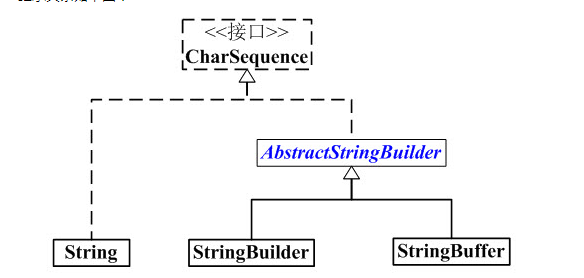

# Java字符串（String、StringBuffer & StringBuilder）
字符串对象或者其等价对象（例如char数组），在内存中总是占据最大空间块，因此如何高效地处理字符串是提供系统整体性能的关键。在Java语言中有三个用于处理字符串的常用实现类`String`，`StringBuilder`和`StringBuffer` ，分别有以下特点：
- String 字符串常量
- StringBuffer 字符串变量（线程安全）
- StringBuilder 字符串变量（非线程安全）

它们的类继承体系如下图所示：



查看三个类的API会发现，`String`、`StringBuilder`和`StringBuffer`都实现了`CharSequence`接口。他们都可以认为是char数组的延伸和进一步封装，主要有三个部分组: `char数组`、`偏移量`、`字符串长度`。`char数组`表示字符串对象的内容，它是字符串对象所表示字符串的超集。字符串对象的真实内容需要由偏移量和长度在这个`char数组`中进行定位和截取。虽然，他们底层的实现机制类似，但是处理机制不同。
- String  -- 是不可变量，即创建后就不能再修改
- StringBuilder -- 是一个可变字符序列，它与String一样，在内存中保存的都是一个有序的字符序列(char类型的数组)，不同点是StringBuilder对象的值都是可变的。
- StringBuffer: 与StringBuilder基本相同，不同的是StringBuffer是线程安全的，它几乎对所有的方法都实现了线程同步，StringBuilder是非线程安全。

以下是测试结果：

```java
public class TestString {

    public static long executeStringAppend(int num) {
        String text = "";
        long beginTime = System.currentTimeMillis();

        for (int i = 0; i < num; i++) {
            text = text + i;
        }

        long endTime = System.currentTimeMillis();

        return endTime - beginTime;
    }

    public static long executeStringBuilderAppend(int num) {
        StringBuilder sb = new StringBuilder();
        long beginTime = System.currentTimeMillis();
        for(int i = 0; i < num; i ++) {
            sb.append(i);
        }
        long endTime = System.currentTimeMillis();
        return endTime - beginTime;
    }
    
    public static long executeStringBufferAppend(int num) {
        StringBuffer sb = new StringBuffer();
        long beginTime = System.currentTimeMillis();
        for(int i = 0; i < num; i ++) {
            sb.append(i);
        }
        long endTime = System.currentTimeMillis();
        return endTime - beginTime;
    }
    
    public static void main(String[] args) {
        
        System.out.println("**************Test 1000 Times");
        System.out.println("Executing String Append Time = " + executeStringAppend(1000));
        System.out.println("Executing StringBuilder Append Time = " + executeStringBuilderAppend(1000));
        System.out.println("Executing StringBuffer Append Time = " + executeStringBufferAppend(1000));
        
        
        System.out.println("**************Test 10000 Times");
        System.out.println("Executing String Append Time = " + executeStringAppend(10000));
        System.out.println("Executing StringBuilder Append Time = " + executeStringBuilderAppend(10000));
        System.out.println("Executing StringBuffer Append Time = " + executeStringBufferAppend(10000));
        
        System.out.println("**************Test 100000 Times");
        System.out.println("Executing String Append Time = " + executeStringAppend(100000));
        System.out.println("Executing StringBuilder Append Time = " + executeStringBuilderAppend(100000));
        System.out.println("Executing StringBuffer Append Time = " + executeStringBufferAppend(100000));
        
        
        System.out.println("**************Test 1000000 Times");
//      System.out.println("Executing String Append Time = " + executeStringAppend(1000000));
        System.out.println("Executing StringBuilder Append Time = " + executeStringBuilderAppend(1000000));
        System.out.println("Executing StringBuffer Append Time = " + executeStringBufferAppend(1000000));
        
        System.out.println("**************Test 10000000 Times");
//      System.out.println("Executing String Append Time = " + executeStringAppend(10000000));
        System.out.println("Executing StringBuilder Append Time = " + executeStringBuilderAppend(10000000));
        System.out.println("Executing StringBuffer Append Time = " + executeStringBufferAppend(10000000));
        
    }
}

//结果：
**************Test 1000 Times
Executing String Append Time = 4
Executing StringBuilder Append Time = 0
Executing StringBuffer Append Time = 0
**************Test 10000 Times
Executing String Append Time = 159
Executing StringBuilder Append Time = 0
Executing StringBuffer Append Time = 1
**************Test 100000 Times
Executing String Append Time = 17292
Executing StringBuilder Append Time = 4
Executing StringBuffer Append Time = 4
**************Test 1000000 Times
Executing StringBuilder Append Time = 26
Executing StringBuffer Append Time = 29
**************Test 10000000 Times
Executing StringBuilder Append Time = 242
Executing StringBuffer Append Time = 281

```


