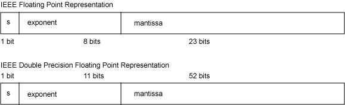

# Java中的浮点数比较 ==、equals和compare
Java浮点数比较过程中的精度丢失问题，导致double、float类型数据进行同类型或不同类型数据比较时要慎重对待。

介绍一下基本知识：

### 类型提升(Type Promotion)
Java中几种基本数值类型进行比较(`==或!=运算`)运算时会发生，进行的自动类型转换。如果运算符两侧的元素类型不同，首先会进行类型提升(Type Promotion),规则如下：
1. 如果运算符两侧任意一个元素的类型为`double`,则另外一个元素会默认进行类型提升为`double` 
2. 否则，如果运算符两侧任意一个元素的类型为'float'，则另外一个元素的类型默认自动提升为`float` 
3. 否则， 如果运算符两侧任意一个元素的类型为'long',则另外一个元素的类型默认自动提升为'long'
4. 否则两侧都会自动转换为`int`

详情请见[JavaSE官方文档](https://docs.oracle.com/javase/specs/jls/se8/html/jls-5.html#jls-5.6.2)

### 舍入误差(Round-Off Error)
根据IEEE 754标准，单精度浮点数`float`为32位，双精度浮点数`double`为64位，如下图所示：



其中，第一部分(s)为符号位，第二部分(exponent)为指数位，第三部分(mantissa)为基数部分。 这是科学计数法的二进制表示。

一方面，既然位数是固定的，要表示像 1/3=0.3333333333333...或者pi=3.1415926..... 这样的无限循环小数，就变得不可能了。根据规范，则需要将不能标识的部分舍掉。另一方面，与10进制不同的是，二进制对于一些有限的小数，也不能精确的标示。比如像0.1这样的小数，用二进制也无法精确表示。所以，也需要舍掉。

关于0.1无法用二进制精确表示，可以参见文章： [http://en.wikipedia.org/wiki/Floating_point](http://en.wikipedia.org/wiki/Floating_point)

### 舍入误差的出现
看几个例子：

`0.1`单精度浮点数的二进制表示
```java
System.out.println(Integer.toBinaryString(Float.floatToIntBits(0.1f)));  
//111101110011001100110011001101
```

`0.1`双精度浮点数的二进制表示
```java
System.out.println(Long.toBinaryString(Double.doubleToLongBits(0.1d)));
//11111110111001100110011001100110011001100110011001100110011010
```

`0.1`从单精度浮点数进行类型提升至双精度浮点数：
```java
System.out.println(Long.toBinaryString(Double.doubleToLongBits(0.1f)));  
//11111110111001100110011001100110100000000000000000000000000000
```


### == 运算符判断
我们可以看到进行类型提升后，二进制表示时数值大小已经发生变化。因此，下面判断返回结果为`false`，也就理所应当了。
```java
System.out.println(0.1d == 0.1f);  
//false
System.out.println(0.1d == (double) 0.1f);  
//false
```

### equals方法判断
下列测试
```java
Double a = Double.valueOf("0.0");  
Double b = Double.valueOf("-0.0");  
System.out.println(a.equals(b)); 
//false
System.out.println(Double.valueOf(-0.0).equals(Double.valueOf(0.0)));
//false
System.out.println(Double.valueOf(0.0).equals(Double.valueOf(0.0)));
//true
```
经过一系列运算得到上述两个结果，进行判断时发现只有一半的情况可以判等。

更多的测试：

```java
Double a = Math.sqrt(-1.0);  
Double b = 0.0d / 0.0d;  
Double c = a + 200.0d;  
Double d = b + 1.0d;  
System.out.println(a.equals(b));  
//true
System.out.println(b.equals(c));  
//true
System.out.println(c.equals(d)); 
//true
```
在Java里面，a和b表示为NaN(Not a Number)，既然不是数字，就无法比较。非常重要的一点是 **equals方法是比较2个对象是否等值，而不是对象的值是否相等，所以equals方法设计的初衷根本就不是用来做数值比较的**。一定不能乱用判断。

### compareTo比较
虽然说它在设计上是用于数值比较的，但它表现跟equals方法一模一样——对于NaN和0.0与-0.0的比较上面。另外，由于舍入误差的存在，也可能会导致浮点数经过一些运算后，结果会有略微不同。所以最好还是不要直接用Float.compareTo和Double.compareTo方法。


## 结论
在进行浮点数比较的时候，主要需要考虑3个因素：
- NaN
- 无穷大/无穷小
- 舍入误差

NaN和无穷出现的可能场景如下：

| 表达式 | 运算结果  |
| :----------------------|:----------|
| Math.sqrt(-1.0)        | NaN       |
| 0.0/0.0                | NaN       |
| 1.0/0.0                | Infinity  |
| -1.0/0.0               | -Infinity |
| NaN + 1.0              | NaN       |  
| Infinity + 1.0         | Infinity  |
| Infinity + Infinity    | Infinity  |
| NaN > 1.0              | false     |
| NaN == 1.0             | false     |
| NaN < 1.0              | false     |
| NaN == NaN             | false     |
| 0.0 == -0.01           | true      |

因此，比较浮点数大小，需要做到：
1. 排除NaN和无穷
2. 在精度范围内比较

```java
public boolean isEqual(double a, double b) {  
    if (Double.isNaN(a) || Double.isNaN(b) || Double.isInfinite(a) || Double.isInfinite(b)) {  
        return false;  
    }  
    return (a - b) < 0.001d;  
}  
```

进行跨精度比较时注意舍入精度。

另外，金融计算中可以使用BigDecimal进行比较。

## 引用
[http://www.radford.edu/aaray/ITEC_352/Lectures_files/ITEC352-Lecture08.pptx](http://www.radford.edu/aaray/ITEC_352/Lectures_files/ITEC352-Lecture08.pptx)

[http://docs.oracle.com/javase/specs/jls/se8/html/jls-5.html#jls-5.6.2](http://docs.oracle.com/javase/specs/jls/se8/html/jls-5.html#jls-5.6.2)

[http://docs.oracle.com/javase/specs/jls/se8/html/jls-15.html#jls-15.21.1](http://docs.oracle.com/javase/specs/jls/se8/html/jls-15.html#jls-15.21.1)