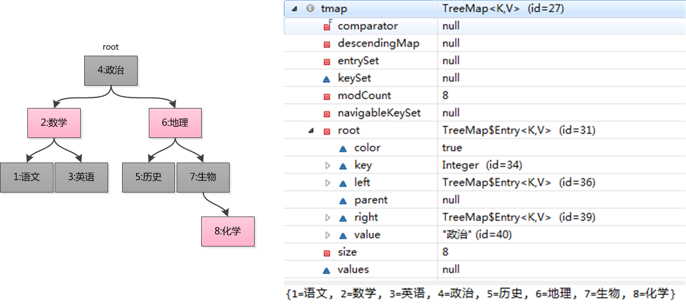

# JavaCollection之TreeMap工作原理与实现
TreeMap以红黑树结构为基础，实现了SortedMap接口，能够把它存储的记录根据键排序，按照默认按键值的升序排序，也可以指定排序比较器。当使用Iterator遍历TreeMap元素时，得到的是排序后的记录。在使用TreeMap时，Key对象必须实现Comparable接口或者在构造时传入自定义构造器(Comparator),否则会抛出`java.lang.ClassCastException`类型的异常。 

官方文档描述了TreeMap的基本功能与性能:

A Red-Black tree based NavigableMap implementation. The map is sorted according to the natural ordering of its keys, or by a Comparator provided at map creation time, depending on which constructor is used.
This implementation provides guaranteed log(n) time cost for the containsKey, get, put and remove operations. Algorithms are adaptations of those in Cormen, Leiserson, and Rivest’s Introduction to Algorithms.

## TreeMap定义
```java
public class TreeMap<K,V>
    extends AbstractMap<K,V>
    implements NavigableMap<K,V>, Cloneable, java.io.Serializable{}
```
 TreeMap继承AbstractMap，实现NavigableMap、Cloneable、Serializable三个接口。其中AbstractMap表明TreeMap为一个Map即支持key-value的集合，[NavigableMap](https://docs.oracle.com/javase/8/docs/api/java/util/NavigableMap.html)这意味着它支持一系列的导航方法，具备针对给定搜索目标返回最接近匹配项的导航方法 。

 我们知道，HashMap不会保证数据有序，LinkedHashMap保持元素的插入序，当我们希望Map可以根据Key大小排序时，可是使用TreeMap。如如下示例代码：

```java
TreeMap<Integer, String> tmap = new TreeMap<Integer, String>();
tmap.put(1, "语文");
tmap.put(3, "英语");
tmap.put(2, "数学");
tmap.put(4, "政治");
tmap.put(5, "历史");
tmap.put(6, "地理");
tmap.put(7, "生物");
tmap.put(8, "化学");
for(Entry<Integer, String> entry : tmap.entrySet()) {
    System.out.println(entry.getKey() + ": " + entry.getValue());
}
```
我们通过分析TreeMap源代码，得出下列逻辑结构：



上图中左侧为数据的组织结构，右侧为断点调试结果(Eclipse调试)。

## TreeMap迭代有序
TreeMap是如何保证其迭代输出是有序的呢？其实从宏观上来讲，就相当于树的中序遍历(LDR)。我们先看一下迭代输出的步骤

```java
for(Entry<Integer, String> entry : tmap.entrySet()) {
    System.out.println(entry.getKey() + ": " + entry.getValue());
}
```
根据[The enhanced for statement](https://docs.oracle.com/javase/specs/jls/se8/html/jls-14.html#jls-14.14.2)，for语句会做如下转换为：
```java
for(Iterator<Map.Entry<String, String>> it = tmap.entrySet().iterator() ; tmap.hasNext(); ) {
    Entry<Integer, String> entry = it.next();
    System.out.println(entry.getKey() + ": " + entry.getValue());
}
```
在`it.next()`的调用中会使用`nextEntry`调用`successor`这个是过的后继的重点，具体实现如下：
```java
static <K,V> TreeMap.Entry<K,V> successor(Entry<K,V> t) {
    if (t == null)
        return null;
    else if (t.right != null) {
        // 有右子树的节点，后继节点就是右子树的“最左节点”
        // 因为“最左子树”是右子树的最小节点
        Entry<K,V> p = t.right;
        while (p.left != null)
            p = p.left;
        return p;
    } else {
        // 如果右子树为空，则寻找当前节点所在左子树的第一个祖先节点
        // 因为左子树找完了，根据LDR该D了
        Entry<K,V> p = t.parent;
        Entry<K,V> ch = t;
        // 保证左子树
        while (p != null && ch == p.right) {
            ch = p;
            p = p.parent;
        }
        return p;
    }
}
```
successor后继的理解。其本质就是中序遍历，`L-D-R`。具体细节如下：

a. 空节点，没有后继
b. 有右子树的节点，后继就是右子树的“最左节点”
c. 无右子树的节点，后继就是该节点所在左子树的第一个祖先节点


## 基本操作PUT和GET
GET方法：get函数则相对来说比较简单，以log(n)的复杂度进行get
```java
final Entry<K,V> getEntry(Object key) {
    // Offload comparator-based version for sake of performance
    if (comparator != null)
        return getEntryUsingComparator(key);
    if (key == null)
        throw new NullPointerException();
    @SuppressWarnings("unchecked")
        Comparable<? super K> k = (Comparable<? super K>) key;
    Entry<K,V> p = root;
        // 按照二叉树搜索的方式进行搜索，搜到返回
    while (p != null) {
        int cmp = k.compareTo(p.key);
        if (cmp < 0)
            p = p.left;
        else if (cmp > 0)
            p = p.right;
        else
            return p;
    }
    return null;
}
 
public V get(Object key) {
    Entry<K,V> p = getEntry(key);
    return (p==null ? null : p.value);
}
```

官方API对于PUT方法的描述：

Associates the specified value with the specified key in this map.If the map previously contained a mapping for the key, the old value is replaced.

在TreeMap的put()的实现方法中主要分为两个步骤，第一：构建排序二叉树，第二：平衡二叉树。对于排序二叉树的创建，其添加节点的过程如下：
1. 以根节点为初始节点进行检索。
2. 与当前节点进行比对，若新增节点值较大，则以当前节点的右子节点作为新的当前节点。否则以当前节点的左子节点作为新的当前节点。
3. 循环递归2步骤知道检索出合适的叶子节点为止。
4. 将新增节点与3步骤中找到的节点进行比对，如果新增节点较大，则添加为右子节点；否则添加为左子节点。

按照这个步骤我们就可以将一个新增节点添加到排序二叉树中合适的位置。如下：
```java
public V put(K key, V value) {  
   //用t表示二叉树的当前节点  
    Entry<K,V> t = root;  
    //t为null表示一个空树，即TreeMap中没有任何元素，直接插入  
    if (t == null) {  
        //比较key值，个人觉得这句代码没有任何意义，空树还需要比较、排序？  
        compare(key, key); // type (and possibly null) check  
        //将新的key-value键值对创建为一个Entry节点，并将该节点赋予给root  
        root = new Entry<>(key, value, null);  
        //容器的size = 1，表示TreeMap集合中存在一个元素  
        size = 1;  
        //修改次数 + 1  
        modCount++;  
        return null;  
    }  
    int cmp;     //cmp表示key排序的返回结果  
    Entry<K,V> parent;   //父节点  
    // split comparator and comparable paths  
    Comparator<? super K> cpr = comparator;    //指定的排序算法  
    //如果cpr不为空，则采用既定的排序算法进行创建TreeMap集合  
    if (cpr != null) {  
        do {  
            parent = t;      //parent指向上次循环后的t  
            //比较新增节点的key和当前节点key的大小  
            cmp = cpr.compare(key, t.key);  
            //cmp返回值小于0，表示新增节点的key小于当前节点的key，则以当前节点的左子节点作为新的当前节点  
            if (cmp < 0)  
                t = t.left;  
            //cmp返回值大于0，表示新增节点的key大于当前节点的key，则以当前节点的右子节点作为新的当前节点  
            else if (cmp > 0)  
                t = t.right;  
            //cmp返回值等于0，表示两个key值相等，则新值覆盖旧值，并返回新值  
            else  
                return t.setValue(value);  
        } while (t != null);  
    }  
    //如果cpr为空，则采用默认的排序算法进行创建TreeMap集合  
    else {  
        if (key == null)     //key值为空抛出异常  
            throw new NullPointerException();  
        /* 下面处理过程和上面一样 */  
        Comparable<? super K> k = (Comparable<? super K>) key;  
        do {  
            parent = t;  
            cmp = k.compareTo(t.key);  
            if (cmp < 0)  
                t = t.left;  
            else if (cmp > 0)  
                t = t.right;  
            else  
                return t.setValue(value);  
        } while (t != null);  
    }  
    //将新增节点当做parent的子节点  
    Entry<K,V> e = new Entry<>(key, value, parent);  
    //如果新增节点的key小于parent的key，则当做左子节点  
    if (cmp < 0)  
        parent.left = e;  
    //如果新增节点的key大于parent的key，则当做右子节点  
    else  
        parent.right = e;  
    /*  
     *  上面已经完成了排序二叉树的的构建，将新增节点插入该树中的合适位置  
     *  下面fixAfterInsertion()方法就是对这棵树进行调整、平衡，具体过程参考上面的五种情况  
     */  
    fixAfterInsertion(e);  
    //TreeMap元素数量 + 1  
    size++;  
    //TreeMap容器修改次数 + 1  
    modCount++;  
    return null;  
}  

```
上面代码中`do{}`代码块是实现排序二叉树的核心算法，通过该算法我们可以确认新增节点在该树的正确位置。找到正确位置后将插入即可，这样做了其实还没有完成，因为我知道`TreeMap`的底层实现是红黑树，红黑树是一棵平衡排序二叉树，普通的排序二叉树可能会出现失衡的情况，所以下一步就是要进行调整。`fixAfterInsertion(e)`; 调整的过程务必会涉及到红黑树的左旋、右旋、着色三个基本操作。

```java
/** 
* 新增节点后的修复操作 
* x 表示新增节点 
*/  
private void fixAfterInsertion(Entry<K,V> x) {  
    x.color = RED;    //新增节点的颜色为红色  

    //循环 直到 x不是根节点，且x的父节点不为红色  
    while (x != null && x != root && x.parent.color == RED) {  
        //如果X的父节点（P）是其父节点的父节点（G）的左节点  
        if (parentOf(x) == leftOf(parentOf(parentOf(x)))) {  
            //获取X的叔节点(U)  
            Entry<K,V> y = rightOf(parentOf(parentOf(x)));  
            //如果X的叔节点（U） 为红色（情况三）  
            if (colorOf(y) == RED) {       
                //将X的父节点（P）设置为黑色  
                setColor(parentOf(x), BLACK);  
                //将X的叔节点（U）设置为黑色  
                setColor(y, BLACK);  
                //将X的父节点的父节点（G）设置红色  
                setColor(parentOf(parentOf(x)), RED);  
                x = parentOf(parentOf(x));  
            }  
            //如果X的叔节点（U为黑色）；这里会存在两种情况（情况四、情况五）  
            else {     
                //如果X节点为其父节点（P）的右子树，则进行左旋转（情况四）  
                if (x == rightOf(parentOf(x))) {  
                    //将X的父节点作为X  
                    x = parentOf(x);  
                    //右旋转  
                    rotateLeft(x);  
                }  
                //（情况五）  
                //将X的父节点（P）设置为黑色  
                setColor(parentOf(x), BLACK);  
                //将X的父节点的父节点（G）设置红色  
                setColor(parentOf(parentOf(x)), RED);  
                //以X的父节点的父节点（G）为中心右旋转  
                rotateRight(parentOf(parentOf(x)));  
            }  
        }  
        //如果X的父节点（P）是其父节点的父节点（G）的右节点  
        else {  
            //获取X的叔节点（U）  
            Entry<K,V> y = leftOf(parentOf(parentOf(x)));  
          //如果X的叔节点（U） 为红色（情况三）  
            if (colorOf(y) == RED) {  
                //将X的父节点（P）设置为黑色  
                setColor(parentOf(x), BLACK);  
                //将X的叔节点（U）设置为黑色  
                setColor(y, BLACK);  
                //将X的父节点的父节点（G）设置红色  
                setColor(parentOf(parentOf(x)), RED);  
                x = parentOf(parentOf(x));  
            }  
          //如果X的叔节点（U为黑色）；这里会存在两种情况（情况四、情况五）  
            else {  
                //如果X节点为其父节点（P）的右子树，则进行左旋转（情况四）  
                if (x == leftOf(parentOf(x))) {  
                    //将X的父节点作为X  
                    x = parentOf(x);  
                   //右旋转  
                    rotateRight(x);  
                }  
                //（情况五）  
                //将X的父节点（P）设置为黑色  
                setColor(parentOf(x), BLACK);  
                //将X的父节点的父节点（G）设置红色  
                setColor(parentOf(parentOf(x)), RED);  
                //以X的父节点的父节点（G）为中心右旋转  
                rotateLeft(parentOf(parentOf(x)));  
            }  
        }  
    }  
    //将根节点G强制设置为黑色  
    root.color = BLACK;  
}  
```

对这段代码的研究我们发现,其处理过程完全符合红黑树新增节点的处理过程。所以在看这段代码的过程一定要对红黑树的新增节点过程有了解。在这个代码中还包含几个重要的操作。`左旋(rotateLeft())`、`右旋（rotateRight()）`、`着色（setColor()）`。

**左旋：rotateLeft()**

所谓左旋转，就是将新增节点（N）当做其父节点（P），将其父节点P当做新增节点（N）的左子节点。即：`G.left ---> N ,N.left ---> P`。

```java
private void rotateLeft(Entry<K,V> p) {  
    if (p != null) {  
        //获取P的右子节点，其实这里就相当于新增节点N（情况四而言）  
        Entry<K,V> r = p.right;  
        //将R的左子树设置为P的右子树  
        p.right = r.left;  
        //若R的左子树不为空，则将P设置为R左子树的父亲  
        if (r.left != null)  
            r.left.parent = p;  
        //将P的父亲设置R的父亲  
        r.parent = p.parent;  
        //如果P的父亲为空，则将R设置为跟节点  
        if (p.parent == null)  
            root = r;  
        //如果P为其父节点（G）的左子树，则将R设置为P父节点(G)左子树  
        else if (p.parent.left == p)  
            p.parent.left = r;  
        //否则R设置为P的父节点（G）的右子树  
        else  
            p.parent.right = r;  
        //将P设置为R的左子树  
        r.left = p;  
        //将R设置为P的父节点  
        p.parent = r;  
    }  
}  
```

**右旋：rotateRight()**
所谓右旋转即，P.right ---> G、G.parent ---> P。

```java
private void rotateRight(Entry<K,V> p) {  
    if (p != null) {  
        //将L设置为P的左子树  
        Entry<K,V> l = p.left;  
        //将L的右子树设置为P的左子树  
        p.left = l.right;  
        //若L的右子树不为空，则将P设置L的右子树的父节点  
        if (l.right != null)   
            l.right.parent = p;  
        //将P的父节点设置为L的父节点  
        l.parent = p.parent;  
        //如果P的父节点为空，则将L设置根节点  
        if (p.parent == null)  
            root = l;  
        //若P为其父节点的右子树，则将L设置为P的父节点的右子树  
        else if (p.parent.right == p)  
            p.parent.right = l;  
        //否则将L设置为P的父节点的左子树  
        else   
            p.parent.left = l;  
        //将P设置为L的右子树  
        l.right = p;  
        //将L设置为P的父节点  
        p.parent = l;  
    }  
}  
```

**着色SetColor()**
着色就是改变该节点的颜色，在红黑树中，它是依靠节点的颜色来维持平衡的。
```java
private static <K,V> void setColor(Entry<K,V> p, boolean c) {  
    if (p != null)  
        p.color = c;  
} 
```

