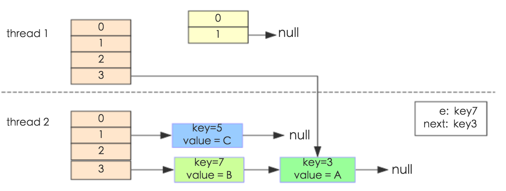

# Java Collection之深入理解HashMap
通过[`Map`](./Java集合之Map.md)，我们知道`HashMap`根据键的`hashCode`值存储数据，大多数情况下可以直接定位到它的值，因而具有很快的访问速度，但遍历顺序却是不确定的。 `HashMap`最多只允许一条记录的键为`null`，允许多条记录的值为`null`。`HashMap`非线程安全，即任一时刻可以有多个线程同时写`HashMap`，可能会导致数据的不一致。如果需要满足线程安全，可以用 `Collections`的`synchronizedMap`方法使`HashMap`具有线程安全的能力，或者使用`ConcurrentHashMap`。下面是JDK 8官方文档对HashMap给出的详细描述:

`
Hash table based implementation of the Map interface. This implementation provides all of the optional map operations, and permits null values and the null key. (The HashMap class is roughly equivalent to Hashtable, except that it is unsynchronized and permits nulls.) This class makes no guarantees as to the order of the map; in particular, it does not guarantee that the order will remain constant over time. 

This implementation provides constant-time performance for the basic operations (get and put), assuming the hash function disperses the elements properly among the buckets. Iteration over collection views requires time proportional to the "capacity" of the HashMap instance (the number of buckets) plus its size (the number of key-value mappings). Thus, it's very important not to set the initial capacity too high (or the load factor too low) if iteration performance is important. 

An instance of HashMap has two parameters that affect its performance: initial capacity and load factor. The capacity is the number of buckets in the hash table, and the initial capacity is simply the capacity at the time the hash table is created. The load factor is a measure of how full the hash table is allowed to get before its capacity is automatically increased. When the number of entries in the hash table exceeds the product of the load factor and the current capacity, the hash table is rehashed (that is, internal data structures are rebuilt) so that the hash table has approximately twice the number of buckets. 

As a general rule, the default load factor (.75) offers a good tradeoff between time and space costs. Higher values decrease the space overhead but increase the lookup cost (reflected in most of the operations of the HashMap class, including get and put). The expected number of entries in the map and its load factor should be taken into account when setting its initial capacity, so as to minimize the number of rehash operations. If the initial capacity is greater than the maximum number of entries divided by the load factor, no rehash operations will ever occur. 

If many mappings are to be stored in a HashMap instance, creating it with a sufficiently large capacity will allow the mappings to be stored more efficiently than letting it perform automatic rehashing as needed to grow the table. Note that using many keys with the same hashCode() is a sure way to slow down performance of any hash table. To ameliorate impact, when keys are Comparable, this class may use comparison order among keys to help break ties. 

Note that this implementation is not synchronized. If multiple threads access a hash map concurrently, and at least one of the threads modifies the map structurally, it must be synchronized externally. (A structural modification is any operation that adds or deletes one or more mappings; merely changing the value associated with a key that an instance already contains is not a structural modification.) This is typically accomplished by synchronizing on some object that naturally encapsulates the map. If no such object exists, the map should be "wrapped" using the Collections.synchronizedMap method. This is best done at creation time, to prevent accidental unsynchronized access to the map:

```java
Map m = Collections.synchronizedMap(new HashMap(...));
```
The iterators returned by all of this class's "collection view methods" are fail-fast: if the map is structurally modified at any time after the iterator is created, in any way except through the iterator's own remove method, the iterator will throw a ConcurrentModificationException. Thus, in the face of concurrent modification, the iterator fails quickly and cleanly, rather than risking arbitrary, non-deterministic behavior at an undetermined time in the future. 

Note that the fail-fast behavior of an iterator cannot be guaranteed as it is, generally speaking, impossible to make any hard guarantees in the presence of unsynchronized concurrent modification. Fail-fast iterators throw ConcurrentModificationException on a best-effort basis. Therefore, it would be wrong to write a program that depended on this exception for its correctness: the fail-fast behavior of iterators should be used only to detect bugs. 
`
我们知道`HashMap`其实是抽象数据结构符号表（Symbol Table）的一种实现。符号表是一种存储键值对的数据结构，支持两种最基本的操作:`插入（put）`，即将一组新的键值对存入表中；`查找（get）`，即根据给定的键得到相应的值。下文，我将主要结合源码，从存储结构、常用方法分析、扩容以及安全性等方面深入分析HashMap的工作原理。

## 存储结构
从逻辑存储结构上来讲，HashMap是`数组+链表/红黑树`（JDK1.8中添加了红黑树部分）实现的，如下图所示：


我们主要从以下两个方面分析HashMap的存储结构： 数据是如何组织的？这样的组织结构有什么好处？

从JDK 1.8源代码可知，`HashMap`类中有一个非常重要的字段——`Node[] table`，也就是`哈希桶数组`。定义`Node`元素的源代码实现如下：

```java
/**
 * 在这个内部类定义过程中final的用法，还没有弄明白？待续
 */
static class Node<K, V> implements Map.Entry<K, V> {
    final int hash; // 用于定位索引位置
    final K key;
    V value;
    Node<V, V> next; //链表的下一个元素指针

    Node(int hash, K key, V value, Node<K, V> next) { ... }
    public final K getKey(){ ... }
    public final V getValue(){ ... }
    public final String toString(){ ... }
    public final int hashCode(){ ... }
    public final V setValue(V newValue){ ... }
    public final boolean equals(Object o) { ... }
}

```
阅读源代码，我们知道，`Node`是`HashMap`的内部类，实现了`Map.Entry<K, V>`接口，本质上定义了一个键值对(Key-Value)。上图中的黑色圆点代表了`Node`对象。也就是说，`HashMap`底层的基本存储结构是`哈希表`。

我们知道使用哈希表的方式组织数据，有两个十分重要的点需要关注：（1）如何解决哈希冲突；（2）设定哈希表的负载因子。为了解决哈希冲突，哈希表可以采用`开放地址法`和`链地址法`等来解决问题。Java的`HashMap`采用链地址法解决哈希冲突。简单来说，链地址法就是数组加链表的组合。桶数组中每个索引位置都是一个元素链表的表头，当元素被Hash后，得到桶数组索引值，然后将元素放置在桶数组对应索引位置为表头的链表中。例如
```java
map.put("哈哈","哈哈哈哈");
```
执行`put`操作时，系统首先执行键Key的`hashCode()`方法调用得到键“哈哈”的散列值，然后通过哈希算法的后后两步运算（高位运算和取模运算，下文有介绍）来定位该键值对应的在桶数组中的存储位置。但是，某些情况下，由于Hash算法问题，某两个Key会定位到相同的位置，这就发生Hash碰撞。我们当然希望不同的Key值经过Hash算法碰撞的概率越小越好，甚至不会发生碰撞，这样Map的存取效率就会达到最好。但事实上，这几乎是不可能实现的。

我们知道，哈希桶数组越大，即使使用较差的Hash算法，元素的分布也会比较分散；但是哈希桶数组越小，即使使用较好的Hash算法，元素之间也会发生较多碰撞。这代表了两种成本要求之间的权衡：时间成本和空间成本。这就要求我们根据实际情况确定哈希桶数组的大小，并且在此基础上采用性能优秀的Hash算法减少Hash碰撞，以平衡时间成本和空间成本使得算法达到最优。

在使用Hash表实现符号表时，如何平衡时间成本和空间成本，以使算法效率达到最优。我们常用的方法是采用好的 **Hash算法** 和 **扩容机制**。在理解Java的Hash算法和扩容机制之前，我们首先理解JDK 8源码中HashMap的几个重要字段。从HashMap的构造方法源码可知，构造函数对下面几个字段进行初始化：
```java
int threshold; //所能容纳的Key-value极限
final float loadFactor; //负载因子
int modCount; //This field is used to make iterators on Collection-views of the HashMap fail-fast.
int size; //The number of key-value mappings contained in this map， 当前Map中实际存储Key-Value的数量
```
首先，`Node[] table`的初始化长度`capacity`(默认值是`DEFAULT_INITIAL_CAPACITY = 1 << 4`)，`loadfactor`为负载因子(默认值是`0.75`)，`threshold`是`HashMap`所能容纳的最大数据量的`Node`(键值对)个数。`threshold = length * loadFactor`。也就是说，在数组定义好长度之后，负载因子越大，所能容纳的键值对个数越多。

从定义我们知道，`threshold`是当前`loadFactor`和`capacity = table.length`允许下的最大容量。当`table`中存储的元素数量超过这个容量时就需要进行扩容处理`resize`，按照HashMap实现扩容后容量是扩容前容量的两倍，也就是`newCapacity = oldCapacity << 1`。默认的负载因子`0.75`是对空间和时间效率的一个平衡选择，建议不要修改，除非在时间和空间比较特殊的情况下，如果内存空间很多而又对时间效率要求很高，可以降低负载因子`LoadFactor`的值；相反，如果内存空间紧张而对时间效率要求不高，可以增加负载因子`loadFactor`的值，这个值可以大于1。

`size`字段表示HashMap中实际存储Key-Value数量，其中需要注意的是它与`table`的长度`length`以及`threshold`之间的区别。而`modCount`字段主要用来记录`HashMap`内部结构发生变化的次数，主要用于迭代的快速失败（`Fail-Fast`）。强调一点，内部结构发生变化指的是结构发生变化，例如`put`新键值对，但是某个`key`对应的`value`值被覆盖不属于结构变化。

在HashMap中，哈希桶数组table的长度length大小必须为2的n次方(一定是合数)，这是一种非常规的设计，常规的设计是把桶的大小设计为素数。相对来说素数导致冲突的概率要小于合数。Hashtable初始化桶大小为11，就是桶大小设计为素数的应用（Hashtable扩容后不能保证还是素数）。HashMap采用这种非常规设计，主要是为了在取模和扩容时做优化，同时为了减少冲突，HashMap定位哈希桶索引位置时，也加入了高位参与运算的过程。

这里存在一个问题，即使负载因子和Hash算法设计的再合理，也免不了会出现拉链过长的情况，一旦出现拉链过长，则会严重影响HashMap的性能。于是，在JDK1.8版本中，对数据结构做了进一步的优化，引入了红黑树。而当链表长度太长（`默认超过8`）时，链表就转换为红黑树，利用红黑树快速增删改查的特点提高`HashMap`的性能，其中会用到红黑树的插入、删除、查找等算法。本文不再对红黑树展开讨论，想了解更多红黑树数据结构的工作原理可以进一步才考其他资料。

## 功能实现
HashMap的内部实现功能还能多，这里将抽取几个代表性功能加以详细描述：（1）根据键Key获取元素在哈希桶数组中索引的位置；（2）put方法的详细执行过程；（3）扩容过程。

1. 根据Key确认元素在哈希桶数组索引位置

无论是键值对的增加、删除，还是键值对的查询操作，我们首先需要做的是定位元素在哈希桶数组中的位置。首先看看源码两个方法分别取值JDK 1.7和JDK 1.8

```java
//方法A
static final int hash(Object key) { // jdk 1.8
    int h;
    //第一步 取key的hasCode
    //第二步 高位参与运算
    
    return (key == null) ? 0 : (h = key.hashCode()) ^ (h >>> 16); 
}


final V putVal(int hash, K key, V value, boolean onlyIfAbsent,
                   boolean evict) {
        Node<K,V>[] tab; Node<K,V> p; int n, i;
        if ((tab = table) == null || (n = tab.length) == 0)
            n = (tab = resize()).length;
        if ((p = tab[i = (n - 1) & hash]) == null)   //第三步，整体取模运算
            tab[i] = newNode(hash, key, value, null);
        else {
            ...
        }
    }

//方法B
final int hash(Object k) {  // JDK 1.7
    int h = 0;
    if (useAltHashing) {
        if (k instanceof String) {
            return sun.misc.Hashing.stringHash32((String) k);
        }
        h = hashSeed;
    }

    h ^= k.hashCode(); //第一步， 取hashCode

    // This function ensures that hashCodes that differ only by
    // constant multiples at each bit position have a bounded
    // number of collisions (approximately 8 at default load factor).
    h ^= (h >>> 20) ^ (h >>> 12);
    return h ^ (h >>> 7) ^ (h >>> 4); //第二步，高位运算
}

/**
 * Returns index for hash code h.
 */
static int indexFor(int h, int length) {
    return h & (length-1); //第三步， 取模运算
}

```

这里的Hash算法本质上是分为三步的: **取key的hashCode值，高位运算，取模运算**。

对于任意给定的对象，只要它的hashCode()返回值相同，那么程序调用方法A（或B）的`hash`方法所得的Hash码值应该总是相同的。定位元素索引，我们想到的就是把哈希值对数组长度取模运算，这样做元素的分布相对来说是比较均匀的。但是取模运算相对耗时，在HashMap中通过`hash & (table.length - 1)`的方式来得到元素的索引位置。

这样做的方法十分精巧，它通过`hash & (table.length - 1)`来得到该对象在`table`中的保存位置，而HashMap底层数组的长度总是2^n，这是HashMap在速度上的优化。当`table.length`总是2的n次方时，`hash & (table.length - 1)`运算等价于对`table.length`取模，也就是`hash % (table.length)`,但是 `&`运算比`%`运算更有效率。

在JDK 1.8的实现中，优化了高位运算的算法，通过hashCode()的`高16位异或低16位实现—— (h = k.hashCode())^(h >> 16)`，主要从速度、功效、质量来考虑的，这么做可以在`table`数组`length`较小的时候，也能保证高低bit位都参与到哈希值的计算中，同时不会有太大的开销。

举例说明，其中n为table的长度：


我们前面分析得出结论——HashMap的数据结构是数组和链表的结合。所以在元素查找时，我们当然希望HashMap中的元素尽量分布均匀，那么我们使用hash算法定位元素时，无需便利链表即可定位元素，这将大大提高查询效率。我们说，HashMap定位元素索引位置的过程，直接决定了Hash方法的离散性能。

2. PUT方法

HashMap的put方法执行过程可以通过下图来理解：


> (1) 判断`table`是否为空或null，是则执行`resize`扩容处理
> (2) 根据Key计算hash值得到插入的索引位置`i`，如果`table[i] == null`，直接新建节点并添加，转向到(6)； 如果`table[i] != null`，转向到(3)
> (3) 判断`table[i]`的首个元素与key是否相同，如果相同直接覆盖value，否则转向到(4)。这里的相同是指hashCode()和equals()判断相等。
> (4) 判断`table[i]`是否为`treeNode`，即`table[i]`是否为红黑树的根节点。如果是红黑树，则直接在树中插入键值对，否则转向到(5)
> (5) 遍历`table[i]`，判断链表长度是否大于`8`。如果大于`8`，将链表转换为红黑树，并在红黑树中插入操作；否则进行链表插入操作；遍历过程中，如果发现key已经存在，则直接进行value覆盖
> (6) 插入成功后，判断实际存在的键值对数量`size`是否超过最大容量`threshold`。如果超过，进行`resize`扩容操作。

源代码以及相关注释如下：

```java
public V put(K key, V value) {
    // 对key的hashCode()做hash
    return putVal(hash(key), key, value, false, true);
}
 
final V putVal(int hash, K key, V value, boolean onlyIfAbsent, boolean evict) {
    Node<K,V>[] tab; Node<K,V> p; int n, i;
    // 步骤(1)：tab为空则创建
    if ((tab = table) == null || (n = tab.length) == 0)
        n = (tab = resize()).length;
    // 步骤(2)：计算index，并对null做处理 
    if ((p = tab[i = (n - 1) & hash]) == null) 
        tab[i] = newNode(hash, key, value, null);
    else {
        Node<K,V> e; K k;
        // 步骤(3)：节点key存在，直接覆盖value
        if (p.hash == hash &&
            ((k = p.key) == key || (key != null && key.equals(k))))
            e = p;
        // 步骤(4)：判断该链为红黑树
        else if (p instanceof TreeNode)
            e = ((TreeNode<K,V>)p).putTreeVal(this, tab, hash, key, value);
        // 步骤(5)：该链为链表
        else {
            for (int binCount = 0; ; ++binCount) {
                if ((e = p.next) == null) {
                    p.next = newNode(hash, key,value,null);
                     //链表长度大于8转换为红黑树进行处理
                    if (binCount >= TREEIFY_THRESHOLD - 1) // -1 for 1st  
                        treeifyBin(tab, hash);
                    break;
                }
                // key已经存在直接覆盖value
                if (e.hash == hash && ((k = e.key) == key || (key != null && key.equals(k))))                                            
                    break;
                p = e;
            }
        }
        
        if (e != null) { // existing mapping for key
            V oldValue = e.value;
            if (!onlyIfAbsent || oldValue == null)
                e.value = value;
            afterNodeAccess(e);
            return oldValue;
        }
    }

    ++modCount;
    // 步骤(6)：超过最大容量，执行扩容操作
    if (++size > threshold)
        resize();
    afterNodeInsertion(evict);
    return null;
}
```

3. 扩容机制

扩容(resize)就是重新计算容量，向HashMap对象里不停的添加元素，而HashMap对象内部的数组无法装载更多的元素时，对象就需要扩大数组的长度，以便能装入更多的元素。当然Java里的数组是无法自动扩容的，方法是使用一个新的数组代替已有的容量小的数组，就像我们用一个小桶装水，如果想装更多的水，就得换大水桶。

我们从JDK 1.7的源代码入手分析扩容机制，然后再介绍JDK 1.8在这种实现上做了哪些优化。

```java
void resize(int newCapacity) {   //传入新的容量
    Entry[] oldTable = table;    //引用扩容前的Entry数组
    int oldCapacity = oldTable.length;  
     //扩容前的数组大小如果已经达到最大(2^30)       
    if (oldCapacity == MAXIMUM_CAPACITY) { 
        //修改阈值为int的最大值(2^31-1),，这样以后将不再执行扩容操作
        threshold = Integer.MAX_VALUE; 
        return;
    }
  
    //初始化一个新的Entry数组
    Entry[] newTable = new Entry[newCapacity];  
    //将数据转移到新的Entry数组里
    transfer(newTable);                 
    //HashMap的table属性引用新的Entry数组
    table = newTable;                           
    //修改阈值
    threshold = (int)(newCapacity * loadFactor);
}
```
在上述代码中，使用一个更大容量的数组替代当前容量较小的数组，然后`transfer()`方法将原有的`Entry`数组中的元素拷贝到新的`Entry`数组中。(注意在JDK 1.8中是新的元素数组`Node`)

```java
/**
 * Transfers all entries from current table to newTable.
 */
void transfer(Entry[] newTable, boolean rehash) { 
    int newCapacity = newTable.length;
    for (Entry<K,V> e : table) {  //便利旧的Entry数组
        while(null != e) {  
            Entry<K,V> next = e.next; //进入元素链表，并遍历链表中元素
            if (rehash) {  //如果需要重新取hash值，则重新哈希
                e.hash = null == e.key ? 0 : hash(e.key);
            }
            //重新计算每个元素在数组中的位置
            int i = indexFor(e.hash, newCapacity); 
            //标记
            e.next = newTable[i];
            //将元素插入新数组中
            newTable[i] = e;
            //访问下一个元素，在
            e = next;
        }
    }
}

```
newTable[i]的引用赋给了e.next，也就是使用了单链表的头插入方式，同一位置上新元素总会被放在链表的头部位置；这样先放在一个索引上的元素终会被放到Entry链的尾部(如果发生了hash冲突的话），这一点和Jdk1.8有区别，下文详解。在旧数组中同一条Entry链上的元素，通过重新计算索引位置后，有可能被放到了新数组的不同位置上。

下面举个例子说明下扩容过程。假设了我们的hash算法就是`key % table.length`。其中的哈希桶数组`table.length=2`， 所以当`key = 3、7、5`，put顺序依次为`5、7、3`。在`key % 2`以后,冲突都发生在`table[1]`。假设负载因子 `loadFactor=1`，即当键值对的装载量大于哈希数组桶容量，也就是`size > table.length`时进行扩容操作。接下来是哈希桶数组`resize`扩容成`table.length = 4`，以及所有Node重新`rehash`的过程。


下面我们讲解下JDK1.8做了哪些优化。经过观测可以发现，我们使用的是2次幂的扩展(指长度扩为原来2倍)，所以，元素的位置要么是在原位置，要么是在原位置再移动2次幂的位置。看下图可以明白这句话的意思，n为table的长度，图（a）表示扩容前的key1和key2两种key确定索引位置的示例，图（b）表示扩容后key1和key2两种key确定索引位置的示例，其中hash1是key1对应的哈希与高位运算结果。


元素在重新计算hash之后，因为n变为2倍，那么n-1的mask范围在高位多1bit(红色)，因此新的index就会发生这样的变化：


因此，我们在扩充HashMap的时候，不需要像JDK1.7的实现那样重新计算hash，只需要看看原来的hash值新增的那个bit是1还是0就好了，是0的话索引没变，是1的话索引变成“原索引+oldCap”，可以看看下图为16扩充为32的resize示意图：


这个设计确实非常的巧妙，既省去了重新计算hash值的时间，而且同时，由于新增的1bit是0还是1可以认为是随机的，因此resize的过程，均匀的把之前的冲突的节点分散到新的bucket了。这一块就是JDK1.8新增的优化点。有一点注意区别，JDK1.7中rehash的时候，旧链表迁移新链表的时候，如果在新表的数组索引位置相同，则链表元素会倒置，但是从上图可以看出，JDK1.8不会倒置。有兴趣的同学可以研究下JDK1.8的resize源码，写的很赞，如下:

```java
/**
 * Initializes or doubles table size.  If null, allocates in
 * accord with initial capacity target held in field threshold.
 * Otherwise, because we are using power-of-two expansion, the
 * elements from each bin must either stay at same index, or move
 * with a power of two offset in the new table.
 *
 * @return the table
 */
final Node<K,V>[] resize() {
    Node<K,V>[] oldTab = table;
    int oldCap = (oldTab == null) ? 0 : oldTab.length;
    int oldThr = threshold;
    int newCap, newThr = 0;
    if (oldCap > 0) {
        //超过Integer.MAX_VALUE就不再执行扩容操作
        if (oldCap >= MAXIMUM_CAPACITY) {
            threshold = Integer.MAX_VALUE;
            return oldTab;
        }
        //如果没有超过Integer.MAX_VALUE就将容量扩充2倍
        else if ((newCap = oldCap << 1) < MAXIMUM_CAPACITY && oldCap >= DEFAULT_INITIAL_CAPACITY)
            newThr = oldThr << 1; // double threshold
    }
    else if (oldThr > 0) // initial capacity was placed in threshold
        newCap = oldThr;
    else {               // zero initial threshold signifies using defaults
        newCap = DEFAULT_INITIAL_CAPACITY;
        newThr = (int)(DEFAULT_LOAD_FACTOR * DEFAULT_INITIAL_CAPACITY);
    }
    // 重新计算resize上限
    if (newThr == 0) {
        float ft = (float)newCap * loadFactor;
        newThr = (newCap < MAXIMUM_CAPACITY && ft < (float)MAXIMUM_CAPACITY ?
                  (int)ft : Integer.MAX_VALUE);
    }
    threshold = newThr;
    @SuppressWarnings({"rawtypes","unchecked"})
        Node<K,V>[] newTab = (Node<K,V>[])new Node[newCap];
    table = newTab;
    if (oldTab != null) {
        //将每个元素都移动到新的桶中
        for (int j = 0; j < oldCap; ++j) {
            Node<K,V> e;
            if ((e = oldTab[j]) != null) {
                oldTab[j] = null;
                if (e.next == null)
                    newTab[e.hash & (newCap - 1)] = e;
                else if (e instanceof TreeNode)
                    ((TreeNode<K,V>)e).split(this, newTab, j, oldCap);
                else { // preserve order   链表优化，元素重hash
                    Node<K,V> loHead = null, loTail = null;
                    Node<K,V> hiHead = null, hiTail = null;
                    Node<K,V> next;
                    do {
                        next = e.next;
                        //原索引
                        if ((e.hash & oldCap) == 0) {
                            if (loTail == null)
                                loHead = e;
                            else
                                loTail.next = e;
                            loTail = e;
                        }
                        //原索引+oldCap
                        else {
                            if (hiTail == null)
                                hiHead = e;
                            else
                                hiTail.next = e;
                            hiTail = e;
                        }
                    } while ((e = next) != null);
                    //将原索引放到桶中
                    if (loTail != null) {
                        loTail.next = null;
                        newTab[j] = loHead;
                    }
                    //原索引+oldCap放到桶中
                    if (hiTail != null) {
                        hiTail.next = null;
                        newTab[j + oldCap] = hiHead;
                    }
                }
            }
        }
    }
    return newTab;
}

```

## 线程的安全性

在多线程使用场景中，应该尽量避免使用线程不安全的HashMap，而使用线程安全的ConcurrentHashMap。那么为什么说HashMap是线程不安全的，下面举例子说明在并发的多线程使用场景中使用HashMap可能造成死循环。代码例子如下(便于理解，仍然使用JDK1.7的环境)：

```java
public class HashMapInfiniteLoop {  
    private static HashMap<Integer,String> map = new HashMap<Integer,String>(2，0.75f);  
    public static void main(String[] args) {  
        map.put(5， "C");  
 
        new Thread("Thread1") {  
            public void run() {  
                map.put(7, "B");  
                System.out.println(map);  
            };  
        }.start();  
        new Thread("Thread2") {  
            public void run() {  
                map.put(3, "A");  
                System.out.println(map);  
            };  
        }.start();        
    }  
}

```
其中，map初始化为一个长度为2的数组，loadFactor=0.75，threshold=2*0.75=1，也就是说当put第二个key的时候，map就需要进行resize。

通过设置断点让线程1和线程2同时debug到transfer方法(3.3小节代码块)的首行。注意此时两个线程已经成功添加数据。放开thread1的断点至transfer方法的“Entry next = e.next;” 这一行；然后放开线程2的的断点，让线程2进行resize。结果如下图。


注意，Thread1的 e 指向了key(3)，而next指向了key(7)，其在线程二rehash后，指向了线程二重组后的链表。

线程一被调度回来执行，先是执行 newTalbe[i] = e， 然后是e = next，导致了e指向了key(7)，而下一次循环的next = e.next导致了next指向了key(3)。




e.next = newTable[i] 导致 key(3).next 指向了 key(7)。注意：此时的key(7).next 已经指向了key(3)， 环形链表就这样出现了。


于是，当我们用线程一调用map.get(11)时，悲剧就出现了——Infinite Loop。

## JDK1.8与JDK1.7的性能对比
HashMap中，如果key经过hash算法得出的数组索引位置全部不相同，即Hash算法非常好，那样的话，getKey方法的时间复杂度就是O(1)，如果Hash算法技术的结果碰撞非常多，假如Hash算极其差，所有的Hash算法结果得出的索引位置一样，那样所有的键值对都集中到一个桶中，或者在一个链表中，或者在一个红黑树中，时间复杂度分别为O(n)和O(lgn)。 鉴于JDK1.8做了多方面的优化，总体性能优于JDK1.7，下面我们从两个方面用例子证明这一点。

### Hash较均匀的情况

测试类 Key

```java
class Key implements Comparable<Key> {
 
    private final int value;
 
    Key(int value) {
        this.value = value;
    }
 
    @Override
    public int compareTo(Key o) {
        return Integer.compare(this.value, o.value);
    }
 
    @Override
    public boolean equals(Object o) {
        if (this == o) return true;
        if (o == null || getClass() != o.getClass())
            return false;
        Key key = (Key) o;
        return value == key.value;
    }
 
    @Override
    public int hashCode() {
        return value;
    }
}
```
这个类复写了equals方法，并且提供了相当好的hashCode函数，任何一个值的hashCode都不会相同，因为直接使用value当做hashcode。为了避免频繁的GC，我将不变的Key实例缓存了起来，而不是一遍一遍的创建它们。代码如下：
```java
public class Keys {
 
    public static final int MAX_KEY = 10_000_000;
    private static final Key[] KEYS_CACHE = new Key[MAX_KEY];
 
    static {
        for (int i = 0; i < MAX_KEY; ++i) {
            KEYS_CACHE[i] = new Key(i);
        }
    }
 
    public static Key of(int value) {
        return KEYS_CACHE[value];
    }
}
```

现在开始我们的试验，测试需要做的仅仅是，创建不同size的HashMap（1、10、100、……10000000），屏蔽了扩容的情况，代码如下：

```java
static void test(int mapSize) {
   HashMap<Key, Integer> map = new HashMap<Key,Integer>(mapSize);
   for (int i = 0; i < mapSize; ++i) {
       map.put(Keys.of(i), i);
   }

   long beginTime = System.nanoTime(); //获取纳秒
   for (int i = 0; i < mapSize; i++) {
       map.get(Keys.of(i));
   }
   long endTime = System.nanoTime();
   System.out.println(endTime - beginTime);
}

public static void main(String[] args) {
   for(int i=10;i<= 1000 0000;i*= 10){
       test(i);
   }
}

```

在测试中会查找不同的值，然后度量花费的时间，为了计算getKey的平均时间，我们遍历所有的get方法，计算总的时间，除以key的数量，计算一个平均值，主要用来比较，绝对值可能会受很多环境因素的影响。结果如下：


通过观测测试结果可知，JDK1.8的性能要高于JDK1.7 15%以上，在某些size的区域上，甚至高于100%。由于Hash算法较均匀，JDK1.8引入的红黑树效果不明显，下面我们看看Hash不均匀的的情况。


### Hash极不均匀的情况
假设我们又一个非常差的Key，它们所有的实例都返回相同的hashCode值。这是使用HashMap最坏的情况。代码修改如下：

```java
class Key implements Comparable<Key> {
 
    //...
 
    @Override
    public int hashCode() {
        return 1;
    }
}

```

仍然执行main方法，得出的结果如下表所示：


从表中结果中可知，随着size的变大，JDK1.7的花费时间是增长的趋势，而JDK1.8是明显的降低趋势，并且呈现对数增长稳定。当一个链表太长的时候，HashMap会动态的将它替换成一个红黑树，这样会将时间复杂度从O(n)降为O(logn)。hash算法均匀和不均匀所花费的时间明显也不相同，这两种情况的相对比较，可以说明一个好的hash算法的重要性。

`测试环境：`

## 小结
(1) 扩容是一个特别耗性能的操作，所以当程序员在使用HashMap的时候，估算map的大小，初始化的时候给一个大致的数值，避免map进行频繁的扩容。

(2) 负载因子是可以修改的，也可以大于1，但是建议不要轻易修改，除非情况非常特殊。

(3) HashMap是线程不安全的，不要在并发的环境中同时操作HashMap，建议使用ConcurrentHashMap。

(4) JDK1.8引入红黑树大程度优化了HashMap的性能。

(5) 还没升级JDK1.8的，现在开始升级吧。HashMap的性能提升仅仅是JDK1.8的冰山一角。

## 参考资料
1. JDK 1.7， JDK 1.8 源代码
2. [教你初步了解红黑树](https://blog.csdn.net/v_july_v/article/details/6105630)
3. [Java 8系列之重新认识HashMap](https://tech.meituan.com/java-hashmap.html)
4. [HashMap performance improvements in Java 8](https://www.javacodegeeks.com/2014/04/hashmap-performance-improvements-in-java-8.html)