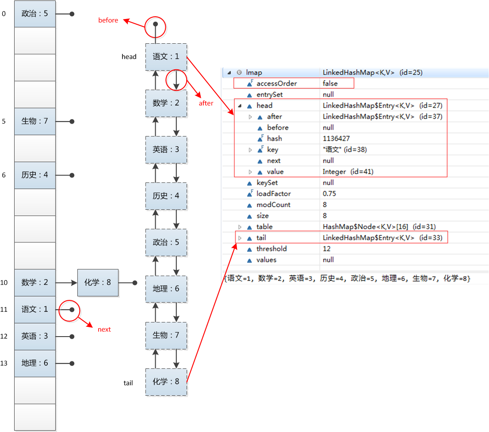

# JavaCollection之深入理解LinkedHashMap
LinkedHashMap是HashMap的一个子类，能够保存记录的插入顺序，在使用Iterator遍历LinkedHashMap时，遍历顺序为插入顺序。另外，可以在构造时带参，按照访问次序排序。

LinkedHashMap除了具有从HashMap继承而来的特性外，还具有其特有的特性。

我们通过一个测试程序进入本文的主题：

```java
LinkedHashMap<String, Integer> lmap = new LinkedHashMap<String, Integer>();
lmap.put("语文", 1);
lmap.put("数学", 2);
lmap.put("英语", 3);
lmap.put("历史", 4);
lmap.put("政治", 5);
lmap.put("地理", 6);
lmap.put("生物", 7);
lmap.put("化学", 8);
for(Entry<String, Integer> entry : lmap.entrySet()) {
    System.out.println(entry.getKey() + ": " + entry.getValue());
}
//运行结果：
//语文: 1
//数学: 2
//英语: 3
//历史: 4
//政治: 5
//地理: 6
//生物: 7
//化学: 8
```
我们可以观察到，和HashMap的运行结果不同，LinkedHashMap的迭代输出的结果保持了插入顺序。是什么样的结构使得LinkedHashMap具有如此特性呢？我们还是一样的看看LinkedHashMap的内部结构，对它有一个感性的认识：



正如官方文档所说：

Hash table and linked list implementation of the Map interface, with predictable iteration order. This implementation differs from HashMap in that it maintains a doubly-linked listrunning through all of its entries. This linked list defines the iteration ordering, which is normally the order in which keys were inserted into the map (insertion-order).

LinkedHashMap采用双向链表（doubly-linked list）的形式将所有entry连接起来，这样是为保证元素的迭代顺序跟插入顺序相同。

除了可以保迭代历顺序，这种结构还有一个好处：迭代LinkedHashMap时不需要像HashMap那样遍历整个table，而只需要直接遍历header指向的双向链表即可，也就是说LinkedHashMap的迭代时间就只跟entry的个数相关，而跟table的大小无关。

有两个参数可以影响LinkedHashMap的性能：初始容量（inital capacity）和负载系数（load factor）。初始容量指定了初始table的大小，负载系数用来指定自动扩容的临界值。当entry的数量超过capacity*load_factor时，容器将自动扩容并重新哈希。对于插入元素较多的场景，将初始容量设大可以减少重新哈希的次数。

将对象放入到LinkedHashMap中时，有两个方法需要特别关心：`hashCode()`和`equals()`。`hashCode()`方法决定了对象会被放到哪个bucket里，当多个对象的哈希值冲突时，`equals()`方法决定了这些对象是否是“同一个对象”。所以，如果要将自定义的对象放入到LinkedHashMap，需要重写 hashCode()和equals()方法。

## 三个重点实现的函数
在HashMap中提到了下面的定义：
```java
// Callbacks to allow LinkedHashMap post-actions
void afterNodeAccess(Node<K,V> p) { }
void afterNodeInsertion(boolean evict) { }
void afterNodeRemoval(Node<K,V> p) { }

```

LinkedHashMap继承于HashMap，因此也重新实现了这3个函数，顾名思义这三个函数的作用分别是：节点访问后、节点插入后、节点移除后做一些事情。

1. **afterNodeAccess方法**
```java
void afterNodeAccess(Node<K,V> e) { // move node to last
    LinkedHashMap.Entry<K,V> last;
    // 如果定义了accessOrder，那么就保证最近访问节点放到最后
    if (accessOrder && (last = tail) != e) {
        LinkedHashMap.Entry<K,V> p =
            (LinkedHashMap.Entry<K,V>)e, b = p.before, a = p.after;
        p.after = null;
        if (b == null)
            head = a;
        else
            b.after = a;
        if (a != null)
            a.before = b;
        else
            last = b;
        if (last == null)
            head = p;
        else {
            p.before = last;
            last.after = p;
        }
        tail = p;
        ++modCount;
    }
}

```
就是说在进行put之后就算是对节点的访问了，那么这个时候就会更新链表，把最近访问的放到最后，保证链表特性。
2. **afterNodeInsertion方法**
```java
void afterNodeInsertion(boolean evict) { // possibly remove eldest
    LinkedHashMap.Entry<K,V> first;
    // 如果定义了移除规则，则执行相应的溢出
    if (evict && (first = head) != null && removeEldestEntry(first)) {
        K key = first.key;
        removeNode(hash(key), key, null, false, true);
    }
}
```
如果用户定义了removeEldestEntry的规则，那么便可以执行相应的移除操作。
3. **afterNodeRemoval方法**
```java
void afterNodeRemoval(Node<K,V> e) { // unlink
    // 从链表中移除节点
    LinkedHashMap.Entry<K,V> p =
        (LinkedHashMap.Entry<K,V>)e, b = p.before, a = p.after;
    p.before = p.after = null;
    if (b == null)
        head = a;
    else
        b.after = a;
    if (a == null)
        tail = b;
    else
        a.before = b;
}

```
这个函数是在移除节点后调用的，就是将节点从双向链表中删除。

我们从上面3个函数看出来，基本上都是为了保证双向链表中的节点次序或者双向链表容量所做的一些额外的事情，目的就是保持双向链表中节点的顺序要从eldest到youngest。

## PUT和GET方法
put方法在LinkedHashMap中未重新实现，只是实现了afterNodeAccess和afterNodeInsertion两个回调函数。get函数则重新实现并加入了afterNodeAccess来保证访问顺序，下面是getan方法的具体实现：
```java
public V get(Object key) {
    Node<K,V> e;
    if ((e = getNode(hash(key), key)) == null)
        return null;
    if (accessOrder)
        afterNodeAccess(e);
    return e.value;
}
```
值得注意的是，在accessOrder模式下，只要执行get或者put等操作的时候，就会产生structural modification。官方文档是这么描述的：

A structural modification is any operation that adds or deletes one or more mappings or, in the case of access-ordered linked hash maps, affects iteration order. In insertion-ordered linked hash maps, merely changing the value associated with a key that is already contained in the map is not a structural modification. In access-ordered linked hash maps, merely querying the map with get is a structural modification.

总之，作为HashMap子类的LinkedHashMap与HashMap功能及其相似，LinkedHashMap所有的更改也是为了维护本身具有访问顺序的双向链表。

注意： 

[ConcurrentModificationException with LinkedHashMap类似的问题](https://stackoverflow.com/questions/16180568/concurrentmodificationexception-with-linkedhashmap/16180833)