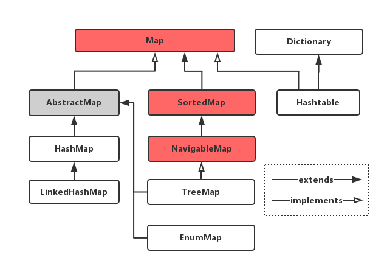

# Java集合之Map
Map是最重要的数据结构。Java为数据结构中符号表(Key-Value)定义了一个接口`java.util.Map`，这个接口主要有四个常用的实现类，分别是`HashMap, Hashtable,LinkedHashMap和TreeMap`，类继承体系如下图所示：



针对Java SE中四个常见的Map实现——HashMap,TreeMap,Hashtable和LinkedHashMap：
1. HashMap -- 根据键的hashCode值存储数据，大多数情况下可以直接定位到键值对。因此，具有很快的访问速度。但是，集合中元素是无序的，并且遍历顺序也是不确定的。HashMap最多允许一条记录的键为`null`，允许多条记录值为`null`。另外，HashMap非线程安全，即任一时刻可以有多个线程同时向HashMap写入数据，这可以能导致数据的不一致。如果需要满足线程安全，可以用`Collections`类的`synchronizedMap`方法使`HashMap`具有线程安全的能力，或者使用`ConcurrentHashMap`。
2. Hashtable -- Hashtable是遗留类，很多常用功能与HashMap类似，不同的是它继承自Dictionary类，并且是线程安全的，任一时间只有一个线程可以向Hashtable写入数据。但是，它的并发性不如`ConcurrentHashMap`，因为`ConcurrentHashMap`引入了分段锁。不建议在新代码中使用Hashtable，在不需要线程安全的场合可以用HashMap替换，需要保证线程安全的场合可以使用ConcurrentHashMap替换。
3. LinkedHashMap -- LinkedHashMap是HashMap的一个子类，能够保存记录的插入顺序，在使用Iterator遍历LinkedHashMap时，遍历顺序为插入顺序。另外，可以在构造时带参，按照访问次序排序。
4. TreeMap -- 以红黑树结构为基础，TreeMap实现了SortedMap接口，能够把它八村的记录根据键排序，默认按键值的升序排序，也可以指定排序比较器，当使用Iterator遍历TreeMap元素时，得到的是排序后的记录。在使用TreeMap时，Key对象必须实现Comparable接口或者在构造时传入自定义构造器(Comparator),否则会抛出`java.lang.ClassCastException`类型的异常。

对于上述四种Map类型的类，要求映射中的key是不可变对象。不可变对象是该对象在创建后它的哈希值不会被改变。如果对象的哈希值发生变化，Map对象很可能就定位不到映射的位置了。


## 符号表中的自定义Key值
在符号表中，如果键Key是自定义对象，在定义其`equals()和hashCode()`方法时一定要谨慎。


## Map的常见问题
通常，Map就是一个包含一个key-value集合数据结构，并且每个Key仅仅出现一次。下面是一系列有关Java Map的常见问题和解法。在解题过程中，我并没有使用具体的Map，而是用泛型替代(Generic)。需要声明的是，我们假设每个Key和Value都是可比较的，也就是说，`K extends Comparable`和`V extends Comparable`。

1. Convert a Map to a List
在Java中，Map接口提供了三种集合视图(collection views):`key set, value set, and key-value set`。他们都可以通过使用构造器(Constructor)或者`addAll()`方法被转化成List。下列代码片段展示了如何将Map构造为一个ArrayList。
```java
//key list
List keyList = new ArrayList(map.keySt());
//value list
List valueList = new ArrayList(map.values());
//key-value list
List entryList = new ArrayList(map.entrySet());
```
2. Iterate over a Map
迭代每对键值是遍历地图的最基本操作。在Java中，Key-value存储在名为`Map.Entry`的映射条目中。`Map.entrySet()`返回一个Key-Value集合.因此，遍历`Map`中的每个`Entry`的最有效方法是:
```java
for(Map.Entry entry : map.entrySet()) {
    //get key
    K key = entry.getKey();
    //get value
    V value = entry.getValue();
}
```
也可以使用Iterator， 在JDK 1.5之前这种方式尤为普遍
```java
Iterator it = map.entrySet().iterator();
while(it.hashNext()) {
    Entry entry = it.next();
    //get key
    K key = entry.getKey();
    //get value
    V value = entry.getValue();
}
```
3. Sort a Map on the keys
依据Key值排序一个Map也是一个常见操作。一种方式是将`Map.Entry`转化成一个`List`，然后通过比较器`Comparator`进行排序：
```java
List list = new ArrayList(map.entrySet());
Collections.sort(list, new Comparator() {
    @Override 
    public int compare(Entry e1, Entry e2) {
        return e1.getKey().compareTo(e2.getKey());
    }
});
```
另一种方法是使用`SortedMap`，它进一步提供了对其键的总体排序。因此，所有的键都必须实现`Comparable`或被比较器接受。

`SortedMap`的一个实现类是`TreeMap`。它的构造函数可以接受比较器。以下代码显示如何将常规地图转换为有序地图。
```java
SortedMap sortedMap = new SortedMap(new Comparator() {
    @Override
    public int compare(K k1, K k2) {
        return k1.compareTo(k2);
    }
});
sortedMap.putAll(map);
```
4. Sort a Map on the values
将`Map`放入`List`中并对它进行排序也适用于这种情况，但是这次我们需要比较`Entry.getValue()`。 以下代码与以前几乎相同。
```java
List list = new ArrayList(map.entrySet());
Collections.sort(list, new Comparator(){
    @Override
    public int compare(Entry e1, Entry e2) {
        return e1.getValue().compareTo(e2.getValue());
    }
});
```
我们同样可以使用`SortedMap`解决这个问题，但是这里要求所有的Value都是唯一的。
5. Initialize a static/immutable Map
When you expect a map to remain constant, it's a good practice to copy it into an immutable map. Such defensive programming techniques will help you create not only safe for use but also safe for thread maps.

To initialize a static/immutable map, we can use a static initializer (like below). The problem of this code is that, although map is declared as static final, we can still operate it after initialization, like `Test.map.put(3,"three");`. Therefore it is not really immutable. To create an immutable map using a static initializer, we need an extra anonymous class and copy it into an unmodifiable map at the last step of initialization. Please see the second piece of code. Then, an `UnsupportedOperationException` will be thrown if you run `Test.map.put(3,"three");`

```java
public class Test{
    private static final Map map;
    static {
        map = new HashMap();
        map.put(1, "one");
        map.put(2, "two");
    }
}

public class Test {
    private static final Map map;
    static {
        Map aMap = new HashMap();
        aMap.put(1, "one");
        aMap.put(2, "two");
        aMap = Collections.unmodifiableMap(aMap);
    }
}

```
[Guava](https://github.com/google/guava) libraries also support different ways of intilizaing a static and immutable collection. To learn more about the benefits of Guava's immutable collection utilities, see [Immutable Collections Explained in Guava User Guide](https://github.com/google/guava).

6. Difference between HashMap, TreeMap, and Hashtable
There are three main implementations of Map interface in [Java](http://docs.oracle.com/javase/7/docs/api/java/util/Map.html): [HashMap](https://docs.oracle.com/javase/7/docs/api/java/util/HashMap.html), [TreeMap](docs.oracle.com/javase/7/docs/api/java/util/TreeMap.html), and [Hashtable](https://docs.oracle.com/javase/7/docs/api/java/util/Hashtable.html). The most important differences include:

 - **The order of iteration.** `HashMap` and `Hashtable` make no guarantees as to the order of the map; in particular, they do not guarantee that the order will remain constant over time. But `TreeMap` will iterate the whole entries according the "natural ordering" of the keys or by a comparator.
- **key-value permission.** `HashMap` allows null key and null values (Only one null key is allowed because no two keys are allowed the same). `Hashtable` does not allow null key or null values. If `TreeMap` uses natural ordering or its comparator does not allow null keys, an exception will be thrown.
- **Synchronized.** Only `Hashtable` is synchronized, others are not. Therefore, "if a thread-safe implementation is not needed, it is recommended to use `HashMap` in place of `Hashtable`."

A more complete comparison is

|                 | HashMap | Hashtable | TreeMap |
|:---------------:|:-------:|:---------:|:-------:|
|iteration order  | no      | no        | yes     |
|null key-value   | yes-yes | no-no     | no-yes  |
|synchronized     | no      | yes       | no      |
|time performance | O(1)    | O(1)      | O(log n)|
|implementation   | buckets | buckets   | red-black tree |

7. A Map with reverse view/lookup
Sometimes, we need a set of key-key pairs, which means the map's values are unique as well as keys (one-to-one map). This constraint enables to create an "inverse lookup/view" of a map. So we can look up a key by its value. Such data structure is called [bidirectional map](https://en.wikipedia.org/wiki/Bidirectional_map), which unfortunately is not supported by JDK.

Both Apache Common Collections and Guava provide implementation of bidirectional map, called BidiMap and BiMap, respectively. Both enforce the restriction that there is a 1:1 relation between keys and values.

8. Shallow copy of a Map
Most implementation of a map in java, if not all, provides a constructor of copy of another map. But the copy procedure is `not synchronized`. That means when one thread copies a map, another one may modify it structurally. To pevent accidental unsynchronized copy, one should use `Collections.synchronizedMap()` in advance.

```java
Map copiedMap = Collections.synchronizedMap(map);
```
Another interesting way of shallow copy is by using `clone()` method. However it is **NOT** even recommended by the designer of Java collection framework, Josh Bloch. In a conversation about "[Copy constructor versus cloning](https://www.artima.com/intv/bloch13.html)", he said

>I often provide a public clone method on concrete classes because people expect it. ... It's a shame that Cloneable is broken, but it happens. ... Cloneable is a weak spot, and I think people should be aware of its limitations.

For this reason, I will not even tell you how to use clone() method to copy a map.
9. Create an empty Map
If the map is immutable, use
```java
map = Collections.emptyMap();
```
Otherwise, use whichever implementation. For example
```java
map = new HashMap();
```


## Sort Map By Value
In Java, we can use the `TreeMap` class to sort a map by its keys. This class is very handy to use. However, sometimes we need to sort a map by its values. How to sort a map by its values is a most frequently asked question by Java programmers. In this post, I will develop the best way to write such a method.

1. Naive Method
The following is a solution to sort a map of <String, Integer> pairs. This is often used in counting frequency of words.

```java
import java.util.Comparator;
import java.util.HashMap;
import java.util.TreeMap;
 
public class SortMapByValue {
 
    public static void main(String[] args) {
        HashMap<String, Integer> map = new HashMap<String, Integer>();
        map.put("a", 10);
        map.put("b", 30);
        map.put("c", 50);
        map.put("d", 40);
        map.put("e", 20);
        System.out.println(map);
 
        TreeMap<String, Integer> sortedMap = sortMapByValue(map);  
        System.out.println(sortedMap);
    }
 
    public static TreeMap<String, Integer> sortMapByValue(HashMap<String, Integer> map){
        Comparator<String> comparator = new ValueComparator(map);
        //TreeMap is a map sorted by its keys. 
        //The comparator is used to sort the TreeMap by keys. 
        TreeMap<String, Integer> result = new TreeMap<String, Integer>(comparator);
        result.putAll(map);
        return result;
    }
}

```

The `ValueComparator` class

```java
//a comparator that compares Stringc
class ValueComparator implements Comparator<String> {
    HashMap<String, Integer> map = new HashMap<String, Integer>();

    public ValueComparator(HashMap<String, Integer> map) {
        this.map.putAll(map);
    }

    @Override
    public int compare(String s1, String s2) {
        if(map.get(s1) >= map.get(s2)){
            return -1;
        }else {
            return 1;
        }
    }
}

```
In this solution, we use a TreeMap to sort the map. When creating the TreeMap, we give it a comparator. The comparator accepts strings and compare the assocated values of the given string key in the map.

The method works well, but it only works for sorting String and Integer pairs. If we want to sort a map with other types of keys and values, it needs to be rewritten. Therefore, a more general solution is preferred.
2. More General Solution
We can ignore the generic type and make the methods work for any types like the following.
```java
import java.util.Comparator;
import java.util.HashMap;
import java.util.Map;
import java.util.TreeMap;
 
public class Solution {
    public static void main(String[] args) {
        HashMap<String, Integer> map = new HashMap<String, Integer>();
        map.put("a", 10);
        map.put("b", 30);
        map.put("c", 50);
        map.put("d", 40);
        map.put("e", 20);
        System.out.println(map);
 
        Map sortedMap = sortByValue(map);
        System.out.println(sortedMap);
    }
 
    public static Map sortByValue(Map unsortedMap) {
        Map sortedMap = new TreeMap(new ValueComparator(unsortedMap));
        sortedMap.putAll(unsortedMap);
        return sortedMap;
    }
 
}
 
class ValueComparator implements Comparator {
    Map map;
 
    public ValueComparator(Map map) {
        this.map = map;
    }
 
    public int compare(Object keyA, Object keyB) {
        Comparable valueA = (Comparable) map.get(keyA);
        Comparable valueB = (Comparable) map.get(keyB);
        return valueB.compareTo(valueA);
    }
}

```
The solution is not type-safe, we need a type-safe and general solution.
3. Using Generic Types

```java
public class SortMapByValue {
    public static void main(String[] args){
        //<String, Integer> Map
        HashMap<String, Integer> map = new HashMap<String, Integer>();
        map.put("a", 10);
        map.put("b", 30);
        map.put("c", 50);
        map.put("d", 40);
        map.put("e", 20);
        System.out.println(map);
 
 
        Comparator<String> comparator = new ValueComparator<String, Integer>(map);
        TreeMap<String, Integer> result = new TreeMap<String, Integer>(comparator);
        result.putAll(map);
 
        System.out.println(result);
 
        // <Integer, Integer> Map
 
        HashMap<Integer, Integer> map2 = new HashMap<Integer, Integer>();
        map2.put(1, 10);
        map2.put(2, 30);
        map2.put(3, 50);
        map2.put(4, 40);
        map2.put(5, 20);
        System.out.println(map2);
 
        Comparator<Integer> comparator2 = new ValueComparator<Integer, Integer>(map2);
        TreeMap<Integer, Integer> result2 = new TreeMap<Integer, Integer>(comparator2);
        result2.putAll(map2);
 
        System.out.println(result2);
    }
}


//a comparator useing generic type
class ValueComparator<K, V extends Comparable<V>> implements Comparator<K> {
    HashMap<K, V> map = new HashMap<K, V>();

    public ValueComparator(HashMap<K, V> map) {
        this.map.putAll(map);
    }

    @Override
    public int compare(K s1, K s2) {
        return -map.get(s1).compareTo(map.get(s2)); //descending order
    }
}
```

4. Another Way of Using Generic Types
```java
public static <K, V extends Comparable<? super V>> Map<K, V> sortByValue(Map<K, V> map) {
    List<Map.Entry<K, V>> list = new LinkedList<>(map.entrySet());
    Collections.sort(list, new Comparator<Map.Entry<K, V>>() {
        @Override
        public int compare(Map.Entry<K, V> e1, Map.Entry<K, V> e2) {
            return (e1.getValue()).compareTo(e2.getValue());
        }
    });
 
    Map<K, V> result = new LinkedHashMap<>();
    for (Map.Entry<K, V> entry : list) {
        result.put(entry.getKey(), entry.getValue());
    }
 
    return result;
}
```