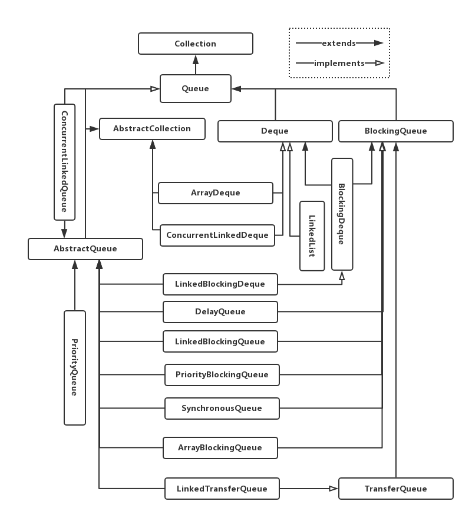

# Java集合之Queue
队列 `Queue` 是一种只允许在一端进行插入操作，而另一端进行取出操作的  **线性表结构**。`Queue`是一种先进先出（First In First Out）的数据结构， 允许插入的一端是叫做 **队尾**，允许删除的一端叫做 **队首** 。严格说来，这种数据结构也是按照某种规则处理独立的元素，因此在Java中，这种数据结构的实现了`Collection`接口， 并扩展了`AbstractCollection`类。

我们知道，从本质上而言，队列就是一个线性表，而线性表通常有两种实现方式：**顺序存储** 和 **链式存储**。
## 顺序存储实现
顺序队列是队列的顺序存储结构，本质上是一个顺序表。在实现时，我们用向量空间来存放队列中的元素。由于队首和队尾位置的变化，我们设置两个指针 **front** 和 **tail** 分别指示当前队首元素和当前队尾元素在向量空间中的位置（初始位置均为`0`）。

**循环队列** 实现顺序队列时经常用到的技术。普通的顺序队列执行入队操作时，会出现尾指针 **tail** 到达存储向量尾部出现队满溢出的现象，但是这种溢出并非没有存储空间，在执行出队操作时头指针 **front** 会释放存储向量首部的空间，但是这些空间并没有被使用。因此，我们称这种溢出现象为“假溢出”。解决“假溢出”的办法是使用循环队列。

## 链式存储实现
队列的链式存储也称作链队列。本质上就是一个单链表，我们在链表头部和尾部分别加上头指针 **front** 和尾指针 **tail** 表示队列的队首和队尾。

## Java Collection Framework中的队列
下面是Java Collection Framework中队列这种数据结构顶层接口规范的定义：

```java
public interface Queue<E> extends Collection<E> {
    boolean add(E e); //向队尾添加元素
    boolean offer(E e); //向队尾添加元素
    E revmove(); // 移除并返回队首元素
    E pool(); // 移除并返回队首元素
    E element(); //取队首元素，但不移除
    E peek(); //取队首元素，但不移除
}
```

从存储形式来讲，Java提供了基于线性存储和基于链式存储两种线性表形式的队列实现。另一方面，考虑到线程安全，Java同样提供了保证线程安全和非线程安全两种实现方式。

我们首先看一下Java Collection Framework中`Queue`的类继承体系:



上面类图中的实现来自两个包`java.util`容器工具类包以及`java.util.concurrent`线程安全包。

