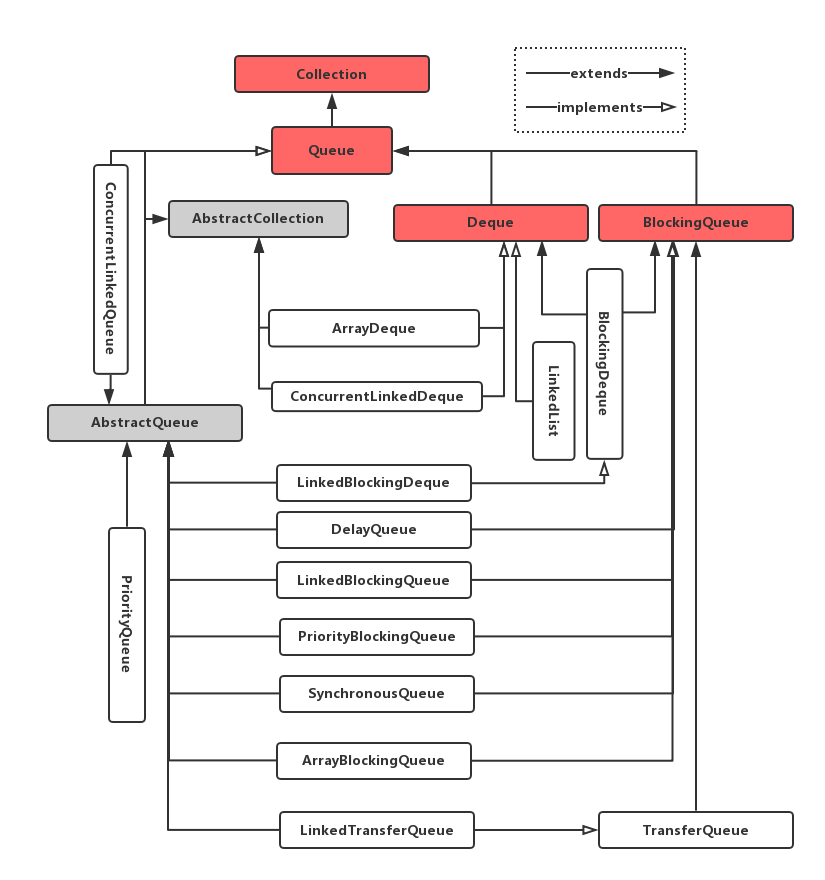

# Java集合之Queue
队列 `Queue` 是一种只允许在一端进行插入操作，而另一端进行取出操作的  **线性表结构**。`Queue`是一种先进先出（First In First Out）的数据结构， 允许插入的一端是叫做 **队尾**，允许删除的一端叫做 **队首** 。严格说来，这种数据结构也是按照某种规则处理独立的元素，因此在Java中，这种数据结构的实现了`Collection`接口， 并扩展了`AbstractCollection`类。

我们知道，从本质上而言，队列就是一个线性表，而线性表通常有两种实现方式：**顺序存储** 和 **链式存储**。
## 顺序存储实现
顺序队列是队列的顺序存储结构，本质上是一个顺序表。在实现时，我们用向量空间来存放队列中的元素。由于队首和队尾位置的变化，我们设置两个指针 **front** 和 **tail** 分别指示当前队首元素和当前队尾元素在向量空间中的位置（初始位置均为`0`）。

**循环队列** 实现顺序队列时经常用到的技术。普通的顺序队列执行入队操作时，会出现尾指针 **tail** 到达存储向量尾部出现队满溢出的现象，但是这种溢出并非没有存储空间，在执行出队操作时头指针 **front** 会释放存储向量首部的空间，但是这些空间并没有被使用。因此，我们称这种溢出现象为“假溢出”。解决“假溢出”的办法是使用循环队列。

## 链式存储实现
队列的链式存储也称作链队列。本质上就是一个单链表，我们在链表头部和尾部分别加上头指针 **front** 和尾指针 **tail** 表示队列的队首和队尾。

## Java Collection Framework中的队列
下面是Java Collection Framework中队列这种数据结构顶层接口规范的定义：

```java
public interface Queue<E> extends Collection<E> {
    boolean add(E e); //向队尾添加元素
    boolean offer(E e); //向队尾添加元素
    E revmove(); // 移除并返回队首元素
    E pool(); // 移除并返回队首元素
    E element(); //取队首元素，但不移除
    E peek(); //取队首元素，但不移除
}
```

从存储形式来讲，Java提供了基于线性存储和基于链式存储两种线性表形式的队列实现。另一方面，考虑到线程安全，Java同样提供了保证线程安全和非线程安全两种实现方式。

我们首先看一下Java Collection Framework中`Queue`的类继承体系:



上面类图中的实现来自两个包`java.util`容器工具类包以及`java.util.concurrent`线程安全包。

在讨论具体的实现类之前，我们首先讨论一个特殊接口——`Deque`（double ended queue（双端队列）），双端队列接口。`Deque` 作为一个接口，它规定了双端队列功能规约。`Deque`作为约定了一个双端队列的实现规约，也就是说，该类是对`Queue`接口规范的增强。深入分析`Deque`接口的源代码，我们会发现它包含了四部分功能的规约。
1. 双向队列 `Deque`特定功能规约。
2. 普通队列`Queue`功能规约。
3. 普通栈`Stack`功能规约。
4. 普通集合`Collection`功能规约。
第3，4部分的方法告诉我们，`Deque`接口的实现类也可以被看作是栈`Stack`或普通的集合`Collection`来使用。这也是 **接口定义规约** 带来的好处。
```java
public interface Deque<E> extends Queue<E> {
    void addFirst(E e);
    void addLast(E e);
    boolean offerFirst(E e);
    boolean offerLast(E e);
    E removeFirst();
    E removeLast();
    E pollFirst();
    E pollLast();
    E getFirst();
    E peekFirst();
    E peekLast();
    boolean removeFirstOccurrence(Object o);
    boolean removeLastOccurrence(Object o);
    boolean add(E e);
    boolean offer(E e);
    E remove();
    E poll();
    E element();
    E peek();
    void push(E e);
    E pop();
    boolean remove(Object o);
    boolean contains(Object o);
    public int size();
    Iterator<E> iterator();
    Iterator<E> descendingIterator();
}
```

此接口定义在双端队列两端访问元素的方法。提供插入、移除和检查元素的方法。每种方法都存在两种形式：一种形式在操作失败时抛出异常，另一种形式返回一个特殊值（null 或 false，具体取决于操作）。插入操作的后一种形式是专为使用有容量限制的 Deque 实现设计的；在大多数实现中，插入操作不能失败。

下表总结了上述12中方法：

| #    | 头部 | 头部 | 尾部 | 尾部 |
|:----:|:-------------:|:-------------:|:------------:|:------------:|
|      | 抛出异常      | 特殊值        | 抛出异常     | 特殊值       |
| 插入 | addFirst(e)   | offerFirst(e) | addLast(e)   | offerLast(e) |
| 移除 | removeFirst() | pollFirst()   | removeLast() | pollLast()   |
| 检查 | getFirst()    | peekFirst()   | getLast()    | peekLast()   |

这个接口扩展了`Queue`接口。在将双端队列用作队列时，将得到FIFO（先进先出）行为。将元素添加到双端队列的末尾，从双端队列的开头删除元素。从`Queue`接口继承的方法安全等效`Deque`方法。如下表所示：

| Queue 方法 | 等效 Deque方法  |
|:----------:|:---------------:|
| add(E e)   | addLast(E e)    |
| offer(E e) | offerLaset(E e) |
| remove()   | removeFirst()   |
| poll()     | pollFirst()     |
| element()  | getFirst()      |
| peek()     | peekFirst()     |

双端队列也可以用作LIFO（后进先出）。我们在使用该性质的时，应该优先使用该接口而不是遗留的`Stack`类。将双端队列用作堆栈时，元素被推入双端队列开头并从双端队列的开头弹出。堆栈方法完全等效于`Deque`方法，如下表所示：

| 堆栈方法  | 等效 Deque 方法 |
|:---------:|:---------------:|
| push(E e) | addFirst(E e) 　|
| pop()     | removeFirst()   |
| peek()    | peekFirst()     |

注意，在将双端队列用作队列或堆栈时，`peek`方法同样正常工作；无论哪种情况下，都从双端队列的开头抽取元素。

## 常见的队列实现类
下面我们介绍一些常见的具有FIFO性质的实现类。

1. **LinkedList** 和 **ArrayDeque** 分别是 **Deque** 接口规约的`链式实现`和`顺序实现`。在要求线程安全的情况下，我们可以使用 **ConcurrentLinkedDeque** 或 **LinkedBlockingDeque** 实现类，其中 **LinkedBlockingDeque**是具有阻塞性质、线程安全的双端队列实现。
2. **LinkedList** 和 **ArrayQueue** 分别是 **Queue** 接口规约的`链式实现`和`顺序实现`。 另外还有优先队列 **PriorityQueue** 实现类。与之相对应的，我们也有能够保证线程安全的相应的实现类。例如，**ArrayBlockingQueue, ConcurrentLinkedDeque, ConcurrentLinkedQueue, DelayQueue, LinkedBlockingDeque, LinkedBlockingQueue, LinkedTransferQueue, PriorityBlockingQueue, PriorityQueue, SynchronousQueue** 等等。


## ArrayDeque和LinkedList的分析
我们将重源代码的角度分析这两个类的实现。更重要的是，这里将挑选我认为比较难以理解的部分重点分析。

### ArrayDeque
**ArrayDeque** 是 **Deque** 的顺序实现，很自然能够想到它的内部实现机制——一个Object数组来保存元素，分别使用head和tail指针来指示队列的头和尾。 具体定义如下：

```java
public class ArrayDeque<E> extends AbstractCollection<E>
                           implements Deque<E>, Cloneable, Serializable
{
    transient Object[] elements; // non-private to simplify nested class access
    transient int head;
    transient int tail;

    private static final int MIN_INITIAL_CAPACITY = 8;

    private void allocateElements(int numElements) {
        int initialCapacity = MIN_INITIAL_CAPACITY;
        // Find the best power of two to hold elements.
        // Tests "<=" because arrays aren't kept full.
        if (numElements >= initialCapacity) {
            initialCapacity = numElements;
            initialCapacity |= (initialCapacity >>>  1);
            initialCapacity |= (initialCapacity >>>  2);
            initialCapacity |= (initialCapacity >>>  4);
            initialCapacity |= (initialCapacity >>>  8);
            initialCapacity |= (initialCapacity >>> 16);
            initialCapacity++;

            if (initialCapacity < 0)   // Too many elements, must back off
                initialCapacity >>>= 1;// Good luck allocating 2 ^ 30 elements
        }
        elements = new Object[initialCapacity];
    }

    private void doubleCapacity() {
        assert head == tail;
        int p = head;
        int n = elements.length;
        int r = n - p; // number of elements to the right of p
        int newCapacity = n << 1;
        if (newCapacity < 0)
            throw new IllegalStateException("Sorry, deque too big");
        Object[] a = new Object[newCapacity];
        System.arraycopy(elements, p, a, 0, r);
        System.arraycopy(elements, 0, a, r, p);
        elements = a;
        head = 0;
        tail = n;
    }
}
```
与其他很多地方不一样的是，**ArrayDeque**类的大部分属性都是默认访问权限的(Java 8)。 其中 `ArrayDeque`中`Object`数组的默认长度为`8`，这是我们后面重点讨论的地方，做所以这么设置是因为有利于做扩容处理。  **关于tail需要注意的一点是tail所在的索引位置是null值，在它前面的元素才是队列中排在最后的元素**。

我们将重点关注 **Object[]**数组的扩容处理。在调整元素长度部分，**ArrayDeque** 采用了两个方法来实现。一个是 **allocateElements**，另一个是 **doubleCapacity** 。 **allocateElements** 方法用于构造函数中根据指定的参数设置初始数组的大小。而** doubleCapacity** 则用于当数组元素不足时做扩容处理。

其中 **allocateElements** 方法中最容易让人困惑的地方是对 **initialCapacity**  移位和或运算。首先通过无符号右移1位，再与原来的数字做或运算，然后再右移2、4、8、16位。这么做的目的是使得最后生成的数字尽可能每一位都是1。很显然，如果这个数字是每一位都为1，后面再对这个数字加1的话，则生成的数字一定是2的若干次方，并且这个数字也肯定是大于 **numElements** 值的最小2的指数值。之所以这么做，是因为有了这个基础，如果后面应用过程中做扩容处理，我们会很容处理，并且即使这个增长下去也不会超过数据类型所能容纳的极限（整型所能容纳的极限）。比如说，有一个数组的长度比`Integer.MAX_VALUE`的一半要多几个元素，如果我们这个时候设置的值不是让它为2的整数次方，那么直接对它空间翻倍就导致空间不够了，但是我们完全可以设置足够空间来容纳的。 其实，最简单的理解就是： **之所以这么做，是因为我们可以通过这种方式找到一个尽可能与numElements接近的initialCapacity， 尽可能的节约空间资源，以免造成空间浪费**。

有了前面的讨论，执行 **doubleCapacity** 扩展空间容量的时候左移一位，就将空间容量扩充一倍。如果长度超出了允许的范围，就会发生溢出，返回的结果就会成为一个负数。这就是为什么有`if (newCapacity < 0)`这一句来抛异常。

### LinkedList 
**LinkedList** 是 **Deque**的链式实现。最重要的是我们需要理解，它内部维护了一个**双向链表**。

