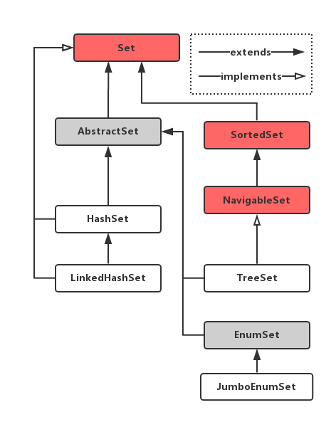

# Java集合之Set
`java.util.Set`接口是`java.util.Collection`接口的一个自类型，是一个不包含任何重复元素的集合。更确切的说，`Set`中不存在一对元素`e1`和`e2`，使得`e1.equals(e2)`成立，并且至多包含一个`null`元素。就像它的名字一样，`Set`是对数学概念中集合的抽象。Java集合框架中`Set`的类继承体系如下图所示：

因为`Set`是一个接口，如果你要使用`Set`，你就要实例化一个它的实现类。我们将会介绍Java Collection Framework中几个常用的`Set`实现类：
- java.util.EnumSet
- java.util.HashSet
- java.util.LinkedHashSet
- java.util.TreeSet

以上四个实现类在以下几个方面会表现出略微的差别：迭代`Set`中的元素时；向`Set`中插入元素或访问`Set`中元素时。

- `HashSet`实际上是维护了一个`HashMap`（适配器模式）。当迭代`HashSet`中的元素时，`HashSet`无法保证每次访问的顺序都相同。
- `LinkedHashSet`最大的特点是它区别于`HashSet`能够在被迭代访问时提供序的保证，并且这种序的保证体现在——我们每次迭代`LinkedHashSet`中的元素时，迭代顺序总与元素被插入的顺序相同。另外，当我们向`LinkedHashSet`插入一个集合中已经存在的元素时，带插入的元素仍然维持它首次被插入时的序。
- `TreeSet`能够保证其中元素被迭代时有序，但是与`LinkedHashSet`不同的是它保证的是元素按照某种规则排序后的结果，例如，`TreeSet`按照从大到小排序。换句话说，这个顺序指的是如果某个`List`或`Array`包含这些元时，运用`Collections.sort()`这些元素将会被排序。而这个排序是由元素（如果元素类实现了`Comparable`接口）的自然序（natural order)，或者一个特殊的比较器（`Comparator`）决定的。
- `EnumSet`是一个接口，而其实现类`JumboEnumSet`为默认权限，对于`jumbo enum types`

当然，上图中`Set`所有的实现类都是非线程安全的，在`java.util.concurrent`包中提供了一些线程安心全的`Set`实现类。

另外，非常重要的一点：我们在提及`Set`及其实现类时，不可避免的会提及`Map`。因为二者常用的实现类中`Set`实际上是维护了一个`Map`,也就是我们常说的 **适配器模式**，例如， `HashSet`和`HashMap`会常被拿来举例和区分两者之间的异同。