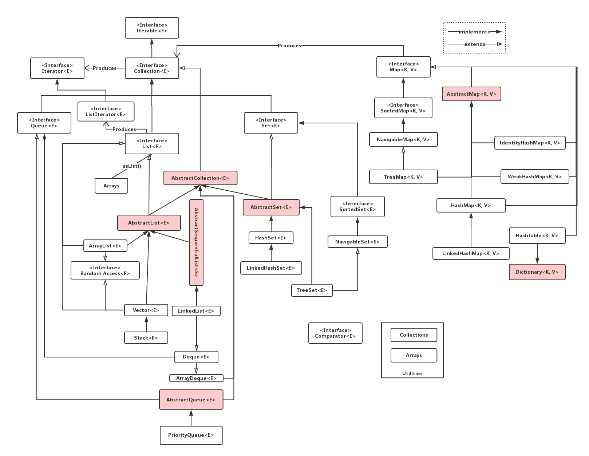

# Java集合类框架
如图所示Java 8集合类框架：

Java容器类类库的用途是“保存对象”，并将其划分为两个不同的概念：
1. **Collection** -- 一个独立的元素序列，这些元素服从一条或多条规则。 **List**  必须按照插入的顺序保存元素，而 **Set** 不能有重复元素，但可以不按序保存。**Queue** 按照队列的规则来确定元素对象的产生顺序（通常它们与插入顺序相同），工作原理是FCFS算法(First Come, First Serve)。
2. **Map** -- 一组成对的 **键值对（Key-Value）**对象，允许我们通过键`Key`来查找值`Value`。`ArrayList`允许我们用数字（通常称为索引）来查找值，因此从某种意义上来说，它将数字与对象关联在一起。**映射表** 允许我们使用另一个对象来查找某个对象，它也被称之为 **关联数组**， 因为它将某些对象与另外一些对象关联在一起；或者被称为 **字典**， 因为你可以使用键来查找值对象，就像在字典中使用单词来定义一样。

