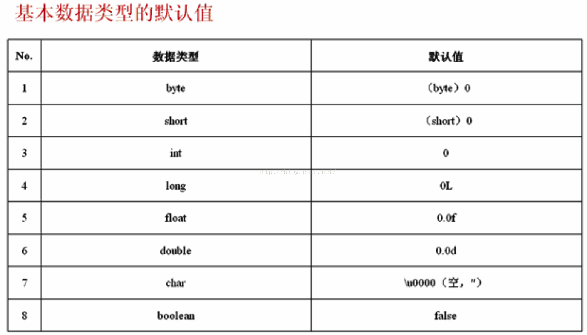

# 摘要
本文介绍了Java的数据类型，整体上可以将其数据类型划分为两种：`基本数据类型`和`对引用数据类型`。
其中`基本数据类型`大致可以分为四大类八种:`数值型`包括整型(byte,short,int,long)以及浮点类型(float,double)，`字符类型`(char)和`布尔类型`(boolean)。`引用数据类型`包括`类(class)`、`接口(interface)`、和`数组`。需要注意的，引用数据类型本质就是`受限的指针`。

## 基本数据类型


### byte：
byte 数据类型是8位、有符号的，以二进制补码表示的整数；
- 最小值是 -128（-2^7）；
- 最大值是 127（2^7-1）；
- 默认值是 0；
- 包装类 java.lang.Byte
- byte 类型用在大型数组中节约空间，主要代替整数，因为 byte 变量占用的空间只有 int 类型的四分之一；
- 例子：byte a = 100，byte b = -50。


### short：
short 数据类型是 16 位、有符号的以二进制补码表示的整数
- 最小值是 -32768（-2^15）；
- 最大值是 32767（2^15 - 1）；
- Short 数据类型也可以像 byte 那样节省空间。一个short变量是int型变量所占空间的二分之一；
- 默认值是 0；
- 包装类 java.lang.Short
- 例子：short s = 1000，short r = -20000。

### int：
int 数据类型是32位、有符号的以二进制补码表示的整数。一般地整型变量默认为 int 类型；
- 最小值是 -2,147,483,648（-2^31）；
- 最大值是 2,147,483,647（2^31 - 1）；
- 默认值是 0 ；
- 包装类 java.lang.Integer
- 例子：int a = 100000, int b = -200000。

### long：
long 数据类型是 64 位、有符号的以二进制补码表示的整数，这种类型主要使用在需要比较大整数的系统上。"L"理论上不分大小写，但是若写成"l"容易与数字"1"混淆，不容易分辩。所以最好大写：
- 最小值是 -9,223,372,036,854,775,808（-2^63）；
- 最大值是 9,223,372,036,854,775,807（2^63 -1）；
- 默认值是 0L；
- 包装类 java.lang.Long
- 例子： long a = 100000L，Long b = -200000L。

### float：
float 数据类型是单精度、32位、符合IEEE 754标准的浮点数。float 在储存大型浮点数组的时候可节省内存空间。浮点数不能用来表示精确的值，如货币；
- 默认值是 0.0f；
- 包装类 java.lang.Float
- 例子：float f1 = 234.5f。

### double：
double 数据类型是双精度、64 位、符合IEEE 754标准的浮点数。浮点数的默认类型为double类型。double类型同样不能表示精确的值，如货币；
- 默认值是 0.0d；
- 包装类 java.lang.Double
- 例子：double d1 = 123.4。

### 浮点数据类型
浮点变量有单精度变量和双精度变量之分，不同的精度开销的内存字节数和表达的数值范围均有区别。两种浮点变量占内存字节数和数值范围

浮点常量也有单精度和双精度之分，前面列出的常量均是双精度常量，如果要特别说明为单精度常量，可以数据末尾加上f或F作为后缀，如12.34f。如果要特别指明一个浮点常量是双精度常量，数据末尾不需要添加后缀，或者在数据末尾加上d或D作为后缀，如12.34d。

- float （单精度浮点型）一个float 32位，占用4个字节，例3.2F，默认是0.0f， 3.402823e+38 ~1.401298e-45（e+38表示是乘以10的38次方，同样，e-45表示乘以10的负45次方）。
- double (双精度浮点型)一个dobule 64位 占用8个字节，例3.2，默认是0.0， 1.797693e+308~4.9000000e-324 占用8个字节

#### 浮点数表示方法
即带小数点的实型数值，可以由直接带小数点的数值和科学计数法两种形式来表示：

- 带小数点的数值形式：由数字和小数点组成，如0.123、.123、123.、123.0。

- 科学计数法表示形式：由一般实数和e±n（E±n）组成，如12.3e3、5E-3，它们分别表示12.3乘以10的3次方，5乘以10的-3次方。需要注意的是，e或E之前必须有数字，且e或E后面的指数必须为整数。

3.2）浮点变量
### boolean：
boolean数据类型表示一位的信息。只有两个取值：true 和 false。这种类型只作为一种标志来记录 true/false 情况；
- 默认值是 false；
- 包装类 java.lang.Boolean
- 例子：boolean one = true。


### char：
char类型是一个单一的 16 位 Unicode 字符，char 数据类型可以储存任何字符；
- 最小值是 \u0000（即为0）；
- 最大值是 \uffff（即为65,535）；
- 包装类 java.lang.Character
- 例子：char letter = 'A';。

基本数据类型受其类型限制有其取值范围。如果赋值超出类型的范围则会出现错误。我们称之为`数据溢出`，包括`数据上溢和数据下溢`。特别的，由于进位的原因：对于`int和long`类型最大值加1成为最小值，最小值减1成为最大值，对于数值型其他类型则没有这种特性。示例代码如下：

```java
public class TypeOfData {
    public static void main(String[] args) {
        System.out.println("Short.MAX_VALUE = " + Short.MAX_VALUE);
        System.out.println("Short.MAX_VALUE + 1 = " + (Short.MAX_VALUE + 1));
        System.out.println("Short.MIN_VALUE = " + Short.MIN_VALUE);
        System.out.println("Short.MIN_VALUE - 1 = " + (Short.MIN_VALUE - 1));
        System.out.println("Integer.MAX_VALUE = " + Integer.MAX_VALUE);
        System.out.println("Integer.MAX_VALUE + 1 = " + (Integer.MAX_VALUE + 1));
        System.out.println("Integer.MIN_VALUE = " + Integer.MIN_VALUE);
        System.out.println("Integer.MIN_VALUE - 1 = " + (Integer.MIN_VALUE - 1));
        System.out.println("Long.MAX_VALUE = " + Long.MAX_VALUE);
        System.out.println("Long.MAX_VALUE + 1 = " + (Long.MAX_VALUE + 1));
        System.out.println("Long.MIN_VALUE = " + Long.MIN_VALUE);
        System.out.println("Long.MIN_VALUE - 1 = " + (Long.MIN_VALUE - 1));
        System.out.println("Float.MAX_VALUE = " + Float.MAX_VALUE);
        System.out.println("Float.MAX_VALUE + 1 = " + (Float.MAX_VALUE + 1));
        System.out.println("Float.MIN_VALUE = " + Float.MIN_VALUE);
        System.out.println("Float.MIN_VALUE - 1 = " + (Float.MIN_VALUE - 1));
    }
}
```
如果要解决数据一出问题，方法就是更长的数据类型。

## 基本数据类型的默认值
在Java语言中，JVM会对各种数据类型默认赋值。如下所示：



## 转义字符
常见的转义字符：

|字符|描述||字符|描述|
|-|-|-|-|-|
|`\f`|换页||`\\`|反斜杠|
|`\b`|倒退一格||`\'`|单引号|
|`\"`|双引号||`\0`|空字符(NULL)|
|`\?`|问号||`\n`|换行|
|'\r'|归位||`\t`|制表符(Tab)|

## 数据类型的转换
Java的数据类型在定义时就已经确立了，因此不能随意转换成其他的数据类型，但Java允许用户有限度的做类型转换处理。

数据类型的转换分为：“自动类型转换”  及 “强制类型转换”两种。

在程序中已经定义好了数据类型的变量，若是想用另一种数据类型表示时，Java会在下列的条件皆成立时，自动做数据类型转换：

1、转换前的数据类型与转换后的数据类型兼容。
2、转换后的数据类型的表示范围比转换前的类型大。

特别的，任何类型的数据都可以向String转换。

```java
public class DataTypeConvert {  
    public static void main(String[] args) {  
        float f = 30.3f; //浮点型  
        int x = (int)f;   // 强制类型转换  
        String str = "A" + x; //+运算符
        System.out.println(str); 
        System.out.println(x);  
        System.out.println("10/3= "+((float)10/3));  
    }  
}  
```


## 判断一个字符串是否是一个数字
```java
class Solution {
    
    public boolean isNumber(String s) {
        if(s == null || s.length() == 0) return false;
        
        int i = 0; 
        //处理前导空格
        for(; i < s.length() && ' ' == s.charAt(i); i ++);
        //处理正负号
        if(i < s.length() && ('+' == s.charAt(i) || '-' == s.charAt(i))) ++i;
        
        //处理数字部分
        boolean digit = false, dot = false, exp = false;
        
        for(; i < s.length(); i++) {
            if('.' == s.charAt(i)  && !dot) // '.'不能出现两次， '.'前面可以没有数字
                dot = true;
            else if('e' == s.charAt(i) && !exp && digit){ // 'e'不能出现两次，'e'前面必须有数字
                //'e'后面不能出现'.', 且必须是整数（正负）
                dot = true;
                exp = true;
                if(i+1 < s.length() && ('+' == s.charAt(i+1) || '-' == s.charAt(i+1))) {
                    i++;
                }
                if(i+1 >= s.length() || !(s.charAt(i+1) >= '0' && s.charAt(i+1) <= '9'))
                    return false;
            }else if(s.charAt(i) >= '0' && s.charAt(i) <= '9') {
                digit = true;
            } else {
                break;
            }
        } 
        
        //处理后续空格
        for(; i < s.length() && ' ' == s.charAt(i); i ++ );
        return digit && i == s.length();
    }
}

````