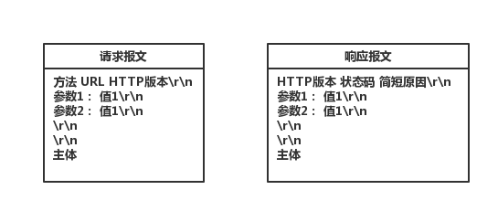

# HTTP协议简介
HTTP协议是应用层的协议，在TCP/IP协议接收到数据之后需要通过HTTP协议来解析数据内容。

HTTP协议的报文结构很重要。 HTTP中报文分为`请求报文（request message）`和`响应报文（response message）`两种类型，这两种类型都包括三个部分：`首行、头部和主体`。请求报文的首行是`请求行`，包括`方法（请求类型）、URL和HTTP版本`三项内容，响应请求的首行是`状态行`，包括`HTTP版本、状态码和简短原因`三项内容，其中原因可有可无。头部保存一些键值对的属性，用冒号`:`分割。主体保存具体内容，请求报文中主要保存`POST`类型的参数，响应报文中保存页面要显示的结果。首行、头部和主体以及头部的各项内容用回车换行`(\r\n)`分割，另外头部和主体之间多一个空行，也就是连续两个回车换行。它们的结构如下图所示：

请求报文中的方法指`GET, HEAD, POST, PUT, DELETE`等类型，响应报文中的状态码就是`Response`中的`status`，一共可以分为5类：

- 1XX： 信息状态码
- 2XX:  成功状态码， 例如 200 表示请求成功
- 3XX:  重定向状态码，例如301表示重定向
- 4XX:  客户端错误状态码，例如404表示没有找到请求的资源
- 5XX： 服务端错误状态码，例如500表示内部错误

