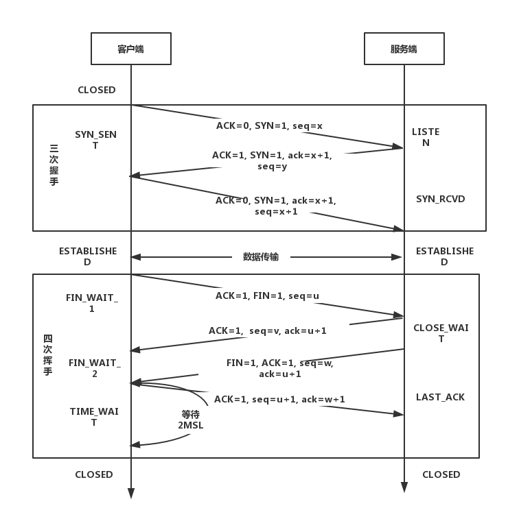

# TCP/IP协议的三次握手和四次挥手
TCP/IP协议是两组不同的协议。IP协议是用来查找地址的，对应网际互联层，TPC协议是用来规范传输规则的，对应着传输层。IP只负责查找地址，具体传输的工作则交由TCP来完成。类似于快递的业务逻辑。货单上填写收货地址的规则以及如何根据地址查找用户，这些规则相当于IP协议；送货时需要打电话，送货，然后交货的过程就是TCP协议保证的过程。

TCP进行数据传输之前会进行三次沟通，一般称为 **三次握手**， 数据传输完断开时要进行四次沟通，一般称为 **四次挥手** 。 在详细描述这两个过程之前，我们首先理解TCP协议中的两个序号和三个标志位的含义：

- `seq`: `sequence number`的缩写，表示所传数据的序号。 TCP进行数据传输时，每个字节都有一个序号，发送数据时会将数据的第一个序号发送给对方，接收方会按照序号检查是否完整接收数据。如果没有完整接收收据就需要重新传送。TCP通过这种方式保证数据完整性。
- `ack`: `acknoledgement number`的缩写， 表示确认号。 接收端用它来给发送端反馈已经成功接收到的数据信息，它的值为希望接收的下一个数据包的起始序号，也就是`ack`值所代表序号前面的数据已经成功接收到了。
- `ACK`: 确认位， 只有`ACK=1`的时候`ack`才起作用。正常通信时`ACK = 1`, 第一次发起请求是因为没有需要确认接收的数据，所以`ACK=0`。
- `SYN`: 同步位， 用于在建立连接时同步序号。 刚开始建立连接时并没有历史接收的数据，所以`ack`也就没有办法设置，这时按照正常机制就无法运行了，`SYN`的作用就是来解决这个问题。当接收端接收到`SYN=1`的报文时就会直接将`ack`设置为接收到的`seq+1`的值。注意这里的值并不是校验后设置的，而是根据`SYN`直接设置的，这样正常的机制就可以运行了，所以	`SYN`叫做同步位。需要注意的是，`SYN`会在前两次握手时窦唯1，这是因为通信双方的`ack`都需要设置一个初始值。
- `FIN`：终止位， 用来在数据传输完毕后释放连接。

传输过程如下图所示：

图中上部为`三次握手`，下部为`四次挥手`，这里的四次挥手中画的是客户端提出的中止连接，在实际传输过程中也有可能是服务端提出终止连接请求，它们的处理过程都是一样的。TCP的传输模式是双全工模式，也就是说传输的双方是对等的，可以同时传输数据，所以无论连接还是关闭都需要对双方同时进行。三次握手中的前两次可以保证服务端能够正确接收并返回请求，后两次可以保证客户端能够正确接收并返回请求，而且在三次握手的过程中还使用SYN标志初始化了双方的ack值。四次挥手就是双方分别发送FIN标志来关闭连接并让对方确认。 其中`2MSL`表示两个最大表问段生存时间。

在传输层的协议除了TCP还有UDP，它们的区别主要是TCP是有连接的，UDP是无连接的，也就是说TCP协议是在沟通好后才会传输数据，而UDP协议是拿到地址后就直接传输，这样产生的结果就是TCP协议传输的数据更加可靠，而UDP协议传输的速度更快。

HTTP协议的底层传输默认使用的是可靠的TCP协议。
