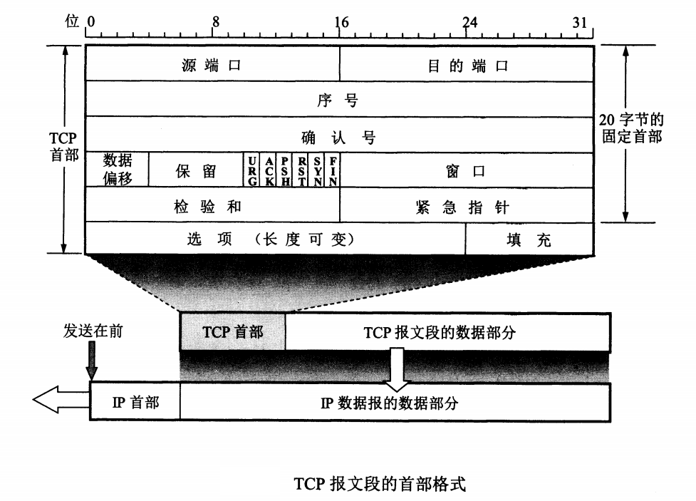

# TCP报文段的首部格式

TCP虽然是面向字节流的，但TCP传送的数据单元却是报文段。一个TCP报文段分为首部和数据两部分，而TCP的全部功能都体现在它首部各个字段的作用。因此，只有弄清TCP首部各个字段的作用才能掌握TCP的工作原理。

TCP报文段首部的前20个字节是固定的，如下图所示，后面有`4n`字节是根据需要而增加的选项(`n`是整数)。因此TCP首部的最小长度是`20`字节。

首部固定部分各个字段的意义如下：

1. **源端口和目的端口**  各占2个字节，分别写入源端口号和目的端口号。
2. **序号** 占4字节。 序号范围是`[0, 2^32 - 1]`，共`2^32`（即4294967296）个序号。序号增加到`2^32-1`后，下一个序号又回到`0`。也就是说，序号使用`mod 2^32`运算。 TCP是面向字节流的。在一个TCP连接中传送的字节流中的 **每一个字节都按序号编号**。 整个要传送的字节流的起始序号必须在连接建立时设置。首部中的序号字段则指的是本报文段所发送的数据的第一个字节的序号。例如，一报文的序号字段值是301，而携带的数据共有100字节。这就表明：本报文段的数据的第一个字节的序号是301，而最后一个字节的序号是400。这个字段的名称也叫做“报文段序号”。
3. **确认号** 占4个字节。 是 **期望收到对方下一个报文段的第一个数据字节的序号**。 例如，B正确收到了A发送过来的一个报文段，其序号字段值是501，而数据长度是200字节（序号501~701），于是B在发送给A的确认报文段中把确认序号置为701。 所以，有这样一个结论： **若确认号 = N， 则表明： 到序号N-1为止的所有数据都已正确收到**。 由于序号字段有32位长，可对`4GB`（即4千兆字节）的数据进行编号。
4. **数据偏移** 占4位， 它指出TCP报文段的数据起始处距离TCP报文段的起始处有多远。这个字段实际上是指出TCP报文段的首部长度。由于首部中还有长度不确定的选项字段，因此数据偏移字段是必要的。应该需要注意，数据偏移的单位是32位字（即以2字节长的字为计算单位）。由于4位二进制数能够表示的最大十进制数字是15，因此数据偏移的最大值是60字节，这也是TCP首部的最大长度（也就是说选项长度不能超过40字节）。
5. **保留** 占6位，保留为今后使用，但目前应置为0
6. **紧急URG（URGent）** 当URG=1时，表明紧急指针字段有效。它告诉系统此报文段中有紧急数据，应尽快传送（相当于高优先级数据），而不要按原来的排队顺序来传送。
7. **确认ACK（ACKnowledgement）** 仅当ACK=1时确认号字段才有效。当ACK=0时，确认号无效。 TCP规定，在连接建立后所有传送的报文都必须把ACK置1。
8. **推送PSH（PuSH）**  当两个应用进程进行交互式通信时，有时在一段的应用进程希望在键入一个命令后立刻就能收到对方的响应。在这种情况下，TCP就可以使用推送(push)操作。这时，发送方TCP把PSH置为1，并立即创建一个报文段发送出去。接收方TCP收到PSH=1的报文段，就尽快地（即“推送”向前）交付接收应用进程，而不再等到整个缓存都满了后再向上交付。
9. **复位RST（ReSet）** 当RST=1时，表明TCP连接中出现了严重差错，必须释放连接，然后重新建立运输连接。RST置为1还用来拒绝一个非法的报文段或拒绝打开一个连接。RST也可成为重建位或重置位。
10. **同步SYN（SYNchronization）** 在连接建立时用来同步序号。当SYN=1而ACK=0时，表明这是一个连接请求报文段。对方若同意建立连接，则应在响应报文段中使用SYN=1和ACK=1。因此，SYN置为1就表示这是一个连接请求或连接接收报文。
11. **终止FIN（FINis）** 用来释放一个链接。当FIN=1时，表明此报文段的发送方的数据已经发送完毕，并要求释放传输连接。
12. **窗口** 占2字节。 窗口值是`[0, 2^16 -1]`之间的整数。 窗口指的是发送报文段的一方的接收窗口（而不是自己的发送窗口）。窗口值告诉对方：从本报文段首部中的确认号算起，接收方目前允许对方发送的数据量（以字节为单位）。之所以要有这个限制，是因为接收方的数据缓存空间是有限的。总之，**窗口值作为接收方让发送方设置其发送窗口的依据**。例如，发送了一个报文段，其确认号是701，窗口字段是1000。这就是告诉对方：从701号算起，我（即发送此报文段的一方）的接收缓存空间还可以接收1000个字节数据（字节序号701~1700）。所以 **窗口字段明确指出了现在允许对方发送的数据量。窗口值经常在动态变化**。
13. **检验和** 占2字节。 检验和字段检验的范围包括首部和数据两部分。计算检验和时，要在TCP报文端的前面加上12个字节的伪首部。伪首部的格式与UDP用户数据报的伪首部一样。但应包伪首部的第四个字段中的17改为6（TCP协议号为6），把第五个字段中的UDP长度改为TCP长度。接收方收到此报文段后，仍要加上这个伪首部来计算检验和。
14. **紧急指针** 占2个字节。 紧急指针尽在URG=1时才有意义。
15. **选项** 长度可变，最长可达40个字节。当没有`选项`时，TCP的首部长度是20字节。 TCP最初只规定了一个选项，即最大报文段长度 **MSS（Maximum Segment SIze）**。 MSS是每个TCP的数据字段的最大长度。

