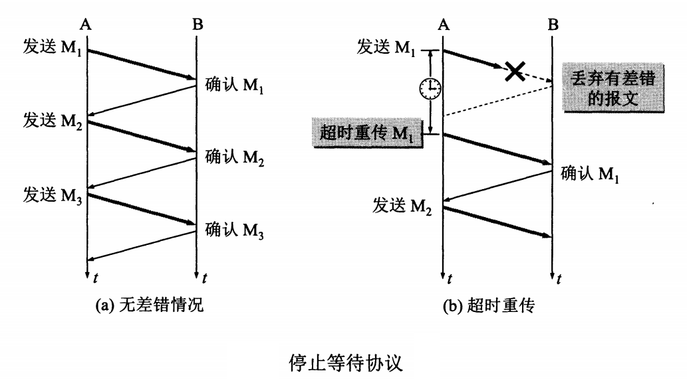
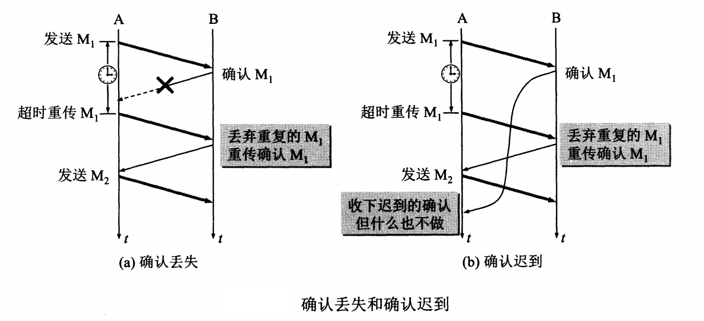
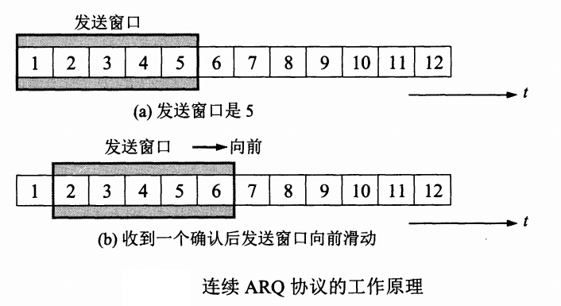
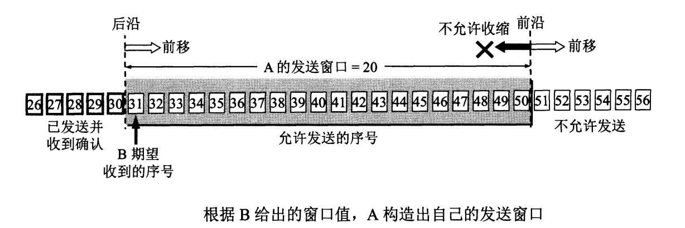
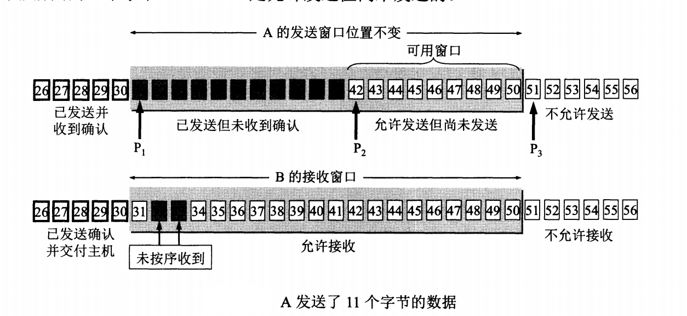
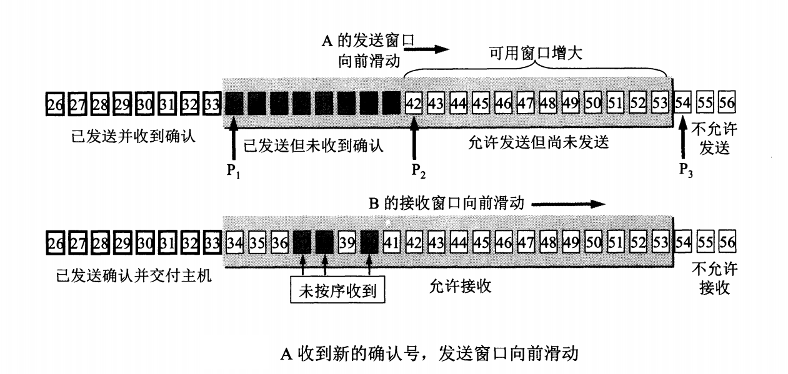
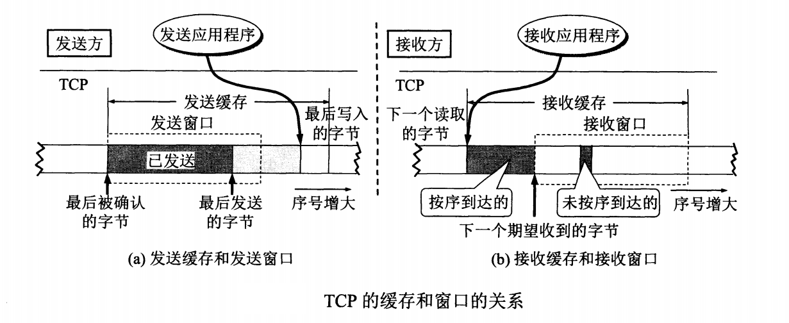

# TCP的可靠传输机制

在 [传输控制协议TCP概述](./传输控制协议TCP概述.md) 一文中，记录了TCP协议的特点和连接抽象，在这里将进一步理解TCP的可靠传输、流量控制和拥塞控制等问题。

## 可靠传输的原理

TCP发送的报文段是交给IP层传送的。但IP层只能尽最大努力服务，也就是说，TCP下面的网络所提供的是不可靠传输。因此，TCP必须采用合适的措施才能使得两个传输层之间的通信变得可靠。

理想的传输条件，有以下两个特点：

1. 传输信道不产生差错
2. 不管发送方以多快的速度发送数据，接收方总是来得及处理接收到的数据。

这样理想的条件下，不需要采取任何措施就能够实现可靠传输。 实际情况之下，上述两个特点都不具备，但是我们可以使用一些可靠的传输协议保证这个过程可靠。 当出现差错时让发送方重传出现差错的数据，同时在接收方来不及吹接收到的数据时，及时告知发送方降低发送速度。这样，本来不可靠的传输信道就能够实现可靠传输。 简单的协议就是 **停止等待协议**

在后面的讨论中，我们将A作为发送方，将B作为接收方，将传送的数据单元称为分组。 

## 停止等待协议

**停止等待** 就是每发送完一个分组就停止发送，等待对方确认。在收到确认后再发送下一个分组。 停止等待协议如下图所示：



### 无差错情况

图(a)是最简单的无差错情况。A发送分组M1,发送完就暂停发送，等待B的确认。B收到了M1就向A发送确认。A在收到了对M1的确认后，就再发送下一个分组M2。依次往复直至通信结束。

### 出现差错

图(b)是分组在传输过程中出现差错的情况。B接收到M1时检测出了差错，就丢弃M1，其他什么都不做。出现差错的原因可能是M1在传输过程中丢失了或者部分丢失。 可靠传输协议是这样设计的：  **A只要过了一段时间仍然没有收到确认，就认为刚才发送的分组丢失了，因而要重传前面发送过的分组。这叫做超时重传**。 要实现超时重传，就要为每一个发送的分组设置一个超时计时器。如果在超时计时器到期之前收到了对方的确认，就撤销已设置的超时计时器。 这里需要注意：

1. A在发送完一个分组后，必须暂时保留已发送的分组的副本（在发生超时重传时使用）。在收到相应的确认后才能清除暂时保留的副本
2. 分组和确认分组都必须有相应的编号。
3. 超时计时器的重传时间应当比数据在分组传输的平均往返时间更长一一些。

### 确认丢失和确认迟到



图(a)说明的是确认丢失。B所发送的对M1的确认丢失了。A在设定超时重传时间内没有收到确认，并无法知道自己发送的分组出错、丢失，或者是B发送的取人丢失了。因此，A在超时计时器到期后就要重传M1。此时，需要注意B的动作。假定B再次收到了重传的分组M1，这时应该采取两个动作：

1. 丢弃这个重复的分组M1，不向上层交付
2. 向A发送确认。不能认为已经发送过确认就不再发送，因为A之所以重传M1，就表示A没有收到对M1的确认。

图(b)也是一种可能出现的情况。传输过程中没有出现差错，但是B对分组M1的确认迟到了。A会收到重复的确认。对重复的确认的处理很简单：收到后就丢弃。B仍然会收到重复的M1，并且同样要丢弃重复的M1，并重传确认分组。


使用上述的 **确认和重传机制**， 就可以在 **不可靠的传输网络上实现可靠的通信**。 我们称这种可靠传输协议为 **自动重传请求ARQ（Automatic Repeat reQuest）**。 表明，重传的请求是自动进行的，接收方不需要请求发送方重传某个出错的分组。


上述的 **停止等待协议**，虽然可以保证分组的可靠传输，但是信道利用率低下。为了提高传输效率，发送方可以不适用效率低下的停止等待协议，而是采用 **流水线传输**，所谓 **流水线传输** 就是发送方可以连续发送多个分组，不必每发送完一个分组就停顿下来等待对方的确认。 使用流水线传输时，下面的两个协议十分重要 **连续ARQ协议** 和 **滑动窗口协议** 。

## 连续ARQ协议




连续ARQ协议规定，发送方每收到一个确认，就把发送窗口向前滑动一个分组的位置。 上图(a)表示发送方维持的 **发送窗口**， 它的意义是： 位于发送窗口内的5个分组都可以连续发送出去，而不需要等待对方的确认。 图(b)表示发送方收到了对第1个分组的确认，于是把发送窗口向前移动一个分组的位置。如果原来已经发送了前5个分组，那么现在就可以发送窗口内的第6个分组。 

接收方一般都采用 **累积确认** 的方式。也就是说，接收方不必对收到的分组逐个发送确认，而是收到几个分组后，按序对到达的最后一个分组发送确认，这就表示：到这个分组为止的所有分组都已经正确收到了。 

累积确认的优缺点：

- 优点： 容易实现，即使确认都丢失也不必重传
- 缺点： 不能向发送方反映处接收方已经正确收到的所有分组的信息。 例如，如果发送方发送了前5个分组，而中间的第3个分组丢失。这时接收方只能对前两个分组发出确认。发送方无法知道后面三个分组的下落，只好把后面三个分组都重传一次。 这就是 **Go-gack-N(回退N)**，表示需要再退回来重传已经发送过的N个分组。


讨论滑动窗口时，图中还有要给时间坐标（以后会省略这样的时间坐标）。“向前”指“向着时间增大的方向”，“向后”指“向着时间减少的方向”。分组发送是按照分组序号从小到达发送的。

## TCP可靠传输的实现
讨论TCP可靠传输的实现——滑动窗口机制。我们概述以字节为单位滑动窗口。

TCP的滑动窗口是以字节为单位的。 我们假定A收到了B发来的确认报文段，其中窗口是20字节，而确认号是31（这表明B期望收到的下一个序号是31，而序号30为止的数据已经收到了）。根据这两个数据，A就构造处自己的发送窗口，如下图所示：



首先，发送方A的发送窗口。发送窗口表示：在没有收到B的确认下，A可以连续把窗口内的数据都发送出去。凡是已经发送过的数据，在未收到确认之前都必须暂时保留，以便在超时重传时使用。

发送窗口里面的序号表示允许发送的序号。显然，窗口越大，发送方就可以在接收到对方确认之前连续发送更多的数据，因而可能获得更高的传输效率。接收方会把自己的接收窗口数值放在窗口字段发送给对方。因此，A的发送窗口一定不能超过B的接收窗口数值。另一方面，发送方的发送窗口大小还要收到当时网络拥塞程度的制约。

发送窗口后沿的后面部分表示已经发送且已收到了确认。发送窗口前沿的前面表示不允许发送的，因为接收方没有为这部分数据保留临时存放的缓存空间。

发送窗口的位置由窗口前沿和后沿的位置共同确定。发送窗口后沿的变化情况有两种可能，即不动（没有接收到新的确认）和前移（收到了新的确认）。发送窗口后沿不可能向后移动。发送创库前沿通常是不断向前移动，但也可能不动。对于这两种情况：一是没有收到新的确认，对方通知的窗口大小也不变；二是收到了新的确认但对方通知的窗口变小了，使得发送窗口的前沿正好不动。


假定A发送了序号为`31~41`的数据。这时，发送窗口的位置并未改变，但发送窗口内靠后面有11个字节（灰色小方框表示）表示已经发送但未收到确认。而发送窗口内靠前面的9个字节（`42~50`）是允许发送但尚未发送的。



从上述可以看出，要描述一个发送窗口的状态需要三个指针： P1,P2和P3. 如上图所示。 指针都指向字节的序号。这三个指针指向的几个部分意义如下：

- 小于P1的是已经发送并已收到确认的部分，而大于P3的是不允许发送的部分。
- P3-P1=A的发送窗口
- P2-P1=已经发送但尚未收到确认的字节数
- P3-P2=允许发送但当前尚未发送的字节树（又称为可用窗口或有效窗口）

看B的接收窗口。 B的接收窗口大小是20。在接收窗口外面，到20号为止的数据是已经发送过确认，且已经交付主机了。因此，B可以不再保留这些数据。接收窗口内的序号（`31~50`）是允许接收的。在上图中B收到了序号为32和33的数据。这些数据没有按序达到，因为序号为31的数据没有收到。 假定B收到了序号为31的数据，并把序号为`31~33`的数据交付给主机，然后B删除这些数据。接着吧接收窗口向前移动3个序号，如下图所示，同时给A发送确认，其中窗口值仍为20，但确认号是34.这表明B已经接收到了序号33为止的数据。可以看到B还接收到了序号为37，38和40的数据，但这些都没有按序到达，只能先再存在接收窗口中。A收到B的确认后，就可吧发送窗口向前滑动3个序号，但指针P2不动。可以看出，目前在A的可用窗口增大了，可以发送的序号范围是`42~53`。




A在继续发送序号`42~53`的数据后，指针P2向前移动和P3重合。发送窗口内的序号已经用完，但还没有在收到确认。由于A的发送窗口已满，可用窗口已减小到零，因此必须停止发送。

### TCP缓存与窗口的关系

发送放的应用进程把字节流写入TCP的发送缓存，接收方的应用进程从TCP的接收缓存中读取字节流。我们进一步阐述窗口与缓存的关系。下图展示了发送方维持的发送缓存和窗口，以及接收方维持的接收缓存和接收窗口。




1. 缓存空间和序号空间都是有限的，并且都是循环使用的。
2. 实际上缓存或窗口中的字节数都是非常之大的

上图(a)所示的发送方的情况。

发送缓存用来暂时存放：

1. 发送应用程序传送给发送方TCP准备发送的数据；
2. TCP已发送处但尚未收到确认的数据

发送窗口通常只是发送缓存的一部分。已经被确认的数据应当从发送缓存中删除，因此发送缓存和发送窗口的后沿是重合的。发送应用程序最后写入发送缓存的字节减去最后被确认的字节，就是还保留在发送缓存中的被写入的字节数。发送应用程序必须控制写入缓存的速率，不能太快。否则就会溢出。

上图(b)所示的接收方情况：

接收缓存用来暂时存放：

1. 按序到达的、但尚未被接收应用程序读取的数据；
2. 未按序到达的数据

如果收到的分组被检测处有差错，则要丢弃。如果接收应用程序来不及读取收到的数据，接收缓存最终会被填满，接收窗口减小到零。反之，如果接收应用程序能够及时从接收缓存中读取收到的数据，则接收窗口就可以增大，但最大不能超过接收缓存的大小。图中还指出了下一个期望收到的字节号。这个字节号也是接收方发送给发送方的报文段的首部中的确认号。

### 超时重传的选择

传输层的超时计时器的超时重传时间如何设置？

TCP采用了一种自适应算法，它记录一个报文段发出的时间，以及收到相应的确认的时间。这两个时间只差就是 **报文段的往返时间RTT**。 TCP保留了RTT的一个 **加权平均往返时间RTTs** 这又称为 **平滑的往返时间**， S表示Smoothed.因为进行的是加权平均，因此得出的结果更加平滑。 每当第一次测量到RTT样本时，RTTs值就取为所测量到的RTT样本值。但以后每测量到一个新的RTT样本，就按照下式重新计算一次RTTs:

```
新的RTTs = (1 - a) * (旧RTTs) + a * (新的RTT样本)
```

上式中， 0 <= a < 1。如果 a 接近于零，表示新的RTTs值表示新的RTTs值和旧的RTTs值相比变化不大，而对新的RTT样本影响不大（RTT值更新较慢）。若选择a接近于1，则表示新的RTTs值受新的RTT样本影响较大（RTT值跟新较快）。

超时计时器设置的超时重传时间RTO(RetransmissionTime-Out)应该略微大于上面得到的加权平均往返时间RTTs.


