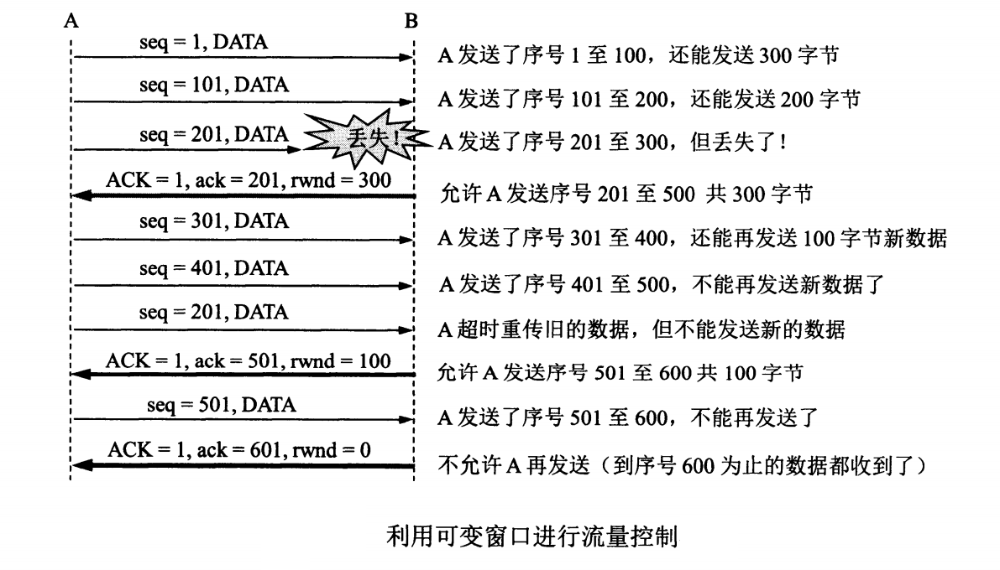

## TCP的流量控制与拥塞控制

## TCP的流量控制
一般来说，我们总是希望数据传输得更快一些。但如果发送方把数据发送得过快，接收方就可能来不及接收，这就会造成数据丢失。 所谓 **流量控制(flow control)** 就是 **让发送方的发送速率不要太快， 要让接收方来得及接收** 。

利用滑动窗口机制可以很方便的在TCP连接上实现对发送方的流量控制。

设A向B发送数据。在连接建立时，B告诉A： “我的窗口rwnd=400”(这里rwnd表示 receiver window).因此，**发送方的发送窗口不能超过接收方给出的接收窗口的数值**。 需要注意的是TCP的窗口单位是字节，不是报文段。 TCP连接建立时的窗口协商过程在图中没有显示出来。再设每个报文段为100字节长，而数据报文段序号的初始值设为1。图中箭头山的大写ACK表示首部中的确认位ACK，小写ack表示确认字段的值。

接收方的主机B进行了三次流量控制。第一次把窗口减小到rwnd = 300, 第二次又减小到rwnd = 100, 最后减小到 rwnd = 0, 即不允许发送发再发送数据了。 这种使发送方暂停发送的状态将持续到主机B重新发送一个新的窗口值为止。B向A发送的三个报文端都设置了ACK=1，只有在ACK=1时确认号字段才有意义。

还有一种情况，B向A发送了零窗口的报文段后不久，B的接收缓存又有了一些存储空间。于是B向A发送了rwnd=400的报文段。此时，该报文段再次丢失。A一直等待接收B发送的非零窗口的通知，而B也一直等待A发送的数据。如果没有其他措施，这种互相等待的死锁局面将一直延续。

为了解决这个问题，TCP为每个连接设有要给持续计时器（persistence timer）。只要TCP连接的一方收到对方的零窗口通知，就启动持续计时器。若持续计时器设置的时间到期，就发送一个零窗口探测报文段，而对方就在确认这个探测报文段时给出了现在的窗口值。

## TCP的拥塞控制

在计算机网络中的链路容量（即带宽）、交换结点中的缓存和处理机等都是网络的资源。在某一段时间，若网络对某一资源的需求超过了该资源所能提供的可用部分，网络的性能就会变坏。这种情况就是 **网络拥塞(congestion)**。

### TCP拥塞控制的方法
TCP进行拥塞控制的算法有四种： 即 **慢开始（slow-start）、拥塞避免（congestion avoidance）、快重传（fast restransmit）和快恢复（fast recovery）**。

1. 慢开始和拥塞避免

基于窗口的拥塞控制。发送方维持了一个叫做拥塞窗口cwnd(congestion window)的状态变量。拥塞窗口的大小取决于网络的拥塞程度，并且动态变化。 发送方让自己的发送窗口等于拥塞窗口。

发送方控制拥塞窗口的原则是：只要网络没有出现拥塞，拥塞窗口就可以再增大一些，以便把更多的分组发送出去，这样就可以提供网络的利用率。 发送方判断网络出现拥塞的依据： **确认超时**. 

**慢开始**算法思路： 当主机开始发送数据时，由于并不清楚网络的负荷情况，所以如果立刻把大量数据字节注入网络，就能引起网络拥塞。 最好的经验就是先探测一下： 即由小到达逐渐增大发送窗口，也就是说，由小到大逐渐增大拥塞窗口数值。

**拥塞避免**算法思路： 让拥塞窗口cwnd缓慢地增大。即没经过一个往返时间RTT就把发送方的拥塞窗口cwnd加1（这里1指一个MSS）,而不是像慢开始阶段那样加倍增长。因此，拥塞避免算法，拥塞窗口cwnd按线性规律缓慢增长，比慢开始算法的拥塞窗口增长速率缓慢得多。

**快重传**算法可以让发送方尽早知道发送了个别报文段的丢失。快重传算法首先要求接收方不要等待自己发送数据是才进行捎带取人，而是要立即发送确认，即使收到了失序的报文段也要立即发出对已收到的报文段的重复确认。

